# 2. Core Architecture Components

AI agents are built on four foundational systems: **The Agent Loop**, **Memory**, **Tools**, and **Planning**. This section dives deep into each component, explaining how they work together to create autonomous, intelligent systems.

---

## 2.1 The Agent Loop

### Core Mechanism: Observe → Reason → Act → Observe

The agent loop is the heartbeat of any agentic system. It's a continuous cycle of perception, reasoning, action, and reflection.

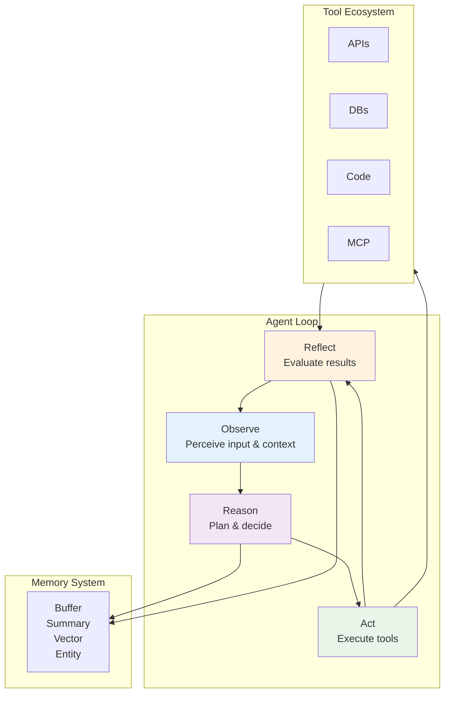

### Detailed Loop Execution

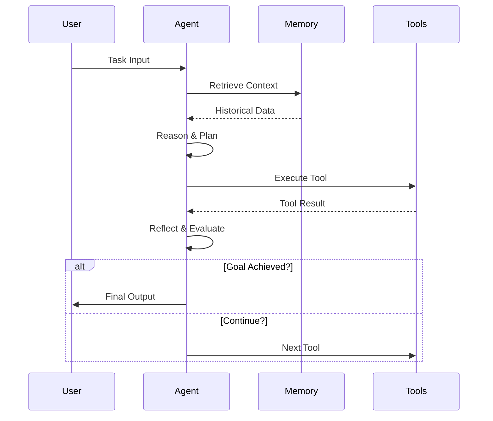

### Loop Variants

| Pattern | Description | Best For |
|---------|-------------|----------|
| **ReAct** | Reason → Act → Observe | General purpose tasks |
| **Plan-and-Execute** | Plan all steps, then execute | Well-defined goals |
| **Re-planning** | Continuous adjustment | Dynamic environments |
| **Reflection** | Self-critique and revision | Quality-critical tasks |

---

## 2.2 Memory Systems

Memory is what separates stateless chatbots from intelligent agents. A robust memory system enables agents to maintain context, learn from experience, and make informed decisions. This section provides a comprehensive guide to memory systems, from cognitive science foundations to production-grade implementations with Spring AI.

---

### 2.2.1 Cognitive Architecture Layer

Building effective memory systems for AI agents requires understanding how human memory works. Cognitive science provides a blueprint for designing architectures that mimic human-like memory capabilities.

#### Human Memory Systems

Human memory is organized into three interconnected systems, each with distinct characteristics and time scales:

**1. Sensory Memory (Instantaneous Buffer)**
- **Visual**: Iconic memory (~500ms retention)
- **Auditory**: Echoic memory (~3 seconds retention)
- **Purpose**: Briefly preserves sensory input for attentional selection
- **Agent Equivalent**: Raw prompt buffer, API response cache

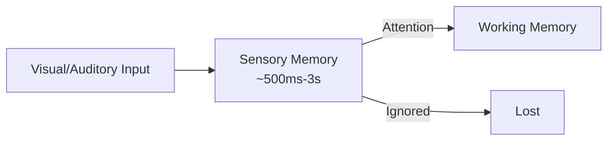

**2. Working Memory (Active Processing)**
- **Capacity**: 7±2 items (Miller's Law, 1956)
- **Duration**: 15-30 seconds without rehearsal
- **Components**: Central executive, phonological loop, visuospatial sketchpad (Baddeley, 1974)
- **Agent Equivalent**: LLM Context Window
- **Critical Phenomenon**: "Lost in the Middle" - LLMs struggle to retrieve information from the middle of long contexts (Liu et al., 2023)

```java
// Spring AI: Working Memory as Context Window
@Service
public class WorkingMemoryManager {

    private final int WORKING_MEMORY_CAPACITY = 7; // Miller's Law
    private final Queue<MemoryItem> activeItems = new LinkedList<>();

    public void addToWorkingMemory(MemoryItem item) {
        activeItems.add(item);
        if (activeItems.size() > WORKING_MEMORY_CAPACITY) {
            activeItems.poll(); // FIFO eviction - maintains capacity limit
        }
    }

    public List<MemoryItem> getActiveContext() {
        return List.copyOf(activeItems);
    }
}
```

**3. Long-Term Memory (Persistent Storage)**

Long-term memory is divided into three distinct types:

| Type | Description | Duration | Agent Implementation |
|------|-------------|----------|---------------------|
| **Episodic** | Personal experiences with temporal context ("What I did last summer") | Lifetime | Conversation history, episode logs |
| **Semantic** | General knowledge and facts ("Paris is the capital of France") | Lifetime | Vector store, knowledge base |
| **Procedural** | Skills and habits ("How to ride a bike") | Lifetime | System prompts, tool definitions, code |

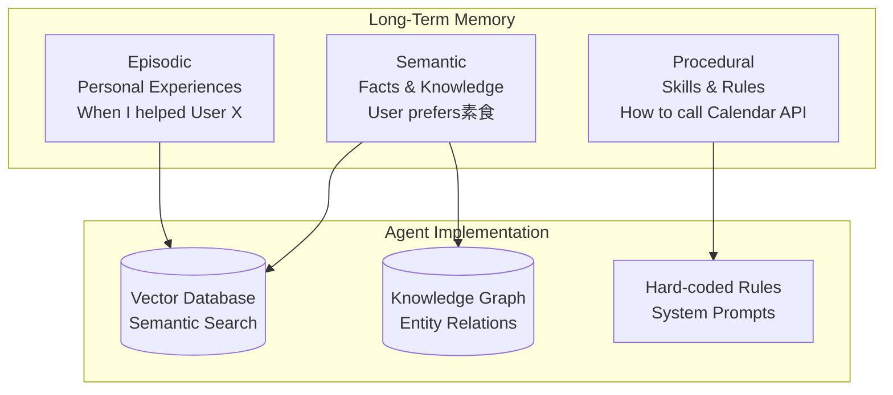

#### Cognitive Science Foundations

Key research findings that inform agent memory design:

1. **Atkinson-Shiffrin Model (1968)**: Three-stage memory flow (Sensory → Short-term → Long-term)
2. **Tulving's Distinction (1972)**: Episodic vs Semantic memory have different neural substrates
3. **Levels of Processing (Craik & Lockhart, 1972)**: Deeper semantic encoding leads to better retention
4. **Encoding Specificity Principle (Tulving, 1983)**: Retrieval cues match encoding context
5. **Spacing Effect**: Distributed rehearsal enhances long-term retention

#### Lost in the Middle Phenomenon

**Critical Research**: "Lost in the Middle: How Language Models Use Long Contexts" (Liu et al., 2023)

**Key Findings**:
- LLM performance drops 20-30% for information in the middle of long contexts
- Optimal performance at the beginning (primacy effect) and end (recency effect)
- Performance degrades significantly beyond 8K tokens for most models

**Practical Implications**:
```java
// Combatting Lost in the Middle with Strategic Context Placement
@Service
public class ContextOptimizer {

    public List<Memory> organizeForOptimalRetrieval(List<Memory> memories) {
        // Strategy 1: Place critical information at beginning or end
        List<Memory> critical = memories.stream()
            .filter(m -> m.getImportance() > 0.8)
            .toList();

        List<Memory> standard = memories.stream()
            .filter(m -> m.getImportance() <= 0.8)
            .toList();

        // Optimal placement: critical at start, rest in middle, summary at end
        List<Memory> organized = new ArrayList<>();
        organized.addAll(critical.subList(0, Math.min(3, critical.size())));
        organized.addAll(standard);
        if (critical.size() > 3) {
            organized.addAll(critical.subList(3, critical.size()));
        }

        return organized;
    }

    // Strategy 2: Hierarchical summarization for long contexts
    public String summarizeMiddleSection(List<Message> middleMessages) {
        String prompt = String.format("""
            Create a concise summary of these messages, preserving key information:
            %s

            Focus on:
            - Main topics discussed
            - Important decisions made
            - User preferences revealed
            """,
            middleMessages.stream()
                .map(Message::getContent)
                .collect(Collectors.joining("\n"))
        );

        return llm.generate(prompt);
    }
}
```

#### Agent Memory: Cognitive Mapping

| Cognitive Component | Human Implementation | Agent Implementation | Technical Carrier |
|---------------------|---------------------|---------------------|-------------------|
| Sensory Memory | Visual/auditory buffers | Message buffer | Conversation list |
| Working Memory | Attention focus | LLM context | Context window |
| Episodic Memory | Autobiographical events | Conversation history | Vector store / DB |
| Semantic Memory | World knowledge | Knowledge base | Vector store / KG |
| Procedural Memory | Skills & habits | System prompts | Hard-coded rules |

```java
// Complete cognitive memory system
@Service
public class CognitiveMemorySystem {

    // Sensory Memory: Transient input buffer
    private final Map<String, String> sensoryBuffer = new ConcurrentHashMap<>();

    // Working Memory: Active processing (LLM context)
    private final WorkingMemoryManager workingMemory;

    // Long-Term Memory: Persistent storage
    private final VectorStore episodicMemory; // Experiences
    private final KnowledgeGraph semanticMemory; // Facts & entities
    private final SystemPromptManager proceduralMemory; // Skills

    public MemoryContext buildContext(String userQuery) {
        // 1. Load from sensory buffer (immediate context)
        String immediateContext = sensoryBuffer.get(userQuery);

        // 2. Retrieve from working memory (active items)
        List<MemoryItem> activeItems = workingMemory.getActiveContext();

        // 3. Recall from episodic memory (relevant experiences)
        List<Memory> experiences = episodicMemory.similaritySearch(
            SearchRequest.query(userQuery).withTopK(5)
        );

        // 4. Query semantic memory (facts & entities)
        List<Entity> entities = semanticMemory.findRelevantEntities(userQuery);

        // 5. Load procedural memory (skills & rules)
        String systemPrompt = proceduralMemory.getSystemPrompt();

        return MemoryContext.builder()
            .sensory(immediateContext)
            .working(activeItems)
            .episodic(experiences)
            .semantic(entities)
            .procedural(systemPrompt)
            .build();
    }
}
```

---

### 2.2.2 Storage & Data Structures Layer

Choosing the right storage backend is critical for memory system performance. Different storage technologies excel at different use cases.

#### 1. Vector Stores (Semantic Memory)

**Best For**: Semantic similarity search, fuzzy matching, knowledge-intensive tasks

**How It Works**:
1. Text is converted to dense vector embeddings (e.g., OpenAI text-embedding-3-large)
2. Vectors are indexed using HNSW (Hierarchical Navigable Small World) algorithm
3. Similarity is computed using cosine similarity or Euclidean distance

**Distance Metrics**:
- **Cosine Similarity**: `cos(θ) = (A·B) / (||A|| × ||B||)` - Range [-1, 1], angle between vectors
- **Euclidean Distance**: `||A - B||` - Straight-line distance
- **Dot Product**: `A·B` - Raw similarity (requires normalized vectors)

```java
// Spring AI: Production-Grade Vector Store Configuration
@Configuration
public class VectorStoreConfig {

    @Bean
    public VectorStore vectorStore(EmbeddingModel embeddingModel, JdbcTemplate jdbcTemplate) {
        return new PgVectorStore(
            PgVectorStoreConfig.builder()
                .embeddingModel(embeddingModel)
                .jdbcTemplate(jdbcTemplate)
                .initializeSchema(true) // Auto-create tables
                .dimensions(3072) // OpenAI text-embedding-3-large
                .distanceType(VectorStore.DistanceType.COSINE_DISTANCE)
                .build()
        );
    }

    @Bean
    public EmbeddingModel embeddingModel(
        @Value("${spring.ai.openai.api-key}") String apiKey
    ) {
        return new OpenAiEmbeddingModel(
            OpenAiEmbeddingOptions.builder()
                .withApiKey(apiKey)
                .withModel("text-embedding-3-large")
                .withDimensions(3072)
                .build()
        );
    }
}

// Service: Storing and retrieving memories
@Service
public class SemanticMemoryService {

    private final VectorStore vectorStore;

    public void storeMemory(String content, Map<String, Object> metadata) {
        MemoryDocument doc = MemoryDocument.builder()
            .id(UUID.randomUUID().toString())
            .text(content)
            .metadata(metadata)
            .build();

        vectorStore.add(List.of(doc));
    }

    public List<Memory> retrieveRelevant(String query, int topK) {
        return vectorStore.similaritySearch(
            SearchRequest.query(query)
                .withTopK(topK)
                .withSimilarityThreshold(0.7) // Only high-quality matches
        ).stream()
            .map(Memory::fromDocument)
            .toList();
    }
}
```

**Production Implementations**:

| Technology | Strengths | Best For | Cost |
|------------|-----------|----------|------|
| **Pinecone** | Fully managed, auto-scaling | Production apps, high traffic | $70-320/mon |
| **Weaviate** | Open-source, hybrid search | Self-hosted, multimodal | Free tier available |
| **Qdrant** | High performance, filter support | Real-time applications | Free tier available |
| **Milvus** | Distributed, 10M+ vectors | Large-scale deployments | Open-source |
| **pgvector** | Postgres extension | Simple deployments, SQL queries | Free |

#### 2. Knowledge Graphs (Structured Memory)

**Breakthrough Research**: **GraphRAG** (Microsoft Research, 2024)

GraphRAG combines knowledge graphs with RAG to solve key limitations of pure vector search:
- **Multi-hop reasoning**: "John works at OpenAI → OpenAI is in SF → John lives in SF area"
- **Community detection**: Groups related entities into communities for hierarchical search
- **Global context**: Generates community summaries for cross-community reasoning

**When to Use GraphRAG**:
- Complex reasoning across multiple entities
- Relationship-heavy queries ("Who else works with John?")
- Multi-hop inference chains
- Knowledge-intensive domains (medical, legal, research)

```java
// Spring AI + Neo4j: Knowledge Graph Implementation
@Configuration
@EnableNeo4jRepositories(basePackages = "com.example.memory.graph")
public class KnowledgeGraphConfig {

    @Bean
    public Neo4jClient neo4jClient(
        @Value("${spring.neo4j.uri}") String uri,
        @Value("${spring.neo4j.authentication.username}") String username,
        @Value("${spring.neo4j.authentication.password}") String password
    ) {
        return Neo4jClient.builder()
            .withDriver(uri, username, password)
            .build();
    }
}

// Domain Model: Entities and Relationships
@Node("Entity")
public class MemoryNode {
    @Id @GeneratedValue
    private Long id;

    @Property("name")
    private String name;

    @Property("type")
    private String type; // PERSON, PLACE, CONCEPT, etc.

    @Property("attributes")
    private Map<String, Object> attributes;

    @Relationship("HAS_PREFERENCE")
    private List<Preference> preferences;

    @Relationship("EXPERIENCED")
    private List<Episode> experiences;
}

@Node("Preference")
public class Preference {
    @Id @GeneratedValue
    private Long id;

    @Property("type")
    private String type; // FOOD, TRAVEL, etc.

    @Property("value")
    private String value;
}

@RelationshipProperties
public class ExperiencedRelation {
    @Property("timestamp")
    private Instant timestamp;

    @Property("importance")
    private double importance;
}

// Repository: Custom queries
public interface MemoryGraphRepository extends Neo4jRepository<MemoryNode, Long> {

    @Query("MATCH (u:User {id: $userId})-[:HAS_PREFERENCE]->(p:Preference) RETURN p")
    List<Preference> findUserPreferences(@Param("userId") String userId);

    @Query("MATCH (u:User {id: $userId})-[:EXPERIENCED]->(e:Episode) " +
           "WHERE e.timestamp > $since " +
           "RETURN e ORDER BY e.timestamp DESC LIMIT 10")
    List<Episode> findRecentEpisodes(
        @Param("userId") String userId,
        @Param("since") Instant since
    );

    @Query("MATCH path = shortestPath(" +
           "(start:Entity {name: $entity1})-[*..5]-(end:Entity {name: $entity2})" +
           ") RETURN path")
    List<List<Entity>> findRelationships(
        @Param("entity1") String entity1,
        @Param("entity2") String entity2
    );
}

// Service: GraphRAG-style retrieval
@Service
public class GraphRAGService {

    private final MemoryGraphRepository graphRepository;
    private final LLM llm;

    // 1. Entity extraction from text
    public List<Entity> extractEntities(String text) {
        String prompt = String.format("""
            Extract entities and relationships from this text:
            %s

            Respond in JSON:
            {
                "entities": [{"name": "...", "type": "..."}],
                "relationships": [{"from": "...", "to": "...", "type": "..."}]
            }
            """, text);

        String response = llm.generate(prompt);
        return parseEntities(response);
    }

    // 2. Community detection (Louvain algorithm)
    public List<Community> detectCommunities(List<MemoryNode> nodes) {
        // Build graph from nodes
        Graph graph = buildEntityGraph(nodes);

        // Apply Louvain community detection
        LouvainAlgorithm louvain = new LouvainAlgorithm();
        List<Set<MemoryNode>> communities = louvain.detect(graph);

        // Generate community summaries
        return communities.stream()
            .map(this::summarizeCommunity)
            .toList();
    }

    private Community summarizeCommunity(Set<MemoryNode> nodes) {
        String summaryPrompt = String.format("""
            Create a summary of this entity community:
            Entities: %s

            Focus on:
            - Common themes or patterns
            - Key relationships
            - Important insights
            """,
            nodes.stream()
                .map(MemoryNode::getName)
                .collect(Collectors.joining(", "))
        );

        String summary = llm.generate(summaryPrompt);

        return Community.builder()
            .entities(nodes)
            .summary(summary)
            .build();
    }

    // 3. Hierarchical retrieval (local + global)
    public GraphRAGResult retrieve(String query, List<Community> communities) {
        // Local search: Within most relevant community
        Community bestCommunity = findMostRelevantCommunity(query, communities);
        List<MemoryNode> localResults = searchWithinCommunity(query, bestCommunity);

        // Global search: Across all community summaries
        List<Community> relevantCommunities = communities.stream()
            .filter(c -> calculateRelevance(query, c.getSummary()) > 0.6)
            .toList();

        return GraphRAGResult.builder()
            .localResults(localResults)
            .globalCommunities(relevantCommunities)
            .build();
    }
}
```

**GraphRAG Architecture**:

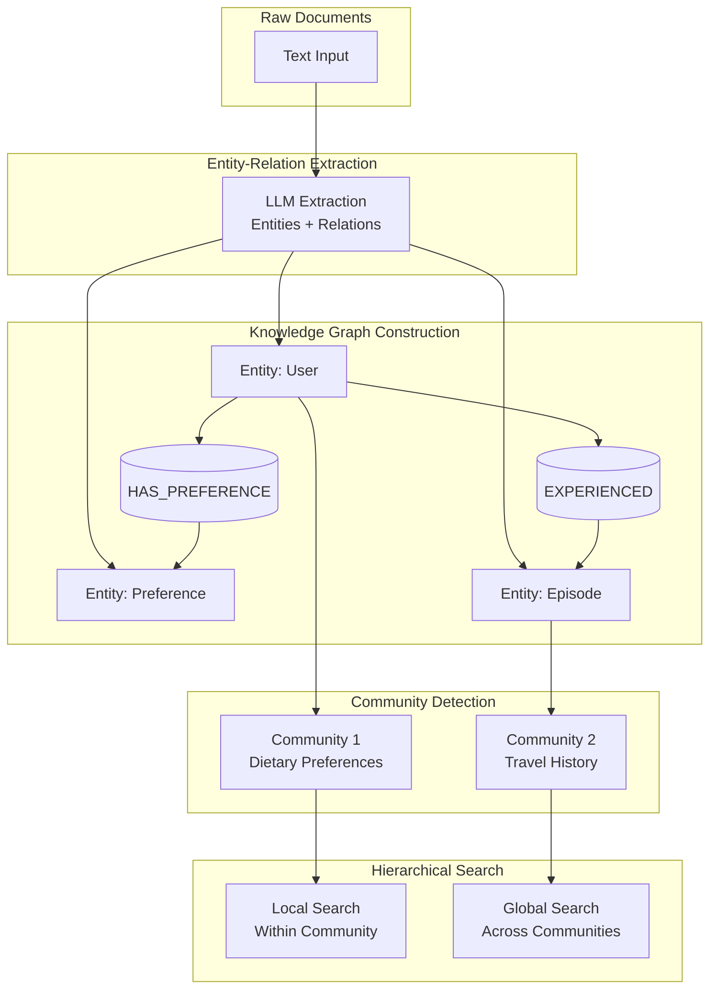

**Vector Store vs Knowledge Graph**:

| Aspect | Vector Store | Knowledge Graph | Hybrid (GraphRAG) |
|--------|-------------|----------------|-------------------|
| **Query Type** | Semantic similarity | Relationship queries | Both |
| **Reasoning** | Shallow (single-hop) | Deep (multi-hop) | Adaptive |
| **Setup Cost** | Low | High | Very high |
| **Maintenance** | Minimal | Significant | Significant |
| **Best For** | Keyword search, Q&A | Complex reasoning | Knowledge-intensive |

#### 3. Structured Databases (SQL/NoSQL)

**Best For**: Precise business state, transactions, structured queries

```java
// Spring AI: JDBC Chat Memory
@Configuration
public class JdbcMemoryConfig {

    @Bean
    public ChatMemoryRepository chatMemoryRepository(JdbcTemplate jdbcTemplate) {
        return new JdbcChatMemoryRepository(jdbcTemplate);
    }
}

// Entity: Conversation metadata
@Entity
@Table(name = "conversations")
public class ConversationEntity {
    @Id
    @GeneratedValue(strategy = GenerationType.IDENTITY)
    private Long id;

    @Column(unique = true, nullable = false)
    private String conversationId;

    @Column
    private Instant createdAt;

    @ElementCollection
    @MapKeyColumn(name = "key")
    @Column(name = "value")
    @CollectionTable(name = "conversation_metadata")
    private Map<String, String> metadata;
}

// Repository: Custom queries
@Repository
public interface ChatMemoryRepository extends JpaRepository<ConversationEntity, Long> {

    @Query("SELECT c FROM ConversationEntity c WHERE c.conversationId = :conversationId")
    Optional<ConversationEntity> findByConversationId(
        @Param("conversationId") String conversationId
    );

    @Query("SELECT m FROM MessageEntity m " +
           "WHERE m.conversationId = :conversationId " +
           "ORDER BY m.timestamp DESC")
    List<MessageEntity> findRecentMessages(
        @Param("conversationId") String conversationId,
        Pageable pageable
    );
}

// Service: Managing conversation memory
@Service
public class ConversationMemoryService {

    private final ChatMemoryRepository repository;

    public void addMessage(String conversationId, Message message) {
        ConversationEntity conversation = repository
            .findByConversationId(conversationId)
            .orElseGet(() -> createConversation(conversationId));

        MessageEntity messageEntity = MessageEntity.builder()
            .conversationId(conversationId)
            .role(message.getRole())
            .content(message.getContent())
            .timestamp(Instant.now())
            .build();

        conversation.addMessage(messageEntity);
        repository.save(conversation);
    }

    public List<Message> getRecentMessages(String conversationId, int limit) {
        return repository.findRecentMessages(
            conversationId,
            Pageable.ofSize(limit)
        ).stream()
            .map(this::toDomainMessage)
            .toList();
    }
}
```

**When to Use SQL/NoSQL**:
- Transactional consistency required (e.g., order states)
- Complex queries with joins
- Regulatory compliance (data retention, GDPR)
- Existing database infrastructure

#### 4. Hierarchical Storage (Virtual Context)

**Breakthrough Research**: **MemGPT** (UC Berkeley, 2023/2024) - "Towards LLMs as Operating Systems"

MemGPT introduces **Virtual Context Management**, treating LLM context windows like operating system memory:

| OS Concept | MemGPT Equivalent | Purpose |
|------------|-------------------|---------|
| RAM | Main Context | Fast access, limited capacity |
| Disk | External Context | Large storage, slower access |
| Page Fault | Context Overflow | Trigger for data movement |
| Page Replacement | FIFO/LRU eviction | Manage memory pressure |

**Key Innovation**: Agents can proactively manage their context through function calls:
- `page_in()`: Load data from external to main context
- `page_out()`: Move data from main to external context

```java
// MemGPT-style: Hierarchical Memory Management
@Service
public class HierarchicalMemoryManager {

    private final int CONTEXT_LIMIT = 8000; // tokens

    // Main context: Fast access (RAM equivalent)
    private final List<MemoryBlock> mainContext = new ArrayList<>();

    // External context: Infinite storage (Disk equivalent)
    private final Queue<MemoryBlock> externalContext = new LinkedList<>();

    public void addMemory(MemoryBlock block) {
        int currentSize = calculateTokenCount(mainContext);

        if (currentSize + block.getTokenCount() <= CONTEXT_LIMIT) {
            // Fits in main context
            mainContext.add(block);
        } else {
            // Overflow: Page out old memories
            evictToExternalContext(block.getTokenCount());
            mainContext.add(block);
        }
    }

    // Page replacement: LRU-style eviction
    private void evictToExternalContext(int requiredSpace) {
        List<MemoryBlock> evicted = mainContext.stream()
            .sorted(Comparator.comparing(MemoryBlock::getLastAccessed))
            .collect(Collectors.toList());

        int freedSpace = 0;
        for (MemoryBlock block : evicted) {
            if (freedSpace >= requiredSpace) break;

            mainContext.remove(block);
            externalContext.add(block);
            freedSpace += block.getTokenCount();
        }
    }

    // Page-in: Load relevant memories
    public List<MemoryBlock> retrieveRelevant(String query) {
        // 1. Search in main context
        List<MemoryBlock> mainResults = searchInMainContext(query);

        if (mainResults.size() >= 5) {
            return mainResults;
        }

        // 2. Need more: Page in from external context
        List<MemoryBlock> externalResults = searchInExternalContext(query);

        // 3. Page in top results (may trigger page-out)
        for (MemoryBlock block : externalResults) {
            addMemory(block); // Handles eviction automatically
        }

        return searchInMainContext(query);
    }

    // MemGPT-style functions for agent to call
    @FunctionCallback(name = "page_in")
    public String pageIn(String memoryId) {
        MemoryBlock block = externalContext.stream()
            .filter(b -> b.getId().equals(memoryId))
            .findFirst()
            .orElseThrow();

        externalContext.remove(block);
        addMemory(block); // Handles capacity management

        return String.format("Paged in memory: %s", block.getId());
    }

    @FunctionCallback(name = "page_out")
    public String pageOut(String memoryId) {
        MemoryBlock block = mainContext.stream()
            .filter(b -> b.getId().equals(memoryId))
            .findFirst()
            .orElseThrow();

        mainContext.remove(block);
        externalContext.add(block);

        return String.format("Paged out memory: %s", block.getId());
    }
}
```

**Storage Comparison**:

| Storage Type | Best For | Advantages | Disadvantages | Production Choice |
|-------------|----------|------------|---------------|-------------------|
| **Vector Store** | Semantic retrieval | Fuzzy matching, scalable | Poor exact queries | Pinecone, Weaviate, Qdrant |
| **Knowledge Graph** | Complex reasoning | Multi-hop inference | Expensive setup | Neo4j, GraphRAG |
| **SQL/NoSQL** | Business state | ACID transactions | No semantic search | PostgreSQL, MongoDB |
| **Hierarchical** | Long context | Unlimited context | High complexity | MemGPT, Letta |

---

### 2.2.3 Memory Lifecycle Operations

Memory is not static storage - it's a dynamic system with four key operations: **Encoding**, **Retrieval**, **Reflection**, and **Forgetting**. Each operation transforms memory, enabling agents to learn and adapt.

#### 1. Encoding: From Input to Memory

**Encoding** is the process of transforming raw input into stored memory representations. The quality of encoding determines retrieval effectiveness.

**Three Chunking Strategies**:

1. **Semantic Chunking** (LightRAG, 2024)
   - Groups related content by topic/theme
   - Preserves semantic coherence
   - Best for: Conversational agents, document QA

2. **Hierarchical Chunking** (MemGPT)
   - Creates multi-level chunks: Document → Chapter → Section → Paragraph
   - Enables retrieval at appropriate granularity
   - Best for: Long-form documents, technical manuals

3. **Temporal Chunking** (Zep)
   - Groups by time windows (hour, day, week)
   - Maintains conversation flow
   - Best for: Chat history, episode logs

```java
// Spring AI: Intelligent Chunking Strategies
@Service
public class MemoryChunkingService {

    // Strategy 1: Semantic Chunking (LightRAG-style)
    public List<MemoryChunk> semanticChunk(String text) {
        // 1. Split into sentences
        List<String> sentences = splitIntoSentences(text);

        // 2. Compute embeddings for each sentence
        List<float[]> embeddings = sentences.stream()
            .map(embeddingModel::embed)
            .toList();

        // 3. Cluster by semantic similarity
        List<List<String>> clusters = clusterBySimilarity(sentences, embeddings);

        // 4. Each cluster becomes a chunk
        return clusters.stream()
            .map(cluster -> MemoryChunk.builder()
                .content(String.join(" ", cluster))
                .type(ChunkType.SEMANTIC)
                .metadata(Map.of(
                    "sentence_count", cluster.size(),
                    "created_at", Instant.now()
                ))
                .build())
            .toList();
    }

    // Strategy 2: Hierarchical Chunking (MemGPT-style)
    public HierarchicalChunks hierarchicalChunk(Document doc) {
        return HierarchicalChunks.builder()
            .document(doc.getContent())
            .chapters(extractChapters(doc))    // Level 1
            .sections(extractSections(doc))    // Level 2
            .paragraphs(extractParagraphs(doc)) // Level 3
            .sentences(extractSentences(doc))   // Level 4
            .build();
    }

    // Strategy 3: Temporal Chunking (Conversation-based)
    public List<MemoryChunk> temporalChunk(List<Message> messages) {
        // Group by time window (1 hour)
        Map<LocalDateTime, List<Message>> grouped = messages.stream()
            .collect(Collectors.groupingBy(
                m -> m.getTimestamp().truncatedTo(ChronoUnit.HOURS)
            ));

        return grouped.entrySet().stream()
            .map(e -> {
                String summary = summarizeMessages(e.getValue());
                return MemoryChunk.builder()
                    .content(summary)
                    .type(ChunkType.TEMPORAL)
                    .timeWindow(e.getKey())
                    .messages(e.getValue())
                    .metadata(Map.of(
                        "message_count", e.getValue().size(),
                        "time_range", String.format("%s - %s",
                            e.getValue().get(0).getTimestamp(),
                            e.getValue().get(e.getValue().size() - 1).getTimestamp()
                        )
                    ))
                    .build();
            })
            .toList();
    }

    // Hybrid: Multi-dimensional chunking
    public List<MemoryChunk> hybridChunk(String text, List<Message> conversation) {
        // 1. Semantic chunking for content
        List<MemoryChunk> contentChunks = semanticChunk(text);

        // 2. Temporal chunking for conversation
        List<MemoryChunk> timeChunks = temporalChunk(conversation);

        // 3. Merge and deduplicate
        return Stream.concat(contentChunks.stream(), timeChunks.stream())
            .distinct()
            .toList();
    }
}
```

**Embedding Techniques**:

| Technique | Description | Best For |
|-----------|-------------|----------|
| **Static Embeddings** | One-time encoding | Stable documents |
| **Dynamic Embeddings** | Update based on usage | Evolving knowledge |
| **Hybrid Embeddings** | Text + metadata | Rich contexts |
| **Multi-modal** | Text + images + audio | Multimedia agents |

#### 2. Retrieval: Finding What Matters

**Retrieval** selects relevant memories from storage. Effective retrieval combines multiple signals: recency, importance, and relevance.

**Multi-Dimensional Retrieval**:

```java
// Stanford Generative Agents Style: Multi-signal Retrieval
@Service
public class MemoryRetrievalService {

    public List<Memory> retrieve(RetrievalQuery query) {

        // Signal 1: Semantic similarity (vector search)
        List<Memory> semanticResults = vectorStore.similaritySearch(
            SearchRequest.query(query.getQuery())
                .withTopK(20)
        );

        // Signal 2: Temporal recency
        List<Memory> recentResults = semanticResults.stream()
            .filter(m -> m.getTimestamp().isAfter(query.getSince()))
            .toList();

        // Signal 3: Importance scoring (LLM-based)
        Map<Memory, Double> importanceScores = calculateImportance(recentResults);

        // Signal 4: Combine all signals
        List<ScoredMemory> scoredMemories = recentResults.stream()
            .map(memory -> {
                // Recency score: Exponential decay
                double recencyScore = calculateRecency(memory, query.getCurrentTime());

                // Importance score: LLM-rated (1-10)
                double importanceScore = importanceScores.get(memory);

                // Relevance score: Vector similarity
                double relevanceScore = memory.getSimilarity();

                // Final weighted score
                double finalScore =
                    0.3 * recencyScore +
                    0.4 * importanceScore +
                    0.3 * relevanceScore;

                return new ScoredMemory(memory, finalScore);
            })
            .sorted(Comparator.comparing(ScoredMemory::getScore).reversed())
            .map(sm -> sm.getMemory())
            .limit(10)
            .toList();

        return scoredMemories;
    }

    // Recency: Exponential decay over time
    private double calculateRecency(Memory memory, Instant currentTime) {
        long daysSince = ChronoUnit.DAYS.between(
            memory.getTimestamp(),
            currentTime
        );
        double lambda = 0.1; // Decay rate
        return Math.exp(-lambda * daysSince);
    }

    // Importance: LLM-based scoring (Stanford Generative Agents)
    private Map<Memory, Double> calculateImportance(List<Memory> memories) {
        return memories.stream()
            .collect(Collectors.toMap(
                Function.identity(),
                memory -> {
                    String prompt = String.format("""
                        On a scale of 1-10, how important is this memory for future decisions?

                        Memory: %s

                        Consider:
                        - Will this impact future interactions?
                        - Is this a significant event?
                        - Does this reveal key preferences?

                        Respond with just a number.
                        """, memory.getContent());

                    String response = llm.generate(prompt);
                    return Double.parseDouble(response.trim()) / 10.0;
                }
            ));
    }
}
```

**Retrieval Strategy Comparison**:

| Strategy | Formula | Best For | Example |
|----------|---------|----------|---------|
| **Recency** | `exp(-λ × Δt)` | Time-sensitive queries | "What did we discuss yesterday?" |
| **Importance** | LLM-rated (1-10) | Long-term decisions | "User's core preferences" |
| **Relevance** | Cosine similarity | Semantic search | "Information about X" |
| **Hybrid** | `α×Recency + β×Importance + γ×Relevance` | Balanced retrieval | Most production systems |

#### 3. Reflection & Consolidation

**Breakthrough Research**: **Stanford Generative Agents** (Park et al., 2023)

Reflection enables agents to:
1. **Identify patterns** across experiences
2. **Generate high-level insights** from raw observations
3. **Build hierarchical memory structures** (observations → reflections)

**The Reflection Loop**:

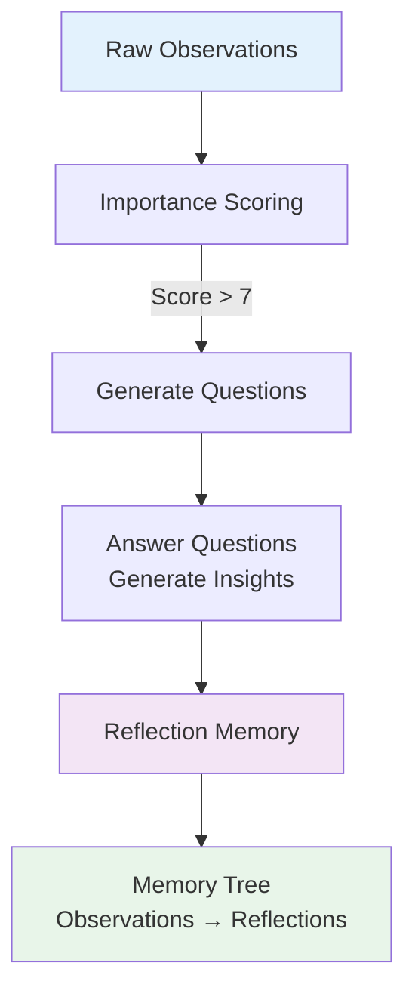

```java
// Stanford Generative Agents Style: Reflection Mechanism
@Service
public class ReflectionMemoryService {

    // Dual memory system
    private final List<Observation> observationMemory = new ArrayList<>();
    private final List<Reflection> reflectionMemory = new ArrayList<>();

    // Triggered daily (or when importance threshold reached)
    @Scheduled(cron = "0 0 2 * * ?") // 2 AM daily
    public void triggerReflection() {

        // 1. Get recent high-importance observations
        List<Observation> recent = getRecentObservations(Duration.ofDays(1));
        List<Observation> importantOnes = recent.stream()
            .filter(obs -> calculateImportance(obs) > 7.0)
            .toList();

        if (importantOnes.isEmpty()) {
            return;
        }

        // 2. Generate reflection questions
        List<String> questions = generateReflectionQuestions(importantOnes);

        // 3. Synthesize insights
        for (String question : questions) {
            Reflection reflection = generateReflection(question, importantOnes);
            reflectionMemory.add(reflection);
        }

        // 4. Build memory tree (observations → reflections)
        buildMemoryTree(importantOnes, reflectionMemory);
    }

    // Step 1: Generate reflection questions
    private List<String> generateReflectionQuestions(List<Observation> observations) {
        String prompt = String.format("""
            Given these recent observations, generate 3-5 high-level questions
            that would help identify patterns or insights:

            Observations:
            %s

            Questions should be abstract and seek to understand underlying themes.
            """,
            observations.stream()
                .map(Observation::getContent)
                .collect(Collectors.joining("\n"))
        );

        String response = llm.generate(prompt);
        return parseQuestions(response);
    }

    // Step 2: Generate reflection (answer questions)
    private Reflection generateReflection(String question, List<Observation> observations) {
        String prompt = String.format("""
            Question: %s

            Relevant observations:
            %s

            Provide a high-level insight or pattern that addresses this question.
            Synthesize from the observations, but think beyond them.
            """,
            question,
            observations.stream()
                .map(Observation::getContent)
                .collect(Collectors.joining("\n"))
        );

        String insight = llm.generate(prompt);

        return Reflection.builder()
            .question(question)
            .insight(insight)
            .basedOnObservations(observations.stream()
                .map(Observation::getId)
                .toList())
            .timestamp(Instant.now())
            .importance(calculateImportance(insight))
            .build();
    }

    // Step 3: Build memory tree (hierarchical structure)
    private void buildMemoryTree(List<Observation> observations, List<Reflection> reflections) {
        // Create links: observations → reflections
        for (Reflection reflection : reflections) {
            for (String obsId : reflection.getBasedOnObservations()) {
                Observation obs = findObservation(obsId);
                obs.addHigherLevelReflection(reflection.getId());
            }
        }
    }
}
```

**Memory Consolidation**:

Over time, memories need consolidation to prevent redundancy and decay.

```java
@Service
public class MemoryConsolidationService {

    // Periodic consolidation (weekly)
    @Scheduled(cron = "0 0 3 * * 0") // 3 AM every Sunday
    public void consolidateMemories() {

        // 1. Detect duplicates
        List<Memory> duplicates = detectDuplicateMemories();

        // 2. Merge duplicates
        for (List<Memory> group : groupDuplicates(duplicates)) {
            Memory merged = mergeMemories(group);
            deleteMemories(group);
            storeMemory(merged);
        }

        // 3. Compress old memories
        List<Memory> oldMemories = getMemoriesOlderThan(Duration.ofDays(30));
        for (List<Memory> batch : batchMemories(oldMemories, 10)) {
            Memory compressed = compressMemories(batch);
            deleteMemories(batch);
            storeMemory(compressed);
        }
    }

    // Duplicate detection using semantic similarity
    private List<Memory> detectDuplicateMemories() {
        List<Memory> allMemories = getAllMemories();
        List<Memory> duplicates = new ArrayList<>();

        for (int i = 0; i < allMemories.size(); i++) {
            for (int j = i + 1; j < allMemories.size(); j++) {
                double similarity = calculateSimilarity(
                    allMemories.get(i),
                    allMemories.get(j)
                );

                if (similarity > 0.9) { // Near-duplicate threshold
                    duplicates.add(allMemories.get(j));
                }
            }
        }

        return duplicates;
    }

    // Memory compression using LLM
    private Memory compressMemories(List<Memory> oldMemories) {
        String prompt = String.format("""
            Compress these memories into a concise summary:
            %s

            Preserve:
            - Key information
            - Important details
            - Actionable insights

            Remove:
            - Redundancy
            - Outdated details
            - Minor points
            """,
            oldMemories.stream()
                .map(Memory::getContent)
                .collect(Collectors.joining("\n"))
        );

        String summary = llm.generate(prompt);

        return Memory.builder()
            .content(summary)
            .isCompressed(true)
            .basedOnMemoryIds(oldMemories.stream()
                .map(Memory::getId)
                .toList())
            .timestamp(Instant.now())
            .build();
    }
}
```

#### 4. Forgetting: Managing Memory Pressure

Not all memories should be kept forever. Intelligent forgetting prevents memory bloat and maintains retrieval performance.

**Three Forgetting Strategies**:

| Strategy | Mechanism | Best For | Example |
|----------|-----------|----------|---------|
| **FIFO** | First-in-first-out | Time-sensitive data | News feed, alerts |
| **LRU + Heat** | Least recently used + access frequency | General purpose | Most agents |
| **Importance Decay** | Low importance fades | Long-term agents | Personal assistants |

```java
@Service
public class MemoryForgettingService {

    // Strategy 1: LRU with Heat Scoring
    public void evictLRUWithHeat(List<Memory> memories, int targetSize) {
        if (memories.size() <= targetSize) {
            return;
        }

        // Calculate heat: access frequency × recency decay
        Map<Memory, Double> heatScores = memories.stream()
            .collect(Collectors.toMap(
                Function.identity(),
                memory -> {
                    long daysSinceAccess = ChronoUnit.DAYS.between(
                        memory.getLastAccessed(),
                        Instant.now()
                    );

                    double accessFrequency = memory.getAccessCount() / (daysSinceAccess + 1.0);
                    return accessFrequency * Math.exp(-0.1 * daysSinceAccess);
                }
            ));

        // Evict coldest memories
        List<Memory> toEvict = memories.stream()
            .sorted(Comparator.comparing(heatScores::get))
            .limit(memories.size() - targetSize)
            .toList();

        memories.removeAll(toEvict);
    }

    // Strategy 2: Importance-Based Decay
    public void decayByImportance(List<Memory> memories) {
        memories.forEach(memory -> {
            double age = ChronoUnit.DAYS.between(
                memory.getTimestamp(),
                Instant.now()
            );

            // Importance decays exponentially over time
            double decayedImportance = memory.getImportance() * Math.exp(-0.05 * age);

            // Mark low-importance memories for deletion
            if (decayedImportance < 2.0) {
                memory.markForDeletion();
            }
        });

        // Remove marked memories
        memories.removeIf(Memory::isMarkedForDeletion);
    }

    // Strategy 3: Compress Before Forget
    public Memory compressBeforeForgetting(List<Memory> oldMemories) {
        // Preserve essence before deletion
        String prompt = String.format("""
            These memories are old and will be deleted.
            Create a compressed summary that preserves only the most essential information:

            %s

            Focus on:
            - One-sentence essence
            - Key facts only
            """,
            oldMemories.stream()
                .map(Memory::getContent)
                .collect(Collectors.joining("\n"))
        );

        String essence = llm.generate(prompt);

        return Memory.builder()
            .content(essence)
            .isCompressed(true)
            .basedOnMemoryIds(oldMemories.stream()
                .map(Memory::getId)
                .toList())
            .build();
    }
}
```

**Memory Lifecycle Diagram**:

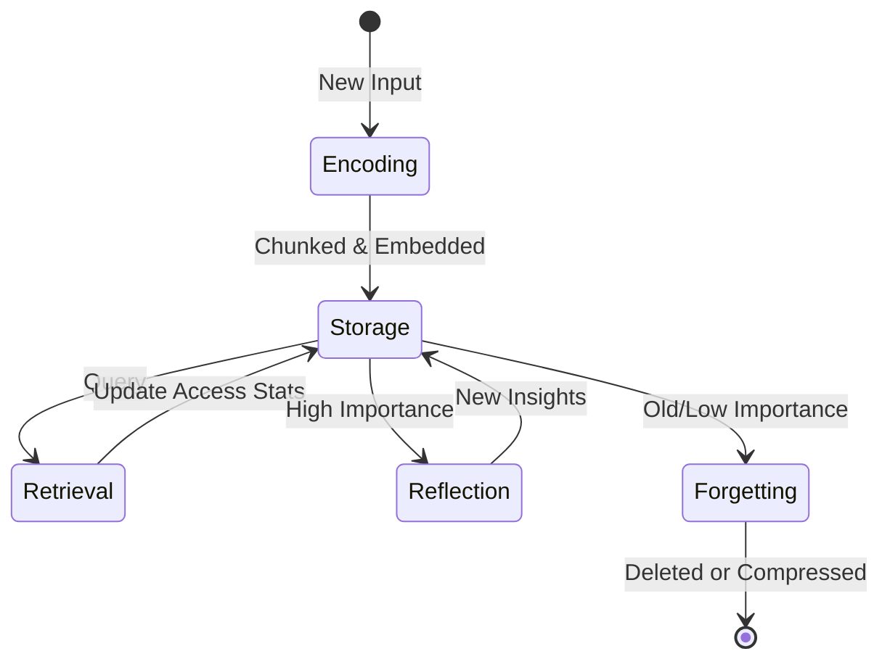

---

### 2.2.4 Context Management Strategies

How do we fit vast memories into limited LLM context windows? Different strategies trade off completeness, coherence, and cost.

#### 1. Sliding Window (Message Buffer)

**Simplest approach**: Keep only the most recent N messages.

**Pros**: Fast, simple, preserves conversation flow
**Cons**: Loses early important information

```java
// Spring AI: Sliding Window
ChatMemory memory = new MessageWindowChatMemory(10); // Last 10 messages
```

#### 2. Summarization (Token Buffer)

**Approach**: Compress old messages into summaries when context exceeds limit.

**Pros**: Token efficient, preserves key information
**Cons**: Loss of detail, summary artifacts

```java
// Spring AI: Summary Memory with Custom Strategy
@Service
public class CustomSummaryMemory {

    private final List<Message> fullHistory = new ArrayList<>();
    private String summary = "";
    private final int TOKEN_LIMIT = 3000;

    public void addMessage(Message message) {
        fullHistory.add(message);

        // Check if we need to summarize
        int currentTokens = estimateTokens(summary, fullHistory);
        if (currentTokens > TOKEN_LIMIT) {
            compressOldestMessages();
        }
    }

    public List<Message> getContext() {
        List<Message> context = new ArrayList<>();

        // Add summary at the beginning
        if (!summary.isEmpty()) {
            context.add(Message.builder()
                .role("system")
                .content("[CONVERSATION SUMMARY]\n" + summary)
                .build());
        }

        // Add recent messages
        context.addAll(getRecentMessages(10));

        return context;
    }

    private void compressOldestMessages() {
        // Keep recent 10, compress the rest
        List<Message> toCompress = fullHistory.subList(
            0,
            Math.max(0, fullHistory.size() - 10)
        );

        String prompt = String.format("""
            Summarize this conversation history:
            %s

            Include:
            - Main topics discussed
            - Important decisions made
            - User preferences revealed
            - Key information exchanged
            """,
            toCompress.stream()
                .map(Message::getContent)
                .collect(Collectors.joining("\n"))
        );

        summary = llm.generate(prompt);
    }
}
```

#### 3. Entity Extraction (Structured Memory)

**Approach**: Extract key entities and facts, discard conversational filler.

**Pros**: Compact, structured, queryable
**Cons**: Misses nuanced context, extraction errors

```java
// Spring AI: Entity Extraction Memory
@Service
public class EntityExtractionMemory {

    private final Map<String, EntityFact> entityStore = new ConcurrentHashMap<>();

    public void processMessage(Message message) {
        // Extract entities using LLM
        String prompt = String.format("""
            Extract key entities and facts from this message:
            %s

            Respond in JSON:
            {
                "entities": [
                    {
                        "name": "...",
                        "type": "PERSON|PLACE|THING|CONCEPT",
                        "attributes": {"key": "value"}
                    }
                ]
            }
            """, message.getContent());

        String response = llm.generate(prompt);
        ExtractedEntities entities = parseEntities(response);

        // Store in entity store
        for (Entity entity : entities.getEntities()) {
            entityStore.put(entity.getName(), entity);
        }
    }

    public String retrieveEntityFact(String entityName, String attribute) {
        EntityFact fact = entityStore.get(entityName);
        return fact != null ? fact.getAttribute(attribute) : null;
    }

    public String buildContext() {
        return entityStore.values().stream()
            .map(EntityFact::toString)
            .collect(Collectors.joining("\n"));
    }
}
```

#### 4. Retrieval-Augmented Generation (RAG)

**Approach**: Dynamically retrieve relevant memory chunks based on current query.

**Pros**: Precise, scalable, memory-efficient
**Cons**: Latency, requires good embeddings

```java
// RAG: Dynamic Context Retrieval
@Service
public class RAGMemoryService {

    private final VectorStore vectorStore;

    public List<Message> buildContext(String query) {
        // 1. Retrieve relevant memories
        List<Document> relevantDocs = vectorStore.similaritySearch(
            SearchRequest.query(query)
                .withTopK(5)
                .withSimilarityThreshold(0.7)
        );

        // 2. Convert to context messages
        return relevantDocs.stream()
            .map(doc -> Message.builder()
                .role("system")
                .content(String.format("[RELEVANT MEMORY]\n%s", doc.getText()))
                .build())
            .toList();
    }

    // Multi-turn retrieval optimization
    public List<Message> multiTurnContext(List<String> queryHistory) {
        // 1. Expand query using conversation history
        String expandedQuery = expandQuery(queryHistory);

        // 2. Hybrid search (vector + keyword)
        List<Document> vectorResults = vectorStore.similaritySearch(expandedQuery);
        List<Document> keywordResults = keywordSearch(expandedQuery);

        // 3. Reciprocal Rank Fusion (RRF)
        List<Document> fused = fuseResults(vectorResults, keywordResults);

        // 4. Rerank using LLM
        List<Document> reranked = rerank(fused, queryHistory);

        return reranked.stream()
            .map(doc -> Message.builder()
                .role("system")
                .content(doc.getText())
                .build())
            .toList();
    }

    // Query expansion using LLM
    private String expandQuery(List<String> queryHistory) {
        String prompt = String.format("""
            Given this conversation history, generate an expanded search query
            that captures the user's underlying intent:

            Conversation:
            %s

            Expanded query (single sentence):
            """,
            String.join("\n", queryHistory)
        );

        return llm.generate(prompt);
    }
}
```

**Strategy Comparison**:

| Strategy | Token Efficiency | Coherence | Latency | Best For |
|----------|------------------|-----------|---------|----------|
| **Sliding Window** | Low | High | Very low | Short chats |
| **Summarization** | High | Medium | Low | Long conversations |
| **Entity Extraction** | Very high | Low | Low | Personal assistants |
| **RAG** | High | Medium | Medium | Knowledge-intensive |

---

### 2.2.5 Multi-Agent Shared Memory

When multiple agents collaborate, how do they share memory while maintaining individual perspectives?

#### 1. Private Memory (Agent-Specific)

Each agent maintains private memory for:
- Intermediate reasoning steps
- Temporary variables
- Error logs and debugging info
- Agent-specific knowledge

```java
// Private memory: Thread-local storage
@Component
public class PrivateAgentMemory {

    private final ThreadLocal<AgentState> privateState =
        ThreadLocal.withInitial(AgentState::new);

    public void setThoughtProcess(String thought) {
        privateState.get().setCurrentThought(thought);
    }

    public String getThoughtProcess() {
        return privateState.get().getCurrentThought();
    }

    public void setTemporaryVariable(String key, Object value) {
        privateState.get().setVariable(key, value);
    }

    public Object getTemporaryVariable(String key) {
        return privateState.get().getVariable(key);
    }

    // Cleanup to prevent memory leaks
    @PreDestroy
    public void cleanup() {
        privateState.remove();
    }
}
```

#### 2. Shared Memory (Team Knowledge Base)

All agents can access shared memory:
- Team announcements
- Common knowledge base
- User preferences
- Project state

```java
// Shared memory: Blackboard pattern
@Service
public class SharedAgentMemory {

    // Key-value store for fast access
    private final ConcurrentHashMap<String, Object> blackboard =
        new ConcurrentHashMap<>();

    // Vector store for semantic search
    private final VectorStore sharedKnowledge;

    // Write to shared memory
    public void writeSharedMemory(String key, Object value) {
        blackboard.put(key, value);

        // Also store in vector store for semantic retrieval
        MemoryDocument doc = MemoryDocument.builder()
            .id(key)
            .text(value.toString())
            .metadata(Map.of(
                "source", "shared",
                "timestamp", Instant.now(),
                "type", value.getClass().getSimpleName()
            ))
            .build();

        sharedKnowledge.add(List.of(doc));
    }

    // Read from shared memory
    public Object readSharedMemory(String key) {
        return blackboard.get(key);
    }

    // Semantic search in shared memory
    public List<Memory> searchSharedMemory(String query) {
        return sharedKnowledge.similaritySearch(
            SearchRequest.query(query).withTopK(5)
        );
    }
}
```

#### 3. Memory Synchronization

When one agent updates memory, how do others stay informed?

**Three Synchronization Patterns**:

| Pattern | Mechanism | Best For | Complexity |
|---------|-----------|----------|------------|
| **Pub-Sub** | Event bus notifications | Real-time updates | Medium |
| **Version Control** | Conflict detection/resolution | Concurrent writes | High |
| **Polling** | Periodic checks | Simple setups | Low |

```java
// Memory synchronization with pub-sub
@Service
public class MemorySynchronizationService {

    private final List<Agent> subscribedAgents = new ArrayList<>();
    private final EventEmitter eventBus = new EventEmitter();

    // Agent subscribes to memory updates
    public void subscribeToUpdates(Agent agent) {
        subscribedAgents.add(agent);
        eventBus.on("memory:update", (event) -> {
            agent.onMemoryUpdate((MemoryUpdate) event.getData());
        });
    }

    // Publish memory update
    @PublishEvent
    public void publishMemoryUpdate(MemoryUpdate update) {
        // Store update
        applyUpdate(update);

        // Notify all subscribers
        eventBus.emit("memory:update", update);

        // Notify subscribed agents directly
        subscribedAgents.forEach(agent -> {
            agent.onMemoryUpdate(update);
        });
    }

    // Conflict resolution (version control)
    public Memory resolveConflict(Memory local, Memory remote) {
        if (local.getVersion() == remote.getVersion()) {
            // No conflict
            return remote;
        }

        // Conflict detected: Use LLM to merge
        String mergePrompt = String.format("""
            Merge these conflicting memory versions:

            Local version (v%d): %s
            Remote version (v%d): %s

            Produce a merged version that preserves the most accurate and up-to-date information.
            """,
            local.getVersion(), local.getContent(),
            remote.getVersion(), remote.getContent()
        );

        String mergedContent = llm.generate(mergePrompt);

        return Memory.builder()
            .content(mergedContent)
            .version(Math.max(local.getVersion(), remote.getVersion()) + 1)
            .build();
    }
}
```

**Multi-Agent Memory Architecture**:

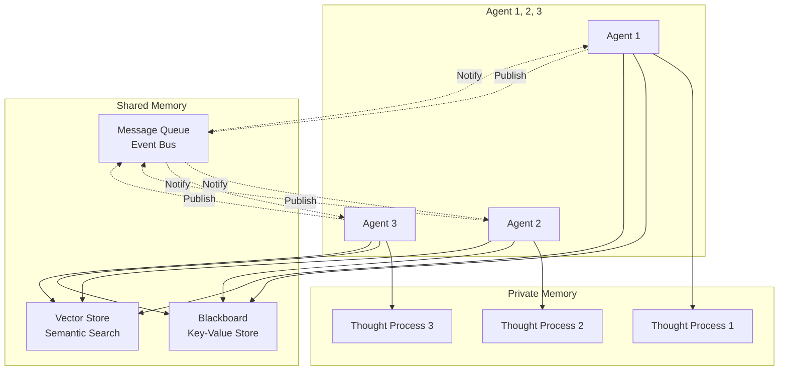

---

### 2.2.6 Evaluation Metrics

How do we measure if a memory system is effective? We need comprehensive metrics across performance, behavior, and resource utilization.

#### 1. Performance Metrics

**Hit Rate**: Proportion of queries that successfully retrieve relevant memory

```java
@Service
public class MemoryEvaluationService {

    public EvaluationMetrics evaluate(List<TestQuery> testQueries) {
        int totalQueries = testQueries.size();
        int hits = 0;
        double sumPrecision = 0.0;
        double sumRecall = 0.0;

        for (TestQuery query : testQueries) {
            List<Memory> retrieved = memoryService.retrieve(query.getQuery(), 10);
            Set<String> relevantIds = query.getRelevantMemoryIds();

            // Hit: At least one relevant memory retrieved
            boolean hit = retrieved.stream()
                .anyMatch(m -> relevantIds.contains(m.getId()));
            if (hit) hits++;

            // Precision@10: Relevant retrieved / Total retrieved
            long relevantRetrieved = retrieved.stream()
                .filter(m -> relevantIds.contains(m.getId()))
                .count();
            double precision = (double) relevantRetrieved / 10;
            sumPrecision += precision;

            // Recall@10: Relevant retrieved / Total relevant
            double recall = (double) relevantRetrieved / relevantIds.size();
            sumRecall += recall;
        }

        // F1 Score: Harmonic mean of precision and recall
        double avgPrecision = sumPrecision / totalQueries;
        double avgRecall = sumRecall / totalQueries;
        double f1Score = 2 * (avgPrecision * avgRecall) / (avgPrecision + avgRecall);

        return EvaluationMetrics.builder()
            .hitRate((double) hits / totalQueries)
            .avgPrecision(avgPrecision)
            .avgRecall(avgRecall)
            .f1Score(f1Score)
            .build();
    }
}
```

**Target Metrics**:

| Metric | Target | Measurement Method |
|--------|--------|-------------------|
| **Hit Rate** | > 90% | Test set evaluation |
| **Precision@K** | > 0.85 | Annotated test queries |
| **Recall@K** | > 0.80 | Annotated test queries |
| **F1 Score** | > 0.82 | Calculated from P/R |
| **Latency** | < 100ms | Load testing |

#### 2. Behavioral Metrics

**Coherence**: Does the agent maintain consistent context?

```java
// LLM-as-a-Judge: Evaluate coherence
@Service
public class BehaviorEvaluationService {

    public double evaluateCoherence(List<Message> conversation) {
        String prompt = String.format("""
            Evaluate the coherence of this conversation:
            %s

            Rate from 1-10 on:
            - Context consistency
            - Logical flow
            - Contradiction avoidance

            Respond with just a number.
            """,
            conversation.stream()
                .map(Message::getContent)
                .collect(Collectors.joining("\n"))
        );

        String response = llm.generate(prompt);
        return Double.parseDouble(response.trim()) / 10.0;
    }
}
```

**Key Behavioral Metrics**:

| Metric | Target | Evaluation Method |
|--------|--------|-------------------|
| **Coherence** | > 0.8 | LLM-as-a-Judge |
| **Believability** | > 4/5 | Human rating |
| **Adaptability** | > 0.7 | Scenario testing |

#### 3. Resource Metrics

**Token Efficiency**: Percentage of context tokens that contribute to responses

```java
@Service
public class ResourceEvaluationService {

    public TokenEfficiencyMetrics evaluateTokenEfficiency(
        List<Conversation> conversations
    ) {
        long totalContextTokens = 0;
        long effectiveTokens = 0;

        for (Conversation conv : conversations) {
            for (Turn turn : conv.getTurns()) {
                // Context tokens provided
                long contextTokens = estimateTokens(turn.getContext());
                totalContextTokens += contextTokens;

                // Effective tokens: referenced in response
                long referencedTokens = estimateReferencedTokens(
                    turn.getContext(),
                    turn.getResponse()
                );
                effectiveTokens += referencedTokens;
            }
        }

        double efficiency = (double) effectiveTokens / totalContextTokens;

        return TokenEfficiencyMetrics.builder()
            .totalContextTokens(totalContextTokens)
            .effectiveTokens(effectiveTokens)
            .efficiency(efficiency)
            .build();
    }
}
```

**Resource Targets**:

| Metric | Target | Monitoring Method |
|--------|--------|-------------------|
| **Token Efficiency** | > 80% | Token analysis |
| **Memory Utilization** | > 70% | Storage metrics |
| **Compute Cost** | < $0.01/query | Cost tracking |

#### 4. End-to-End Evaluation Pipeline

```java
// Comprehensive evaluation system
@Service
public class MemorySystemEvaluator {

    public EvaluationReport evaluate(
        MemorySystem memorySystem,
        List<TestQuery> testQueries,
        List<Conversation> testConversations
    ) {
        // 1. Performance metrics
        EvaluationMetrics performance = performanceEvaluator.evaluate(testQueries);

        // 2. Behavioral metrics
        double avgCoherence = testConversations.stream()
            .mapToDouble(behaviorEvaluator::evaluateCoherence)
            .average()
            .orElse(0.0);

        // 3. Resource metrics
        TokenEfficiencyMetrics efficiency = resourceEvaluator.evaluateTokenEfficiency(testConversations);

        // 4. Generate report
        return EvaluationReport.builder()
            .performance(performance)
            .coherence(avgCoherence)
            .tokenEfficiency(efficiency)
            .overallScore(calculateOverallScore(performance, avgCoherence, efficiency))
            .recommendations(generateRecommendations(performance, avgCoherence, efficiency))
            .build();
    }

    private double calculateOverallScore(
        EvaluationMetrics performance,
        double coherence,
        TokenEfficiencyMetrics efficiency
    ) {
        return 0.4 * performance.getF1Score() +
               0.3 * coherence +
               0.3 * efficiency.getEfficiency();
    }
}
```

**Complete Metrics Dashboard**:

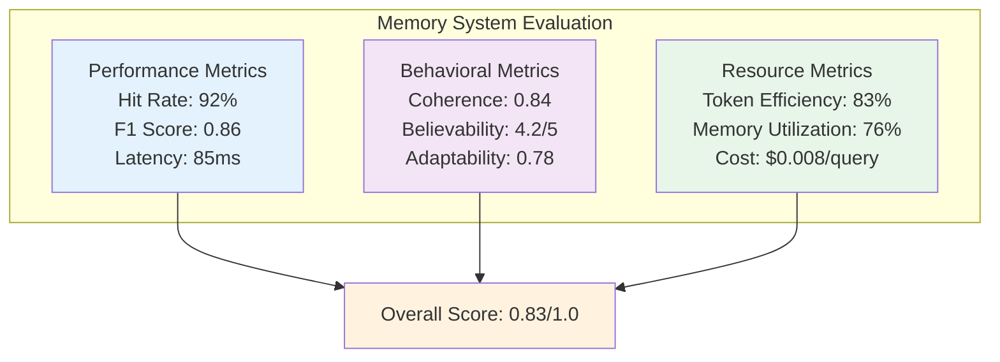

---

### 2.2.7 Key Takeaways & Best Practices

#### Memory System Design Checklist

- [ ] **Understand your use case**: Semantic search? Exact queries? Long context?
- [ ] **Choose right storage**: Vector store for semantic, SQL for state, Graph for reasoning
- [ ] **Implement multi-signal retrieval**: Combine recency, importance, relevance
- [ ] **Add reflection mechanism**: Enable agents to learn from experience
- [ ] **Plan for forgetting**: LRU, importance decay, compression
- [ ] **Measure everything**: Track hit rate, coherence, token efficiency
- [ ] **Start simple**: Sliding window → Add summarization → Add RAG
- [ ] **Use production tools**: Pinecone, Weaviate, Neo4j, Spring AI

#### Quick Reference

| Task | Recommended Approach |
|------|---------------------|
| **Simple chatbot** | Sliding window (MessageWindowChatMemory) |
| **Long conversations** | Summarization (TokenBufferChatMemory) |
| **Personal assistant** | Entity extraction + Vector store |
| **Knowledge base** | Vector store + RAG |
| **Complex reasoning** | Knowledge graph (GraphRAG) |
| **Very long context** | Hierarchical storage (MemGPT) |
| **Multi-agent system** | Shared memory + Pub-sub sync |
| **Learning agent** | Episodic memory + Reflection |

---

### 2.2.8 References & Further Reading

**Core Papers**:
1. **MemGPT**: "Towards LLMs as Operating Systems" (UC Berkeley, 2023) - https://arxiv.org/abs/2310.08560
2. **GraphRAG**: Microsoft Research (2024) - https://www.microsoft.com/en-us/research/project/graphrag/
3. **Stanford Generative Agents**: Park et al. (2023) - https://arxiv.org/abs/2304.03442
4. **Lost in the Middle**: Liu et al. (2023) - https://arxiv.org/abs/2307.03172

**Production Frameworks**:
- **Spring AI**: https://docs.spring.io/spring-ai/reference/
- **LangChain Memory**: https://python.langchain.com/docs/modules/memory/
- **MemGPT/Letta**: https://www.memgpt.ai/
- **LightRAG**: https://github.com/HKUDS/LightRAG

**Tools**:
- **Pinecone**: https://www.pinecone.io/
- **Weaviate**: https://weaviate.io/
- **Neo4j**: https://neo4j.com/
- **pgvector**: https://github.com/pgvector/pgvector

---

## 2.3 Tool System

Tools are the capabilities that allow agents to interact with the world beyond text generation.

### Tool Architecture

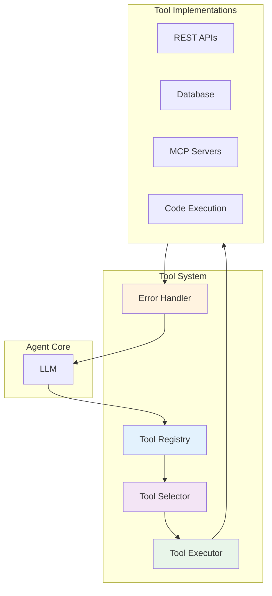

### 1. Tool Definition

Tools must be defined with clear schemas for the LLM to understand and use them.

```java
// Spring AI: Tool Definition
@Descriptor("search_web")
public record SearchRequest(
    @Description("The search query string") String query,
    @Description("Number of results to return") @DefaultValue("5") int numResults
) {}

public FunctionCallback callback = FunctionCallback.builder()
    .function("search_web", this::searchWeb)
    .description("Search the web for current information")
    .inputType(SearchRequest.class)
    .build();
```

### 2. Tool Selection Strategies

| Strategy | Description | When to Use |
|----------|-------------|-------------|
| **LLM-based** | LLM chooses tool | General purpose |
| **Rule-based** | Predefined rules | Deterministic selection |
| **Embedding-based** | Semantic matching | Many similar tools |
| **Router Agent** | Separate agent decides | Complex tool ecosystems |

### 3. Tool Execution Flow

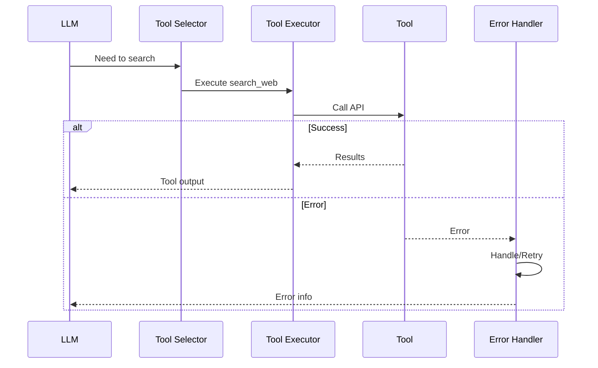

### 4. Error Handling

Robust agents must handle tool failures gracefully.

```java
// Spring AI: Tool Error Handling
public class ResilientToolExecutor {

    @Retryable(maxAttempts = 3, backoff = @Backoff(delay = 1000))
    public ToolExecutionResult execute(ToolCall call) {
        try {
            return tool.execute(call);
        } catch (RateLimitException e) {
            // Exponential backoff retry
            throw e;
        } catch (InvalidInputException e) {
            // Return structured error to LLM
            return ToolExecutionResult.error(e.getMessage());
        } catch (Exception e) {
            // Log and fail gracefully
            logger.error("Tool execution failed", e);
            return ToolExecutionResult.error("Tool unavailable");
        }
    }
}
```

### 5. MCP Integration

Model Context Protocol provides a standardized way to integrate tools.

```java
// Spring AI: MCP Server Integration
@Bean
public McpClient mcpClient() {
    return McpClient.builder()
        .server("file-system")
        .transport(StdioServerTransport.builder()
            .command("npx")
            .args("-y", "@modelcontextprotocol/server-filesystem", "/allowed/path")
            .build())
        .build();
}
```

---

## 2.4 Planning System

Planning enables agents to break down complex tasks and execute them systematically.

### Planning Hierarchy

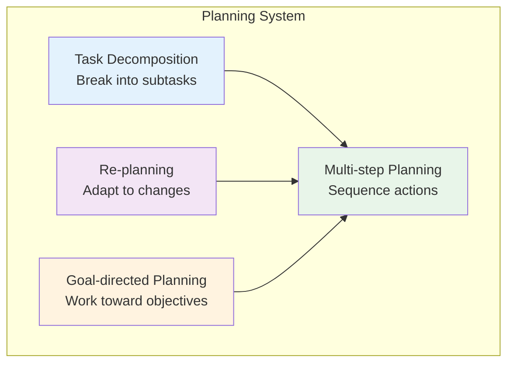

### 1. Task Decomposition

Breaking complex goals into manageable subtasks.

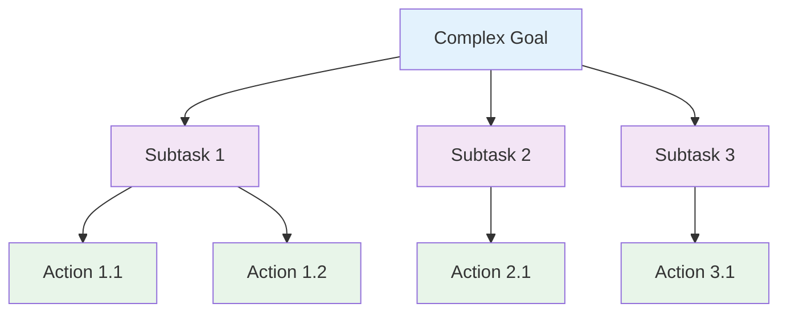

**Example:**
```
Goal: "Research and write a blog post about quantum computing"

Decomposition:
1. Research Phase
   - Search "quantum computing basics"
   - Search "latest quantum computing advances 2024"
   - Extract key concepts and examples

2. Outline Phase
   - Structure blog post
   - Define sections

3. Writing Phase
   - Write introduction
   - Write body paragraphs
   - Write conclusion

4. Review Phase
   - Check for accuracy
   - Improve clarity
   - Add citations
```

### 2. Re-planning

Adapting plans based on feedback and changing conditions.

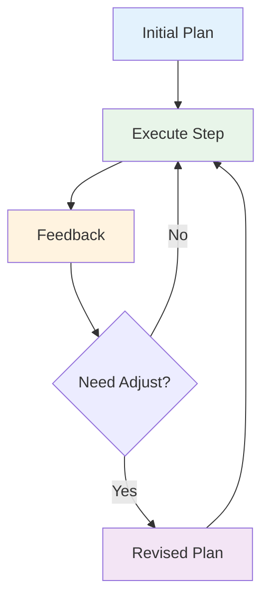

**Re-planning Triggers:**
- Tool failure
- Unexpected results
- New information
- User feedback
- Timeout or resource constraints

### 3. Multi-step Planning

Sequencing actions to achieve complex goals.

```java
// Spring AI: Multi-step Planning
public class TaskPlanner {

    public List<Action> plan(String goal) {
        return List.of(
            Action.builder()
                .type("search")
                .params(Map.of("query", goal))
                .build(),
            Action.builder()
                .type("analyze")
                .dependsOn(List.of(0))
                .build(),
            Action.builder()
                .type("write")
                .dependsOn(List.of(1))
                .build()
        );
    }
}
```

### 4. Goal-directed Planning

Planning with specific objectives in mind.

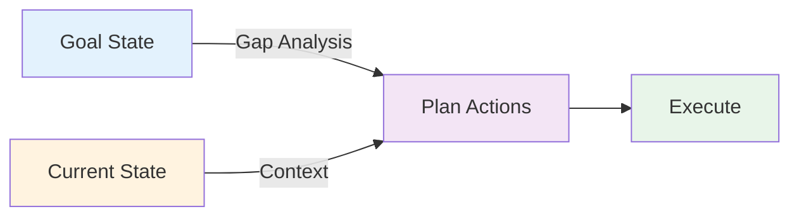

**Techniques:**
- Forward chaining (start from current state)
- Backward chaining (start from goal state)
- Bidirectional search (both directions)
- Hierarchical planning (plan at multiple levels)

---

## 2.5 Integration: Complete Agent Architecture

Putting it all together - a complete agent architecture.

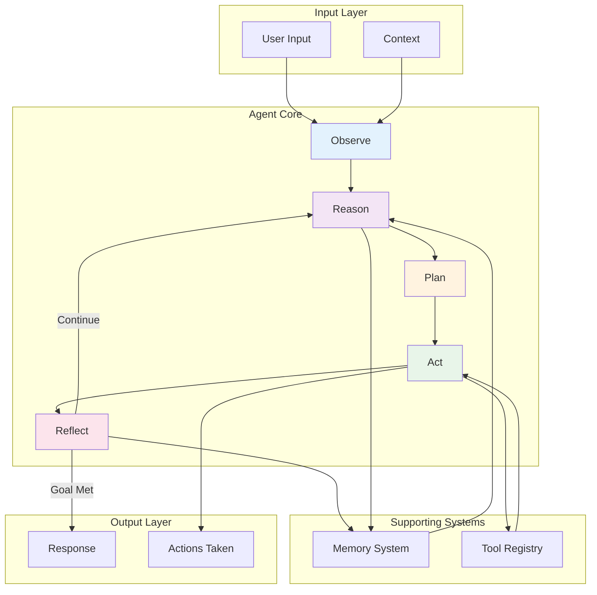

---

## 2.6 Key Takeaways

### Memory System Selection

| Memory Type | Best For | Trade-offs |
|-------------|----------|------------|
| **Buffer** | Short conversations | Simple but limited |
| **Summary** | Long sessions | Efficient but lossy |
| **Vector** | Knowledge-intensive | Powerful but complex |
| **Entity** | Personal assistants | Structured but rigid |
| **Episodic** | Learning agents | Rich but expensive |

### Tool System Design

1. **Clear Descriptions**: LLM must understand when and how to use tools
2. **Strong Typing**: Use structured schemas for inputs/outputs
3. **Error Handling**: Graceful failures with informative messages
4. **Idempotency**: Tools should be safe to retry

### Planning Best Practices

1. **Decompose**: Break complex tasks into subtasks
2. **Adapt**: Re-plan when conditions change
3. **Validate**: Check plan feasibility before execution
4. **Iterate**: Use reflection to improve plans

---

## 2.7 Next Steps

Now that you understand the foundational architecture:

**For Implementation:**
- → **[3. Design Patterns](./design-patterns)** - Learn proven patterns for structuring agents
- → **[4. Frameworks](./frameworks)** - See how to implement with Spring AI

**For Advanced Topics:**
- → **[5. Engineering](./engineering)** - Production deployment and evaluation
- → **[6. Frontier](./frontier)** - Emerging trends and research

---

:::tip Architecture Pattern
The ReAct loop (Reason → Act → Observe) is the foundation of most agent architectures. Master this pattern before exploring more complex systems.
:::

:::info Spring AI Developers
See **[4. Frameworks & Tech Stack](./frameworks)** for complete Spring AI implementation examples of all these components.
:::
