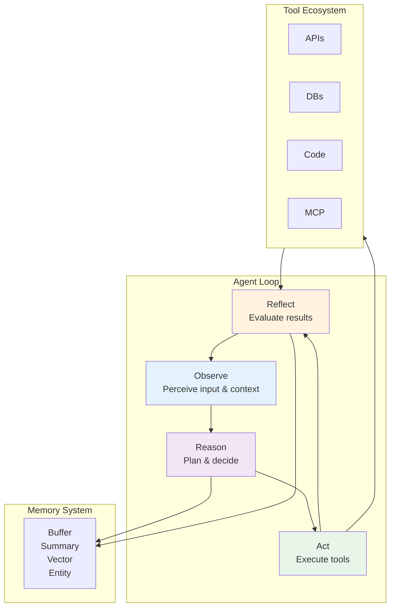
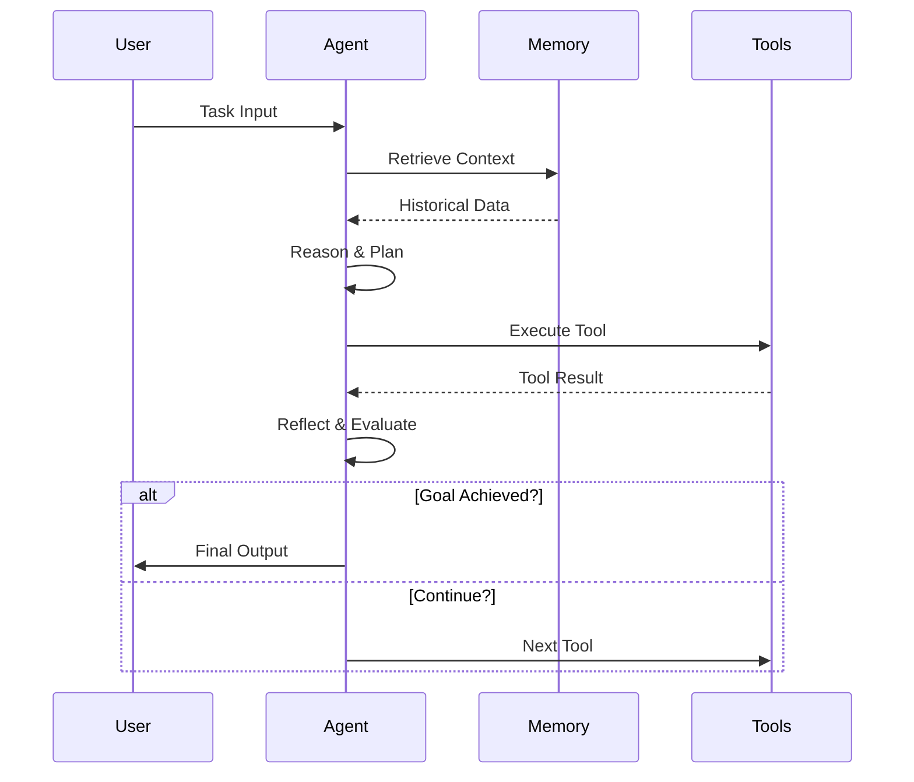
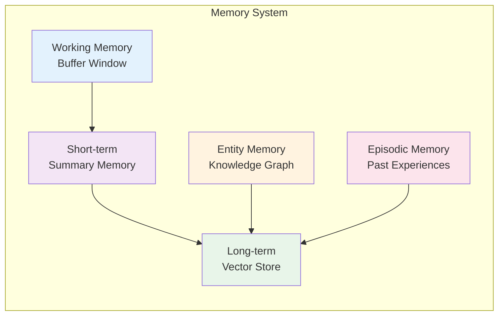
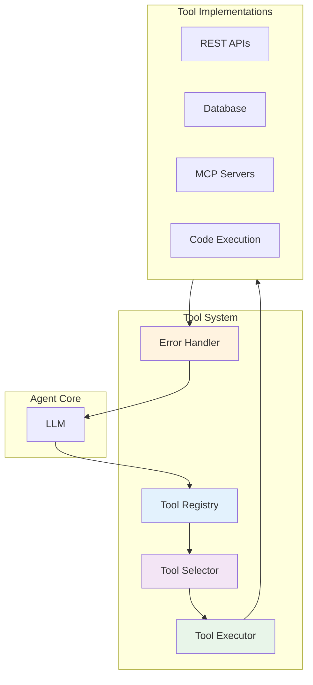
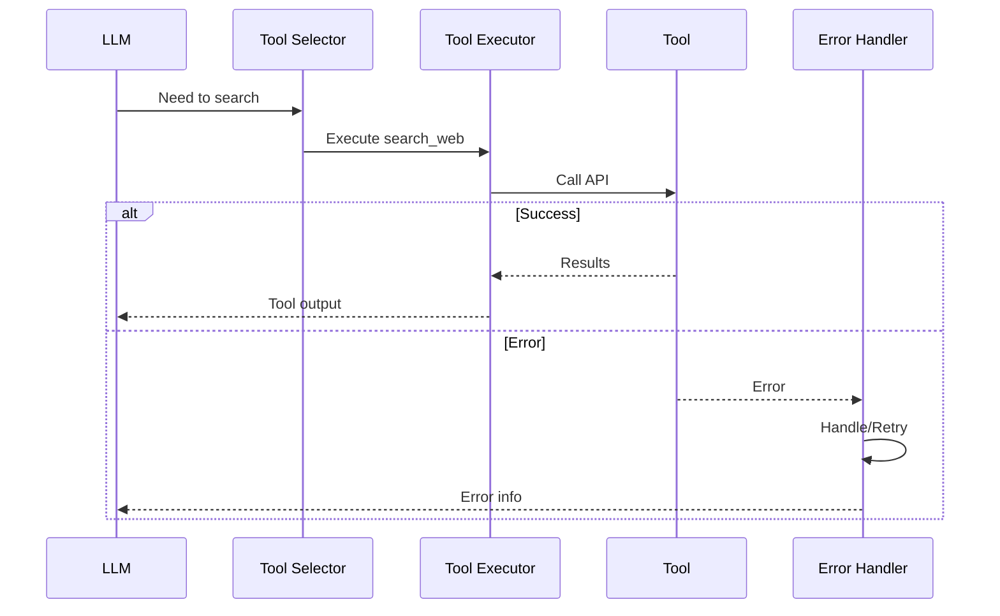
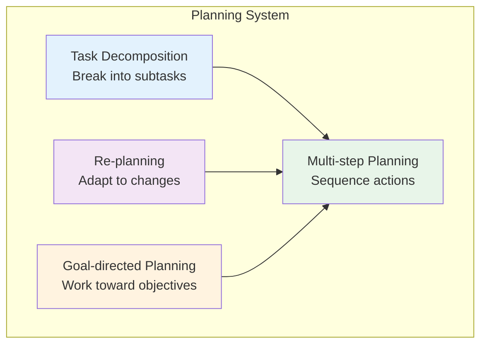
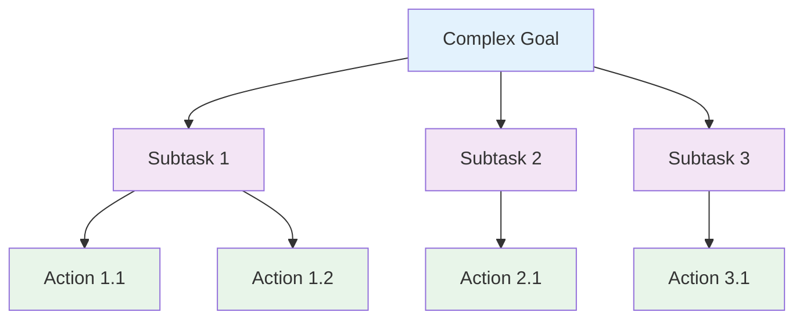
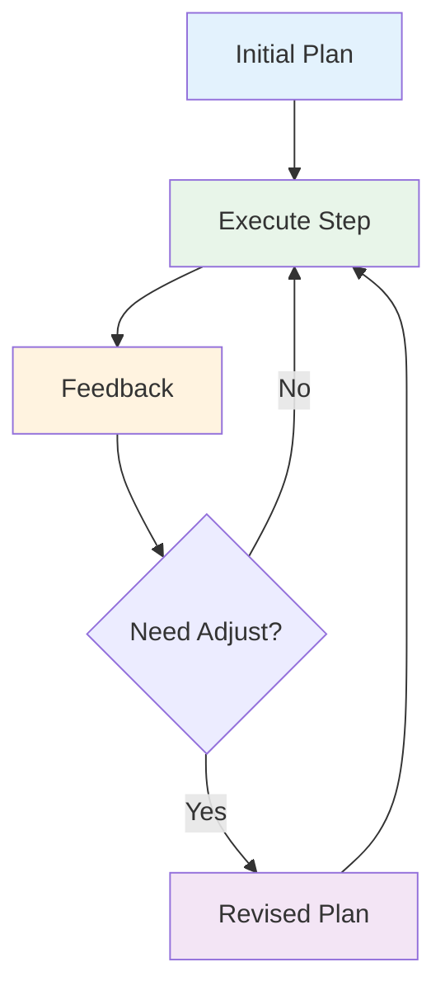
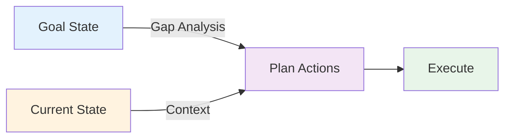
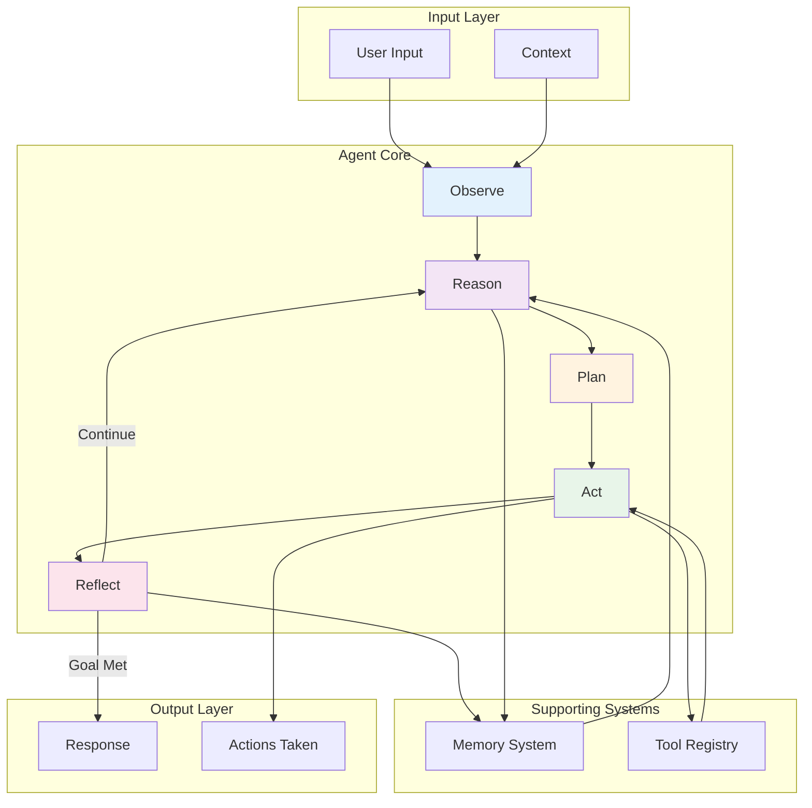

# 2. Core Architecture Components

AI agents are built on four foundational systems: **The Agent Loop**, **Memory**, **Tools**, and **Planning**. This section dives deep into each component, explaining how they work together to create autonomous, intelligent systems.

---

## 2.1 The Agent Loop

### Core Mechanism: Observe → Reason → Act → Observe

The agent loop is the heartbeat of any agentic system. It's a continuous cycle of perception, reasoning, action, and reflection.



### Detailed Loop Execution



### Loop Variants

| Pattern | Description | Best For |
|---------|-------------|----------|
| **ReAct** | Reason → Act → Observe | General purpose tasks |
| **Plan-and-Execute** | Plan all steps, then execute | Well-defined goals |
| **Re-planning** | Continuous adjustment | Dynamic environments |
| **Reflection** | Self-critique and revision | Quality-critical tasks |

---

## 2.2 Memory Systems

Memory is what separates stateless chatbots from intelligent agents. A robust memory system enables agents to maintain context, learn from experience, and make informed decisions.

### Memory Hierarchy



### 1. Buffer Memory (Working Memory)

The simplest form of memory - keeps recent conversation history.

**Characteristics:**
- Stores last N messages
- Fixed-size window
- First-in-first-out eviction
- Fast access

**Use Cases:**
- Short conversations
- Stateless sessions
- Simple context tracking

```java
// Spring AI: ChatMemory with Buffer Window
ChatMemory memory = new MessageWindowChatMemory(10); // Last 10 messages
```

### 2. Summary Memory

Compresses historical context into concise summaries.

**Characteristics:**
- Summarizes old conversations
- Growing window with compression
- Balances detail and brevity
- Reduces token usage

**Use Cases:**
- Long-running conversations
- Token-constrained scenarios
- When history matters but details don't

```java
// Spring AI: Summary Memory
ChatMemory memory = new TokenBufferChatMemory(
    new SummaryTokenBuffer(3000) // Compress at 3000 tokens
);
```

### 3. Vector Store Memory (Semantic Memory)

Retrieves relevant past information based on semantic similarity.

**Characteristics:**
- Embedding-based retrieval
- Semantic search
- Scalable to large knowledge bases
- RAG integration

**Use Cases:**
- Knowledge-intensive tasks
- Document-based conversations
- Long-term information retention

```java
// Spring AI: Vector Store Memory
VectorStore vectorStore = new SimpleVectorStore();
ChatMemory memory = new VectorStoreChatMemory(vectorStore);
```

### 4. Entity Memory

Extracts and remembers facts about entities (people, places, things).

**Characteristics:**
- Entity extraction
- Relationship tracking
- Knowledge graph structure
- Fact-based retrieval

**Use Cases:**
- Personal assistant agents
- CRM systems
- Information extraction

```java
// Spring AI: Entity Memory
EntityMemory memory = new EntityMemory();
memory.remember("John works at OpenAI");
memory.remember("John lives in San Francisco");

// Later
String workplace = memory.getEntityFact("John", "workplace");
// Returns: "OpenAI"
```

### 5. Episodic Memory

Stores complete episodes of past agent experiences.

**Characteristics:**
- Stores full task execution traces
- Includes goals, actions, outcomes
- Enables learning from experience
- Supports reflection and improvement

**Use Cases:**
- Self-improving agents
- Case-based reasoning
- Complex multi-step tasks

```java
// Spring AI: Episodic Memory
EpisodicMemory memory = new EpisodicMemory();
Episode episode = Episode.builder()
    .goal("Fix bug in authentication")
    .actions(List.of("search", "read_code", "propose_fix"))
    .outcome("Bug fixed successfully")
    .build();
memory.store(episode);
```

### Memory Selection Guide

| Scenario | Recommended Memory | Reason |
|----------|-------------------|--------|
| Quick Q&A | Buffer | Simple, fast |
| Long conversation | Summary | Token efficiency |
| Knowledge-intensive | Vector Store | Semantic retrieval |
| Personal assistant | Entity + Vector | Fact retention |
| Learning agent | Episodic | Experience-based |

---

## 2.3 Tool System

Tools are the capabilities that allow agents to interact with the world beyond text generation.

### Tool Architecture



### 1. Tool Definition

Tools must be defined with clear schemas for the LLM to understand and use them.

```java
// Spring AI: Tool Definition
@Descriptor("search_web")
public record SearchRequest(
    @Description("The search query string") String query,
    @Description("Number of results to return") @DefaultValue("5") int numResults
) {}

public FunctionCallback callback = FunctionCallback.builder()
    .function("search_web", this::searchWeb)
    .description("Search the web for current information")
    .inputType(SearchRequest.class)
    .build();
```

### 2. Tool Selection Strategies

| Strategy | Description | When to Use |
|----------|-------------|-------------|
| **LLM-based** | LLM chooses tool | General purpose |
| **Rule-based** | Predefined rules | Deterministic selection |
| **Embedding-based** | Semantic matching | Many similar tools |
| **Router Agent** | Separate agent decides | Complex tool ecosystems |

### 3. Tool Execution Flow



### 4. Error Handling

Robust agents must handle tool failures gracefully.

```java
// Spring AI: Tool Error Handling
public class ResilientToolExecutor {

    @Retryable(maxAttempts = 3, backoff = @Backoff(delay = 1000))
    public ToolExecutionResult execute(ToolCall call) {
        try {
            return tool.execute(call);
        } catch (RateLimitException e) {
            // Exponential backoff retry
            throw e;
        } catch (InvalidInputException e) {
            // Return structured error to LLM
            return ToolExecutionResult.error(e.getMessage());
        } catch (Exception e) {
            // Log and fail gracefully
            logger.error("Tool execution failed", e);
            return ToolExecutionResult.error("Tool unavailable");
        }
    }
}
```

### 5. MCP Integration

Model Context Protocol provides a standardized way to integrate tools.

```java
// Spring AI: MCP Server Integration
@Bean
public McpClient mcpClient() {
    return McpClient.builder()
        .server("file-system")
        .transport(StdioServerTransport.builder()
            .command("npx")
            .args("-y", "@modelcontextprotocol/server-filesystem", "/allowed/path")
            .build())
        .build();
}
```

---

## 2.4 Planning System

Planning enables agents to break down complex tasks and execute them systematically.

### Planning Hierarchy



### 1. Task Decomposition

Breaking complex goals into manageable subtasks.



**Example:**
```
Goal: "Research and write a blog post about quantum computing"

Decomposition:
1. Research Phase
   - Search "quantum computing basics"
   - Search "latest quantum computing advances 2024"
   - Extract key concepts and examples

2. Outline Phase
   - Structure blog post
   - Define sections

3. Writing Phase
   - Write introduction
   - Write body paragraphs
   - Write conclusion

4. Review Phase
   - Check for accuracy
   - Improve clarity
   - Add citations
```

### 2. Re-planning

Adapting plans based on feedback and changing conditions.



**Re-planning Triggers:**
- Tool failure
- Unexpected results
- New information
- User feedback
- Timeout or resource constraints

### 3. Multi-step Planning

Sequencing actions to achieve complex goals.

```java
// Spring AI: Multi-step Planning
public class TaskPlanner {

    public List<Action> plan(String goal) {
        return List.of(
            Action.builder()
                .type("search")
                .params(Map.of("query", goal))
                .build(),
            Action.builder()
                .type("analyze")
                .dependsOn(List.of(0))
                .build(),
            Action.builder()
                .type("write")
                .dependsOn(List.of(1))
                .build()
        );
    }
}
```

### 4. Goal-directed Planning

Planning with specific objectives in mind.



**Techniques:**
- Forward chaining (start from current state)
- Backward chaining (start from goal state)
- Bidirectional search (both directions)
- Hierarchical planning (plan at multiple levels)

---

## 2.5 Integration: Complete Agent Architecture

Putting it all together - a complete agent architecture.



---

## 2.6 Key Takeaways

### Memory System Selection

| Memory Type | Best For | Trade-offs |
|-------------|----------|------------|
| **Buffer** | Short conversations | Simple but limited |
| **Summary** | Long sessions | Efficient but lossy |
| **Vector** | Knowledge-intensive | Powerful but complex |
| **Entity** | Personal assistants | Structured but rigid |
| **Episodic** | Learning agents | Rich but expensive |

### Tool System Design

1. **Clear Descriptions**: LLM must understand when and how to use tools
2. **Strong Typing**: Use structured schemas for inputs/outputs
3. **Error Handling**: Graceful failures with informative messages
4. **Idempotency**: Tools should be safe to retry

### Planning Best Practices

1. **Decompose**: Break complex tasks into subtasks
2. **Adapt**: Re-plan when conditions change
3. **Validate**: Check plan feasibility before execution
4. **Iterate**: Use reflection to improve plans

---

## 2.7 Next Steps

Now that you understand the foundational architecture:

**For Implementation:**
- → **[3. Design Patterns](./design-patterns)** - Learn proven patterns for structuring agents
- → **[4. Frameworks](./frameworks)** - See how to implement with Spring AI

**For Advanced Topics:**
- → **[5. Engineering](./engineering)** - Production deployment and evaluation
- → **[6. Frontier](./frontier)** - Emerging trends and research

---

:::tip Architecture Pattern
The ReAct loop (Reason → Act → Observe) is the foundation of most agent architectures. Master this pattern before exploring more complex systems.
:::

:::info Spring AI Developers
See **[4. Frameworks & Tech Stack](./frameworks)** for complete Spring AI implementation examples of all these components.
:::
