# 3. Agent Design Patterns

Building effective agents requires proven patterns that structure how agents think, act, and collaborate. This section covers the most important design patterns, from single-agent architectures to sophisticated multi-agent systems.

---

## What Are Agentic Systems?

At its core, an **agentic system** is a computational entity designed to:

1. **Perceive** its environment (both digital and potentially physical)
2. **Reason** and make informed decisions based on those perceptions and predefined or learned goals
3. **Act** autonomously to achieve those goals

Unlike traditional software that follows rigid, step-by-step instructions, agents exhibit flexibility and initiative.

### Traditional Software vs. Agentic Systems

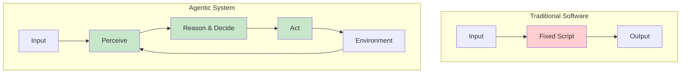

**Example: Customer Inquiry Management**

| Traditional System | Agentic System |
|-------------------|----------------|
| Follows fixed script | Perceives query nuances |
| Linear path | Accesses knowledge bases dynamically |
| Cannot adapt | Interacts with other systems (order management) |
| Passive responses | Asks clarifying questions proactively |
| Reactive | Anticipates future needs |

### Core Characteristics of Agentic Systems

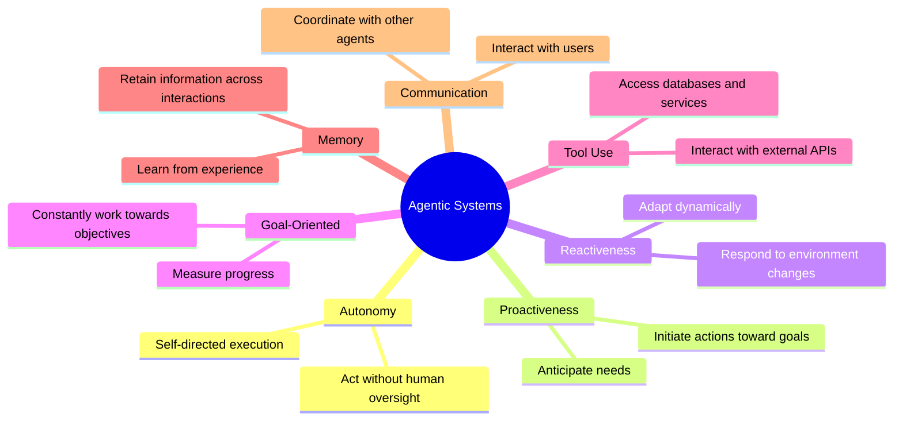

### The "Canvas" Metaphor

Agentic systems operate on the canvas of your application's infrastructure, utilizing available services and data.

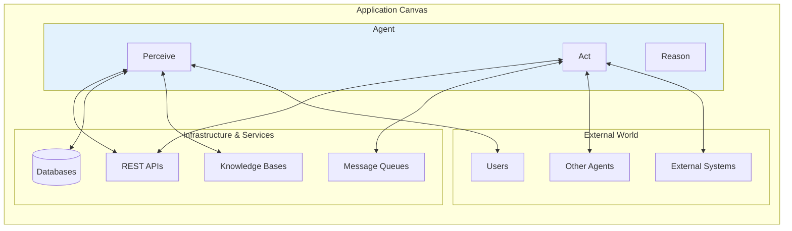

### Complexity Challenges

Effectively realizing these characteristics introduces significant complexity:

| Challenge | Question to Address |
|-----------|---------------------|
| **State Management** | How does the agent maintain state across multiple steps? |
| **Tool Selection** | How does it decide when and how to use a tool? |
| **Agent Communication** | How is communication between different agents managed? |
| **Resilience** | How do you handle unexpected outcomes or errors? |
| **Goal Achievement** | How does the agent know when it has succeeded? |

---

## Why Patterns Matter in Agent Development

This complexity is precisely why **agentic design patterns** are indispensable.

### What Are Design Patterns?

Design patterns are **not rigid rules**. Rather, they are battle-tested templates or blueprints that offer proven approaches to standard design and implementation challenges in the agentic domain.

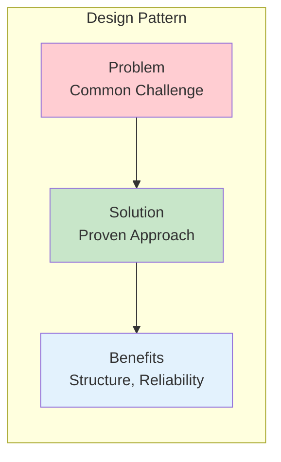

### Key Benefits

| Benefit | Impact on Your Agents |
|---------|----------------------|
| **Proven Solutions** | Avoid reinventing fundamental approaches |
| **Common Language** | Clearer communication with your team |
| **Structure & Clarity** | Easier to understand and maintain |
| **Reliability** | Battle-tested error handling and state management |
| **Development Speed** | Focus on unique aspects, not foundational mechanics |
| **Maintainability** | Established patterns others can recognize |

### The Pattern Advantage

**Without Patterns:**
```
Every agent = Custom implementation
├── Different state management approaches
├── Inconsistent error handling
├── Unique communication protocols
└── Hard to maintain and scale
```

**With Patterns:**
```
All agents = Consistent foundation
├── Standardized patterns for common problems
├── Predictable behavior
├── Easy to extend and modify
└── Scalable architecture
```

### This Chapter's Patterns

This chapter covers **10 fundamental design patterns** that represent the core building blocks for constructing sophisticated agents:

**Single-Agent Patterns:**
1. Prompt Chaining (Pipeline)
2. ReAct (Reasoning + Acting)
3. Plan-and-Solve
4. Reflection
5. Self-Consistency

**Multi-Agent Patterns:**
6. Supervisor
7. Hierarchical
8. Sequential
9. Debate

**Coordination Patterns:**
10. Query Router

These patterns provide a toolkit for building agents that can:
- Process complex multi-step tasks
- Coordinate with other agents
- Maintain context across interactions
- Handle errors gracefully
- Scale from simple to complex workflows

---

## Pattern Selection Quick Reference

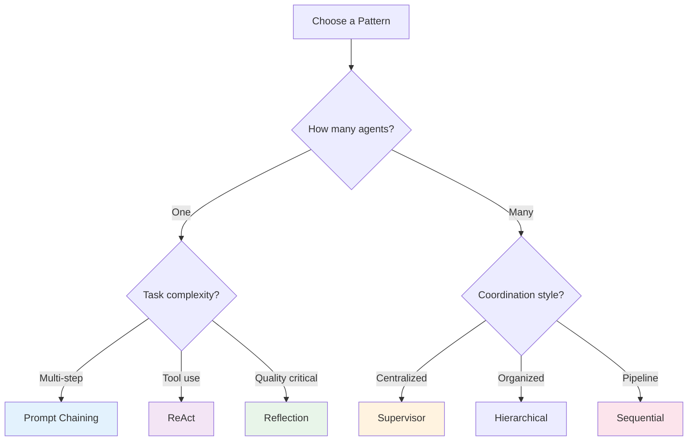

### Pattern Complexity Guide

| Pattern | Complexity | Best For | Learning Curve |
|---------|-----------|----------|----------------|
| **Prompt Chaining** | ⭐ | Multi-step workflows | Low |
| **ReAct** | ⭐ | Tool-using agents | Low |
| **Sequential** | ⭐ | Pipelines | Low |
| **Reflection** | ⭐⭐ | Quality improvement | Medium |
| **Plan-and-Solve** | ⭐⭐ | Well-defined goals | Medium |
| **Router** | ⭐⭐ | Query classification | Medium |
| **Self-Consistency** | ⭐⭐ | Reducing randomness | Medium |
| **Supervisor** | ⭐⭐⭐ | Complex workflows | High |
| **Debate** | ⭐⭐⭐ | Decision making | High |
| **Hierarchical** | ⭐⭐⭐⭐ | Large systems | Very High |

---

**Now let's dive into the patterns, starting with foundational single-agent approaches.**

---

## 3.1 Single-Agent Patterns

### Pattern 1: Prompt Chaining (Pipeline Pattern)

By deconstructing complex problems into a sequence of simpler, more manageable sub-tasks, prompt chaining provides a robust framework for guiding large language models. This "divide-and-conquer" strategy significantly enhances the reliability and control of the output by focusing the model on one specific operation at a time.

#### What is Prompt Chaining?

Prompt chaining, sometimes referred to as the **Pipeline pattern**, represents a powerful paradigm for handling intricate tasks when leveraging large language models (LLMs). Rather than expecting an LLM to solve a complex problem in a single, monolithic step, prompt chaining advocates for a divide-and-conquer strategy.

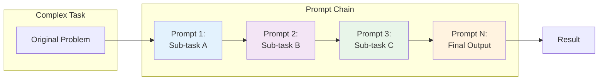

**The Core Idea:**
- Break down the original, daunting problem into a sequence of smaller, more manageable sub-problems
- Each sub-problem is addressed individually through a specifically designed prompt
- The output generated from one prompt is strategically fed as input into the subsequent prompt in the chain
- This establishes a dependency chain where context and results of previous operations guide subsequent processing

#### Why Use It? (Problems with Single Prompts)

For multifaceted tasks, using a single, complex prompt for an LLM can be inefficient and unreliable:

| Issue | Description | Example |
|-------|-------------|---------|
| **Instruction Neglect** | Model overlooks parts of the prompt | "Summarize AND extract data AND draft email" - model may only summarize |
| **Contextual Drift** | Model loses track of initial context | Long prompts cause the model to forget early instructions |
| **Error Propagation** | Early errors amplify through the response | Wrong analysis in step 1 affects all subsequent steps |
| **Context Window Limits** | Insufficient information for complex tasks | Can't fit all requirements in one prompt |
| **Increased Hallucination** | Higher cognitive load = more errors | Complex multi-step requests generate incorrect information |

**Example Failure Scenario:**
```
Query: "Analyze this market research report, summarize findings,
identify trends with data points, and draft an email to the marketing team."

Likely Result: Model summarizes well but fails to extract specific
data or drafts a poor email because the cognitive load is too high.
```

#### Enhanced Reliability Through Sequential Decomposition

Prompt chaining addresses these challenges by breaking the complex task into a focused, sequential workflow:

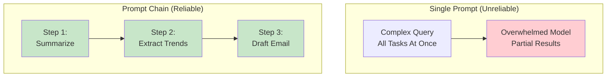

**Example Chained Approach:**

**Step 1: Summarization**
```
Prompt: "Summarize the key findings of the following market research report: [text]"
Focus: Summarization only
```

**Step 2: Trend Identification**
```
Prompt: "Using the summary, identify the top three emerging trends and
extract the specific data points that support each trend: [output from step 1]"
Focus: Data extraction
```

**Step 3: Email Composition**
```
Prompt: "Draft a concise email to the marketing team that outlines
the following trends and their supporting data: [output from step 2]"
Focus: Communication
```

#### Key Mechanisms

##### 1. Role Assignment at Each Stage

Assign distinct roles to every stage for improved focus:

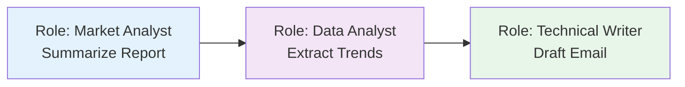

##### 2. Structured Output

The reliability of a prompt chain is highly dependent on the integrity of the data passed between steps. **Specifying a structured output format** (JSON, XML) is crucial.

```java
// Example: Structured output for trend identification
public record TrendData(
    String trendName,
    String supportingData
) {}

// Output format
TrendData[] trends = {
    new TrendData(
        "AI-Powered Personalization",
        "73% of consumers prefer brands that use personal information for relevant shopping"
    ),
    new TrendData(
        "Sustainable Brands",
        "ESG product sales grew 28% vs 20% for products without ESG claims"
    )
};
```

This structured format ensures that the data is machine-readable and can be precisely parsed and inserted into the next prompt without ambiguity.

#### Practical Applications & Use Cases

##### 1. Information Processing Workflows

```
Prompt 1: Extract text content from a document
    ↓
Prompt 2: Summarize the cleaned text
    ↓
Prompt 3: Extract specific entities (names, dates, locations)
    ↓
Prompt 4: Use entities to search knowledge base
    ↓
Prompt 5: Generate final report
```

**Applications**: Automated content analysis, AI research assistants, complex report generation

##### 2. Complex Query Answering

Question: *"What were the main causes of the 1929 stock market crash, and how did government policy respond?"*

```
Prompt 1: Identify core sub-questions (causes, government response)
    ↓
Prompt 2: Research causes of the crash
    ↓
Prompt 3: Research government policy response
    ↓
Prompt 4: Synthesize information into coherent answer
```

##### 3. Data Extraction and Transformation

```
Prompt 1: Extract fields from invoice (name, address, amount)
    ↓
Processing: Validate all required fields present
    ↓
Prompt 2 (Conditional): If missing/malformed, retry with specific focus
    ↓
Processing: Validate results again
    ↓
Output: Structured, validated data
```

**Applications**: OCR processing, form data extraction, invoice processing

##### 4. Content Generation Workflows

```
Prompt 1: Generate 5 topic ideas
    ↓
Processing: User selects best idea
    ↓
Prompt 2: Generate detailed outline
    ↓
Prompt 3-N: Write each section (with context from previous sections)
    ↓
Final Prompt: Review and refine for coherence and tone
```

**Applications**: Creative writing, technical documentation, blog generation

##### 5. Conversational Agents with State

```
Prompt 1: Process user utterance, identify intent and entities
    ↓
Processing: Update conversation state
    ↓
Prompt 2: Based on state, generate response and identify next needed info
    ↓
Repeat for subsequent turns...
```

##### 6. Code Generation and Refinement

```
Prompt 1: Generate pseudocode/outline
    ↓
Prompt 2: Write initial code draft
    ↓
Prompt 3: Identify errors and improvements
    ↓
Prompt 4: Refine code based on issues
    ↓
Prompt 5: Add documentation and tests
```

#### Implementation: Spring AI Example

```java
@Service
public class PromptChainingService {

    @Autowired
    private ChatClient chatClient;

    /**
     * Chain: Extract → Transform to JSON → Validate
     */
    public String processTechnicalSpecs(String inputText) {
        // Step 1: Extract Information
        String extracted = extractSpecs(inputText);
        log.info("Step 1 - Extracted: {}", extracted);

        // Step 2: Transform to JSON
        String json = transformToJson(extracted);
        log.info("Step 2 - JSON: {}", json);

        // Step 3: Validate
        boolean isValid = validateJson(json);
        if (!isValid) {
            // Retry with refinement
            json = refineJson(extracted);
        }

        return json;
    }

    private String extractSpecs(String text) {
        return chatClient.prompt()
            .system("You are a technical specification extractor.")
            .user("Extract the technical specifications from: {text}")
            .param("text", text)
            .call()
            .content();
    }

    private String transformToJson(String specs) {
        return chatClient.prompt()
            .system("You are a data formatter. Always return valid JSON.")
            .user("""
                Transform these specifications into a JSON object with
                'cpu', 'memory', and 'storage' as keys:

                {specs}

                Return ONLY the JSON object, no additional text.
                """.formatted(specs))
            .call()
            .content();
    }

    private boolean validateJson(String json) {
        try {
            ObjectMapper mapper = new ObjectMapper();
            mapper.readTree(json);
            return true;
        } catch (Exception e) {
            return false;
        }
    }

    private String refineJson(String specs) {
        return chatClient.prompt()
            .system("You are a JSON expert. Fix invalid JSON.")
            .user("""
                The following output was not valid JSON. Please fix it:

                {specs}

                Return ONLY valid JSON.
                """.formatted(specs))
            .call()
            .content();
    }
}
```

#### Advanced Pattern: Parallel + Sequential

Complex operations often combine parallel processing for independent tasks with prompt chaining for dependent steps:

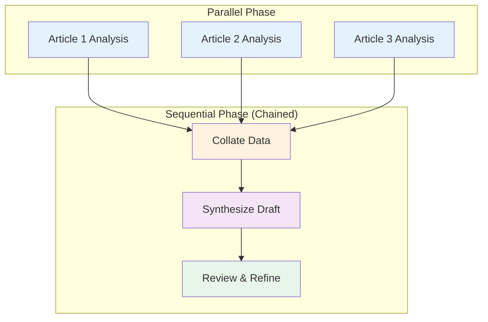

**Example Implementation**:

```java
@Service
public class ParallelSequentialService {

    @Autowired
    private ChatClient chatClient;

    public String generateComprehensiveReport(List<String> articleUrls) {
        // Parallel Phase: Extract info from all articles concurrently
        List<CompletableFuture<ArticleInfo>> futures = articleUrls.stream()
            .map(url -> CompletableFuture.supplyAsync(
                () -> extractArticleInfo(url), executor))
            .toList();

        // Wait for all parallel extractions
        List<ArticleInfo> infos = futures.stream()
            .map(CompletableFuture::join)
            .toList();

        // Sequential Phase: Chain of dependent operations
        String collated = collateData(infos);
        String draft = synthesizeDraft(collated);
        String refined = reviewAndRefine(draft);

        return refined;
    }

    private String collateData(List<ArticleInfo> infos) {
        // Step 1 in sequential chain
        return chatClient.prompt()
            .user("Collate these article extracts into organized notes: {infos}")
            .param("infos", infos.toString())
            .call()
            .content();
    }

    private String synthesizeDraft(String collated) {
        // Step 2: Uses output from step 1
        return chatClient.prompt()
            .user("Write a comprehensive report based on: {collated}")
            .param("collated", collated)
            .call()
            .content();
    }

    private String reviewAndRefine(String draft) {
        // Step 3: Uses output from step 2
        return chatClient.prompt()
            .user("Review and improve this report for clarity and accuracy: {draft}")
            .param("draft", draft)
            .call()
            .content();
    }
}
```

#### Limitations

| Limitation | Description | Mitigation |
|-----------|-------------|------------|
| **Latency** | Multiple sequential LLM calls = slower | Parallelize independent steps where possible |
| **Cost** | Each step consumes tokens | Use smaller models for intermediate steps |
| **Error Accumulation** | Errors in early steps affect later steps | Add validation and retry logic between steps |
| **Complexity** | More moving parts to manage | Use frameworks (LangChain, LangGraph) for orchestration |
| **State Management** | Passing state between steps can be complex | Use structured formats and define clear contracts |

#### Relationship to Context Engineering

Prompt chaining is a foundational technique that enables **Context Engineering** - the systematic discipline of designing and delivering a complete informational environment to AI models.

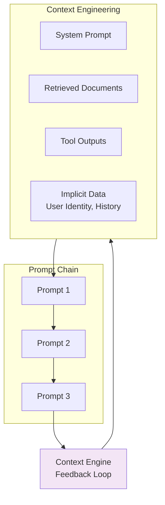

**Context Engineering Components**:
- **System Prompt**: Foundational instructions (e.g., "You are a technical writer")
- **Retrieved Documents**: Fetched from knowledge base
- **Tool Outputs**: Results from API calls or database queries
- **Implicit Data**: User identity, interaction history, environmental state

Prompt chaining enables the iterative refinement of this context, creating a feedback loop where each step enriches the informational environment for the next.

#### When to Use Prompt Chaining

| Scenario | Use Chaining? | Reason |
|----------|--------------|--------|
| **Simple Q&A** | ❌ No | Single prompt sufficient |
| **Multi-step reasoning** | ✅ Yes | Each step needs dedicated focus |
| **External tool integration** | ✅ Yes | Need to process tool outputs |
| **Content generation pipeline** | ✅ Yes | Natural progression (outline → draft → refine) |
| **Data extraction** | ✅ Yes | May need validation and retry |
| **Real-time requirements** | ❌ Maybe | Consider latency impact |

#### Best Practices

1. **Design Backwards**: Start with the final output format and work backwards
2. **Validate Between Steps**: Check outputs before passing to next prompt
3. **Use Structured Formats**: JSON/XML for machine-readable intermediate outputs
4. **Assign Clear Roles**: Different system prompts for each stage
5. **Handle Failures Gracefully**: Implement retry logic for individual steps
6. **Monitor Token Usage**: Chain length can quickly increase costs
7. **Log Intermediate Outputs**: Essential for debugging and optimization

---

### Pattern 2: ReAct Agent

The foundational pattern for tool-using agents.

#### How It Works

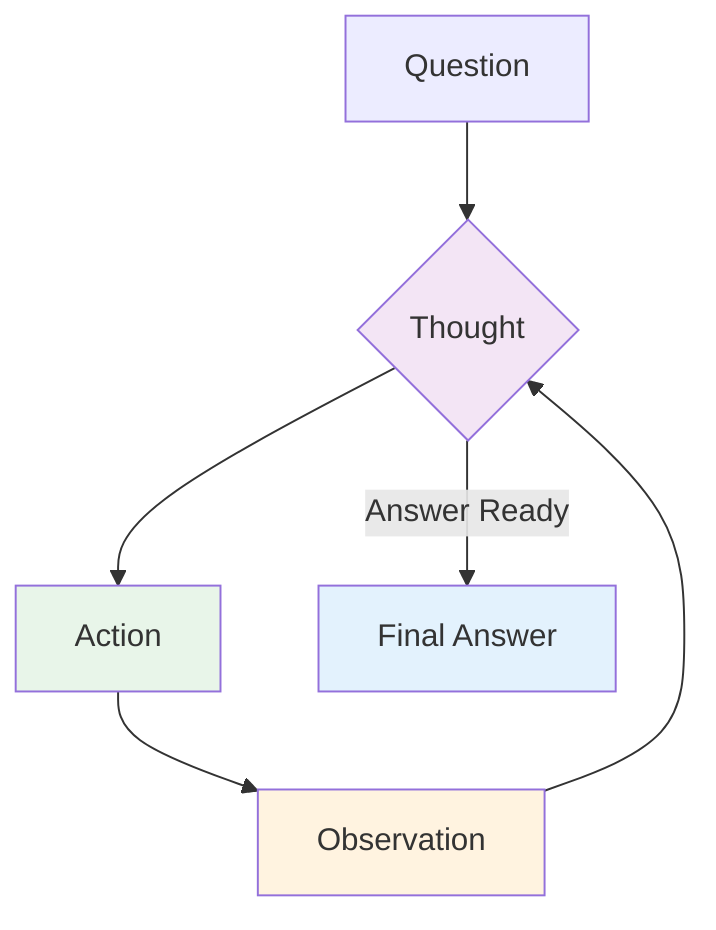

#### Implementation Steps

1. **Thought**: Agent reasons about what to do
2. **Action**: Agent executes a tool
3. **Observation**: Agent observes the result
4. **Iterate**: Repeat until goal is achieved

#### Example: Research Agent

```java
// Spring AI: ReAct Agent
@Service
public class ReactAgent {

    @Autowired
    private ChatClient chatClient;

    @Autowired
    private ToolService toolService;

    public String execute(String query, int maxIterations) {
        String context = query;
        String thought;
        String action;
        String observation;

        for (int i = 0; i < maxIterations; i++) {
            // Think
            thought = chatClient.prompt()
                .user(u -> u.text(
                    "Question: " + context + "\n" +
                    "Thought: Let me think about this step by step."
                ))
                .call()
                .content();

            // Decide on action
            if (shouldAnswerDirectly(thought)) {
                return extractAnswer(thought);
            }

            // Act
            action = extractAction(thought);
            observation = toolService.execute(action);

            // Observe and continue
            context = String.format(
                "Question: %s\nThought: %s\nAction: %s\nObservation: %s",
                query, thought, action, observation
            );
        }

        return "Max iterations reached";
    }
}
```

#### Best Practices

- **Clear Thoughts**: Explicit reasoning helps debugging
- **Specific Actions**: Tools should have clear purposes
- **Rich Observations**: Return detailed tool outputs
- **Iteration Limit**: Prevent infinite loops

---

### Pattern 3: Plan-and-Solve Agent

Plan all steps first, then execute sequentially.

#### How It Works

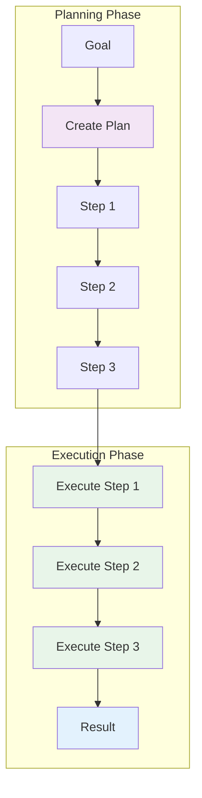

#### Advantages

- **Efficiency**: Can parallelize independent steps
- **Transparency**: Plan is visible and reviewable
- **Stability**: Less sensitive to intermediate failures

#### Disadvantages

- **Inflexibility**: Hard to adapt to unexpected outcomes
- **Upfront Cost**: Planning requires extra tokens
- **Brittleness**: Fails if plan is wrong

#### Example

```java
// Spring AI: Plan-and-Solve Agent
public String planAndSolve(String goal) {
    // Phase 1: Create Plan
    String plan = chatClient.prompt()
        .system("You are a planning expert. Break down complex goals into clear steps.")
        .user("Goal: " + goal + "\nCreate a detailed step-by-step plan.")
        .call()
        .content();

    List<String> steps = parseSteps(plan);

    // Phase 2: Execute Plan
    StringBuilder result = new StringBuilder();
    for (String step : steps) {
        String stepResult = executeStep(step);
        result.append(stepResult).append("\n");
    }

    return result.toString();
}
```

---

### Pattern 4: Reflection Agent

Agent critiques and improves its own outputs.

#### How It Works

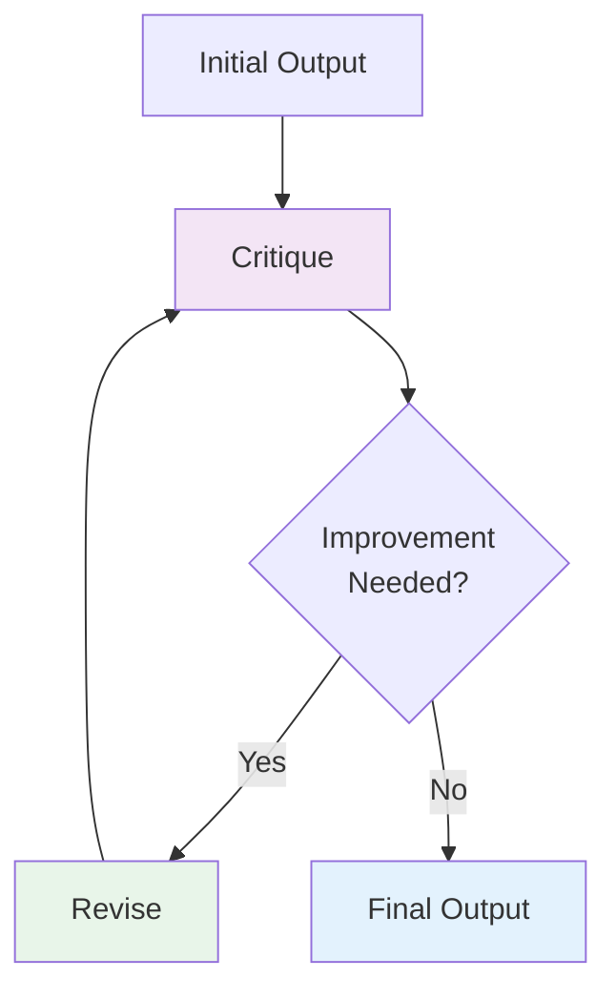

#### Implementation

```java
// Spring AI: Reflection Agent
public String reflectAndImprove(String task) {
    String output = generateInitialOutput(task);

    for (int i = 0; i < MAX_REFLECTIONS; i++) {
        // Critique
        String critique = chatClient.prompt()
            .system("You are a critical reviewer. Identify flaws and suggest improvements.")
            .user("Output:\n" + output + "\n\nProvide specific critique.")
            .call()
            .content();

        // Check if satisfied
        if (isSatisfactory(critique)) {
            break;
        }

        // Revise
        output = chatClient.prompt()
            .system("You are a revision expert. Improve based on critique.")
            .user("Original:\n" + output + "\n\nCritique:\n" + critique)
            .call()
            .content();
    }

    return output;
}
```

#### Use Cases

- **Code Review**: Self-reviewing code generation
- **Writing**: Multi-draft content creation
- **Research**: Verifying citations and claims
- **Decision Making**: Evaluating trade-offs

---

### Pattern 5: Self-Consistency Agent

Generate multiple solutions and select the best one.

#### How It Works

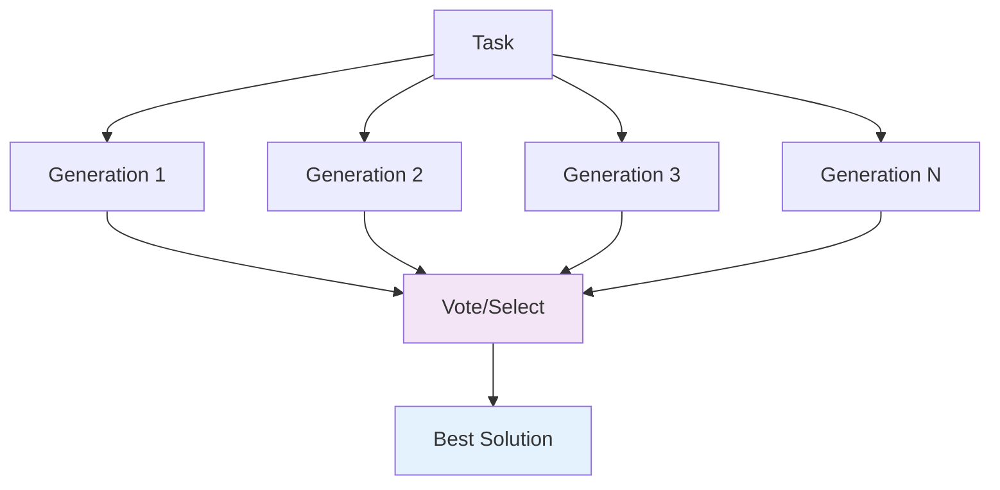

#### Implementation

```java
// Spring AI: Self-Consistency Agent
public String selfConsistent(String task, int n) {
    // Generate N solutions
    List<String> solutions = new ArrayList<>();
    for (int i = 0; i < n; i++) {
        String solution = chatClient.prompt()
            .user(task)
            .call()
            .content();
        solutions.add(solution);
    }

    // Select best
    String best = chatClient.prompt()
        .system("You are a judge. Select the best solution.")
        .user("Task: " + task + "\n\nSolutions:\n" +
              String.join("\n\n---\n\n", solutions) +
              "\n\nSelect the best one and explain why.")
        .call()
        .content();

    return extractSolution(best);
}
```

#### Advantages

- **Quality**: Multiple attempts increase quality
- **Reliability**: Reduces randomness
- **Robustness**: Handles edge cases better

#### Disadvantages

- **Cost**: N× token usage
- **Latency**: N× slower
- **Selection**: Need good voting mechanism

---

## 3.2 Multi-Agent Patterns

### Pattern 6: Supervisor Pattern

One supervisor agent coordinates multiple specialized worker agents.

#### Architecture

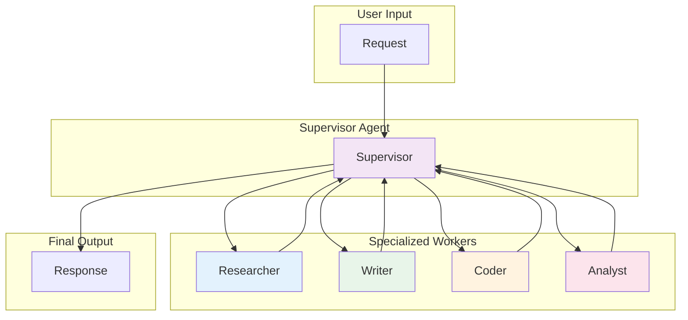

#### Implementation

```java
// Spring AI: Supervisor Pattern
@Service
public class SupervisorAgent {

    @Autowired
    private ChatClient chatClient;

    @Autowired
    private List<WorkerAgent> workers;

    public String supervise(String task) {
        String state = "Task: " + task;
        int maxIterations = 10;

        for (int i = 0; i < maxIterations; i++) {
            // Supervisor decides next action
            String decision = chatClient.prompt()
                .system("You are a supervisor. Coordinate workers to complete the task.")
                .user(state + "\n\nWhich worker should act next?")
                .call()
                .content();

            String workerName = extractWorker(decision);
            String workerInput = extractInput(decision);

            // Execute worker
            WorkerAgent worker = findWorker(workerName);
            String result = worker.execute(workerInput);

            // Update state
            state += String.format("\n\n%s: %s\nResult: %s",
                workerName, workerInput, result);

            // Check if done
            if (isComplete(decision)) {
                return extractFinalAnswer(decision);
            }
        }

        return state;
    }
}
```

#### Worker Agents

```java
// Research Worker
@Component("researcher")
public class ResearcherAgent implements WorkerAgent {

    @Autowired
    private SearchService searchService;

    public String execute(String input) {
        // Research logic
        return searchService.search(input);
    }
}

// Writer Worker
@Component("writer")
public class WriterAgent implements WorkerAgent {

    @Autowired
    private ChatClient chatClient;

    public String execute(String input) {
        // Writing logic
        return chatClient.prompt()
            .user("Write content based on: " + input)
            .call()
            .content();
    }
}
```

#### When to Use

- **Complex Workflows**: Multi-step processes
- **Specialized Skills**: Different capabilities needed
- **Parallel Execution**: Independent subtasks
- **Quality Control**: Reviewer agent can validate

---

### Pattern 7: Hierarchical Pattern

Multi-level supervision for complex tasks.

#### Architecture

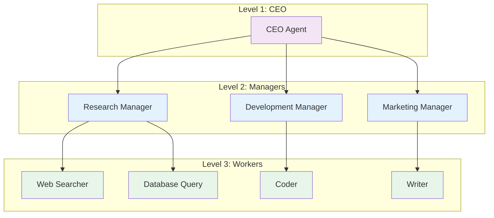

#### Implementation

```java
// Spring AI: Hierarchical Agents
public class HierarchicalSystem {

    private Agent ceo;
    private List<Agent> managers;
    private List<Agent> workers;

    public String execute(String goal) {
        // CEO creates high-level plan
        String plan = ceo.execute("Create execution plan for: " + goal);

        // Managers assign tasks to workers
        List<String> results = new ArrayList<>();
        for (String managerTask : parseManagerTasks(plan)) {
            Agent manager = findBestManager(managerTask);
            String managerResult = manager.execute(managerTask);
            results.add(managerResult);
        }

        // CEO synthesizes final output
        return ceo.execute("Synthesize: " + String.join("\n", results));
    }
}
```

#### Use Cases

- **Large Projects**: Complex, multi-faceted goals
- **Organizational Structure**: Mirroring real teams
- **Scalability**: Can add levels as needed

---

### Pattern 8: Sequential Pattern

Agents pass work in a pipeline.

#### Architecture

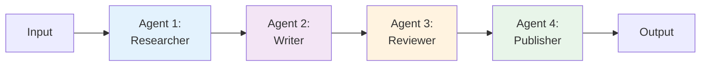

#### Implementation

```java
// Spring AI: Sequential Pipeline
@Component
public class SequentialPipeline {

    private List<Agent> pipeline;

    public String execute(String input) {
        String current = input;

        for (Agent agent : pipeline) {
            current = agent.execute(current);
        }

        return current;
    }

    @PostConstruct
    public void setup() {
        pipeline = List.of(
            new ResearcherAgent(),
            new WriterAgent(),
            new ReviewerAgent(),
            new PublisherAgent()
        );
    }
}
```

#### Use Cases

- **Content Creation**: Research → Write → Review → Publish
- **Data Processing**: Extract → Transform → Load
- **Software Development**: Design → Code → Test → Deploy

---

### Pattern 9: Debate Pattern

Multiple agents discuss and vote on the best solution.

#### Architecture

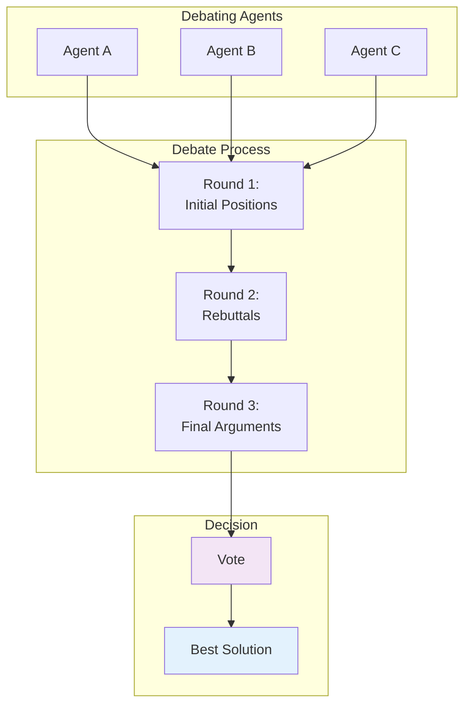

#### Implementation

```java
// Spring AI: Debate Pattern
public String debate(String question, int rounds) {
    List<Agent> agents = List.of(
        new Agent("Optimist"),
        new Agent("Pessimist"),
        new Agent("Realist")
    );

    List<String> positions = new ArrayList<>();

    // Initial positions
    for (Agent agent : agents) {
        String position = agent.execute(
            "Question: " + question + "\nProvide your initial position."
        );
        positions.add(agent.getName() + ": " + position);
    }

    // Debate rounds
    for (int round = 0; round < rounds; round++) {
        for (Agent agent : agents) {
            String rebuttal = agent.execute(String.join("\n\n", positions) +
                "\n\nProvide your rebuttal.");
            positions.add(agent.getName() + " (Round " + (round + 1) + "): " + rebuttal);
        }
    }

    // Vote on best solution
    return chatClient.prompt()
        .system("Evaluate the debate and select the best position.")
        .user(String.join("\n\n", positions))
        .call()
        .content();
}
```

#### Use Cases

- **Decision Making**: Complex choices with trade-offs
- **Problem Solving**: Multiple approaches to consider
- **Risk Assessment**: Different perspectives on risks

---

## 3.3 Router Pattern

### Pattern 10: Query Router

The **Routing Pattern** enables intelligent task delegation by classifying incoming requests and routing them to the most appropriate agent or service. It acts as a traffic controller or dispatcher within agentic systems.

### What is the Routing Pattern?

The Routing Pattern is a fundamental architectural pattern that:

- **Centralizes entry points**: All requests go through a single router
- **Classifies intelligently**: Analyzes request intent, topic, complexity
- **Delegates appropriately**: Routes to specialized handlers
- **Optimizes efficiency**: Each task handled by the most suitable agent

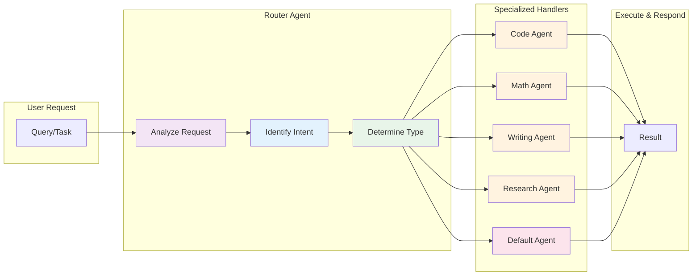

### Core Architecture Components

#### 1. Router Agent

The central component that:
- Receives all incoming requests
- Analyzes and classifies each request
- Determines the best handler for the task
- Routes the request to the appropriate agent
- Handles fallback and error cases

#### 2. Classification Strategies

| Method | Description | Example |
|--------|-------------|---------|
| **Intent Recognition** | Identify user's primary goal | "Fix bug" → Code Agent |
| **Topic Detection** | Categorize by subject matter | "Calculate sum" → Math Agent |
| **Complexity Analysis** | Assess difficulty level | Simple → Quick Agent, Complex → Expert Agent |
| **Capability Matching** | Match to required tools | Needs database → Data Agent |
| **Context Awareness** | Consider user history and preferences | Previous coding tasks → Code Agent |

#### 3. Specialized Agents

Each agent is optimized for specific types of tasks:

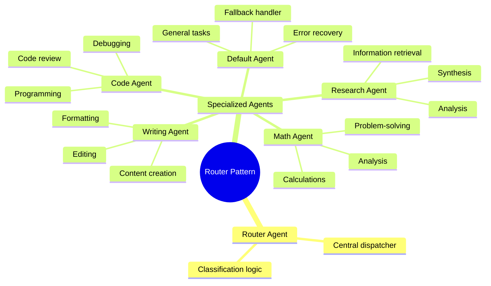

### When to Use the Routing Pattern

| Scenario | Use Routing When... | Example |
|----------|---------------------|---------|
| **Multiple Specialized Capabilities** | Different tasks require different expertise | Code, research, writing, math tasks |
| **Scalability Requirements** | Need to add new agent types without changing core logic | Adding new specialist agents over time |
| **Load Distribution** | Want to distribute work across specialized services | Balancing computational load |
| **Optimization** | Different agents optimized for specific task types | Faster processing with domain experts |
| **Flexibility** | Need to route to human experts or external systems | Escalation to human agents |
| **Clear Categorization** | Tasks can be reliably classified | Distinct query types |

### Implementation: Spring AI

```java
@Service
public class RouterAgent {

    @Autowired
    private ChatClient chatClient;

    @Autowired
    private Map<String, Agent> agents;

    @Autowired
    private Agent defaultAgent;

    public String route(String query) {
        // Step 1: Classify query with confidence scoring
        ClassificationResult classification = classifyQuery(query);

        // Step 2: Check confidence threshold
        if (classification.confidence() < 0.7) {
            // Low confidence - use default agent
            return defaultAgent.execute(query);
        }

        // Step 3: Route to specialized agent
        String agentType = classification.type();
        Agent agent = agents.getOrDefault(agentType, defaultAgent);

        // Step 4: Execute and return
        return agent.execute(query);
    }

    private ClassificationResult classifyQuery(String query) {
        String response = chatClient.prompt()
            .system("""
                You are a query classifier. Analyze the user's query and determine
                which specialized agent should handle it.

                Available agents:
                - CODE: Programming, debugging, code review, software development
                - MATH: Calculations, mathematical analysis, statistics
                - WRITING: Content creation, editing, documentation
                - RESEARCH: Information retrieval, analysis, synthesis

                Respond in JSON format:
                {
                    "type": "CODE|MATH|WRITING|RESEARCH",
                    "confidence": 0.0-1.0,
                    "reasoning": "explanation"
                }
                """)
            .user("Query: " + query)
            .call()
            .content();

        return parseClassification(response);
    }

    private ClassificationResult parseClassification(String response) {
        try {
            ObjectMapper mapper = new ObjectMapper();
            return mapper.readValue(response, ClassificationResult.class);
        } catch (Exception e) {
            // Fallback to default if parsing fails
            return new ClassificationResult("GENERAL", 0.5, "Parsing failed");
        }
    }

    public record ClassificationResult(
        String type,
        double confidence,
        String reasoning
    ) {}
}
```

### Advanced Features

#### 1. Multi-Stage Routing

Some implementations use multiple routing stages for precision:

```mermaid
flowchart LR
    A[Stage 1:<br/>Broad Category] --> B[Stage 2:<br/>Specific Task]
    B --> C[Stage 3:<br/>Agent Selection]

    style A fill:#e3f2fd
    style B fill:#f3e5f5
    style C fill:#e8f5e9
```

**Example:**
```
Stage 1: "This is a technical request" → Technical
Stage 2: "Involves code debugging" → Debugging
Stage 3: "Python-specific debugging" → Python Debugging Agent
```

#### 2. Context-Aware Routing

Router considers additional context:

```java
public class ContextAwareRouter {

    public String route(String query, RoutingContext context) {
        // Consider user preferences
        UserPreferences prefs = context.getUserPreferences();

        // Consider agent availability
        Map<String, Boolean> agentStatus = context.getAgentStatus();

        // Consider system load
        SystemMetrics metrics = context.getSystemMetrics();

        // Make routing decision
        if (prefs.preferredAgent() != null &&
            agentStatus.get(prefs.preferredAgent())) {
            return agents.get(prefs.preferredAgent()).execute(query);
        }

        // Route based on load balancing
        return routeToLeastLoadedAgent(query, agentStatus);
    }
}
```

#### 3. Adaptive Routing

Routes can change based on performance metrics:

```java
@Service
public class AdaptiveRouter {

    @Autowired
    private AgentPerformanceMonitor monitor;

    public String route(String query) {
        Map<String, Double> successRates = monitor.getSuccessRates();
        Map<String, Double> latencies = monitor.getAverageLatencies();

        // Select agent based on performance metrics
        String bestAgent = agents.keySet().stream()
            .filter(agent -> successRates.get(agent) > 0.8)
            .min(Comparator.comparingDouble(agent -> latencies.get(agent)))
            .orElse(defaultAgent);

        return agents.get(bestAgent).execute(query);
    }
}
```

#### 4. Dynamic Agent Discovery

Allow agents to register themselves dynamically:

```java
@Component
public class AgentRegistry {

    private final Map<String, Agent> agents = new ConcurrentHashMap<>();

    public void registerAgent(String type, Agent agent, AgentMetadata metadata) {
        agents.put(type, agent);
        // Health check
        if (!isHealthy(agent)) {
            log.warn("Agent {} failed health check on registration", type);
        }
    }

    public void unregisterAgent(String type) {
        agents.remove(type);
    }

    public Agent getAgent(String type) {
        return agents.get(type);
    }

    public List<String> getAvailableAgents() {
        return new ArrayList<>(agents.keySet());
    }
}
```

### Real-World Applications

#### 1. Customer Support System

```mermaid
flowchart TB
    U[Customer Query] --> R[Router]

    subgraph Routes["Specialized Routes"]
        R -->|Billing| B[Billing Agent]
        R -->|Technical| T[Technical Support Agent]
        R -->|FAQ| F[FAQ Agent]
        R -->|Complex| H[Human Agent]
    end

    B --> O[Resolve Issue]
    T --> O
    F --> O
    H --> O

    style R fill:#f3e5f5
```

**Implementation:**
```java
public String supportRouting(String query, CustomerContext context) {
    // Check if VIP customer
    if (context.isVIP()) {
        return humanAgent.handle(query);
    }

    // Classify issue type
    String type = classifySupportQuery(query);

    return switch (type) {
        case "BILLING" -> billingAgent.handle(query, context);
        case "TECHNICAL" -> technicalAgent.handle(query, context);
        case "FAQ" -> faqAgent.handle(query, context);
        default -> humanAgent.handle(query, context);
    };
}
```

#### 2. Code Assistant Platform

```mermaid
flowchart TB
    U[Developer Request] --> R[Router]

    subgraph Routes["Development Routes"]
        R -->|Bug Fix| D1[Debugging Agent]
        R -->|New Feature| D2[Development Agent]
        R -->|Documentation| D3[Docs Agent]
        R -->|Review| D4[Review Agent]
    end

    D1 --> S[Solution]
    D2 --> S
    D3 --> S
    D4 --> S

    style R fill:#f3e5f5
```

#### 3. Research & Analysis Platform

```mermaid
flowchart TB
    U[Research Query] --> R[Router]

    subgraph Routes["Analysis Routes"]
        R -->|Web Search| W1[Search Agent]
        R -->|Database| W2[Data Agent]
        R -->|Analysis| W3[Analytics Agent]
        R -->|Report| W4[Writing Agent]
    end

    W1 --> P[Parallel Processing]
    W2 --> P
    W3 --> P
    W4 --> S[Synthesize Report]

    style R fill:#f3e5f5
    style S fill:#e8f5e9
```

### Best Practices

#### 1. Clear Classification Criteria

```java
public enum RequestType {
    CODE_DEVELOPMENT("code", "Programming and software development"),
    RESEARCH("research", "Information gathering and analysis"),
    CONTENT_WRITING("writing", "Content creation and editing"),
    MATHEMATICS("math", "Calculations and problem-solving"),
    GENERAL("general", "General purpose tasks");

    private final String code;
    private final String description;
}
```

#### 2. Fallback Mechanism

```java
public class RouterWithFallback {

    private static final double CONFIDENCE_THRESHOLD = 0.7;

    public String routeWithFallback(String query) {
        ClassificationResult result = classify(query);

        if (result.confidence() < CONFIDENCE_THRESHOLD) {
            log.warn("Low confidence classification: {}, using default agent",
                result.type());
            return defaultAgent.execute(query);
        }

        try {
            return specializedAgent.execute(query);
        } catch (Exception e) {
            log.error("Specialized agent failed, falling back to default", e);
            return defaultAgent.execute(query);
        }
    }
}
```

#### 3. Monitoring and Metrics

```java
@Service
public class RouterMetrics {

    private final MeterRegistry meterRegistry;

    public void recordRouting(String fromType, String toAgent) {
        Counter.builder("routing.decisions")
            .tag("from_type", fromType)
            .tag("to_agent", toAgent)
            .register(meterRegistry)
            .increment();
    }

    public void recordClassificationAccuracy(boolean correct) {
        Gauge.builder("routing.accuracy")
            .register(meterRegistry, () -> calculateAccuracy());
    }
}
```

### Advantages & Challenges

| Advantage | Description |
|-----------|-------------|
| **Specialization** | Each agent focuses on domain expertise |
| **Efficiency** | Tasks routed to most suitable handler |
| **Scalability** | Easy to add new specialized agents |
| **Maintainability** | Clear separation of concerns |
| **Performance** | Optimized handlers for specific tasks |
| **Flexibility** | Dynamic routing based on conditions |

| Challenge | Solution |
|-----------|----------|
| **Misclassification** | Implement confidence thresholds and fallback |
| **Router Bottleneck** | Optimize classification, use caching |
| **Agent Discovery** | Dynamic registration and health checks |
| **Error Handling** | Graceful degradation to default agents |
| **Monitoring** | Track routing accuracy and agent performance |
| **Cold Start** | Use few-shot examples in system prompt |

### Comparison with Other Patterns

| Pattern | Primary Focus | Key Difference |
|---------|--------------|----------------|
| **Routing** | Classification and delegation | Decides WHERE to send task |
| **Supervisor** | Coordination and orchestration | Manages HOW task is completed |
| **Sequential** | Fixed pipeline | Routes through predetermined steps |
| **Debate** | Multiple perspectives | Routes to all agents, aggregates results |
| **Chaining** | Sequential processing | Chains outputs as inputs |

### Key Takeaways

1. **Centralized Classification**: Router serves as the single entry point
2. **Specialized Handlers**: Each agent optimized for specific task types
3. **Dynamic Decision Making**: Router intelligently selects best handler
4. **Scalability Architecture**: New agents added without modifying core logic
5. **Performance Optimization**: Tasks handled by most efficient agents
6. **Resilience**: Fallback mechanisms ensure reliability

---

## 3.4 Case Studies

### Case Study 1: Code Review System

**Pattern**: Supervisor + Workers

```
Supervisor (Code Review Lead)
├── Security Agent (Checks for vulnerabilities)
├── Style Agent (Enforces code style)
├── Performance Agent (Identifies bottlenecks)
└── Documentation Agent (Checks documentation)

Flow:
1. Supervisor receives PR diff
2. Routes to specialist agents
3. Collects all feedback
4. Synthesizes comprehensive review
5. Posts review comments
```

### Case Study 2: Research Writing Flow

**Pattern**: Sequential + Supervisor

```
Flow:
1. Researcher Agent (Gather sources)
   ↓
2. Analyst Agent (Synthesize findings)
   ↓
3. Writer Agent (Draft article)
   ↓
4. Reviewer Agent (Quality check)
   ↓
5. Supervisor (Final approval)
```

### Case Study 3: Customer Support

**Pattern**: Router + Specialist Agents

```
Router Agent (Classify query)
├── Billing Agent (Payment issues)
├── Technical Agent (Technical problems)
├── FAQ Agent (Common questions)
└── Escalation Agent (Human handoff)

Benefits:
- Faster routing
- Specialized knowledge
- Consistent responses
```

---

## 3.5 Pattern Selection Guide

| Pattern | Complexity | Parallelism | Best For |
|---------|-----------|-------------|----------|
| **Prompt Chaining** | Low | No | Multi-step workflows, data pipelines |
| **ReAct** | Low | No | General tool use |
| **Plan-and-Solve** | Medium | Partial | Well-defined goals |
| **Reflection** | Medium | No | Quality-critical tasks |
| **Self-Consistency** | Medium | Yes | Reducing randomness |
| **Supervisor** | High | Yes | Complex workflows |
| **Hierarchical** | Very High | Yes | Large projects |
| **Sequential** | Low | No | Pipelines |
| **Debate** | High | Yes | Decision making |
| **Router** | Medium | Yes | Query classification |

---

## 3.6 Key Takeaways

### Single-Agent Patterns

1. **Prompt Chaining**: Foundation for multi-step workflows, breaks complex tasks into sequential steps
2. **ReAct**: Foundation of tool-using agents
3. **Plan-and-Solve**: Efficient but rigid
4. **Reflection**: Improves quality through iteration
5. **Self-Consistency**: Reduces randomness through voting

### Multi-Agent Patterns

1. **Supervisor**: Flexible coordination
2. **Hierarchical**: Scalable organization
3. **Sequential**: Clear pipeline flow
4. **Debate**: Consensus through discussion

### Design Principles

- **Start Simple**: Begin with ReAct, add complexity as needed
- **Clear Roles**: Each agent should have a specific purpose
- **Robust Communication**: Structured message passing
- **Error Handling**: Agents should fail gracefully

---

## 3.7 Next Steps

Now that you understand the patterns:

**For Implementation:**
- → **[4. Frameworks](./frameworks)** - Learn how to implement these patterns with Spring AI
- → **[5. Engineering](./engineering)** - Production deployment patterns

**For Advanced Topics:**
- → **[6. Frontier](./frontier)** - Emerging multi-agent research

---

:::tip Pattern Selection
Most applications can be served well with **ReAct** (simple) or **Supervisor** (complex) patterns. Start simple and add complexity only when needed.
:::

:::info Spring AI Examples
See **[4. Frameworks & Tech Stack](./frameworks)** for complete Spring AI implementations of all these patterns.
:::

---

## References

### Core Concepts & Foundations

1. **ReAct: Synergizing Reasoning and Acting in Language Models**
   Yao, S., et al. (2022). *arXiv preprint arXiv:2210.03629*
   [https://arxiv.org/abs/2210.03629](https://arxiv.org/abs/2210.03629)

2. **Chain-of-Thought Prompting Elicits Reasoning in Large Language Models**
   Wei, J., et al. (2022). *Advances in Neural Information Processing Systems 35*
   [https://arxiv.org/abs/2201.11903](https://arxiv.org/abs/2201.11903)

3. **Reflexion: Language Agents with Verbal Reinforcement Learning**
   Shinn, N., et al. (2023). *arXiv preprint arXiv:2303.11366*
   [https://arxiv.org/abs/2303.11366](https://arxiv.org/abs/2303.11366)

4. **Self-Consistency Improves Chain of Thought Reasoning in Large Language Models**
   Wang, X., et al. (2022). *ICLR 2023*
   [https://arxiv.org/abs/2203.11171](https://arxiv.org/abs/2203.11171)

5. **Tree of Thoughts: Deliberate Problem Solving with Large Language Models**
   Yao, S., et al. (2023). *arXiv preprint arXiv:2305.10601*
   [https://arxiv.org/abs/2305.10601](https://arxiv.org/abs/2305.10601)

### Multi-Agent Systems

6. **MetaGPT: Meta Programming for A Multi-Agent Collaborative Framework**
   Wang, Z., et al. (2023). *ICLR 2024*
   [https://arxiv.org/abs/2308.00313](https://arxiv.org/abs/2308.00313)

7. **AutoGen: Enabling Next-Gen LLM Applications**
   Microsoft Research (2023)
   [https://microsoft.github.io/autogen/](https://microsoft.github.io/autogen/)

8. **CrewAI: Framework for Orchestrating Role-Playing AI Agents**
   João Paulo Gomes V. (2023)
   [https://docs.crewai.com/](https://docs.crewai.com/)

9. **ChatDev: Communicative Agents for Software Development**
   Qiang, L., et al. (2023). *arXiv preprint arXiv:2306.02625*
   [https://arxiv.org/abs/2306.02625](https://arxiv.org/abs/2306.02625)

10. **AgentVerse: Facilitating Multi-Agent Collaboration in Complex Environments**
    Chen, L., et al. (2023)
    [https://arxiv.org/abs/2308.10848](https://arxiv.org/abs/2308.10848)

### Frameworks & Tools

11. **LangChain: Building Applications with LLMs**
    Harrison Chase (2022)
    [https://python.langchain.com/](https://python.langchain.com/)

12. **LangGraph: Building Stateful Agents with LangChain**
    LangChain Documentation
    [https://langchain-ai.github.io/langgraph/](https://langchain-ai.github.io/langgraph/)

13. **Spring AI: AI Application Framework for Spring Boot**
    VMware (2023)
    [https://spring.io/projects/spring-ai](https://spring.io/projects/spring-ai)

14. **Semantic Kernel: Integrating LLMs with Software**
    Microsoft (2023)
    [https://learn.microsoft.com/en-us/semantic-kernel/](https://learn.microsoft.com/en-us/semantic-kernel/)

### Prompt Engineering

15. **Prompt Engineering Guide**
    Kamradt, M. (2023)
    [https://www.promptingguide.ai/](https://www.promptingguide.ai)

16. **Prompt Chaining Techniques**
    PromptingGuide.ai
    [https://www.promptingguide.ai/techniques/chaining](https://www.promptingguide.ai/techniques/chaining)

17. **Chapter 1: Prompt Chaining**
    Google internal documentation (2024)
    [https://docs.google.com/document/d/1flxKGrbnF2g8yh3F-oVD5Xx7ZumId56HbFpIiPdkqLI/edit](https://docs.google.com/document/d/1flxKGrbnF2g8yh3F-oVD5Xx7ZumId56HbFpIiPdkqLI/edit)

### Evaluation & Engineering

18. **LLM-as-a-Judge: Evaluating LLM Outputs with LLMs**
    Gilardi, L., et al. (2023). *arXiv preprint arXiv:2310.07891*
    [https://arxiv.org/abs/2310.07891](https://arxiv.org/abs/2310.07891)

19. **Papers With Code: Browse State-of-the-Art Machine Learning Papers**
    [https://paperswithcode.com/](https://paperswithcode.com)

20. **Arize Phoenix: Open Source LLM Observability**
    [https://docs.arize.com/phoenix](https://docs.arize.com/phoenix)

### Context Engineering & Memory

21. **Context Engineering: Building Rich Informational Environments for AI**
    Google AI for Developers
    [https://cloud.google.com/discover/what-is-prompt-engineering](https://cloud.google.com/discover/what-is-prompt-engineering)

22. **MemGPT: Towards LLMs as Operating Systems**
    Mcilraith, S., et al. (2023). *arXiv preprint arXiv:2310.08560*
    [https://arxiv.org/abs/2310.08560](https://arxiv.org/abs/2310.08560)

### Research Frontiers

23. **Towards a Unified View of Parameter-Efficient Transfer Learning**
    Houlsby, N., et al. (2019). *NeurIPS 2019*

24. **Sparks of Artificial General Intelligence: Early Experiments with GPT-4**
    Bubeck, S., et al. (2023). *arXiv preprint arXiv:2303.12712*
    [https://arxiv.org/abs/2303.12712](https://arxiv.org/abs/2303.12712)

### Industry Applications

25. **Customer Service Automation with AI Agents**
    McKinsey & Company (2023)
    [https://www.mckinsey.com/capabilities/operations/our-insights/automating-customer-service-with-ai](https://www.mckinsey.com/capabilities/operations/our-insights/automating-customer-service-with-ai)

26. **AI Agents in Software Development**
    GitHub Copilot Research
    [https://github.github/copilot-research](https://github.github/copilot-research)

27. **Kubernetes-Native AI: Deploying Agents at Scale**
    Kubernetes Documentation
    [https://kubernetes.io/](https://kubernetes.io/)

---

### Additional Resources

**Conferences & Workshops:**
- ICML (International Conference on Machine Learning)
- NeurIPS (Neural Information Processing Systems)
- ICLR (International Conference on Learning Representations)
- AAAI (Association for Advancement of Artificial Intelligence)
- Agent Workshops (specialized tracks at major conferences)

**Open Source Projects:**
- [LangChain GitHub](https://github.com/langchain-ai/langchain)
- [AutoGen GitHub](https://github.com/microsoft/autogen)
- [CrewAI GitHub](https://github.com/joaomdmoura/crewAI)
- [Spring AI GitHub](https://github.com/spring-projects/spring-ai)

**Learning Platforms:**
- [DeepLearning.AI](https://www.deeplearning.ai/)
- [Coursera - AI Agent Courses](https://www.coursera.org/learn/ai-agents)
- [Fast.ai - Practical Deep Learning](https://www.fast.ai/)
- [OpenAI Documentation](https://platform.openai.com/docs)

**Research Repositories:**
- [arXiv.org - AI Section](https://arxiv.org/list/cs.AI/recent)
- [Papers With Code](https://paperswithcode.com/)
- [Hugging Face Papers](https://huggingface.co/papers)

---

*Last Updated: January 2025*
*This reference list is continuously updated to reflect the latest research in agentic AI systems.*

