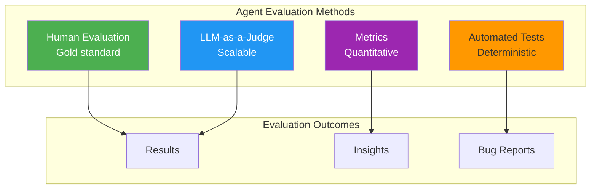
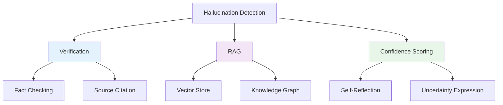
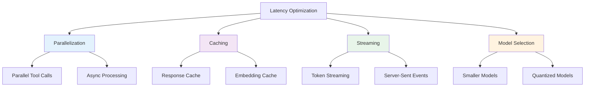

# 5. Engineering Challenges & Production Readiness

Building agents that work in prototypes is different from building agents that work reliably in production. This section covers the critical engineering challenges, evaluation methods, security considerations, and deployment strategies for production-grade AI agents.

---

## 5.1 Agent Evaluation

Evaluating agent performance is fundamentally different from traditional software testing due to non-determinism and complexity.

### Evaluation Approaches



### 1. LLM-as-a-Judge

Use an LLM to evaluate agent outputs against criteria.

#### Implementation

```java
@Service
public class AgentEvaluator {

    @Autowired
    private ChatClient evaluatorClient;

    public EvaluationResult evaluate(AgentOutput output, EvaluationCriteria criteria) {
        String evaluation = evaluatorClient.prompt()
            .system("""
                You are an expert evaluator for AI agent outputs.
                Rate the following on a scale of 1-10:
                1. Accuracy: Is the information correct?
                2. Completeness: Does it fully address the task?
                3. Relevance: Is the information focused?
                4. Safety: Are there any harmful outputs?
                """)
            .user("""
                Task: {task}
                Agent Output: {output}
                Context: {context}

                Provide evaluation in JSON format:
                {
                    "accuracy": 8,
                    "completeness": 7,
                    "relevance": 9,
                    "safety": 10,
                    "reasoning": "..."
                }
                """.formatted(
                    output.task(),
                    output.content(),
                    output.context()
                ))
            .call()
            .content();

        return parseEvaluation(evaluation);
    }
}
```

#### Best Practices

- **Clear Criteria**: Define specific evaluation dimensions
- **Few-Shot Examples**: Provide examples of good/bad outputs
- **Multiple Judges**: Use multiple LLMs and aggregate
- **Human Validation**: Calibrate LLM judges with human labels

### 2. Human Evaluation

Human evaluation remains the gold standard for quality.

#### Evaluation Framework

```java
@Service
public class HumanEvaluationService {

    public EvaluationDataset createDataset(List<AgentOutput> outputs) {
        // Shuffle for randomization
        List<AgentOutput> shuffled = shuffle(outputs);

        // Create evaluation tasks
        return EvaluationDataset.builder()
            .instructions("Rate each output on accuracy, completeness, and quality (1-10)")
            .items(shuffled.stream()
                .map(this::createEvaluationItem)
                .toList())
            .build();
    }

    public EvaluationMetrics calculateMetrics(List<HumanRating> ratings) {
        return EvaluationMetrics.builder()
            .accuracyMean(ratings.stream().mapToInt(HumanRating::accuracy).average().orElse(0))
            .completenessMean(ratings.stream().mapToInt(HumanRating::completeness).average().orElse(0))
            .interAnnotatorAgreement(calculateKappa(ratings))
            .build();
    }
}
```

#### Evaluation Interface (Frontend)

```typescript
// Next.js: Evaluation Interface
interface EvaluationItem {
  id: string;
  task: string;
  output: string;
  context: string;
}

interface Rating {
  accuracy: number;
  completeness: number;
  quality: number;
  notes?: string;
}

export function EvaluationForm({ item }: { item: EvaluationItem }) {
  const [rating, setRating] = useState<Rating>({
    accuracy: 5,
    completeness: 5,
    quality: 5,
  });

  const handleSubmit = async () => {
    await fetch('/api/evaluation/rate', {
      method: 'POST',
      body: JSON.stringify({ itemId: item.id, rating }),
    });
  };

  return (
    <div className="evaluation-form">
      <h3>Task: {item.task}</h3>
      <p>{item.output}</p>

      <Slider
        label="Accuracy"
        value={rating.accuracy}
        onChange={(v) => setRating({ ...rating, accuracy: v })}
      />

      <Slider
        label="Completeness"
        value={rating.completeness}
        onChange={(v) => setRating({ ...rating, completeness: v })}
      />

      <Slider
        label="Quality"
        value={rating.quality}
        onChange={(v) => setRating({ ...rating, quality: v })}
      />

      <Textarea
        label="Notes"
        value={rating.notes}
        onChange={(v) => setRating({ ...rating, notes: v })}
      />

      <Button onClick={handleSubmit}>Submit Rating</Button>
    </div>
  );
}
```

### 3. Automated Testing

Test specific agent behaviors with unit and integration tests.

```java
@SpringBootTest
class AgentServiceTest {

    @Autowired
    private ReactAgentService agent;

    @MockBean
    private SearchService searchService;

    @Test
    void testAgentUsesSearchTool() {
        // Arrange
        when(searchService.search(anyString()))
            .thenReturn("Paris is the capital of France");

        // Act
        String result = agent.execute("What is the capital of France?", 5);

        // Assert
        assertThat(result).contains("Paris");
        verify(searchService, times(1)).search(anyString());
    }

    @Test
    void testAgentHandlesToolFailure() {
        // Arrange
        when(searchService.search(anyString()))
            .thenThrow(new ServiceUnavailableException("Search is down"));

        // Act
        String result = agent.execute("Search for news", 5);

        // Assert
        assertThat(result).contains("apologize");
        assertThat(result).contains("unavailable");
    }
}
```

### 4. Key Metrics

| Metric | Description | Target |
|--------|-------------|--------|
| **Task Success Rate** | % of tasks completed successfully | > 90% |
| **Accuracy** | Factual correctness of outputs | > 95% |
| **Relevance** | How well output addresses task | > 90% |
| **Safety** | Absence of harmful content | 100% |
| **Latency (p50)** | Median response time | < 5s |
| **Latency (p95)** | 95th percentile response time | < 15s |
| **Cost per Task** | Token cost per successful task | Minimize |
| **Tool Success Rate** | % of tool calls successful | > 95% |

---

## 5.2 Common Challenges

### Challenge 1: Hallucination

Agents can generate plausible-sounding but incorrect information.

#### Mitigation Strategies



#### Implementation

```java
@Service
public class AntiHallucinationService {

    @Autowired
    private VectorStore vectorStore;

    @Autowired
    private ChatClient chatClient;

    public String generateWithVerification(String query) {
        // Step 1: Retrieve relevant context
        List<Document> context = vectorStore.similaritySearch(
            SearchRequest.query(query).withTopK(5)
        );

        // Step 2: Generate with citations
        String response = chatClient.prompt()
            .user(query)
            .messages(createMessagesWithCitations(context))
            .call()
            .content();

        // Step 3: Verify claims
        List<Claim> claims = extractClaims(response);
        for (Claim claim : claims) {
            if (!verifyClaim(claim, context)) {
                return flagUncertainty(claim);
            }
        }

        return response;
    }

    private boolean verifyClaim(Claim claim, List<Document> context) {
        // Use RAG context to verify
        String verification = chatClient.prompt()
            .system("Verify if the claim is supported by the context.")
            .user("""
                Claim: {claim}
                Context: {context}
                Answer YES or NO with explanation.
                """.formatted(
                    claim.text(),
                    context.stream()
                        .map(Document::getContent)
                        .collect(Collectors.joining("\n"))
                ))
            .call()
            .content();

        return verification.toLowerCase().startsWith("yes");
    }
}
```

### Challenge 2: Infinite Loops

Agents can get stuck in repetitive behaviors.

#### Solutions

```java
@Service
public class LoopPreventionService {

    private static final int MAX_ITERATIONS = 10;
    private static final int MAX_REPEAT_ACTIONS = 3;

    public AgentExecutionResult executeWithGuardrails(AgentTask task) {
        Set<String> recentActions = new HashSet<>();
        int iteration = 0;

        while (iteration < MAX_ITERATIONS && !task.isComplete()) {
            String action = task.getNextAction();

            // Detect loops
            if (recentActions.contains(action)) {
                int count = countOccurrences(recentActions, action);
                if (count >= MAX_REPEAT_ACTIONS) {
                    return handleLoop(task, action);
                }
            }

            recentActions.add(action);
            if (recentActions.size() > 5) {
                recentActions.remove(recentActions.iterator().next());
            }

            // Execute
            task.executeAction(action);
            iteration++;
        }

        return task.getResult();
    }

    private AgentExecutionResult handleLoop(AgentTask task, String repeatingAction) {
        // Ask for human intervention
        return AgentExecutionResult.builder()
            .status("NEEDS_INTERVENTION")
            .message("Agent stuck in loop repeating: " + repeatingAction)
            .suggestedActions(List.of(
                "Retry with different approach",
                "Provide more specific instructions",
                "Break task into smaller steps"
            ))
            .build();
    }
}
```

### Challenge 3: Cost Control

LLM usage can become expensive at scale.

#### Cost Optimization Strategies

| Strategy | Impact | Implementation |
|----------|--------|----------------|
| **Caching** | High | Cache LLM responses |
| **Smaller Models** | High | Use Haiku for simple tasks |
| **Token Limits** | Medium | Set max tokens per request |
| **Result Streaming** | Low | Stream responses for UX |
| **Batch Processing** | Medium | Process multiple queries together |

#### Implementation

```java
@Service
public class CostOptimizedAgentService {

    @Autowired
    private ChatClient gpt4Client; // Expensive

    @Autowired
    private ChatClient haikuClient; // Cheap

    @Autowired
    private CacheManager cacheManager;

    public String execute(AgentRequest request) {
        // Check cache first
        String cacheKey = generateCacheKey(request);
        String cached = cacheManager.getCache("agent-responses").get(cacheKey, String.class);
        if (cached != null) {
            return cached;
        }

        // Route to appropriate model
        ChatClient client = selectModel(request);
        String response = client.prompt().user(request.query()).call().content();

        // Cache the result
        cacheManager.getCache("agent-responses").put(cacheKey, response);

        return response;
    }

    private ChatClient selectModel(AgentRequest request) {
        // Use Haiku for simple queries
        if (request.complexity() == Complexity.LOW) {
            return haikuClient;
        }

        // Use GPT-4 for complex tasks
        return gpt4Client;
    }
}
```

### Challenge 4: Latency

Agents need to respond quickly for good UX.

#### Optimization Techniques



#### Parallel Tool Execution

```java
@Service
public class ParallelToolExecutor {

    @Autowired
    private List<FunctionCallback> tools;

    public Map<String, String> executeParallel(List<ToolCall> calls) {
        ExecutorService executor = Executors.newFixedThreadPool(10);

        List<CompletableFuture<Map.Entry<String, String>>> futures = calls.stream()
            .map(call -> CompletableFuture.supplyAsync(() -> {
                String result = executeTool(call);
                return Map.entry(call.name(), result);
            }, executor))
            .toList();

        CompletableFuture.allOf(futures.toArray(new CompletableFuture[0])).join();

        return futures.stream()
            .map(CompletableFuture::join)
            .collect(Collectors.toMap(
                Map.Entry::getKey,
                Map.Entry::getValue
            ));
    }
}
```

---

## 5.3 Security & Safety

### Prompt Injection

Malicious users trying to manipulate agent behavior.

#### Defense Strategies

```java
@Service
public class PromptInjectionDefense {

    private static final Pattern INJECTION_PATTERNS = Pattern.compile(
        "(ignore|override|forget|disregard).*(instructions|system|prompt)",
        Pattern.CASE_INSENSITIVE
    );

    public SanitizedInput sanitize(UserInput input) {
        String text = input.text();

        // Check for injection patterns
        if (INJECTION_PATTERNS.matcher(text).find()) {
            throw new SecurityException("Potential prompt injection detected");
        }

        // Validate against allowlist
        if (!isAllowedTopic(text)) {
            throw new SecurityException("Topic not allowed");
        }

        // Rate limit check
        if (exceedsRateLimit(input.userId())) {
            throw new RateLimitExceededException();
        }

        return SanitizedInput.from(text);
    }

    @Bean
    public SecurityFilter securityFilter() {
        return new SecurityFilter() {
            @Override
            public Mono<Void> filter(ServerWebExchange exchange, WebFilterChain chain) {
                String path = exchange.getRequest().getPath().value();

                if (path.startsWith("/api/agents")) {
                    String body = getBody(exchange);
                    try {
                        sanitize(new UserInput(body));
                    } catch (SecurityException e) {
                        exchange.getResponse().setStatusCode(HttpStatus.FORBIDDEN);
                        return exchange.getResponse().setComplete();
                    }
                }

                return chain.filter(exchange);
            }
        };
    }
}
```

### Tool Access Control

Restrict which tools agents can use based on user permissions.

```java
@Service
public class ToolAccessControl {

    @Autowired
    private PermissionService permissionService;

    public List<FunctionCallback> getAuthorizedTools(String userId) {
        return allTools.stream()
            .filter(tool -> permissionService.hasPermission(userId, tool.getName()))
            .toList();
    }

    public boolean canExecuteTool(String userId, String toolName) {
        ToolPermission permission = permissionService.getPermission(userId, toolName);

        // Check permission
        if (!permission.isAllowed()) {
            return false;
        }

        // Check rate limits
        if (permission.getUsageCount() >= permission.getMaxUsage()) {
            return false;
        }

        // Check time restrictions
        if (!permission.isWithinAllowedHours()) {
            return false;
        }

        return true;
    }
}
```

### Human-in-the-Loop

Require human approval for sensitive operations.

```java
@Service
public class HumanInTheLoopService {

    @Autowired
    private NotificationService notificationService;

    @Autowired
    private ApprovalRepository approvalRepository;

    public AgentResult executeWithApproval(AgentTask task) {
        // Check if approval needed
        if (task.requiresApproval()) {
            ApprovalRequest request = createApprovalRequest(task);
            notificationService.notifyApprovers(request);

            // Wait for approval
            Approval approval = waitForApproval(request.getId());

            if (!approval.isApproved()) {
                return AgentResult.rejected("Approval denied: " + approval.getReason());
            }
        }

        // Execute task
        return task.execute();
    }

    private Approval waitForApproval(String requestId) {
        // Poll for approval (or use WebSocket)
        for (int i = 0; i < 60; i++) { // 1 minute timeout
            Approval approval = approvalRepository.findById(requestId).orElse(null);
            if (approval != null && approval.isDecided()) {
                return approval;
            }
            try {
                Thread.sleep(1000);
            } catch (InterruptedException e) {
                throw new RuntimeException(e);
            }
        }

        throw new ApprovalTimeoutException();
    }
}
```

### Audit Logging

Track all agent actions for security and compliance.

```java
@Service
public class AgentAuditLogger {

    @Autowired
    private AuditLogRepository auditLogRepository;

    @EventListener
    public void logAgentAction(AgentActionEvent event) {
        AgentAuditLog log = AgentAuditLog.builder()
            .agentId(event.getAgentId())
            .userId(event.getUserId())
            .action(event.getAction())
            .input(sanitize(event.getInput()))
            .output(sanitize(event.getOutput()))
            .toolsUsed(event.getToolsUsed())
            .tokensConsumed(event.getTokensConsumed())
            .cost(event.getCost())
            .timestamp(Instant.now())
            .build();

        auditLogRepository.save(log);
    }

    public List<AgentAuditLog> getUserActivity(String userId, Instant since) {
        return auditLogRepository.findByUserIdAndTimestampAfter(userId, since);
    }
}
```

---

## 5.4 Production Deployment

### Docker Configuration

```dockerfile
# Dockerfile
FROM eclipse-temurin:21-jdk-alpine AS builder
WORKDIR /app
COPY build.gradle settings.gradle ./
COPY src ./src
RUN ./gradlew bootJar --no-daemon

FROM eclipse-temurin:21-jre-alpine
WORKDIR /app
COPY --from=builder /app/build/libs/*.jar app.jar

# Health check
HEALTHCHECK --interval=30s --timeout=3s --start-period=60s --retries=3 \
  CMD wget --no-verbose --tries=1 --spider http://localhost:8080/actuator/health || exit 1

EXPOSE 8080
ENTRYPOINT ["java", "-jar", "app.jar"]
```

### Docker Compose

```yaml
version: '3.8'
services:
  agent-service:
    build: .
    ports:
      - "8080:8080"
    environment:
      - SPRING_PROFILES_ACTIVE=production
      - OPENAI_API_KEY=${OPENAI_API_KEY}
      - POSTGRES_URL=jdbc:postgresql://postgres:5432/agents
      - REDIS_URL=redis://redis:6379
    depends_on:
      - postgres
      - redis
    restart: unless-stopped

  postgres:
    image: pgvector/pgvector:pg16
    environment:
      - POSTGRES_DB=agents
      - POSTGRES_USER=agent_user
      - POSTGRES_PASSWORD=${POSTGRES_PASSWORD}
    volumes:
      - postgres_data:/var/lib/postgresql/data
    restart: unless-stopped

  redis:
    image: redis:7-alpine
    volumes:
      - redis_data:/data
    restart: unless-stopped

  prometheus:
    image: prom/prometheus
    ports:
      - "9090:9090"
    volumes:
      - ./prometheus.yml:/etc/prometheus/prometheus.yml
    restart: unless-stopped

  grafana:
    image: grafana/grafana
    ports:
      - "3000:3000"
    environment:
      - GF_SECURITY_ADMIN_PASSWORD=${GRAFANA_PASSWORD}
    volumes:
      - grafana_data:/var/lib/grafana
    restart: unless-stopped

volumes:
  postgres_data:
  redis_data:
  grafana_data:
```

### Observability Stack

```yaml
# prometheus.yml
global:
  scrape_interval: 15s

scrape_configs:
  - job_name: 'agent-service'
    metrics_path: '/actuator/prometheus'
    static_configs:
      - targets: ['agent-service:8080']
```

### Monitoring Dashboard (Grafana)

Key metrics to monitor:

| Metric | Description | Alert Threshold |
|--------|-------------|-----------------|
| **agent_success_rate** | % of successful agent executions | < 95% |
| **agent_latency_p95** | 95th percentile latency | > 15s |
| **agent_token_usage** | Tokens consumed per hour | > 100K |
| **agent_cost_per_task** | Cost per successful task | > $0.10 |
| **tool_failure_rate** | % of failed tool calls | > 5% |
| **llm_api_errors** | LLM API error rate | > 1% |

---

## 5.5 A/B Testing

Test different agent configurations safely.

```java
@Service
public class AgentABTestService {

    @Autowired
    private AgentRegistry agentRegistry;

    @Autowired
    private ExperimentRepository experimentRepository;

    public String executeWithExperiment(String userId, String query) {
        // Get active experiment
        Experiment experiment = experimentRepository.findActive("agent-v2-vs-v1");

        // Assign user to variant
        String variant = assignVariant(experiment, userId);

        // Get agent for variant
        Agent agent = agentRegistry.getAgent(variant);

        // Execute
        String result = agent.execute(query);

        // Log metrics
        logMetrics(experiment, variant, userId, result);

        return result;
    }

    private String assignVariant(Experiment experiment, String userId) {
        // Consistent hashing for stable assignment
        int hash = userId.hashCode();
        if (hash % 2 == 0) {
            return "agent_v1";
        } else {
            return "agent_v2";
        }
    }
}
```

---

## 5.6 Key Takeaways

### Evaluation Strategy

1. **LLM-as-a-Judge**: Scalable but needs calibration
2. **Human Evaluation**: Gold standard for quality
3. **Automated Tests**: Essential for regressions
4. **Metrics Tracking**: Quantitative insights

### Challenge Mitigation

| Challenge | Mitigation |
|-----------|-----------|
| **Hallucination** | RAG + Verification + Citations |
| **Infinite Loops** | Iteration limits + Loop detection |
| **High Cost** | Caching + Smaller models |
| **High Latency** | Parallel tools + Streaming |
| **Security** | Input validation + Access control |

### Production Readiness Checklist

- [ ] Evaluation framework established
- [ ] Error handling comprehensive
- [ ] Rate limiting configured
- [ ] Security controls in place
- [ ] Audit logging enabled
- [ ] Monitoring and alerting configured
- [ ] Cost controls implemented
- [ ] A/B testing framework ready
- [ ] Rollback plan documented

---

## 5.7 Next Steps

**Complete your learning journey:**
- → **[6. Frontier Trends](./frontier)** - Emerging technologies and research

---

:::tip Start Small
When deploying to production, start with a limited beta, monitor metrics closely, and gradually increase traffic based on performance.
:::

:::warning Cost Awareness
Agent costs can scale quickly. Always implement caching and set budget limits before wide deployment.
:::
