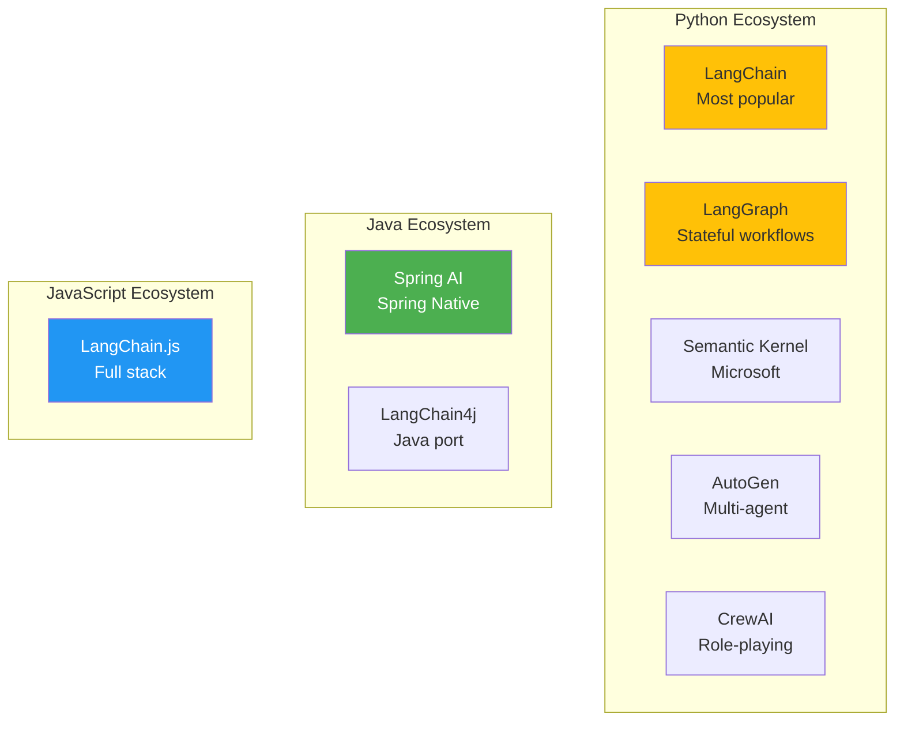
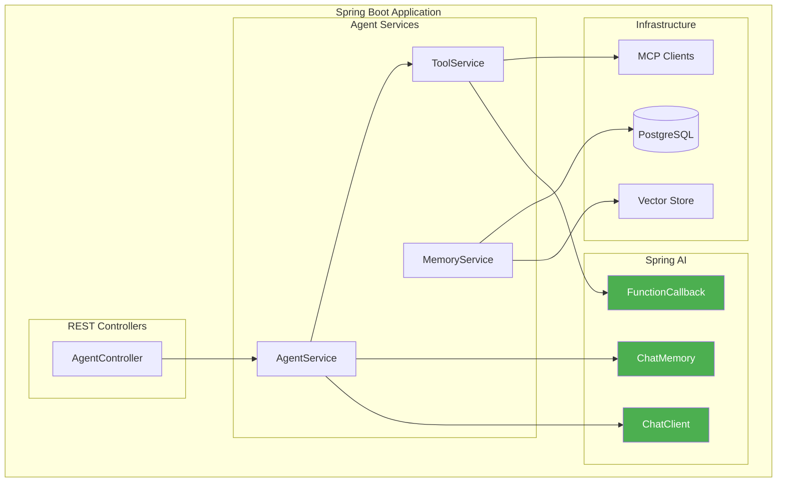

# 4. Frameworks & Tech Stack

Building production agents requires choosing the right framework and understanding how to implement core patterns. This section compares major frameworks and provides detailed Spring AI implementation guides for Java/Spring Boot developers.

---

## 4.1 Framework Comparison

### Overview of Major Frameworks



### Comparison Matrix

| Framework | Language | Maturity | Multi-Agent | Stateful | Best For |
|-----------|----------|----------|-------------|----------|----------|
| **Spring AI** | Java | Growing | Basic | Yes | Enterprise Java |
| **LangChain** | Python | Mature | Basic | Limited | Quick prototyping |
| **LangGraph** | Python | Growing | Excellent | Yes | Complex workflows |
| **Semantic Kernel** | Python/C# | Mature | Good | Yes | Microsoft stack |
| **AutoGen** | Python | Mature | Excellent | Yes | Research |
| **CrewAI** | Python | New | Excellent | Yes | Role-based agents |
| **LangChain4j** | Java | Growing | Basic | Yes | Java port of LangChain |

### Feature Comparison

| Feature | Spring AI | LangGraph | Semantic Kernel | AutoGen |
|---------|-----------|-----------|-----------------|---------|
| **Tool Calling** | ✅ Native | ✅ Native | ✅ Native | ✅ Native |
| **Memory Management** | ✅ Strong | ✅ Strong | ✅ Good | ✅ Basic |
| **Multi-Agent** | ⚠️ Basic | ✅ Excellent | ✅ Good | ✅ Excellent |
| **State Persistence** | ✅ Yes | ✅ Excellent | ✅ Good | ✅ Basic |
| **Observability** | ✅ Spring Boot Actuator | ✅ LangSmith | ✅ Telemetry | ⚠️ Basic |
| **Enterprise Support** | ✅ Excellent | ⚠️ Limited | ✅ Good | ⚠️ Limited |

---

## 4.2 Spring AI Deep Dive

Spring AI provides the most seamless experience for Java/Spring Boot developers building agent systems.

### Architecture



### Project Setup

#### Dependencies (build.gradle)

```groovy
dependencies {
    // Spring AI OpenAI
    implementation 'org.springframework.ai:spring-ai-openai-spring-boot-starter:1.0.0'

    // Spring AI MCP
    implementation 'org.springframework.ai:spring-ai-mcp-spring-boot-starter:1.0.0'

    // Spring AI Vector Store (PostgreSQL + pgvector)
    implementation 'org.springframework.ai:spring-ai-pgvector-store-spring-boot-starter:1.0.0'

    // Spring Boot
    implementation 'org.springframework.boot:spring-boot-starter-web'
    implementation 'org.springframework.boot:spring-boot-starter-actuator'

    // Environment variables (Doppler integration)
    developmentOnly 'io.github.c-d-m:spring-boot-doppler:0.1.0'
}
```

#### Configuration (application.yml)

```yaml
spring:
  ai:
    openai:
      api-key: ${OPENAI_API_KEY}
      chat:
        options:
          model: gpt-4-turbo
          temperature: 0.7

    mcp:
      servers:
        - name: filesystem
          transport:
            type: stdio
            command: npx
            args:
              - -y
              - "@modelcontextprotocol/server-filesystem"
              - /allowed/path

    vectorstore:
      pgvector:
        dimension: 1536
        distance-type: cosine
        index-type: ivfflat

# Actuator for observability
management:
  endpoints:
    web:
      exposure:
        include: health,metrics,httptrace
  tracing:
    sampling:
      probability: 1.0
```

### Core Components

#### 1. ChatClient Configuration

```java
@Configuration
public class ChatClientConfig {

    @Bean
    public ChatClient chatClient(OpenAiChatModel model) {
        return ChatClient.builder(model)
            .defaultSystem("You are a helpful AI assistant with access to tools.")
            .defaultOptions(OpenAiChatOptions.builder()
                .model("gpt-4-turbo")
                .temperature(0.7)
                .build())
            .build();
    }
}
```

#### 2. Tool Definition

```java
@Component
public class AgentTools {

    @Autowired
    private SearchService searchService;

    @Autowired
    private DatabaseService databaseService;

    @Bean
    public FunctionCallback searchTool() {
        return FunctionCallback.builder()
            .function("search_web", this::searchWeb)
            .description("Search the web for current information")
            .inputType(SearchRequest.class)
            .build();
    }

    @Bean
    public FunctionCallback databaseQueryTool() {
        return FunctionCallback.builder()
            .function("query_database", this::queryDatabase)
            .description("Query the database for structured data")
            .inputType(DatabaseQuery.class)
            .build();
    }

    public record SearchRequest(
        @Description("The search query string") String query,
        @Description("Number of results to return") @DefaultValue("5") int numResults
    ) {}

    public String searchWeb(SearchRequest request) {
        return searchService.search(request.query(), request.numResults());
    }

    public record DatabaseQuery(
        @Description("SQL query to execute") String sql
    ) {}

    public String queryDatabase(DatabaseQuery query) {
        return databaseService.executeQuery(query.sql());
    }
}
```

#### 3. Memory Configuration

```java
@Configuration
public class MemoryConfig {

    @Bean
    public ChatMemory bufferMemory() {
        return new MessageWindowChatMemory(10); // Last 10 messages
    }

    @Bean
    public ChatMemory vectorMemory(VectorStore vectorStore) {
        return new VectorStoreChatMemory(vectorStore);
    }

    @Bean
    public VectorStore vectorStore(JdbcTemplate jdbcTemplate, EmbeddingModel embeddingModel) {
        return new PgVectorStore(jdbcTemplate, embeddingModel);
    }
}
```

### Complete Agent Implementation

#### ReAct Agent with Spring AI

```java
@Service
public class ReactAgentService {

    @Autowired
    private ChatClient chatClient;

    @Autowired
    private List<FunctionCallback> tools;

    @Autowired
    private ChatMemory memory;

    public String execute(String query, int maxIterations) {
        AgentContext context = new AgentContext(query, memory);

        for (int i = 0; i < maxIterations; i++) {
            // Generate thought and decide action
            AgentResponse response = thinkAndAct(context);

            // Check if agent wants to answer directly
            if (response.isFinal()) {
                return response.getContent();
            }

            // Execute tool
            String toolResult = executeTool(response.getToolCall());

            // Add to context
            context.addObservation(toolResult);

            // Update memory
            memory.add(response.getMessage());
        }

        return "Max iterations reached";
    }

    private AgentResponse thinkAndAct(AgentContext context) {
        return chatClient.prompt()
            .messages(context.getMessages())
            .functions(tools)
            .call()
            .entity(AgentResponse.class);
    }

    private String executeTool(ToolCall call) {
        FunctionCallback tool = findTool(call.name());
        return tool.call(call.arguments());
    }

    private FunctionCallback findTool(String name) {
        return tools.stream()
            .filter(t -> t.getName().equals(name))
            .findFirst()
            .orElseThrow();
    }
}
```

#### REST Controller

```java
@RestController
@RequestMapping("/api/agents")
public class AgentController {

    @Autowired
    private ReactAgentService reactAgent;

    @PostMapping("/chat")
    public ResponseEntity<ChatResponse> chat(@RequestBody ChatRequest request) {
        String response = reactAgent.execute(
            request.getMessage(),
            request.getMaxIterations()
        );

        return ResponseEntity.ok(new ChatResponse(response));
    }

    @PostMapping("/stream")
    public Flux<String> chatStream(@RequestBody ChatRequest request) {
        return reactAgent.executeStream(request.getMessage())
            .map(chunk -> "data: " + chunk + "\n\n");
    }
}
```

### Multi-Agent Implementation

#### Supervisor Pattern with Spring AI

```java
@Service
public class SupervisorAgent {

    @Autowired
    private ChatClient chatClient;

    @Autowired
    private Map<String, WorkerAgent> workers;

    @Autowired
    private ChatMemory memory;

    public String supervise(String task) {
        SupervisorState state = new SupervisorState(task, memory);

        for (int iteration = 0; iteration < 10; iteration++) {
            // Supervisor decides next worker and task
            String decision = chatClient.prompt()
                .messages(state.getMessages())
                .system("""
                    You are a supervisor coordinating specialized workers.
                    Available workers: {workers}

                    Respond in JSON format:
                    {
                        "worker": "worker_name",
                        "task": "specific task for worker",
                        "done": false
                    }
                    """.formatted(
                        workers.keySet().stream().collect(Collectors.joining(", "))
                    ))
                .call()
                .content();

            SupervisorDecision supervisorDecision = parseDecision(decision);

            // Check if done
            if (supervisorDecision.isDone()) {
                return supervisorDecision.getFinalAnswer();
            }

            // Execute worker
            WorkerAgent worker = workers.get(supervisorDecision.getWorker());
            String result = worker.execute(supervisorDecision.getTask());

            // Update state
            state.addWorkerResult(
                supervisorDecision.getWorker(),
                supervisorDecision.getTask(),
                result
            );
        }

        return state.synthesizeFinalAnswer();
    }
}
```

#### Worker Agents

```java
@Component("researcher")
public class ResearcherWorker implements WorkerAgent {

    @Autowired
    private ChatClient chatClient;

    @Autowired
    private SearchService searchService;

    @Override
    public String execute(String task) {
        // Search for information
        String searchResults = searchService.search(task);

        // Analyze and summarize
        return chatClient.prompt()
            .system("You are a research specialist. Analyze search results and provide key findings.")
            .user("""
                Task: {task}
                Search Results: {results}
                """.formatted(task, searchResults))
            .call()
            .content();
    }
}

@Component("writer")
public class WriterWorker implements WorkerAgent {

    @Autowired
    private ChatClient chatClient;

    @Override
    public String execute(String task) {
        return chatClient.prompt()
            .system("You are a professional writer. Create well-structured content.")
            .user(task)
            .call()
            .content();
    }
}

@Component("coder")
public class CoderWorker implements WorkerAgent {

    @Autowired
    private ChatClient chatClient;

    @Override
    public String execute(String task) {
        return chatClient.prompt()
            .system("You are an expert programmer. Write clean, efficient code.")
            .user(task)
            .call()
            .content();
    }
}
```

---

## 4.3 Other Frameworks

### LangGraph (Python)

LangGraph excels at building stateful, multi-agent applications.

```python
from langgraph.graph import StateGraph, END
from typing import TypedDict

class AgentState(TypedDict):
    messages: list
    next: str

def supervisor_node(state: AgentState):
    # Decide which agent acts next
    return {"next": "researcher"}

def researcher_node(state: AgentState):
    # Research logic
    return {"messages": ["Research results"]}

# Build graph
workflow = StateGraph(AgentState)
workflow.add_node("supervisor", supervisor_node)
workflow.add_node("researcher", researcher_node)

workflow.add_edge("supervisor", "researcher")
workflow.add_edge("researcher", "supervisor")

workflow.set_entry_point("supervisor")
app = workflow.compile()
```

### Semantic Kernel (C#)

Microsoft's Semantic Kernel integrates well with .NET ecosystem.

```csharp
// Build kernel
var kernel = Kernel.CreateBuilder()
    .AddOpenAIChatCompletion("gpt-4", apiKey)
    .Build();

// Add plugin
kernel.ImportPluginFromObject(new WebSearchPlugin());

// Run agent
var result = await kernel.InvokePromptAsync(
    "Search for latest AI news and summarize"
);
```

---

## 4.4 Development Tools

### Observability & Debugging

| Tool | Purpose | Integration |
|------|---------|-------------|
| **LangSmith** | Debug & trace LangChain | Built-in with LangGraph |
| **Spring Boot Actuator** | Metrics & tracing | Native with Spring AI |
| **Arize Phoenix** | LLM observability | OpenTelemetry integration |
| **PromptLayer** | Prompt versioning | API wrapper |

### Spring Boot Actuator Setup

```yaml
# application.yml
management:
  endpoints:
    web:
      exposure:
        include: health,metrics,prometheus,httptrace
  metrics:
    export:
      prometheus:
        enabled: true
  tracing:
    sampling:
      probability: 1.0
```

### OpenTelemetry Integration

```java
@Configuration
public class TracingConfig {

    @Bean
    public OpenTelemetry openTelemetry() {
        return OpenTelemetrySdk.builder()
            .setTracerProvider(
                SdkTracerProvider.builder()
                    .addSpanProcessor(BatchSpanProcessor.builder(
                        OtlpGrpcSpanExporter.builder()
                            .setEndpoint("http://localhost:4317")
                            .build()
                    ).build())
                    .build()
            )
            .buildAndRegisterGlobal();
    }
}
```

---

## 4.5 Complete Example: Research Agent

### Project Structure

```
research-agent/
├── src/main/java/com/portfolio/agent/
│   ├── config/
│   │   ├── ChatClientConfig.java
│   │   ├── MemoryConfig.java
│   │   └── ToolConfig.java
│   ├── controller/
│   │   └── AgentController.java
│   ├── service/
│   │   ├── ReactAgentService.java
│   │   └── SupervisorAgentService.java
│   ├── tools/
│   │   ├── SearchTool.java
│   │   ├── DatabaseTool.java
│   │   └── FileTool.java
│   └── Application.java
├── src/main/resources/
│   └── application.yml
└── build.gradle
```

### Main Application

```java
@SpringBootApplication
@EnableScheduling
public class ResearchAgentApplication {

    public static void main(String[] args) {
        SpringApplication.run(ResearchAgentApplication.class, args);
    }
}
```

### Request/Response DTOs

```java
public record ChatRequest(
    String message,
    @DefaultValue("5") int maxIterations
) {}

public record ChatResponse(
    String response,
    int iterations,
    List<String> toolsUsed
) {}
```

### Testing

```java
@SpringBootTest
@AutoConfigureMockMvc
class AgentControllerTest {

    @Autowired
    private MockMvc mockMvc;

    @Test
    void testChatEndpoint() throws Exception {
        String request = """
            {"message": "What's the latest news about AI?"}
            """;

        mockMvc.perform(post("/api/agents/chat")
                .contentType(MediaType.APPLICATION_JSON)
                .content(request))
            .andExpect(status().isOk())
            .andExpect(jsonPath("$.response").exists());
    }
}
```

---

## 4.6 Key Takeaways

### Framework Selection

| Use Case | Recommended Framework |
|----------|---------------------|
| **Java Enterprise** | Spring AI |
| **Python Prototyping** | LangChain |
| **Complex Multi-Agent** | LangGraph |
| **Microsoft Stack** | Semantic Kernel |
| **Research** | AutoGen |

### Spring AI Advantages

1. **Native Spring Integration**: Seamless with Spring Boot
2. **Type Safety**: Strong typing with records
3. **Dependency Injection**: Easy testing and configuration
4. **Observability**: Built-in with Actuator
5. **Enterprise Support**: Production-ready features

### Best Practices

1. **Environment Variables**: Use Doppler for secrets
2. **Structured Output**: Use records for type safety
3. **Memory Management**: Choose appropriate memory type
4. **Error Handling**: Robust tool execution
5. **Testing**: Mock tools for unit tests

---

## 4.7 Next Steps

Now that you have the framework knowledge:

**For Production:**
- → **[5. Engineering & Production](./engineering)** - Deployment, evaluation, security

**For Future:**
- → **[6. Frontier Trends](./frontier)** - Emerging technologies

---

:::tip Start with Spring AI
If you're a Java/Spring Boot developer, **Spring AI** provides the smoothest path to building production agents. See the complete examples above for implementation patterns.
:::

:::info Environment Management
Remember to use **Doppler** for all environment variables. Never hardcode API keys or secrets in your codebase.
:::
