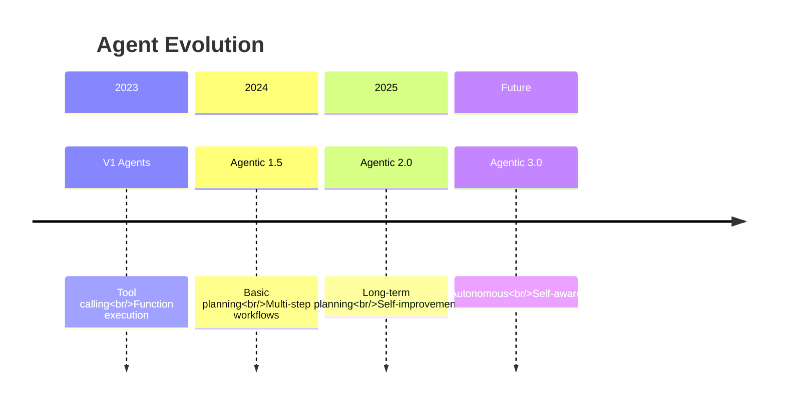
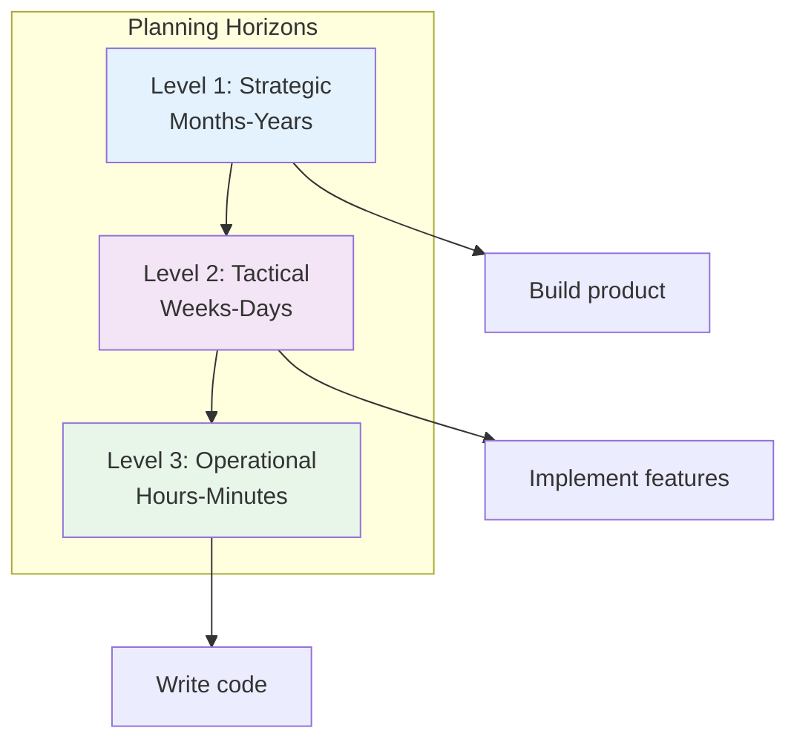
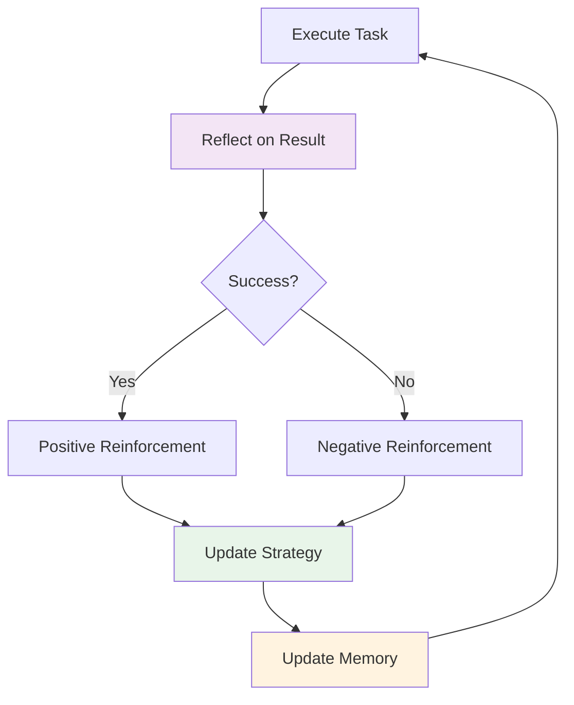
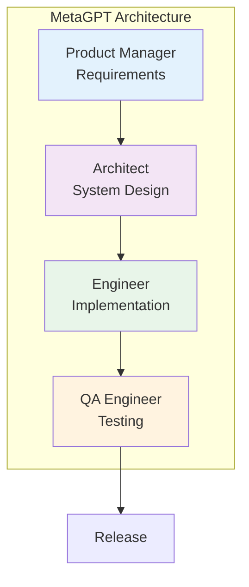
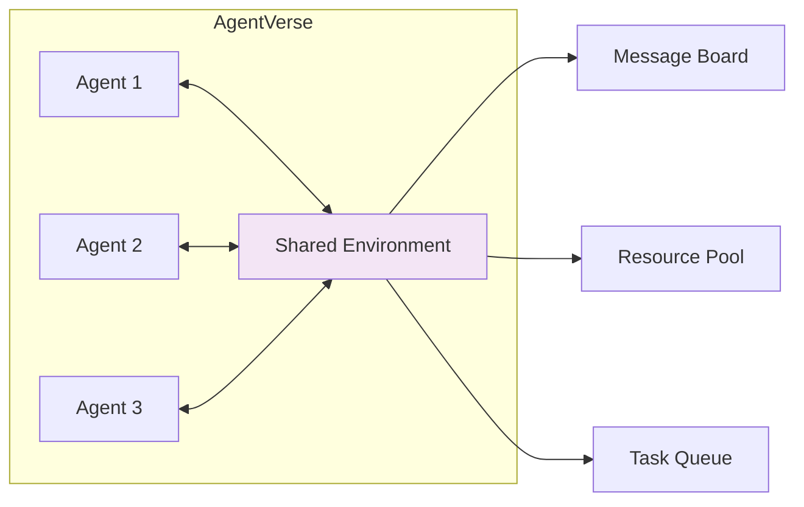
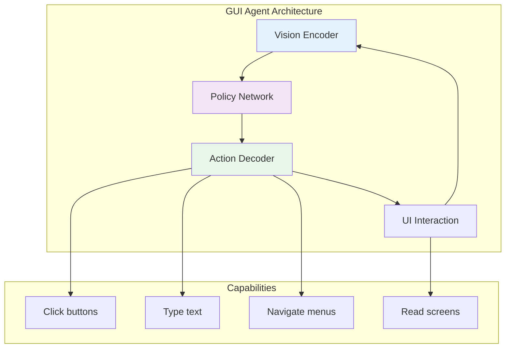
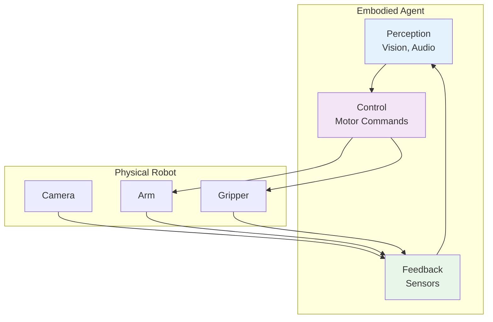
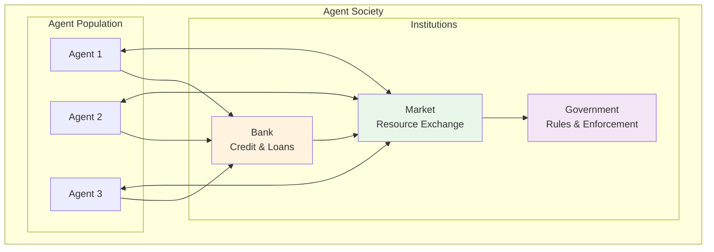
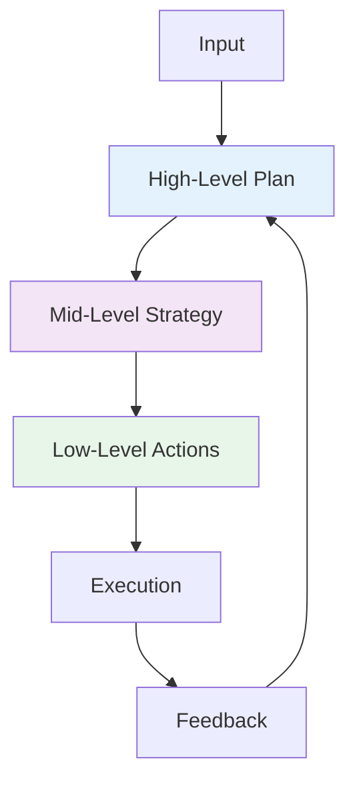
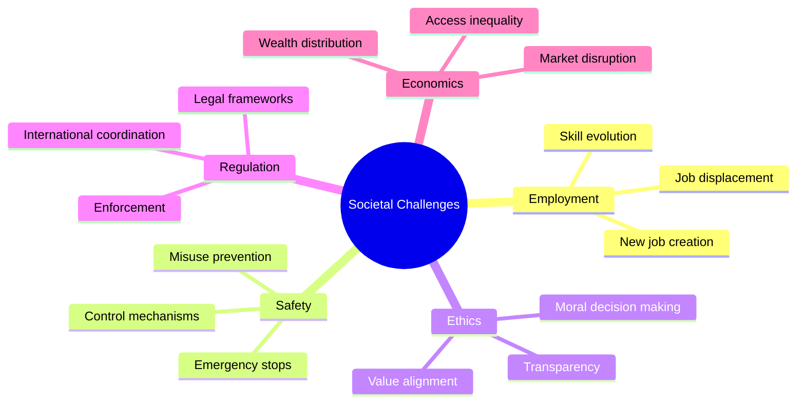

# 6. Frontier Trends & Future Directions

AI agent technology is evolving rapidly. This section explores cutting-edge research, emerging trends, and the future trajectory of agentic AI systems.

---

## 6.1 Agentic V2: The Next Generation

### Evolution from Tool Use to Autonomy



### V2 Capabilities

| Capability | V1 (Current) | V2 (Emerging) |
|------------|-------------|---------------|
| **Planning Horizon** | Immediate steps | Long-term strategies |
| **Learning** | Fixed prompts | Self-improving |
| **Collaboration** | Structured patterns | Dynamic teaming |
| **Memory** | Context window | Persistent learning |
| **Reliability** | ~80% success | >95% success |
| **Autonomy** | Human-guided | Semi-autonomous |

---

## 6.2 Long-Term Planning

### Hierarchical Task Networks

Breaking down complex goals across multiple time horizons.



### Implementation Concept

```java
// Concept: Hierarchical Planning Agent
public interface HierarchicalPlanner {

    Plan createStrategicPlan(Goal goal);
    Plan createTacticalPlan(StrategicPlan strategic);
    Plan createOperationalPlan(TacticalPlan tactical);

    default Plan execute(Goal goal) {
        // Multi-level planning
        Plan strategic = createStrategicPlan(goal);
        Plan tactical = createTacticalPlan(strategic);
        Plan operational = createOperationalPlan(tactical);

        // Execute with continuous replanning
        while (!operational.isComplete()) {
            executeStep(operational.nextStep());

            if (shouldReplan()) {
                operational = createOperationalPlan(tactical);
            }
        }

        return operational;
    }
}
```

---

## 6.3 Self-Improving Agents

### Learning from Experience



### Self-Improvement Techniques

| Technique | Description | Maturity |
|-----------|-------------|----------|
| **Reflection** | Critique and improve own outputs | Production-ready |
| **Experience Replay** | Learn from past episodes | Research |
| **Meta-Learning** | Learn how to learn | Research |
| **Self-Play** | Improve through practice | Emerging |
| **Evolutionary** | Optimize through selection | Research |

---

## 6.4 Multi-Agent Research Frontiers

### MetaGPT: Software Company Simulation

MetaGPT assigns roles to agents simulating a software company.



**Key Innovation**: Standard Operating Procedures (SOPs)
- Defines clear workflows for each role
- Enforces communication protocols
- Reduces coordination overhead

### ChatDev: Software Development

ChatDev specializes in automated software development.

**Phases**:
1. **Design**: Architecture and requirements
2. **Coding**: Implementation with best practices
3. **Testing**: Automated test generation
4. **Documentation**: Auto-generated docs

**Benefits**:
- Faster development cycles
- Consistent code quality
- Reduced human oversight

### AgentVerse: Interactive Agent Environment

Creates virtual environments where agents interact and collaborate.



---

## 6.5 Emerging Directions

### GUI Agents

Agents that directly interact with graphical user interfaces.



**Examples**:
- **Anthropic's Computer Use**: Claude controlling desktop
- **Multion**: AI assistant for web tasks
- **Rabbit R1**: Purpose-built device for autonomous actions

**Challenges**:
- UI understanding and robustness
- Error recovery
- Security and permission models

### Embodied Agents

Agents that interact with the physical world through robots.



**Applications**:
- Home robotics (cleaning, cooking)
- Industrial automation
- Healthcare assistance
- Exploration (space, underwater)

**Key Research**:
- **RT-2**: Robotic Transformer 2 (Google DeepMind)
- **VoxPoser**: LLM for robot manipulation
- **Hello Robot**: Stretch for home tasks

### Agent Societies

Multi-agent systems with social structures and economics.



**Research Areas**:
- **Economic Models**: Token economies, incentive design
- **Governance**: Voting, consensus, rule-making
- **Social Dynamics**: Cooperation, competition, emergence
- **Ethics**: Moral frameworks, value alignment

---

## 6.6 Technical Frontiers

### 1. RecG Agents: Recursive Critic and Generator

Agents that generate and critique their own outputs recursively.

```
For i in 1...N:
    Output_i = Generator(Feedback_{i-1})
    Critique_i = Critic(Output_i)
    Feedback_i = Refine(Critique_i)

Return Output_N
```

**Benefits**:
- Self-improving quality
- Reduced human oversight
- Handles complex criteria

### 2. Chain of Abstraction

Reasoning at different levels of abstraction.



### 3. Tree of Thoughts

Exploring multiple reasoning paths in parallel.

```
Root (Question)
├── Branch 1: Approach A
│   ├── Sub-branch 1.1
│   └── Sub-branch 1.2
├── Branch 2: Approach B
│   ├── Sub-branch 2.1
│   └── Sub-branch 2.2
└── Branch 3: Approach C
    ├── Sub-branch 3.1
    └── Sub-branch 3.2

Evaluate all branches and select best.
```

---

## 6.7 Challenges & Open Problems

### Technical Challenges

| Challenge | Description | Current Status |
|-----------|-------------|----------------|
| **Long-term Memory** | Persistent, scalable memory | Partial solutions |
| **Causal Reasoning** | Understanding cause-effect | Research stage |
| **Transfer Learning** | Applying knowledge to new domains | Early progress |
| **Explainability** | Understanding agent decisions | Active research |
| **Safety Assurance** | Formal guarantees of behavior | Major open problem |

### Societal Challenges



---

## 6.8 Predictions: 2025-2030

### Near-Term (2025-2026)

- **V2 Agents**: Long-term planning becomes common
- **Self-Improvement**: Agents learn from feedback
- **Multi-Agent Standard**: Common patterns emerge
- **GUI Agents**: Web task automation matures

### Mid-Term (2027-2028)

- **Embodied Agents**: Home robots become practical
- **Agent Societies**: Economic systems emerge
- **Regulation**: First agent-specific laws passed
- **Safety Standards**: Industry-wide protocols

### Long-Term (2029-2030)

- **Semi-Autonomous**: Agents operate with minimal oversight
- **Recursive Improvement**: Agents improve other agents
- **General Purpose**: Agents handle diverse tasks
- **Human-Agent Collaboration**: Seamless teamwork

---

## 6.9 How to Stay Current

### Research Sources

| Source | Type | Update Frequency |
|--------|------|------------------|
| **arXiv** | Preprints | Daily |
| **Papers With Code** | Implementations | Weekly |
| **LangChain Blog** | Industry insights | Monthly |
| **Anthropic/Google Blogs** | Company research | Irregular |
| **Agent Workshops** | Academic conferences | Quarterly |

### Key Conferences

- **ICML**: International Conference on Machine Learning
- **NeurIPS**: Neural Information Processing Systems
- **ICLR**: International Conference on Learning Representations
- **AAAI**: Association for Advancement of AI
- **Agent Workshops**: Specialized agent conferences

### Open Source Projects

- **LangChain/LangGraph**: Rapidly evolving frameworks
- **AutoGen**: Microsoft's multi-agent framework
- **CrewAI**: Role-playing agents
- **MetaGPT**: Software company simulation

---

## 6.10 Key Takeaways

### The Frontier is Moving Fast

1. **V2 Agents**: From tool use to autonomous planning
2. **Self-Improvement**: Agents learning from experience
3. **Multi-Agent**: Rich collaboration patterns
4. **New Modalities**: GUI, embodied, social agents

### Challenges Remain

1. **Reliability**: >95% success rate needed
2. **Safety**: Formal guarantees lacking
3. **Alignment**: Value alignment unsolved
4. **Control**: Emergency stop mechanisms needed

### Prepare for the Future

1. **Learn Fundamentals**: V1 patterns apply to V2
2. **Experiment**: Build with new frameworks
3. **Follow Research**: Stay current with papers
4. **Think Ethically**: Consider societal impact

---

## 6.11 Learning Path Complete

You've completed the AI Agent journey:

✅ **1. Core Concepts**: Understanding agents
✅ **2. Architecture**: Building blocks
✅ **3. Design Patterns**: Proven solutions
✅ **4. Frameworks**: Implementation tools
✅ **5. Engineering**: Production readiness
✅ **6. Frontier**: Future directions

### Next Steps

1. **Build Something**: Create your own agent
2. **Join Community**: Contribute to open source
3. **Share Knowledge**: Write and teach others
4. **Stay Curious**: Keep learning and exploring

---

:::tip The Best Time to Start
The field is moving fast, but the fundamentals you've learned will remain relevant. Start building agents today, and evolve with the technology.
:::

:::info Keep Exploring
This is just the beginning. The frontier of AI agents is expanding every day. Stay curious, keep building, and help shape the future of autonomous AI systems.
:::
