# 🤝 Agentic Workflows

> **"Agents are LLMs that can take actions in the world."**

AI Agents extend LLMs beyond text generation to autonomous systems that can reason, plan, use tools, and complete complex multi-step tasks.

---

## 🎯 What Are AI Agents?

| Component | Description |
|-----------|-------------|
| **LLM Brain** | Core reasoning and decision making |
| **Tools** | Functions the agent can call |
| **Memory** | Context and conversation history |
| **Planning** | Breaking down complex tasks |
| **Execution** | Taking actions based on decisions |

---

## 🏗️ Agent Architecture

```mermaid
flowchart TB
    A[User Input] --> B[Agent]
    
    subgraph Agent["🤖 Agent Core"]
        C[Planner]
        D[Executor]
        E[Memory]
    end
    
    B --> C
    C --> D
    D --> F[Tools]
    F --> G[Search API]
    F --> H[Calculator]
    F --> I[Database]
    F --> J[Code Executor]
    
    D --> E
    E --> C
    
    D --> K[Output]
```



---

## 🔧 Tool Calling (Function Calling)

### How It Works

```mermaid
sequenceDiagram
    participant U as User
    participant A as Agent/LLM
    participant T as Tool

    U->>A: "What's the weather in NYC?"
    A->>A: Decide to use weather tool
    A->>T: get_weather(city="NYC")
    T->>A: {"temp": 72, "condition": "sunny"}
    A->>U: "It's 72°F and sunny in NYC"
```



### Defining Tools

```python
# OpenAI Function Calling format
tools = [
    {
        "type": "function",
        "function": {
            "name": "get_weather",
            "description": "Get current weather for a city",
            "parameters": {
                "type": "object",
                "properties": {
                    "city": {
                        "type": "string",
                        "description": "The city name"
                    },
                    "unit": {
                        "type": "string",
                        "enum": ["celsius", "fahrenheit"],
                        "description": "Temperature unit"
                    }
                },
                "required": ["city"]
            }
        }
    }
]
```

### Tool Implementation Example

```java
// Spring AI Tool Definition
@Bean
public FunctionCallback weatherFunction() {
    return FunctionCallback.builder()
        .function("getWeather", (Request request) -> {
            String city = request.city();
            // Call weather API
            return new WeatherResponse(city, 72, "sunny");
        })
        .description("Get current weather for a city")
        .inputType(Request.class)
        .build();
}
```

---

## 🔄 Agent Patterns

### ReAct Pattern (Reasoning + Acting)


```markdown
Question: What is the population of the largest city in Japan?

Thought 1: I need to find the largest city in Japan
Action 1: Search("largest city in Japan")
Observation 1: Tokyo is the largest city in Japan

Thought 2: Now I need Tokyo's population
Action 2: Search("Tokyo population 2024")
Observation 2: Tokyo has approximately 14 million people

Thought 3: I have the answer
Final Answer: The population of Tokyo, Japan's largest city, is approximately 14 million.
```

### Plan and Execute


### Multi-Agent Collaboration


---

## 🧠 Memory Systems

| Type | Description | Use Case |
|------|-------------|----------|
| **Buffer** | Recent N messages | Chat context |
| **Summary** | Condensed history | Long conversations |
| **Vector** | Semantic retrieval | Knowledge base |
| **Entity** | Extracted entities | User preferences |
| **Episodic** | Past interactions | Learning from experience |

```python
# Memory implementation concept
class ConversationMemory:
    def __init__(self, max_tokens=4000):
        self.messages = []
        self.summary = ""
        self.max_tokens = max_tokens
    
    def add_message(self, role, content):
        self.messages.append({"role": role, "content": content})
        
        # Summarize when too long
        if self.get_token_count() > self.max_tokens:
            self.summarize_and_trim()
    
    def get_context(self):
        return f"Summary: {self.summary}\n\n" + self.format_messages()
```

---

## 🛠️ Frameworks

### LangChain / LangGraph

| Component | Purpose |
|-----------|---------|
| **Chains** | Sequential operations |
| **Agents** | Tool-using LLMs |
| **Memory** | Conversation state |
| **Callbacks** | Observability hooks |
| **LangGraph** | Stateful multi-actor workflows |

### LangGraph Example

```python
from langgraph.graph import StateGraph

# Define graph state
class AgentState(TypedDict):
    messages: list
    next: str

# Build graph
workflow = StateGraph(AgentState)
workflow.add_node("researcher", research_node)
workflow.add_node("writer", writer_node)
workflow.add_node("reviewer", reviewer_node)

# Define edges
workflow.add_edge("researcher", "writer")
workflow.add_conditional_edges("writer", should_continue)
workflow.add_edge("reviewer", "writer")  # revision loop

graph = workflow.compile()
```

---

## 📝 Detailed Topics

- [LangChain Deep Dive](/documentation/docs/ai/agents/langchain)
- [LangGraph Workflows](/documentation/docs/ai/agents/langgraph)
- [Tool Design Best Practices](/documentation/docs/ai/agents/tools)
- [Memory Patterns](/documentation/docs/ai/agents/memory)
- [Multi-Agent Systems](/documentation/docs/ai/agents/multi-agent)

---

:::tip Agent Development Tips
1. **Start simple** - Single tool agent before multi-agent
2. **Clear tool descriptions** - LLM uses these to decide
3. **Error handling** - Tools will fail, plan for it
4. **Limit iterations** - Prevent infinite loops
5. **Observability** - Log every step for debugging
:::
