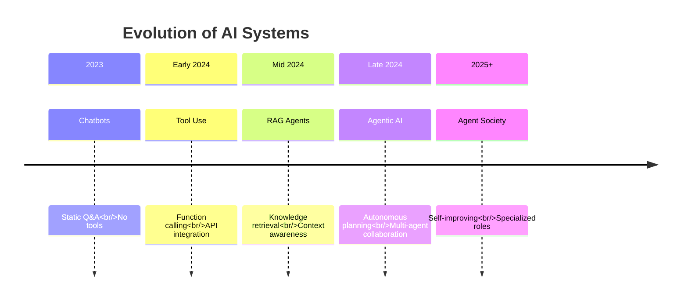
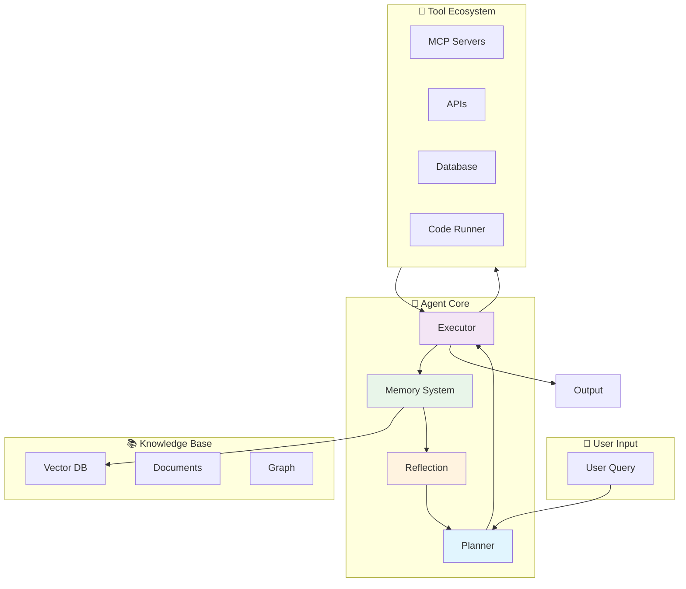

# AI Agent Systems

> **"The future of AI is not just conversation—it's action."**

AI Agents represent the evolution from passive chatbots to autonomous systems that can reason, plan, use tools, and complete complex multi-step tasks. This chapter covers everything from foundational concepts to production deployment.

## What Are AI Agents?

| Component | Description | Example |
|-----------|-------------|---------|
| **Model (Brain)** | Core reasoning and decision-making engine | GPT-4, Claude 3.5, Llama 3 |
| **Prompt (Instruction)** | System behavior and task guidance | "You are a helpful research assistant..." |
| **Memory** | Context, history, and knowledge retrieval | Conversation history, RAG, Vector DB |
| **Tools** | Capabilities to interact with the world | APIs, databases, code execution |
| **Planning** | Breaking down complex tasks into steps | "Search → Analyze → Write → Review" |

### The Core Formula

```
Agent = Model (Brain) + Prompt (Instruction) + Memory (RAG/Context)
         + Tools (MCP) + Planning (Architecture)
```

### Why Agents Matter

| Traditional LLM | AI Agent |
|----------------|----------|
| **Passive** - Only generates text | **Active** - Takes actions in the world |
| **One-shot** - Single response | **Multi-step** - Plans and executes workflows |
| **Limited** - Training knowledge only | **Extended** - Real-time data via tools |
| **Static** - No state persistence | **Stateful** - Memory and learning |

---

## From Chatbots to Agents



### The Agentic Spectrum

```
Passive Chat → Tool-Using → Task-Planning → Multi-Agent → Autonomous
     ↓             ↓              ↓              ↓            ↓
   Q&A Only     Functions     Workflows     Collaboration  Self-Driving
```

---

## Agent Architecture Overview



---

## Chapter Roadmap

This chapter is structured to take you from fundamentals to production-ready systems:

### 1. [Introduction](./01-introduction) - Core Concepts
- **What makes something an "Agent"?**
- The evolution from chatbots to autonomous systems
- Core capabilities: Perception, Reasoning, Action, Reflection
- When to use agents vs. traditional automation

### 2. [Architecture](./02-architecture) - Building Blocks
- **The Agent Loop**: Observe → Reason → Act → Observe
- **Memory Systems**: Buffer, Summary, Vector, Entity, Episodic
- **Tool Systems**: MCP, Function Calling, Error Handling
- **Planning**: Task decomposition, Re-planning, Goal-directed

### 3. [Design Patterns](./03-design-patterns) - Proven Solutions
- **Single-Agent Patterns**: ReAct, Reflection, Self-Consistency
- **Multi-Agent Patterns**: Supervisor, Hierarchical, Debate
- **Router Pattern**: Query classification and routing
- **Case Studies**: Real-world implementations

### 4. [Frameworks](./04-frameworks) - Tech Stack & Tools
- **Framework Comparison**: LangChain, LangGraph, Semantic Kernel, AutoGen
- **Spring AI Deep Dive**: Building production agents with Java
- **Developer Tools**: LangSmith, Arize Phoenix, PromptLayer
- **Complete Example**: End-to-end Spring Boot agent

### 5. [Engineering](./05-engineering) - Production Readiness
- **Evaluation**: LLM-as-a-Judge, metrics, testing frameworks
- **Challenges**: Hallucination, infinite loops, cost control
- **Security**: Prompt injection, access control, HITL
- **Deployment**: Docker, observability, A/B testing

### 6. [Frontier](./06-frontier) - Future Trends
- **Agentic V2**: Long-term planning, self-improvement
- **Multi-Agent Research**: MetaGPT, ChatDev, AgentVerse
- **Emerging Directions**: GUI agents, embodied agents
- **Challenges & Opportunities**: The road ahead

---

## Quick Start Patterns

### Pattern 1: ReAct Agent (Reasoning + Acting)

```markdown
Question: What's the population of the largest city in Japan?

Thought: I need to find the largest city in Japan first
Action: Search("largest city in Japan")
Observation: Tokyo is the largest city

Thought: Now I need Tokyo's population
Action: Search("Tokyo population 2024")
Observation: Approximately 14 million

Thought: I have all the information needed
Answer: Tokyo, Japan's largest city, has about 14 million people.
```

### Pattern 2: Supervisor Multi-Agent

```
User Request → Supervisor Agent
                ↓
    ┌───────────┼───────────┐
    ↓           ↓           ↓
Researcher   Writer    Reviewer
    ↓           ↓           ↓
    └───────────┴───────────┘
                ↓
          Supervisor
                ↓
          Final Output
```

---

## Key Technologies

| Technology | Role | Integration |
|------------|------|-------------|
| **Spring AI** | Java framework for agents | `spring-ai-openai-spring-boot-starter` |
| **MCP** | Standardized tool protocol | Model Context Protocol servers |
| **Vector DB** | Semantic memory | Pinecone, Weaviate, pgvector |
| **LangGraph** | Multi-agent workflows | Stateful agent orchestration |
| **LangSmith** | Debugging & tracing | Agent observability |

---

## When to Use Agents

### ✅ Good Use Cases

- **Research & Analysis**: Multi-step information gathering and synthesis
- **Content Creation**: Writing with research, review, and revision cycles
- **Code Tasks**: Debugging, refactoring, documentation generation
- **Data Operations**: ETL workflows, data analysis, reporting
- **Customer Service**: Complex queries requiring multiple systems

### ❌ Avoid Agents For

- **Simple CRUD**: Traditional APIs are faster and cheaper
- **Predictable Workflows**: Hard-coded logic is more reliable
- **Real-time Requirements**: LLM latency is too high
- **Strict Determinism**: Agents are non-deterministic by nature
- **Cost-Sensitive**: High token usage vs. simple scripts

---

## Prerequisites

Before diving into agents, make sure you're comfortable with:

1. **LLM Fundamentals** ([Module 01](/ai/llm-fundamentals))
   - Tokenization, embeddings, inference
   - Model capabilities and limitations

2. **Prompt Engineering** ([Module 02](/ai/prompt-engineering))
   - System prompts, few-shot learning
   - Structured output, reasoning patterns

3. **RAG** ([Module 03](/ai/rag))
   - Vector databases, retrieval strategies
   - Context management

4. **MCP** ([Module 05](/ai/mcp))
   - Tool protocol, server implementation
   - Resources, tools, and prompts

---

## Learning Paths

### For Java/Spring Boot Developers

**Path**: 01 → 02 → 04 (Spring AI focus) → 05

Focus on production-ready Spring Boot agents with MCP integration.

### For AI Engineers

**Path**: 01 → 02 → 03 (Design patterns) → 05 → 06

Focus on multi-agent systems and advanced patterns.

### For Full-Stack Developers

**Path**: 01 → 02 → 04 (Framework comparison) → 05

Focus on Next.js frontend + Spring Boot backend integration.

---

## Common Challenges

| Challenge | Solution | Covered In |
|-----------|----------|------------|
| **Hallucination** | RAG + Verification | Architecture, Engineering |
| **Infinite Loops** | Max iterations + HITL | Architecture |
| **High Cost** | Caching + smaller models | Engineering |
| **Poor Reliability** | Reflection + self-check | Design Patterns |
| **Security Risks** | Prompt injection defense | Engineering |
| **Debugging Difficulty** | Tracing + observability | Frameworks, Engineering |

---

## Production Checklist

Before deploying an agent to production:

- [ ] Clear success/failure criteria defined
- [ ] Comprehensive error handling
- [ ] Human-in-the-loop for sensitive operations
- [ ] Rate limiting and cost controls
- [ ] Audit logging enabled
- [ ] Monitoring and alerting configured
- [ ] Security review completed
- [ ] Load testing performed
- [ ] A/B testing framework ready
- [ ] Rollback plan documented

---

:::tip Get Started
New to agents? Start with **[01 Introduction](./01-introduction)** to understand the core concepts and evolution from chatbots to autonomous systems.
:::

:::info For Spring Boot Developers
If you're building agents with Java, jump to **[04 Frameworks](./04-frameworks)** for Spring AI implementation guides and complete code examples.
:::

:::warning Production Readiness
Deploying agents to production requires careful planning. See **[05 Engineering](./05-engineering)** for evaluation, security, and deployment best practices.
:::
