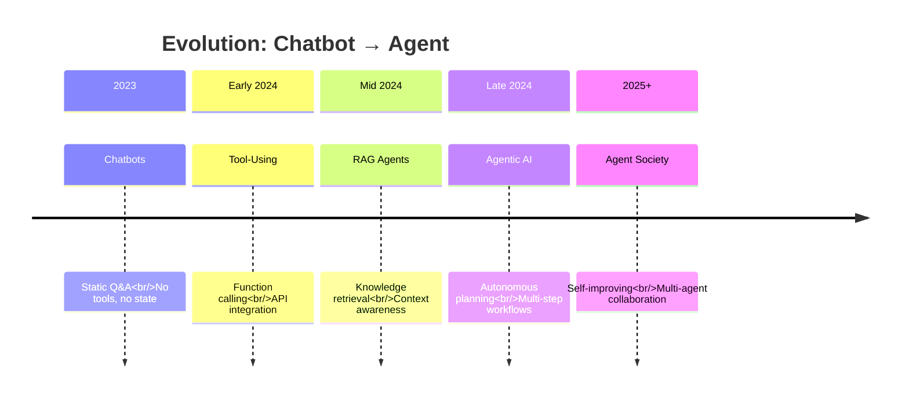
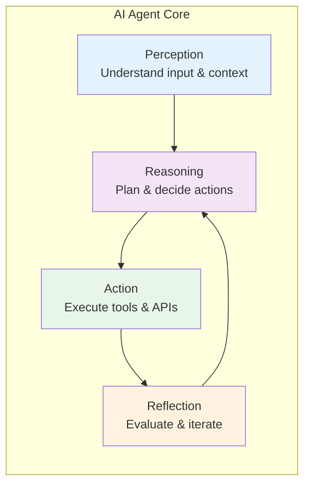
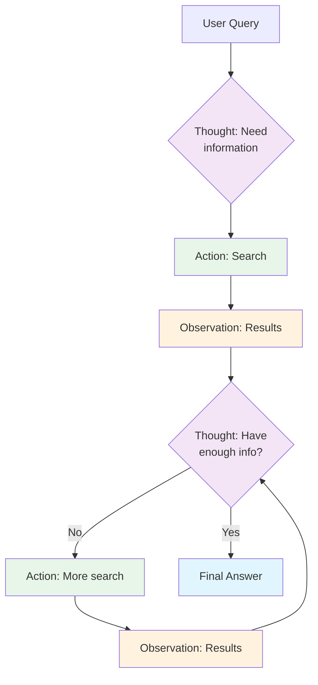
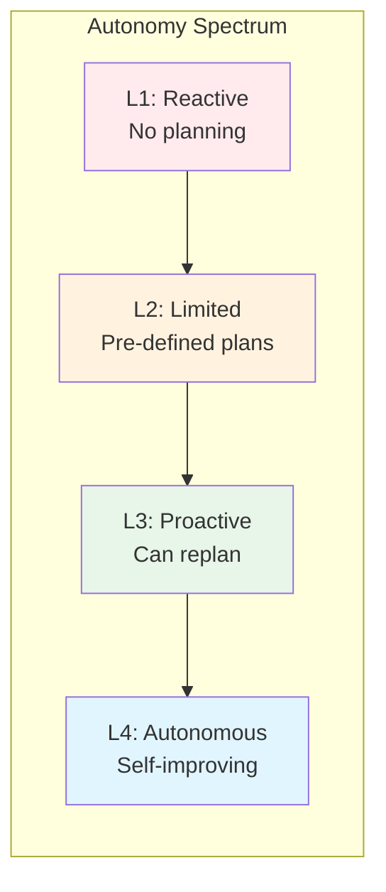

# 1. Core Concepts & Definition

> **"The future of AI is not just conversation—it's action."**

AI Agents represent the evolution from passive chatbots to autonomous systems that can reason, plan, use tools, and complete complex multi-step tasks. This section explores the fundamental concepts that define AI agents and distinguish them from traditional LLM applications.

---

## 1.1 From LLM Chatbots to AI Agents

### The Evolution Path



### Key Differences

| Dimension | Traditional LLM | AI Agent |
|-----------|----------------|----------|
| **Interactivity** | Passive - Only generates text | Active - Takes actions in the world |
| **Workflow** | One-shot - Single response | Multi-step - Plans and executes workflows |
| **Knowledge** | Limited - Training data only | Extended - Real-time data via tools |
| **State** | Stateless - No memory | Stateful - Persistent memory and learning |
| **Capability** | Conversational | Task completion |
| **Autonomy** | Low - Requires prompt | High - Self-directed planning |

---

## 1.2 What Makes Something an "Agent"?

### The Four Core Capabilities



#### 1. **Perception** (感知)
- Understanding user intent and context
- Processing multimodal inputs (text, images, audio)
- Recognizing task requirements and constraints

#### 2. **Reasoning** (推理)
- Breaking down complex tasks into subtasks
- Planning execution sequences
- Making decisions based on available information

#### 3. **Action** (行动)
- Calling tools and APIs
- Interacting with databases and external systems
- Modifying state in the environment

#### 4. **Reflection** (反思)
- Evaluating outcomes against goals
- Detecting and correcting errors
- Re-planning when necessary

---

## 1.3 The Agent Formula

### Core Components

```
Agent = Model (Brain) + Prompt (Instruction) + Memory (Context)
        + Tools (Capabilities) + Planning (Architecture)
```

#### Component Breakdown

| Component | Role | Example |
|-----------|------|---------|
| **Model** | Reasoning engine | GPT-4, Claude 3.5, Llama 3 |
| **Prompt** | Behavior definition | System prompts, task instructions |
| **Memory** | Context & knowledge | Conversation history, RAG, Vector DB |
| **Tools** | World interaction | APIs, databases, code execution |
| **Planning** | Task orchestration | ReAct, Plan-and-Execute, Reflection |

### Component Deep Dive

#### 1. **Model (Brain)**
The LLM serves as the central reasoning engine, responsible for:
- Understanding natural language input
- Generating plans and decisions
- Selecting appropriate tools
- Interpreting tool results

#### 2. **Prompt (Instruction)**
System prompts define agent behavior:
```markdown
You are a research assistant agent with access to web search and academic databases.
Your goal is to find, synthesize, and cite accurate information for user queries.
Always verify information from multiple sources before presenting conclusions.
```

#### 3. **Memory (Context)**
Memory systems enable agents to maintain context:
- **Buffer Memory**: Recent conversation history
- **Summary Memory**: Compressed historical context
- **Vector Store**: Semantic knowledge retrieval
- **Entity Memory**: Facts about people, places, things
- **Episodic Memory**: Past experiences and outcomes

#### 4. **Tools (Capabilities)**
Tools extend agent capabilities beyond text generation:
- **Web Search**: Real-time information retrieval
- **Code Execution**: Running and testing code
- **API Integration**: Accessing external services
- **Database Queries**: Structured data operations
- **File Operations**: Reading and writing files

#### 5. **Planning (Architecture)**
Planning mechanisms orchestrate multi-step workflows:
- **Task Decomposition**: Breaking complex goals into subtasks
- **Re-planning**: Adjusting plans based on feedback
- **Multi-step Planning**: Sequencing actions
- **Goal-directed Planning**: Working toward specific objectives

---

## 1.4 The Agent Loop

### ReAct Pattern (Reasoning + Acting)

The most fundamental agent pattern:

```
1. Thought: What do I need to do?
2. Action: Execute a tool/API
3. Observation: What was the result?
4. Repeat: Continue until goal is achieved
```

#### Example Workflow



#### Practical Example

**Question**: "What's the population of the largest city in Japan?"

```
Thought 1: I need to find the largest city in Japan first
Action 1: search("largest city in Japan")
Observation 1: Tokyo is the largest city in Japan

Thought 2: Now I need Tokyo's population
Action 2: search("Tokyo population 2024")
Observation 2: Approximately 14 million people

Thought 3: I have all the information needed
Answer: Tokyo, Japan's largest city, has about 14 million people.
```

---

## 1.5 Agent Capabilities and Limitations

### What Agents Do Well

| Use Case | Why Agents Excel |
|----------|------------------|
| **Research & Analysis** | Multi-step information gathering and synthesis |
| **Content Creation** | Writing with research, review, and revision cycles |
| **Code Tasks** | Debugging, refactoring, documentation generation |
| **Data Operations** | ETL workflows, data analysis, reporting |
| **Customer Service** | Complex queries requiring multiple systems |

### When to Avoid Agents

| Scenario | Better Alternative | Reason |
|----------|-------------------|--------|
| **Simple CRUD** | REST APIs | Faster, cheaper, more predictable |
| **Predictable Workflows** | Hard-coded logic | More reliable, deterministic |
| **Real-time Requirements** | Traditional programs | LLM latency too high |
| **Strict Determinism** | Rule-based systems | Agents are inherently non-deterministic |
| **Cost-Sensitive** | Simple scripts | High token usage vs. fixed logic |

### Cost-Benefit Analysis

```
Traditional Approach:
- Development cost: High (manual programming)
- Runtime cost: Low (fixed logic)
- Maintainability: Low (hard to update)
- Flexibility: Low (rigid workflows)

Agent Approach:
- Development cost: Low (prompt-based)
- Runtime cost: High (token usage)
- Maintainability: High (prompt updates)
- Flexibility: High (adaptive behavior)
```

---

## 1.6 Types of AI Agents

### Classification by Autonomy



| Level | Autonomy | Planning | Example |
|-------|----------|----------|---------|
| **L1: Reactive** | None | No planning | Simple tool-calling chatbot |
| **L2: Limited** | Low | Fixed plan | Scripted workflows |
| **L3: Proactive** | Medium | Dynamic re-planning | ReAct agents |
| **L4: Autonomous** | High | Self-improving | Multi-agent systems |

### Classification by Architecture

| Type | Description | Use Case |
|------|-------------|----------|
| **Single Agent** | One agent with multiple tools | General purpose tasks |
| **Supervisor-Worker** | One coordinator, specialized workers | Complex workflows |
| **Hierarchical** | Multi-level control | Large-scale systems |
| **Sequential** | Pipeline of agents | Content creation |
| **Debate** | Multiple agents discuss/vote | Decision making |

---

## 1.7 Real-World Examples

### Example 1: Research Agent

```
User: "Create a report on the latest AI trends in 2024"

Agent Workflow:
1. Search for "AI trends 2024" (5 sources)
2. Extract key themes from each source
3. Identify common patterns
4. Synthesize into structured report
5. Cite sources properly
6. Review for completeness
7. Format as markdown
```

### Example 2: Code Review Agent

```
User: "Review this pull request"

Agent Workflow:
1. Read the diff
2. Check for security vulnerabilities
3. Verify best practices
4. Test for edge cases
5. Suggest improvements
6. Generate review comments
7. Create summary report
```

### Example 3: Customer Service Agent

```
User: "I need to return my order"

Agent Workflow:
1. Authenticate user
2. Fetch order details
3. Check return policy
4. Calculate refund amount
5. Process return request
6. Update inventory
7. Send confirmation email
8. Provide tracking info
```

---

## 1.8 Key Takeaways

### Core Concepts

1. **Agents = LLM + Tools + Planning**
   - LLM provides reasoning
   - Tools provide capabilities
   - Planning provides orchestration

2. **Four Pillars of Agency**
   - Perception: Understanding the world
   - Reasoning: Making decisions
   - Action: Interacting with the world
   - Reflection: Learning and improving

3. **ReAct Pattern**
   - Thought → Action → Observation → Repeat
   - The fundamental loop for agentic behavior

### Decision Framework

```
Should I use an agent?

YES if:
- Task requires multi-step reasoning
- Information is distributed across sources
- Task involves creativity or synthesis
- Requirements may change dynamically

NO if:
- Task is simple CRUD
- Workflow is well-defined and fixed
- Latency requirements are strict
- Cost is a primary concern
```

---

## 1.9 Prerequisites for Deep Dive

Before proceeding to the next sections, ensure you understand:

1. **LLM Fundamentals** ([Module 01](/ai/llm-fundamentals))
   - Tokenization and embeddings
   - Transformer architecture
   - Model capabilities and limitations

2. **Prompt Engineering** ([Module 02](/ai/prompt-engineering))
   - System prompts
   - Few-shot learning
   - Structured output
   - Reasoning patterns

3. **RAG Concepts** ([Module 03](/ai/rag))
   - Vector databases
   - Retrieval strategies
   - Context management

4. **MCP Protocol** ([Module 05](/ai/mcp))
   - Tool definition
   - Server implementation
   - Integration patterns

---

:::tip Next Steps
Now that you understand the core concepts, explore **[2. Architecture Components](./architecture)** to learn how to build the foundational systems that power AI agents.
:::

:::info For Spring Boot Developers
If you're eager to start coding, jump to **[4. Frameworks & Tech Stack](./frameworks)** for Spring AI implementation guides.
:::
