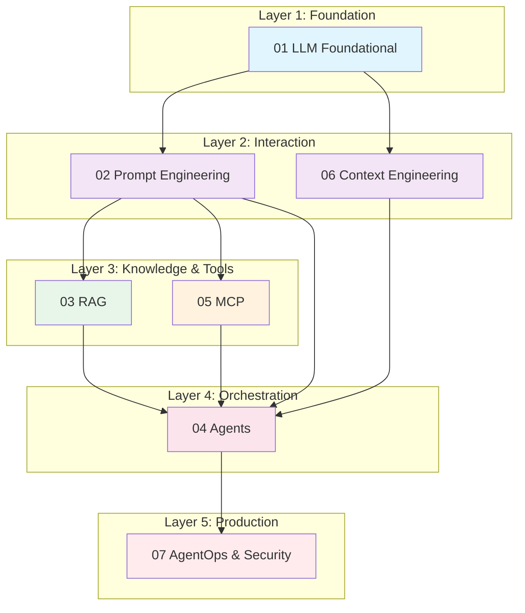

# AI Agent Engineering Handbook

> **"The best AI engineers understand both the models and the engineering."**

This knowledge base builds a complete technical loop from LLM fundamentals to production AI agent systems.

## The Core Formula

```
Agent = Model (Brain) + Prompt (Instruction) + Memory (RAG/Context) + Tools (MCP) + Planning (Architecture)
```

---

## 1. System Architecture Overview

This diagram shows how the 7 modules logically depend on each other:



**How the modules connect:**

- **LLM Foundational** provides computing and reasoning foundations
- **Prompt & Context** are the media for interacting with models
- **RAG** provides static knowledge support for models
- **MCP** provides dynamic tool support for models
- **Agents** orchestrate and coordinate all above components
- **Ops & Security** runs through the entire lifecycle

---

## 2. Module Synopsis

| ID | Module | One-Liner Definition | Key Technologies & Keywords |
|----|--------|---------------------|----------------------------|
| **01** | LLM Foundational | Understanding the "brain" mechanism, training pipeline, and physical limitations | Transformer, Attention, Pre-training, RLHF, Tokenization, Inference Params (Temp/Top-P) |
| **02** | Prompt Engineering | Writing "instruction code" to elicit reasoning and standardize output format | Chain-of-Thought (CoT), Few-shot, ReAct, XML/JSON Output, Persona |
| **03** | RAG | Augmenting models with external "library" to solve hallucinations and inject private data | Vector DB, Embeddings, Chunking, Hybrid Search, Grounding, Self-Querying |
| **04** | Agents | Evolving from "chat" to "action" with planning, reflection, and tool use | Orchestration, Loop Control, Reflection, Router, Multi-Agent (Supervisor/Hierarchical) |
| **05** | MCP | Model Context Protocol - standardized AI connection (USB-C) decoupling models from tools | Host/Client/Server, Resources, Tools, Prompts, JSON-RPC, Stdio/SSE |
| **06** | Context Engineering | Managing model "attention" window and long/short-term memory to prevent overload | KV Cache, Context Window, Short/Long-term Memory, Information Compression |
| **07** | AgentOps & Security | Converting demos to production applications with safety, observability, and evaluation | Eval (LLM-as-a-Judge), Prompt Injection, Docker Deployment, Tracing |

---

## 3. Learning Paths

Choose your path based on your development goals.

### The Builder Path (Practical Developer)

**Goal:** Quickly build a Java AI Agent that can access the web and query databases.

**Recommended Order:**

1. **05 MCP**: First understand how to write a tool (Server)
2. **04 Agents**: Learn how to make the model call this tool
3. **02 Prompt**: Optimize instructions for more accurate calls
4. **07 Ops**: Deploy to Docker (refer to Brave Search case)

**Focus:** Rapid iteration, working code, production deployment

### The Architect Path (Architect/Researcher)

**Goal:** Design complex enterprise multi-agent systems.

**Recommended Order:**

1. **01 Foundational**: Understand model capability boundaries
2. **04 Agents**: Design multi-agent collaboration patterns
3. **06 Context**: Design memory systems to support long workflows
4. **03 RAG**: Plan enterprise knowledge base integration

**Focus:** System design, scalability patterns, architectural trade-offs

---

## 4. Quick References

Essential resources for common tasks - avoid deep-diving into documentation.

### Standard Agent System Prompt Template

[See Template Guide](/llm-foundamentals/prompts)

### MCP Server Standard Code Structure (Java/Spring)

[See Java Implementation Guide](/mcp/java-spring-server)

### RAG Chunking Strategy Cheat Sheet

[See RAG Optimization Guide](/rag/chunking-strategies)

### Recommended LLM Parameters

| Parameter | Conservative | Creative | Coding |
|-----------|-------------|----------|--------|
| **Temperature** | 0.0 - 0.3 | 0.7 - 1.0 | 0.1 - 0.2 |
| **Top-P** | 0.9 | 0.95 | 0.9 |
| **Max Tokens** | 1024 | 2048 | 4096 |
| **Frequency Penalty** | 0.0 | 0.3 | 0.0 |

---

## 5. Navigation Guide

### Core Modules

- **[LLM Foundational](/ai/llm-fundamentals)** - Transformer architecture, training, inference, limitations
- **[Prompt Engineering](/ai/prompt-engineering)** - CoT, few-shot, ReAct patterns, output formatting
- **[RAG](/ai/rag)** - Vector databases, embeddings, retrieval strategies, grounding
- **[Agents](/ai/agents)** - Orchestration, multi-agent systems, planning, reflection
- **[MCP](/ai/mcp)** - Protocol specification, server implementation, tools, resources
- **[Context Engineering](/ai/context-engineering)** - Context windows, memory systems, optimization
- **[AgentOps & Security](/ai/agentops-security)** - Deployment, monitoring, safety, incident response

### Additional Resources

- **[Java & AI Internship Guide](/ai/internship/internship)** - Career development, practical skills

---

## 6. Key Concepts at a Glance

### Token Economics

- **1 token** ~= 0.75 words (English) ~= 4 characters
- **Context window** = maximum tokens per request (varies by model)
- **KV cache** = cached previous tokens for faster generation

### The RAG Pipeline

```
Query -> Embedding -> Vector Search -> Context Assembly -> LLM -> Response
```

### Agent Decision Loop

```
Observe -> Reason -> Act -> Observe -> Reason -> Act ...
```

### MCP Connection Model

```
Host (App) <-> Client (Protocol) <-> Server (Tool/Data)
```

---

## 7. Common Patterns

### Pattern 1: ReAct Agent

```
Thought: [Analyze the situation]
Action: [Call a tool]
Observation: [Review result]
Thought: [Plan next step]
Action: [Continue or finish]
```

### Pattern 2: Router Agent

```
Classify Query -> Route to Specialist Agent -> Aggregate Results
```

### Pattern 3: Hierarchical Agents

```
Supervisor Agent -> Worker Agents -> Report Back -> Synthesize
```

---

## 8. Production Checklist

Before deploying to production:

- [ ] All tools have proper error handling
- [ ] Sensitive operations require human approval
- [ ] Comprehensive audit logging enabled
- [ ] Kill switches implemented and tested
- [ ] Rate limiting configured
- [ ] Cost controls in place
- [ ] Monitoring dashboards active
- [ ] Incident response procedures documented
- [ ] Security review completed
- [ ] Load testing performed

---

:::tip Get Started
New to AI engineering? Start with **[LLM Foundational](/ai/llm-fundamentals)** to understand how models work, then move to **[Prompt Engineering](/ai/prompt-engineering)** to learn effective prompting patterns.
:::

:::info For Java Developers
If you're building AI applications with Spring Boot, check out **[MCP](/ai/mcp)** for standardized tool integration and **[AgentOps](/ai/agentops-security)** for production deployment patterns.
:::
