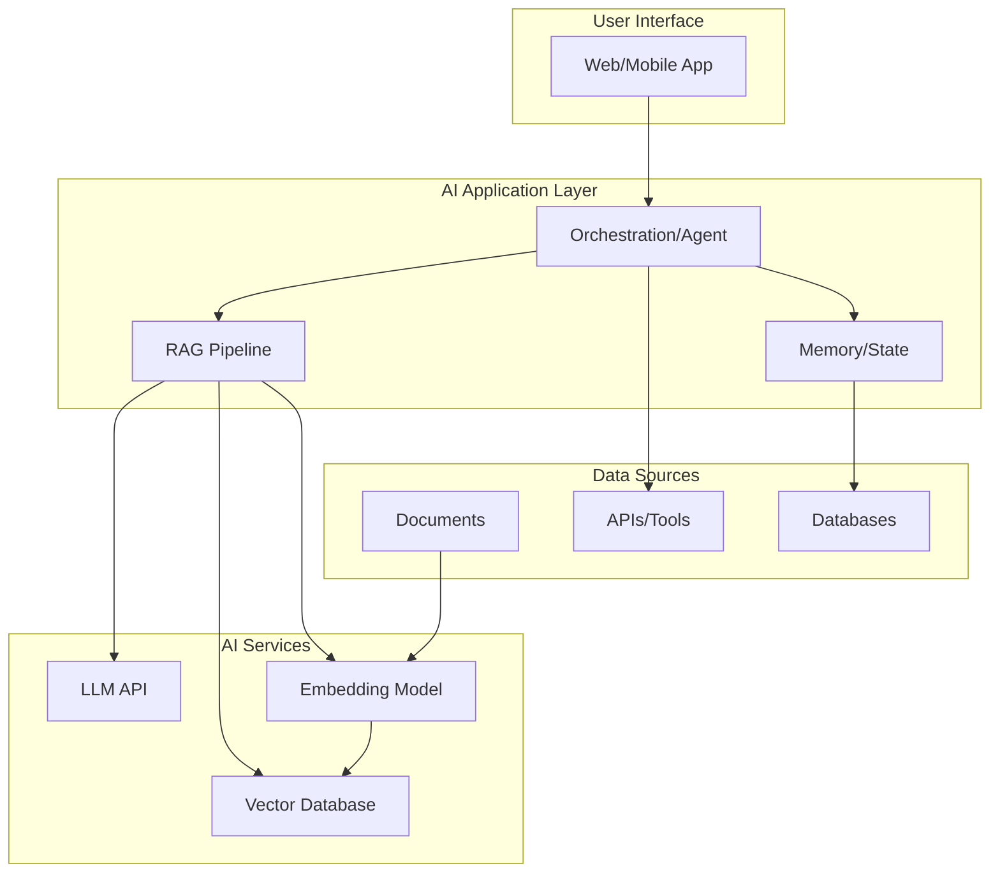
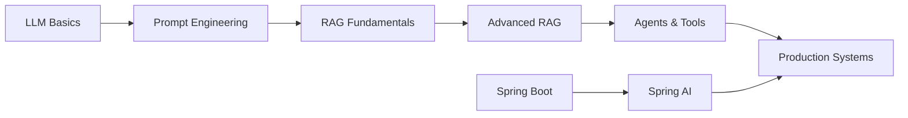

# 🤖 AI & Agents

> **"The best AI engineers understand both the models and the engineering."**

This is the **cutting-edge domain** of modern software engineering. AI is transforming every industry, and mastering these technologies provides a significant competitive advantage.

## 🎯 Why This Matters

The AI landscape is evolving rapidly. This section covers **practical, production-ready** knowledge for building AI-powered applications:

- **LLM Integration** - Connecting applications to powerful language models
- **RAG Systems** - Building knowledge-enhanced AI applications
- **Agent Workflows** - Creating autonomous AI systems that can take actions
- **Java AI Ecosystem** - Bringing AI capabilities to enterprise applications

---

## 📚 Topics Covered

### [LLM Fundamentals](/documentation/docs/ai/llm-fundamentals)
Understanding how large language models work and how to use them effectively.
- Prompt Engineering techniques
- Token economics and context management
- Model selection (GPT-4, Claude, Llama, etc.)
- Fine-tuning vs prompting trade-offs

### [RAG Systems](/documentation/docs/ai/rag)
Retrieval-Augmented Generation - making LLMs smarter with external knowledge.
- Embedding models and vector representations
- Vector databases (Pinecone, Milvus, PgVector)
- Document chunking strategies
- Hybrid search (semantic + keyword)

### [Agentic Workflows](/documentation/docs/ai/agents)
Building AI systems that can reason, plan, and take actions.
- LangChain & LangGraph patterns
- Multi-agent collaboration
- Tool/Function calling
- Memory and state management

### [Spring AI](/documentation/docs/ai/spring-ai)
Enterprise Java AI development.
- Integrating LLMs with Spring Boot
- Building production-ready AI services
- Chat, embedding, and image models
- Output parsing and validation

---

## 🏗️ Architecture Overview

---

## 🔄 Technology Stack

| Layer | Technologies |
|-------|-------------|
| **LLM Providers** | OpenAI, Anthropic, Ollama, Azure OpenAI |
| **Frameworks** | LangChain, LangGraph, Haystack, Spring AI |
| **Vector DBs** | Pinecone, Milvus, Weaviate, PgVector, Chroma |
| **Embedding Models** | OpenAI Ada, BGE, E5, Cohere |
| **Observability** | LangSmith, Weights & Biases, Helicone |

---

## 🎯 Learning Path

---

:::tip Career Advice
AI engineering is the **fastest-growing skill** in tech. Focus on:
1. **Hands-on building** - Theory alone isn't enough
2. **Production challenges** - Latency, cost, reliability
3. **Evaluation** - How to measure AI system quality
4. **Safety** - Responsible AI development
:::
