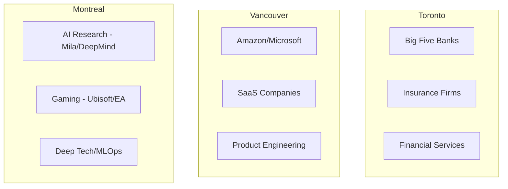
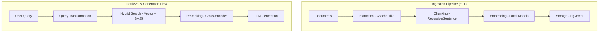
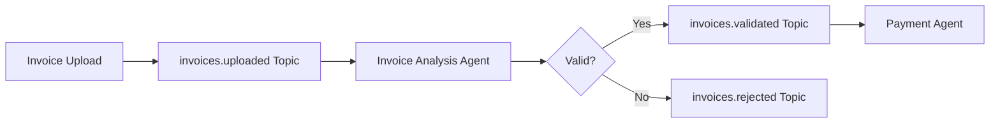

# Strategic Technical Career Roadmap: The 2026 Canadian Java & AI Internship Landscape

> **"The era of generic skills is over. Master the intersection of Enterprise Java and Agentic AI."**

---

## 1. The Macro-Strategic Environment: Canada's 2026 Tech Labor Market

The Canadian technology sector, as it stands in 2026, has matured from a landscape defined by speculative growth into one characterized by engineered efficiency and regulatory compliance. For the international Computer Science undergraduate, the environment is bifurcated: while the aggregate demand for generalist junior developers has softened due to automation and economic consolidation, the specific demand for **"AI-Native Backend Engineers"**—those capable of weaving Large Language Models (LLMs) into the rigid tapestry of enterprise Java systems—has reached an inflection point of acute scarcity.

This report provides a forensic analysis of this niche. It moves beyond generic career advice to offer a granular, evidence-based roadmap for navigating the intersection of Canadian immigration policy, enterprise architecture, and the evolving technical interview gauntlet.

### 1.1 The Immigration and Work Authorization Paradox

The most significant non-technical barrier for international students in 2026 is the evolving regulatory framework managed by Immigration, Refugees and Citizenship Canada (IRCC). Following the intake caps introduced in 2024 and solidified in the 2026–2028 Immigration Levels Plan, the market has seen a reduction in the sheer volume of study permits, stabilizing the intake to approximately **408,000 permits** for 2026.

Employers, particularly outside the major multinational corporations, often operate under a cloud of ambiguity regarding the administrative burden of hiring international students. A prevailing misconception equates "international student" with "LMIA (Labour Market Impact Assessment) liability." However, **co-op placements are explicitly exempt** from this requirement.

:::tip Strategic Scripting for Work Authorization Screening
The ability to articulate the distinction between LMIA requirements and co-op exemptions is as critical as technical competence.
:::

#### Table 1: Strategic Scripting for Work Authorization Screening

| Employer Concern / Query | The "High-Friction" Answer (Avoid) | The "Zero-Risk" Strategic Answer (Recommended) |
|--------------------------|-------------------------------------|------------------------------------------------|
| **"Are you legally authorized to work in Canada?"** | "No, but I can apply for a permit." <br/><br/>*Implication: Uncertainty, delays, and administrative work for HR.* | "Yes. I hold a valid Study Permit and am eligible for the Co-op Work Permit. This is an open work permit tied to my university curriculum, requiring zero sponsorship or LMIA from your organization." |
| **"Will you require sponsorship in the future?"** | "Yes, I hope to get PR eventually." <br/><br/>*Implication: The candidate is a flight risk or a future legal expense.* | "For the entirety of this internship and my subsequent 3-year Post-Graduation Work Permit (PGWP), I have full, independent work authorization. I do not require employer sponsorship to begin or maintain employment." |
| **"What are your working hour restrictions?"** | "I think I can work 20 hours, but full time in summer?" <br/><br/>*Implication: The candidate is unsure of the law, creating compliance risk.* | "As a registered Co-op student, I am authorized by IRCC to work full-time (40+ hours/week) for the duration of the designated work term. I am available without restriction during this period." |

:::info Recommended Resources
- Official IRCC "Work as a co-op student or intern" page
- University of British Columbia's International Student Guide
- Stay updated on "maintained status" clauses for students transitioning between study and work permits
:::

### 1.2 Regional Hiring Dynamics: The "Big Three" Hubs

The demand for Java and AI skills is not distributed uniformly across the Canadian geography. The market is segmented into three distinct clusters, each with a unique industrial personality.



#### Toronto: The Enterprise Fortress

Toronto remains the undisputed financial capital, housing the headquarters of the "Big Five" banks (RBC, TD, Scotiabank, BMO, CIBC) and major insurance firms (Sun Life, Manulife).

| Aspect | Details |
|--------|---------|
| **Technical Persona** | The "Safe Innovator" - prioritizes Java (Spring Boot) for type safety, mature ecosystem, and security features |
| **AI Implementation** | RAG systems for internal knowledge management; strong aversion to sending PII to public LLMs |
| **Hiring Volume** | High - banks have formalized "Technology & Operations" intake streams |
| **Target Companies** | RBC, TD, Scotiabank, Sun Life, Rogers, Telus |

#### Vancouver: The Product & Scale-Up Hub

Vancouver's ecosystem is heavily influenced by the US West Coast, hosting major engineering offices for Amazon, Microsoft, and a vibrant layer of SaaS companies like Clio and Hootsuite.

| Aspect | Details |
|--------|---------|
| **Technical Persona** | The "Product Engineer" - values velocity and user experience; polyglot environments |
| **AI Implementation** | Agentic Workflows - features where AI does work for the user |
| **Hiring Volume** | Moderate to High, highly competitive |
| **Target Companies** | Amazon, Clio, SAP, Hootsuite, Unbounce |

#### Montreal: The Deep Tech & Research Center

Montreal is a global heavyweight in AI research (Mila, Google DeepMind) and the gaming industry (Ubisoft, EA).

| Aspect | Details |
|--------|---------|
| **Technical Persona** | The "Systems Optimizer" - C++ and Python for research, Java/Go for productionization |
| **AI Implementation** | High complexity - optimizing inference latency, managing massive datasets |
| **Cultural Specifics** | Bilingualism is an asset; showing interest in French is a significant cultural signal |
| **Target Companies** | Ubisoft, Autodesk, Morgan Stanley, CAE |

#### Table 2: Regional Skill Prioritization Matrix

| City | Primary Industries | Dominant Tech Stack | AI Focus Area |
|------|-------------------|---------------------|---------------|
| **Toronto** | Finance, Insurance, Telco | Java 21, Spring Boot, Microservices, Angular | Internal RAG, Fraud Detection, Compliance Bots |
| **Vancouver** | SaaS, E-commerce, Cloud | Java, Python, AWS, React, Kafka | Customer Agents, Automated Workflows, Personalization |
| **Montreal** | Gaming, Aerospace, AI Research | C++, Python, Java (MLOps) | Deep Learning, Reinforcement Learning, Simulation |

---

## 2. The Framework War: Spring AI vs. LangChain4j

The most critical technical decision a Java developer faces in 2026 is the choice of orchestration framework. The industry has moved past writing raw HTTP requests to OpenAI APIs; the complexity of modern agents—managing memory, context windows, tools, and RAG pipelines—necessitates a robust framework.

### 2.1 Spring AI: The Enterprise Standard

Spring AI is the official project from the Spring team, designed to make AI integration feel "native" to the Spring ecosystem.

| Aspect | Details |
|--------|---------|
| **Architectural Philosophy** | "Portability and Abstraction" - decouple application code from specific model provider |
| **Key Component** | The **Advisors API** - functions like Spring AOP, allowing transparent interception of chat request/response flow |
| **Target Audience** | Financial institutions and large enterprises in Toronto |

```java
ChatClient.builder(chatModel)
   .defaultAdvisors(new MessageChatMemoryAdvisor(chatMemory))
   .build()
   .prompt("What is my balance?")
   .call();
```

### 2.2 LangChain4j: The Agile Innovator

LangChain4j is the Java port of the popular Python LangChain library. It is community-driven, moves extremely fast, and often implements cutting-edge research papers months before they appear in Spring AI.

| Aspect | Details |
|--------|---------|
| **Architectural Philosophy** | "Feature Parity and Expressiveness" - brings full power of "Agentic" revolution to Java |
| **Key Component** | The **@AiService** - high-level, declarative API using Java Proxy pattern |
| **Target Audience** | Startups and Scale-ups in Vancouver and Montreal |

```java
@AiService
public interface BankingAssistant {
    @SystemMessage("You are a helpful bank teller. If the request is about fraud, use the FraudTool.")
    @UserMessage("Check the status of transaction {{transactionId}}")
    TransactionStatus checkStatus(String transactionId);
}
```

### Table 3: Framework Selection Guide for Interviews

| Feature | Spring AI | LangChain4j | Interview Strategy |
|---------|-----------|-------------|-------------------|
| **Integration** | Native (Starters, Actuator) | Good (Quarkus/Spring Starters) | "I use Spring AI for microservices where observability and standard configuration are paramount." |
| **Simplicity** | High (Opinionated) | Moderate (Flexible) | "I use LangChain4j for rapid prototyping and when I need advanced agent patterns like ReAct." |
| **Agent Support** | Growing (Function Calling) | Mature (ReAct, Plan-and-Execute) | Highlight LangChain4j experience if interview focuses on Autonomous Agents |
| **RAG** | Standard (Advisors) | Advanced (Hybrid Search, Re-ranking) | Discuss LangChain4j's ingestion pipeline for Complex RAG roles |

---

## 3. System Design for AI Agents: The 2026 Architecture

The "System Design" interview for interns has evolved. In 2026, candidates are expected to understand the architecture of LLM Applications.

### 3.1 Advanced RAG Architecture (Java Implementation)

Retrieval-Augmented Generation (RAG) is the standard solution for the "hallucination" problem. A production implementation requires a sophisticated pipeline.



#### The Ingestion Pipeline (ETL)

| Stage | Description | Best Practices |
|-------|-------------|----------------|
| **Extraction** | Using Apache Tika to parse PDFs, Word docs, HTML | Handle encoding issues |
| **Chunking** | Splitting documents for embedding | Use Recursive Character Splitter with 50-token overlap |
| **Embedding** | Converting text to vectors | Prefer local models (ONNX) for privacy |
| **Storage** | Vector database | PgVector (PostgreSQL) for enterprise compliance |

#### The Retrieval & Generation Flow (Online)

1. **Query Transformation** - Rewrite vague queries for better search intent
2. **Hybrid Search** - Vector + BM25/Keyword for exact matches
3. **Re-ranking** - Cross-encoder model for precision before sending top 5 to LLM

### 3.2 Event-Driven Agentic Architecture (Kafka + AI)

The cutting edge of 2026 architecture is the Event-Driven Agent. Instead of synchronous HTTP, agents communicate asynchronously via Apache Kafka.



:::info Why This Matters
This architecture allows massive scalability. You can run 50 instances of the Invoice Agent to handle traffic spikes without overwhelming the Payment Agent. Perfect for microservices philosophy.
:::

---

## 4. The Interview Gauntlet: Banks vs. Startups

### 4.1 The "Big Five" Bank Interview (TD, RBC, BMO, CIBC, Scotiabank)

| Aspect | Details |
|--------|---------|
| **Primary Filter** | Risk & Compliance - "Will this person break the build, leak data, or cause a compliance incident?" |
| **Platform** | HackerRank or Codility |
| **Language** | Often locked to Java |
| **Topics** | String manipulation, Arrays, HashMaps |
| **Trap** | Failing to handle "Edge Cases" (null inputs, empty files) |

**Technical Knowledge Focus:**
- Spring Boot: Dependency Injection, Scope, @Transactional
- Security: API key handling, PII masking
- Testing: JUnit and Mockito (writing tests during interview = top 10%)

### 4.2 The Startup/Scale-Up Interview (Clio, Wealthsimple, Cohere)

| Aspect | Details |
|--------|---------|
| **Primary Filter** | Velocity & Product Sense - "Can this person build a feature end-to-end without hand-holding?" |
| **Platform** | CoderPad (Live Pair Programming) or Take-Home Project |
| **Language** | Polyglot allowed, Java/Kotlin preferred for backend |
| **Style** | Practical application - "Call this weather API, parse JSON, cache result" |
| **Trap** | Over-engineering - Build MVP first, then optimize |

**System Design Focus:**
- Latency and UX - "How do we stream LLM response?" (Answer: SSE)
- Cost - "How do we prevent LLM budget burn?" (Answer: Token limits, Redis caching)

### Table 4: Interview Preparation Matrix

| Metric | Bank Strategy | Startup Strategy |
|--------|---------------|------------------|
| **Code Structure** | Verbose, Enterprise patterns (DTOs, Service Layer) | Clean, Concise, Functional style |
| **Key Concepts** | ACID compliance, Thread safety, PII protection | Eventual consistency, API Latency, UX |
| **Behavioral** | Strict STAR method. Focus on "Conflict Resolution" and "Process" | Conversational. Focus on "Ownership," "Learning," and "Passion" |
| **Tools to Use** | Eclipse/IntelliJ (Community), Maven | IntelliJ (Ultimate), Docker, Gradle |

---

## 5. Strategic Portfolio Development: Resume & Projects

In a market saturated with generic "Chat with PDF" tutorials, your portfolio must demonstrate Enterprise Complexity.

### 5.1 Resume Keyword Optimization

Applicant Tracking Systems (ATS) scan for specific "clusters" of skills.

**The "Java AI Engineer" Keyword Cluster:**
- **Core:** Java 21, Spring Boot 3, REST API, Microservices, Hibernate/JPA, Maven, Junit 5
- **AI/LLM:** RAG, Vector Database (PgVector, Milvus), Embeddings, Prompt Engineering, Function Calling, LangChain4j, Spring AI
- **Infrastructure:** Docker, Kubernetes, Kafka, Redis, PostgreSQL, Git, CI/CD (GitHub Actions)

:::tip Insight
Do not list generic terms like "AI" or "Machine Learning." Be specific: "Implemented RAG pipeline using Spring AI and PgVector."
:::

### 5.2 Three Unique "Java + AI" Capstone Projects

#### Project 1: "FinAgent" – The Transactional Banking Assistant

**Target:** Banks (TD, RBC)

**Concept:** A secure banking assistant that doesn't just chat, but performs actions. "Transfer $50 to Alice."

**Tech Stack:** Java 21, Spring Boot, Spring AI, PostgreSQL

**Key Feature:** Tool Calling with OAuth2 Guardrails
```java
@Tool
public TransferResult transferMoney(String to, BigDecimal amount) {
    // Check SCOPE_WRITE permission before execution
    // Human-in-the-loop for transfers over $100
}
```

**Interview Story:** "I built an agent that executes financial transactions, but I implemented a 'Human-in-the-Loop' confirmation step for any transfer over $100 to prevent AI hallucinations from draining accounts."

#### Project 2: "EventFlow" – The Event-Driven Customer Support Bot

**Target:** Scale-ups (Shopify, Clio)

**Tech Stack:** Java, LangChain4j, Apache Kafka, Redis

**Architecture:**
- Service A (Ingestion) → tickets.new topic
- Service B (Triage Agent) → analyzes sentiment, routes to tickets.urgent or tickets.routine
- Service C (Auto-Responder) → generates draft reply

**Interview Story:** "Show how you can spin up 10 instances of the Triage Agent to handle a burst of traffic. This proves you understand distributed systems."

#### Project 3: "CodeGraph" – Semantic Code Search for Developers

**Target:** Developer Tooling Companies / Deep Tech

**Tech Stack:** Java, Spring Boot, Neo4j (Graph Database)

**Key Feature:** GraphRAG - Use a Knowledge Graph to map relationships between classes and methods

**Interview Story:** "Standard vector search failed to understand the inheritance hierarchy of the code, so I implemented a GraphRAG approach using Neo4j to capture the structural relationships."

---

## 6. Comprehensive Preparation Syllabus (4-Week Boot Camp)

### Table 5: 4-Week Execution Plan

| Week | Focus Area | Daily Tasks & Milestones | Recommended Tools/Textbooks |
|------|------------|--------------------------|----------------------------|
| **Week 1** | The Enterprise Java Core | Mon-Tue: Java 21 features (Records, Pattern Matching, Virtual Threads)<br/>Wed-Thu: Spring Boot 3 (DI, AOP, Transaction Management)<br/>Fri-Sun: Build Project 1 (FinAgent) Skeleton | "Modern Java in Action" (Manning)<br/>Spring Academy (Free courses)<br/>IntelliJ IDEA Community |
| **Week 2** | AI Engineering & Frameworks | Mon-Tue: Spring AI deep dive. Implement Advisors<br/>Wed-Thu: RAG Implementation. Setup PgVector<br/>Fri-Sun: LeetCode "Top 75" (Arrays & Strings) | Spring AI Reference Documentation<br/>DeepLearning.AI "Building Systems with LLMs"<br/>Ollama (local LLM testing) |
| **Week 3** | System Design & Architecture | Mon-Tue: Kafka Fundamentals (Producers, Consumers, Groups)<br/>Wed-Thu: Build Project 2 (EventFlow)<br/>Fri-Sun: System Design Practice | "System Design Interview Vol 2" (Alex Xu)<br/>"Kafka: The Definitive Guide"<br/>Excalidraw (diagrams) |
| **Week 4** | Interview Polish & Application | Mon: Resume Finalization<br/>Tue: Behavioral Prep (5 STAR stories)<br/>Wed: Mock Interview<br/>Thu-Fri: Apply to 20 roles<br/>Weekend: LeetCode "Blind 75" Review | "Cracking the Coding Interview"<br/>Levels.fyi (salary/interview data)<br/>LinkedIn (Networking) |

---

## 6.1 Conclusion

The 2026 internship market is a crucible that separates the "coders" from the "engineers." The era of generic skills is over. By mastering the intersection of Enterprise Java and Agentic AI, and by navigating the immigration landscape with strategic precision, the international student transforms from a passive applicant into a high-value asset.

The demand for this specific skill set—the ability to build reliable, secure, and intelligent systems—is the defining characteristic of the Canadian tech sector for the decade to come.

:::success Key Takeaway
Drive your preparation with this architectural blueprint, and the results will follow.
:::
