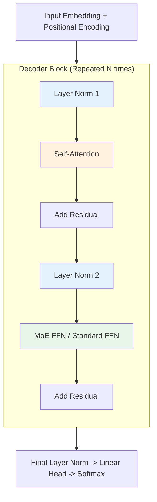
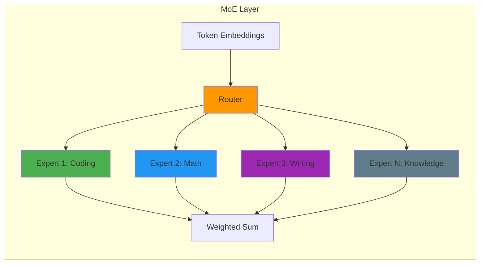

# Transformer Architecture: The Engine of LLMs

> **"The Transformer is the first sequence transduction model relying entirely on attention."** — Vaswani et al. (2017)

To pass an LLM interview, simply knowing "it uses attention" is not enough. You must understand *why* specific design choices were made (Pre-Norm vs Post-Norm, SwiGLU vs ReLU, GQA vs MHA, MoE vs Dense) and the mathematical operations inside the block.

---

## 1. The High-Level View

A modern Decoder-Only Transformer (like GPT-4 or Llama 3) consists of a stack of identical blocks. Each block has two main sub-layers:
1. **Multi-Head Self-Attention (MHA)**: Mixing information between tokens.
2. **Feed-Forward Network (FFN)**: Processing information within each token independently.

Critically, these are wrapped in **Residual Connections** and **Layer Normalization**.



**2025 Evolution**:
- **FFN → MoE**: Many models now use Mixture-of-Experts for the feed-forward layer
- **MHA → GQA**: Grouped-Query Attention reduces KV cache memory
- **Standard → Hybrid**: Some models mix Transformer with State Space Models (Mamba)

---

## 2. Self-Attention: The "Routing" Layer

Attention allows tokens to "talk" to each other. It asks specific questions to build context.

### The Query, Key, Value Intuition
Every token produces three vectors:
- **Query (Q)**: "What am I looking for?" (e.g., a noun looking for its adjective).
- **Key (K)**: "What do I contain?" (e.g., I am an adjective).
- **Value (V)**: "If you attend to me, here is my information."

### The Math
$$
\text{Attention}(Q, K, V) = \text{softmax}\left(\frac{QK^T}{\sqrt{d_k}}\right)V
$$

1. **$QK^T$ (Similarity)**: Computes a score for every pair of tokens. High score = high relevance.
2. **$\frac{1}{\sqrt{d_k}}$ (Scaling)**: Prevents dot products from exploding, which would cause vanishing gradients in softmax.
3. **Softmax**: 0-1 Normalization.
4. **$ \cdot V$**: Weighted sum of the Value vectors.

### Why Multi-Head?
One head might focus on **syntax** (noun-verb agreement). Another might focus on **semantics** (synonyms). Another might look at **position** (previous word).

| Model | Heads | Head Dimension | Total Dimension |
|-------|-------|----------------|-----------------|
| **Llama 3 8B** | 32 | 128 | 4,096 |
| **Llama 3 70B** | 64 | 128 | 8,192 |
| **GPT-4** | 96+ (est.) | 128 | 12,288 |

---

## 3. Grouped Query Attention (GQA) - **The 2025 Standard**

As context windows grew (8k → 128k → 1M+), the **KV Cache** became a memory bottleneck. Storing Key and Value matrices for every head is expensive.

### The Spectrum: MHA → GQA → MQA

| Mechanism | Query Heads | KV Heads | KV Cache Size | Quality | Speed |
|-----------|-------------|-----------|----------------|---------|-------|
| **MHA** (Multi-Head) | H | H | 100% | Best | Slowest |
| **GQA** (Grouped-Query) | H | G (where G < H) | ~1/G | Near-best | Faster |
| **MQA** (Multi-Query) | H | 1 | 1/H | Lower | Fastest |

### How GQA Works

Instead of each head having its own K/V projections, groups of query heads share K/V:

```python
# MHA: 32 heads, 32 KV pairs
q_heads = 32
kv_heads = 32

# GQA: 32 query heads, 8 KV pairs (groups of 4)
q_heads = 32
kv_heads = 8  # Each KV pair serves 4 query heads
```

**Benefits**:
- **Memory reduction**: 8x less KV cache for GQA-8
- **Bandwidth reduction**: Less memory transfer during inference
- **Quality retention**: GQA-8 achieves ~98-99% of MHA quality

**Adoption**:
- **Llama 3 70B**: Uses GQA for efficient inference
- **T5-XXL**: GQA-8 for production deployment
- **Gemini 2.5**: Uses GQA variants for long context

### 2025: Weighted GQA (WGQA)

**Innovation**: Learnable parameters for each K/V head enable weighted averaging during fine-tuning.

**Benefits**:
- 0.53% average improvement over standard GQA
- Converges to MHA quality with no inference overhead
- Model learns optimal grouping during training

---

## 4. Mixture-of-Experts (MoE) - **The Scaling Revolution**

Instead of one monolithic feed-forward network, MoE uses multiple specialized "expert" networks. Each token is routed to the most relevant experts.

### Architecture



### Key Components

1. **Router**: Gating network that selects top-k experts for each token
2. **Experts**: Specialized FFN networks (typically 8-64 per layer)
3. **Load Balancing**: Auxiliary loss ensures all experts are utilized

### 2025 MoE Models

| Model | Total Params | Active Params | Experts | Top-K | Notes |
|-------|-------------|---------------|---------|-------|-------|
| **Mixtral 8x7B** | 46.7B | 13B | 8 | 2 | Open-source, matches Llama 2 70B |
| **Llama 4** | TBD | TBD | TBD | TBD | MoE variant rumored |
| **DeepSeek-V3** | 671B | 37B | 256 | 8 | Shared experts, diverse routing |
| **GPT-4** | ~1.7T (est.) | ~220B (est.) | ~128 (est.) | TBD | MoE widely suspected |
| **Switch Transformer** | 1.6T | TBD | 2048 | 1 | Research milestone |
| **GLaM** | 1.2T | TBD | 64 | 2 | Google's trillion-parameter model |

### Why MoE Matters

**Training Efficiency**:
- Same quality as dense model with **1/3 the compute** (GLaM result)
- Allows scaling to trillions of parameters
- **Carbon footprint**: Up to 10x reduction vs dense models

**Inference Efficiency**:
- Only activates relevant experts per token
- **70B parameters with 13B active** = 8B model speed with 70B quality
- Enables massive models on consumer hardware (with quantization)

**Training Stability (2025 Advances)**:
- **Router Z-loss**: Penalizes large router logits, stabilizing training
- **Shared experts**: Reduces redundancy, increases diversity
- **Sigmoid gating**: More stable than softmax for expert selection

### MoE vs Dense FFN

| Aspect | Dense FFN | MoE |
|--------|-----------|-----|
| **Parameters** | Fixed per layer | Scales with experts |
| **Compute** | Always active | Sparse activation |
| **Quality** | Baseline | Same or better |
| **Inference** | Predictable | Variable (depends on routing) |
| **Training** | Stable | Requires tricks (Z-loss, aux loss) |

---

## 5. Pre-Norm vs. Post-Norm

This is a classic evolution in LLM history.

### Post-Norm (Original Transformer, BERT)
LayerNorm is applied *after* the residual connection.
$$ x = \text{LayerNorm}(x + \text{Sublayer}(x)) $$
- **Issue**: Gradients can explode near the output layers during initialization, requiring a "warm-up" stage.

### Pre-Norm (GPT-2, Llama, PaLM)
LayerNorm is applied *before* the sublayer.
$$ x = x + \text{Sublayer}(\text{LayerNorm}(x)) $$
- **Benefit**: Gradients flow through the "residual highway" (the simple `$+$` path) untouched. Training is much more stable at scale.
- **Trade-off**: Potentially slightly less expressive (theoretical debate), but stability wins for LLMs.

**2025 Consensus**: Pre-Norm is universal for decoder-only LLMs. Post-Norm still used in some encoder-decoder models (T5).

---

## 6. Feed-Forward Networks (FFN) & MoE: The "Knowledge" Layer

If Attention is "routing" information, the FFN (or MoE) is "processing" it. Some researchers posit that FFNs act as **Key-Value Memories** storing factual knowledge.

### Evolution of Activations
1. **ReLU** (Original): $\max(0, x)$. Problem: "Dead neurons" (zero gradient).
2. **GELU** (GPT-2/3): Gaussian Error Linear Unit. Smoother, probabilistic.
3. **SwiGLU** (PaLM, Llama): Swish-Gated Linear Unit.

### What is SwiGLU?
It adds a "gate" to the FFN. Instead of just passing data through, we compute two paths and multiply them.

$$
\text{SwiGLU}(x) = (xW_1 \cdot \text{Sigmoid}(xW_1)) \otimes (xW_2)
$$

It requires 3 matrix multiplications instead of 2, but consistently yields better performance for the same compute budget.

### MoE as FFN Replacement

**Standard Transformer Block**:
```
Attention → Dense FFN → Output
```

**MoE Transformer Block**:
```
Attention → Router → Selected Experts → Combined Output
```

Each expert is a specialized FFN:
- Expert 1: Specializes in coding patterns
- Expert 2: Specializes in mathematical reasoning
- Expert 3: Specializes in factual knowledge
- Expert 4-8: Other specializations

---

## 7. Linear Attention & Hybrid Architectures

### Linear Attention (2020+)

**Problem**: Standard attention has $O(N^2)$ complexity due to the $QK^T$ matrix.

**Solution**: Use kernel functions to approximate attention without explicit $N \times N$ matrix.

$$
\text{LinearAttention}(Q, K, V) = \phi(Q) \cdot (\phi(K)^T \cdot V)
$$

Where $\phi(x) = \text{elu}(x) + 1$ (element-wise linear unit).

**Benefits**:
- **$O(N)$ complexity** instead of $O(N^2)$
- Enables truly massive context windows (1M+ tokens)
- **Trade-off**: Slight quality degradation

**Adoption**:
- **RWKV**: Recurrent architecture with linear attention
- **Mamba/State Space Models**: Linear complexity by design
- **Hybrid models**: Mix Transformer and linear attention layers

### 2025: Higher-Order Attention (Nexus)

**Innovation**: Query and Key vectors are outputs of nested self-attention loops.

**Benefits**:
- Captures multi-hop relationships in single layer
- More expressive than standard first-order attention
- Enables complex reasoning without deep stacks

**Status**: Research stage, not yet production in major LLMs.

---

## 8. Positional Encodings Revisited

### RoPE (Rotary Positional Embeddings) - **Gold Standard**

Used by **Llama 2/3/4, PaLM, Mistral, GPT-NeoX**.

- **Intuition**: Encode position by **rotating** the vector in space.
- **Mechanism**:
    - Tokens at position $m$ are rotated by angle $m\theta$.
    - The dot product (similarity) between two tokens depends only on their relative distance ($m-n$).
- **Why it wins**:
    - **Decay**: Attention naturally decays as tokens get further apart (long-term dependency management).
    - **Extrapolation**: It handles context lengths longer than training data better than absolute embeddings.

### 2025: PaTH Attention

**Innovation**: Treats in-between words as a path of data-dependent transformations (Householder reflections).

**Benefits**:
- **Positional memory**: Tracks state changes across sequences
- **Better sequential reasoning**: Improved code execution tracking
- **Selective forgetting**: Combined with Forgetting Transformers (FoX) to down-weight old info

**Status**: Cutting-edge research, not yet in production models.

---

## 9. Interview FAQ

<details>
<summary><strong>Q: What is the computational complexity of Self-Attention?</strong></summary>

**A:** $O(N^2)$ where $N$ is the sequence length.
- Computing $QK^T$ results in an $N \times N$ matrix.
- This is why long context (100k+) is hard; doubling context quadruples compute.
- **2025 Solutions**:
  - **FlashAttention-2**: Optimizes IO but still $O(N^2)$ mathematically
  - **Linear Attention**: $O(N)$ complexity, slight quality trade-off
  - **Ring Attention**: Distributed across GPUs, enables 1M+ context
  - **Sliding Window**: Only attend to nearby tokens + global cache
</details>

<details>
<summary><strong>Q: Why do we need Layer Normalization?</strong></summary>

**A:** To stabilize the distribution of activations across deep networks and ensuring that no single feature dominates magnitude-wise. Without it, gradients would explode or vanish in a network with 100+ layers.

**2025 Update**: RMSNorm (Root Mean Square Normalization) is replacing LayerNorm in many models (Llama, Gemma) because it's simpler and faster:
$$ \text{RMSNorm}(x) = \frac{x}{\sqrt{\text{mean}(x^2) + \epsilon}} \cdot \gamma $$
</details>

<details>
<summary><strong>Q: How does a Decoder-only model prevent "cheating" during training?</strong></summary>

**A:** Through **Causal Masking**. In the self-attention step, we set the attention scores for all future tokens (positions $j > i$) to $-\infty$. When passed through softmax, these become 0, ensuring token $i$ can only attend to $0...i$.

**Implementation**:
```python
# Create causal mask
mask = torch.triu(torch.ones(seq_len, seq_len), diagonal=1)
# Apply to attention scores
scores = scores.masked_fill(mask.bool(), float('-inf'))
```
</details>

<details>
<summary><strong>Q: What is the purpose of the Residual (Skip) Connection?</strong></summary>

**A:** It mitigates the vanishing gradient problem. By allowing gradients to flow directly through the network via addition ($x + f(x)$), errors can backpropagate from the last layer to the first without being diminished by multiple multiplication steps.

**2025 Insight**: Residual connections also enable **gradient checkpointing**, trading compute for memory during training.
</details>

<details>
<summary><strong>Q: When should I use GQA vs MHA vs MQA?</strong></summary>

**A:**

**Use MHA** when:
- Quality is paramount (research, benchmarks)
- Context window is short (< 8k tokens)
- Memory is not a constraint

**Use GQA** when:
- **Default choice** for production LLMs in 2025
- Long context (32k-128k tokens)
- Memory-constrained deployment
- Want near-MHA quality with faster inference

**Use MQA** when:
- Maximal throughput is required
- Can accept 5-10% quality degradation
- Very large batch inference (e.g., API serving)

**2025 Verdict**: GQA-8 or GQA-4 is the sweet spot for most applications.
</details>

<details>
<summary><strong>Q: What causes training instability in MoE models?</strong></summary>

**A:** Three main issues:

1. **Router collapse**: All tokens route to the same expert, leaving others unused
   - **Fix**: Auxiliary load-balancing loss, expert capacity factor

2. **Expert overflow**: Expert receives more tokens than its capacity factor allows
   - **Fix**: Drop tokens or route to next layer

3. **Gradient imbalance**: Some experts receive much larger gradients than others
   - **Fix**: Router Z-loss, normalized expert losses

**2025 Solutions**:
- **Shared experts**: Reduces redundancy, improves load balancing
- **Sigmoid gating**: More stable than softmax for expert selection
- **Stable MoE training**: Warm-up periods, gradual expert activation
</details>

<details>
<summary><strong>Q: How does RoPE differ from absolute positional embeddings?</strong></summary>

**A:** **Absolute embeddings** add a fixed vector $P_i$ to token at position $i$:
$$ x_i' = x_i + P_i $$
Position is encoded as a fixed property of the token.

**RoPE** rotates the query and key vectors based on position:
$$ q_i' = q_i \cdot e^{im\theta} $$
$$ k_j' = k_j \cdot e^{jm\theta} $$

The dot product $q_i' \cdot k_j'$ depends only on relative distance $(j-i)$, not absolute positions.

**Benefits**:
- Better extrapolation to longer sequences
- Natural decay of attention with distance
- No learned positional parameters

**2025 Dominance**: RoPE is used in almost all decoder-only LLMs (Llama, GPT-4, PaLM, Mistral).
</details>

---

## Summary for Interviews

1. **Transformer blocks** consist of Multi-Head Attention + FFN, wrapped in residuals and normalization.
2. **Self-attention** computes similarity between all token pairs via $QK^T$, scaled by $\frac{1}{\sqrt{d_k}}$.
3. **Multi-head attention** allows different heads to focus on different aspects (syntax, semantics, position).
4. **Pre-norm** (LayerNorm before sublayer) is standard for decoder-only LLMs; more stable than post-norm.
5. **GQA** (Grouped-Query Attention) is the 2025 standard: reduces KV cache by 4-8x with minimal quality loss.
6. **MoE** (Mixture-of-Experts) enables scaling to trillions of parameters by activating only relevant experts per token.
7. **RoPE** (Rotary Positional Embeddings) dominates for position encoding; enables better extrapolation to long contexts.
8. **SwiGLU** activation outperforms ReLU/GELU for LLMs; adds gating mechanism to FFN.
9. **Linear attention** variants enable $O(N)$ complexity for 1M+ token contexts; used in hybrid models.
10. **2025 architecture trends**: MoE for scaling, GQA for efficiency, RoPE for positioning, hybrid (Transformer + SSM) for long context.

:::tip Implementation Resources
For hands-on practice:

**1. Study GQA implementations**:
- [Llama 3 architecture](https://llama.meta.com/)
- [Grouped Query Attention paper](https://arxiv.org/abs/2305.13245)

**2. Explore MoE models**:
- [Mixtral 8x7B (Hugging Face)](https://huggingface.co/mistralai/Mixtral-8x7B-v0.1)
- [Switch Transformer](https://arxiv.org/abs/2101.03961)

**3. Build intuition with attention viz**:
- [BertViz](https://github.com/jessevig/bertviz) - Attention visualization
- [Transformer Explainer](https://poloclub.github.io/transformer-explainer/) - Interactive attention math

**4. Experiment with RoPE**:
- [RoPE implementation in PyTorch](https://github.com/facebookresearch/llama/blob/main/llama/model.py#L360)
:::
