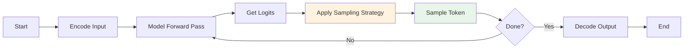
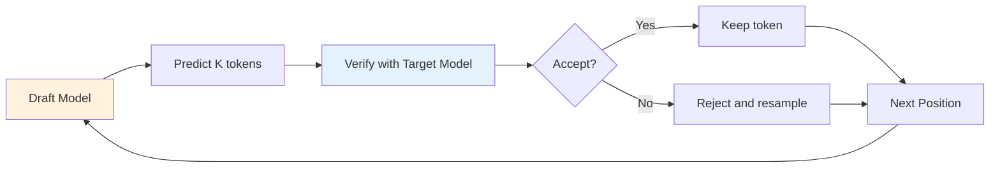
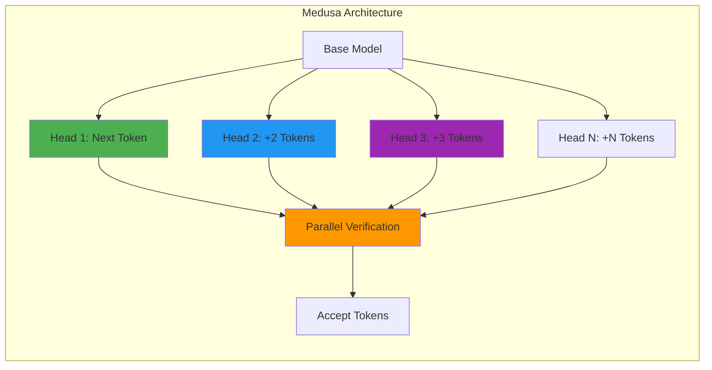
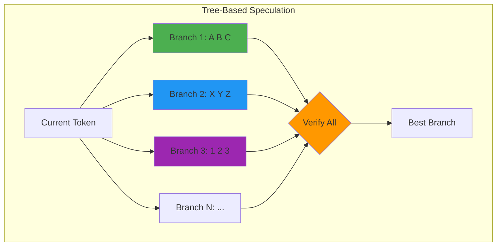

# Inference - Controlling Output Quality

> **"Inference transforms probability distributions into coherent text through strategic token selection."**

Training builds the model, but inference determines its output. Understanding decoding strategies, sampling parameters, and optimization techniques is essential for controlling model behavior in production. This document covers autoregressive generation, decoding algorithms, sampling parameters, and performance optimization techniques for deploying LLMs at scale.

---

## Autoregressive Generation

### The Generation Loop

LLMs generate text autoregressively - one token at a time, with each new token conditioned on all previous tokens.



### Basic Implementation

```python
import torch
import torch.nn.functional as F

def generate_autoregressive(
    model,
    input_ids: torch.Tensor,
    max_new_tokens: int = 100,
    temperature: float = 1.0,
    top_k: int = None,
    top_p: float = 1.0,
    eos_token_id: int = None
) -> torch.Tensor:
    """
    Generate tokens autoregressively.

    Args:
        model: Language model
        input_ids: Input token IDs (batch, seq_len)
        max_new_tokens: Maximum tokens to generate
        temperature: Sampling temperature
        top_k: Keep top k tokens
        top_p: Nucleus sampling threshold
        eos_token_id: End-of-sequence token ID
    """
    batch_size, seq_len = input_ids.shape
    current_ids = input_ids.clone()

    for step in range(max_new_tokens):
        # Forward pass
        with torch.no_grad():
            outputs = model(current_ids)
            logits = outputs.logits[:, -1, :]  # (batch, vocab_size)

        # Apply temperature
        logits = logits / temperature

        # Apply top-k filtering
        if top_k is not None:
            top_k_logits, top_k_indices = torch.topk(logits, top_k)
            logits = torch.full_like(logits, float('-inf'))
            logits.scatter_(1, top_k_indices, top_k_logits)

        # Apply top-p (nucleus) filtering
        if top_p < 1.0:
            sorted_logits, sorted_indices = torch.sort(logits, descending=True)
            cumulative_probs = torch.cumsum(F.softmax(sorted_logits, dim=-1), dim=-1)

            # Remove tokens with cumulative probability above threshold
            sorted_indices_to_remove = cumulative_probs > top_p
            sorted_indices_to_remove[..., 1:] = sorted_indices_to_remove[..., :-1].clone()
            sorted_indices_to_remove[..., 0] = False

            indices_to_remove = sorted_indices_to_remove.scatter(1, sorted_indices, sorted_indices_to_remove)
            logits[indices_to_remove] = float('-inf')

        # Sample token
        probs = F.softmax(logits, dim=-1)
        next_token = torch.multinomial(probs, num_samples=1)  # (batch, 1)

        # Append to sequence
        current_ids = torch.cat([current_ids, next_token], dim=1)

        # Check for EOS
        if eos_token_id is not None and (next_token == eos_token_id).all():
            break

    return current_ids

# Usage
input_text = "The future of AI is"
input_ids = tokenizer.encode(input_text, return_tensors="pt")
output_ids = generate_autoregressive(model, input_ids, max_new_tokens=50, temperature=0.8)
output_text = tokenizer.decode(output_ids[0], skip_special_tokens=True)
print(output_text)
```

---

## Decoding Strategies

### Strategy Comparison

| Strategy | Description | Speed | Quality | Diversity | Best For |
|----------|-------------|-------|---------|-----------|----------|
| **Greedy Search** | Always pick highest probability | Fastest | Good for facts | None | Factual QA, code |
| **Beam Search** | Keep top k hypotheses | Slow | High quality | Low | Translation, summarization |
| **Sampling** | Sample from probability distribution | Fast | Variable | High | Creative writing |
| **Nucleus (Top-p)** | Sample from smallest top mass | Fast | Good | High | General chat, assistants |
| **Top-k** | Sample from top k tokens | Fast | Good | Medium-High | Balanced generation |
| **Contrastive** | Balance prob + degeneration penalty | Medium | Very high | Medium | Long-form content |
| **MCTS** | Tree search with lookahead | Very slow | Best | Medium | Complex reasoning |

### Greedy Search

```python
def greedy_search(model, input_ids: torch.Tensor, max_new_tokens: int) -> torch.Tensor:
    """
    Greedy decoding: always select the most likely token.
    """
    current_ids = input_ids.clone()

    for _ in range(max_new_tokens):
        outputs = model(current_ids)
        next_token = outputs.logits[:, -1, :].argmax(dim=-1, keepdim=True)
        current_ids = torch.cat([current_ids, next_token], dim=1)

    return current_ids

# Example: Greedy might repeat "The the the the..." if it gets stuck
```

### Beam Search

```python
def beam_search(
    model,
    input_ids: torch.Tensor,
    max_new_tokens: int,
    num_beams: int = 4,
    length_penalty: float = 1.0
) -> torch.Tensor:
    """
    Beam search: keep top-k hypotheses at each step.

    Args:
        model: Language model
        input_ids: Input token IDs
        max_new_tokens: Maximum tokens to generate
        num_beams: Number of beams to track
        length_penalty: Penalize short sequences (1.0 = no penalty)
    """
    batch_size = input_ids.shape[0]
    input_ids = input_ids.repeat_interleave(num_beams, dim=0)

    # Initialize beams
    beam_scores = torch.zeros(batch_size * num_beams, device=input_ids.device)
    beam_scores[1::num_beams] = float('-inf')  # Only first beam is valid

    for step in range(max_new_tokens):
        outputs = model(input_ids)
        next_token_logits = outputs.logits[:, -1, :]
        next_token_scores = F.log_softmax(next_token_logits, dim=-1)

        # Add beam scores
        vocab_size = next_token_scores.shape[-1]
        next_scores = beam_scores.unsqueeze(-1) + next_token_scores

        # Reshape for top-k selection
        next_scores = next_scores.view(batch_size, num_beams * vocab_size)
        next_scores, next_tokens = torch.topk(next_scores, k=num_beams, dim=-1)

        # Convert flat indices to (beam, token) pairs
        beam_indices = next_tokens // vocab_size
        token_indices = next_tokens % vocab_size

        # Update beams
        input_ids = input_ids.view(batch_size, num_beams, -1)
        input_ids = input_ids[torch.arange(batch_size).unsqueeze(-1), beam_indices]
        input_ids = input_ids.reshape(batch_size * num_beams, -1)

        next_token_ids = token_indices.view(-1, 1)
        input_ids = torch.cat([input_ids, next_token_ids], dim=-1)

        beam_scores = next_scores.view(-1)

    # Select best beam
    input_ids = input_ids.view(batch_size, num_beams, -1)
    best_beam_indices = beam_scores.view(batch_size, num_beams).argmax(dim=-1)
    output_ids = input_ids[torch.arange(batch_size), best_beam_indices]

    return output_ids

# Example usage
output = beam_search(model, input_ids, max_new_tokens=50, num_beams=4)
```

### Contrastive Search

Contrastive search combines probability modeling with degeneration penalty:

```python
def contrastive_search(
    model,
    input_ids: torch.Tensor,
    max_new_tokens: int,
    top_k: int = 5,
    alpha: float = 0.6,
    momentum: float = 0.5
) -> torch.Tensor:
    """
    Contrastive search: balance probability and similarity to context.

    Args:
        model: Language model
        input_ids: Input tokens
        max_new_tokens: Maximum tokens to generate
        top_k: Number of candidates to consider
        alpha: Penalty for repetition (0 = pure sampling, 1 = pure degeneration penalty)
        momentum: Weight for updating cumulative probability

    Reference:
        Su, J., et al. (2022). "A Contrastive Framework for Neural Text Generation"
        https://arxiv.org/abs/2202.01855
    """
    current_ids = input_ids.clone()
    cumulative_probs = None

    for _ in range(max_new_tokens):
        # Forward pass
        with torch.no_grad():
            outputs = model(current_ids)
            logits = outputs.logits[:, -1, :]
            hidden_states = outputs.hidden_states[-1][:, -1, :]  # Last layer hidden state

        # Get top-k candidates
        top_k_logits, top_k_indices = torch.topk(logits, top_k)
        top_k_probs = F.softmax(top_k_logits, dim=-1)

        # Compute model confidence (probability mass)
        model_confidence = top_k_probs.max(dim=-1)[0]

        # Compute degeneration penalty (similarity to previous tokens)
        # Use cosine similarity between current hidden state and previous states
        prev_hidden = outputs.hidden_states[-1][:, :-1, :]  # All previous hidden states

        # Compute similarity with most recent tokens
        if prev_hidden.size(1) > 0:
            # Similarity with last few tokens (local context)
            recent_hidden = prev_hidden[:, -min(5, prev_hidden.size(1)):, :]
            similarities = F.cosine_similarity(
                hidden_states.unsqueeze(1),
                recent_hidden,
                dim=-1
            ).max(dim=1)[0]
            degeneration_penalty = similarities.max()
        else:
            degeneration_penalty = torch.tensor(0.0)

        # Update cumulative probability
        if cumulative_probs is None:
            cumulative_probs = model_confidence
        else:
            cumulative_probs = momentum * cumulative_probs + (1 - momentum) * model_confidence

        # Select token that maximizes: (1-alpha) * probability - alpha * degeneration
        # For each top-k token, compute the score
        scores = (1 - alpha) * top_k_probs - alpha * degeneration_penalty

        # Select best token
        best_idx = scores.argmax(dim=-1)
        next_token = top_k_indices[range(len(best_idx)), best_idx].unsqueeze(-1)

        current_ids = torch.cat([current_ids, next_token], dim=1)

    return current_ids
```

### MCTS (Monte Carlo Tree Search) Decoding

For tasks requiring deeper lookahead:

```python
class MCTSNode:
    """Node for Monte Carlo Tree Search decoding."""
    def __init__(self, token_id: int, parent=None):
        self.token_id = token_id
        self.parent = parent
        self.children = []
        self.visits = 0
        self.total_value = 0.0
        self.prior_prob = 0.0

    def ucb_score(self, c_puct: float = 1.0) -> float:
        """Upper Confidence Bound for selection."""
        if self.visits == 0:
            return float('inf')

        exploitation = self.total_value / self.visits
        exploration = c_puct * math.sqrt(math.log(self.parent.visits) / self.visits) if self.parent else 0

        return exploitation + exploration

def mcts_decode(
    model,
    input_ids: torch.Tensor,
    max_new_tokens: int,
    num_simulations: int = 50,
    c_puct: float = 1.0,
    temperature: float = 1.0
) -> torch.Tensor:
    """
    Monte Carlo Tree Search for lookahead decoding.

    More expensive but can find better sequences for complex tasks.
    """
    current_ids = input_ids.clone()

    for step in range(max_new_tokens):
        # Build search tree
        root = MCTSNode(token_id=None)

        # Run simulations
        for _ in range(num_simulations):
            # Selection: traverse tree using UCB
            node = root
            path = []

            while node.children:
                # Select child with highest UCB score
                node = max(node.children, key=lambda n: n.ucb_score(c_puct))
                path.append(node)

            # Expansion: add new child if not terminal
            if len(path) < 5:  # Limit depth
                # Get model predictions
                with torch.no_grad():
                    outputs = model(current_ids)
                    logits = outputs.logits[:, -1, :] / temperature
                    probs = F.softmax(logits, dim=-1)

                # Sample candidate token
                token = torch.multinomial(probs, num_samples=1).item()
                child = MCTSNode(token, parent=node)
                node.children.append(child)
                node.prior_prob = probs[0, token].item()
                path.append(child)

            # Evaluation: estimate value using model
            with torch.no_grad():
                # Construct full sequence for evaluation
                eval_ids = current_ids.clone()
                for node in path[1:]:
                    eval_ids = torch.cat([eval_ids, torch.tensor([[node.token_id]])], dim=1)

                outputs = model(eval_ids)
                # Value = negative loss (higher is better)
                value = -outputs.loss.item() if hasattr(outputs, 'loss') else 0.0

            # Backpropagation: update values
            for node in path:
                node.visits += 1
                node.total_value += value

        # Select best child after simulations
        if root.children:
            best_child = max(root.children, key=lambda n: n.visits)
            next_token = torch.tensor([[best_child.token_id]])
            current_ids = torch.cat([current_ids, next_token], dim=1)
        else:
            break

    return current_ids
```

### Sampling with Temperature

```python
def sample_with_temperature(
    model,
    input_ids: torch.Tensor,
    max_new_tokens: int,
    temperature: float = 1.0
) -> torch.Tensor:
    """
    Sample from the probability distribution with temperature scaling.
    """
    current_ids = input_ids.clone()

    for _ in range(max_new_tokens):
        outputs = model(current_ids)
        logits = outputs.logits[:, -1, :] / temperature

        # Sample from softmax distribution
        probs = F.softmax(logits, dim=-1)
        next_token = torch.multinomial(probs, num_samples=1)

        current_ids = torch.cat([current_ids, next_token], dim=1)

    return current_ids

# Temperature effects
# T=0.1: Very deterministic, almost greedy
# T=0.5: Focused, mostly high-probability tokens
# T=1.0: Standard sampling
# T=1.5: More creative, includes lower-probability tokens
# T=2.0+: Very random, often incoherent
```

---

## Sampling Parameters

### Temperature

Controls randomness in sampling:

```python
def apply_temperature(logits: torch.Tensor, temperature: float) -> torch.Tensor:
    """
    Apply temperature scaling to logits.

    Lower temperature -> sharper distribution
    Higher temperature -> flatter distribution
    """
    return logits / temperature

# Temperature effects on probability distribution
logits = torch.tensor([2.0, 1.0, 0.0, -1.0, -2.0])

print("Temperature effects:")
for temp in [0.1, 0.5, 1.0, 2.0]:
    scaled = apply_temperature(logits, temp)
    probs = F.softmax(scaled, dim=0)
    print(f"  T={temp:.1f}: {probs.tolist()}")
```

**Output:**
```
Temperature effects:
  T=0.1: [0.97, 0.03, 0.00, 0.00, 0.00]  # Very sharp
  T=0.5: [0.67, 0.24, 0.07, 0.01, 0.00]  # Focused
  T=1.0: [0.50, 0.27, 0.12, 0.07, 0.04]  # Balanced
  T=2.0: [0.39, 0.32, 0.16, 0.09, 0.05]  # Flat
```

### Top-K vs Top-P (Nucleus)

```python
def apply_top_k(logits: torch.Tensor, top_k: int) -> torch.Tensor:
    """
    Filter to keep only top k tokens.
    """
    top_k_logits, top_k_indices = torch.topk(logits, top_k)
    filtered = torch.full_like(logits, float('-inf'))
    filtered.scatter_(0, top_k_indices, top_k_logits)
    return filtered

def apply_top_p(logits: torch.Tensor, top_p: float) -> torch.Tensor:
    """
    Nucleus sampling: keep smallest top set with cumulative mass >= top_p.
    """
    sorted_logits, sorted_indices = torch.sort(logits, descending=True)
    cumulative_probs = torch.cumsum(F.softmax(sorted_logits, dim=-1), dim=-1)

    # Find indices to remove
    sorted_indices_to_remove = cumulative_probs > top_p
    sorted_indices_to_remove[1:] = sorted_indices_to_remove[:-1].clone()
    sorted_indices_to_remove[0] = False

    # Scatter back to original order
    indices_to_remove = sorted_indices_to_remove.scatter(0, sorted_indices, sorted_indices_to_remove)
    logits[indices_to_remove] = float('-inf')

    return logits

# Example: Top-k vs Top-p
logits = torch.randn(50000)  # Large vocabulary

# Top-k: Always keep exactly k tokens
top_k_filtered = apply_top_k(logits, top_k=50)

# Top-p: Keep variable number of tokens
top_p_filtered = apply_top_p(logits, top_p=0.9)
num_kept = (top_p_filtered != float('-inf')).sum()
print(f"Top-p=0.9 kept {num_kept} tokens")
```

### Frequency and Presence Penalties

```python
def apply_frequency_penalty(
    logits: torch.Tensor,
    token_ids: torch.Tensor,
    frequency_penalty: float = 0.0,
    presence_penalty: float = 0.0
) -> torch.Tensor:
    """
    Apply frequency and presence penalties.

    Args:
        logits: Model logits (vocab_size,)
        token_ids: Previously generated token IDs
        frequency_penalty: Penalize based on frequency (higher = less repetition)
        presence_penalty: Penalize based on presence (binary)
    """
    # Count token frequencies
    unique_tokens, counts = torch.unique(token_ids, return_counts=True)

    # Apply penalties
    for token, count in zip(unique_tokens, counts):
        # Frequency penalty: scales with count
        logits[token] -= frequency_penalty * count

        # Presence penalty: binary (present or not)
        logits[token] -= presence_penalty

    return logits

# Example
generated_tokens = torch.tensor([10, 20, 10, 30, 10, 20])  # 10: 3x, 20: 2x, 30: 1x
logits = torch.randn(50000)

# With penalties, tokens 10 and 20 get penalized more heavily
logits_penalized = apply_frequency_penalty(
    logits.clone(),
    generated_tokens,
    frequency_penalty=0.5,
    presence_penalty=0.1
)
```

### Parameter Reference Table

| Parameter | Range | Effect | Use Case |
|-----------|-------|--------|----------|
| **temperature** | 0.0 - 2.0 | Randomness | 0.2: coding, facts / 0.8: chat / 1.2: creative |
| **top_k** | 1 - 100 | Diversity | 1: greedy / 40-50: balanced / 100: very diverse |
| **top_p** | 0.1 - 1.0 | Mass filtering | 0.5: focused / 0.9: standard / 1.0: no filtering |
| **frequency_penalty** | 0.0 - 2.0 | Reduce repetition | 0.0: none / 0.5: some / 1.0: strong |
| **presence_penalty** | 0.0 - 2.0 | Encourage variety | 0.0: none / 0.5: moderate / 1.0: strong |

---

## Performance Optimizations

### KV Cache

Key-Value cache stores attention keys and values from previous tokens to avoid recomputation.

```mermaid
flowchart TB
    subgraph WithoutCache["Without KV Cache"]
        A1[Token 1] --> B1[Compute Attention]
        B1 --> C1[Output 1]
        C1 --> D1[Token 2]
        D1 --> E1[Recompute Attention for 1+2]
        E1 --> F1[Output 2]
    end

    subgraph WithCache["With KV Cache"]
        A2[Token 1] --> B2[Compute & Cache K,V]
        B2 --> C2[Output 1]
        C2 --> D2[Token 2]
        D2 --> E2[Compute K,V for 2 only]
        E2 --> F2[Use Cached K,V for 1]
        F2 --> G2[Output 2]
    end

    style B2 fill:#e8f5e9
    style E2 fill:#e8f5e9
```



**Complexity comparison:**
- Without cache: O(N^2) per step
- With cache: O(N) per step

```python
class KVCache:
    """
    Key-Value cache for efficient autoregressive generation.
    """
    def __init__(self, batch_size: int, num_layers: int, num_heads: int, head_dim: int, max_len: int = 2048):
        self.batch_size = batch_size
        self.num_layers = num_layers
        self.num_heads = num_heads
        self.head_dim = head_dim
        self.max_len = max_len

        # Pre-allocate cache
        # Shape: (num_layers, batch_size, num_heads, max_len, head_dim)
        self.keys = torch.zeros(num_layers, batch_size, num_heads, max_len, head_dim)
        self.values = torch.zeros(num_layers, batch_size, num_heads, max_len, head_dim)
        self.current_len = 0

    def update(self, layer_idx: int, keys: torch.Tensor, values: torch.Tensor):
        """
        Update cache for a specific layer.

        Args:
            layer_idx: Layer index
            keys: New keys (batch, num_heads, seq_len, head_dim)
            values: New values (batch, num_heads, seq_len, head_dim)
        """
        seq_len = keys.size(2)
        if self.current_len + seq_len > self.max_len:
            raise ValueError(f"Cache overflow: {self.current_len + seq_len} > {self.max_len}")

        # Store keys and values
        self.keys[layer_idx, :, :, self.current_len:self.current_len+seq_len, :] = keys
        self.values[layer_idx, :, :, self.current_len:self.current_len+seq_len, :] = values

    def get(self, layer_idx: int) -> tuple[torch.Tensor, torch.Tensor]:
        """
        Get cached keys and values for a layer.

        Returns:
            keys: (batch, num_heads, current_len, head_dim)
            values: (batch, num_heads, current_len, head_dim)
        """
        return (
            self.keys[layer_idx, :, :, :self.current_len, :],
            self.values[layer_idx, :, :, :self.current_len, :]
        )

    def increment(self, n: int):
        """Increment current length."""
        self.current_len += n

# Modified attention with KV cache
def attention_with_cache(
    q: torch.Tensor,
    k: torch.Tensor,
    v: torch.Tensor,
    cache: KVCache,
    layer_idx: int,
    use_cache: bool = True
) -> tuple[torch.Tensor, tuple[torch.Tensor, torch.Tensor]]:
    """
    Compute attention with KV caching.

    Args:
        q: Query (batch, num_heads, seq_len, head_dim)
        k: Key (batch, num_heads, seq_len, head_dim)
        v: Value (batch, num_heads, seq_len, head_dim)
        cache: KV cache
        layer_idx: Current layer index
        use_cache: Whether to use/update cache

    Returns:
        output: Attention output (batch, num_heads, seq_len, head_dim)
        (k, v): Keys and values for caching
    """
    if use_cache:
        # Update cache with new keys and values
        cache.update(layer_idx, k, v)

        # Get all keys and values (cached + new)
        k_all, v_all = cache.get(layer_idx)
    else:
        k_all, v_all = k, v

    # Compute attention scores
    scores = torch.matmul(q, k_all.transpose(-2, -1)) / math.sqrt(q.size(-1))
    attn_weights = F.softmax(scores, dim=-1)
    output = torch.matmul(attn_weights, v_all)

    return output, (k, v)
```

### Speculative Decoding

Use a smaller draft model to predict tokens, then verify with the larger model.



```python
def speculative_decode(
    draft_model,
    target_model,
    input_ids: torch.Tensor,
    max_new_tokens: int,
    spec_len: int = 4
) -> torch.Tensor:
    """
    Speculative decoding with a draft model.

    Args:
        draft_model: Smaller, faster model
        target_model: Larger, better model
        input_ids: Input tokens
        max_new_tokens: Maximum tokens to generate
        spec_len: Number of tokens to speculate ahead
    """
    current_ids = input_ids.clone()

    while current_ids.size(1) < input_ids.size(1) + max_new_tokens:
        # Step 1: Draft model predicts spec_len tokens
        draft_tokens = []
        draft_probs = []

        draft_input = current_ids
        for _ in range(spec_len):
            with torch.no_grad():
                draft_outputs = draft_model(draft_input)
                draft_logits = draft_outputs.logits[:, -1, :]
                draft_prob = F.softmax(draft_logits, dim=-1)

            # Sample token
            draft_token = torch.multinomial(draft_prob, num_samples=1)
            draft_tokens.append(draft_token)
            draft_probs.append(draft_prob)

            draft_input = torch.cat([draft_input, draft_token], dim=1)

        draft_tokens = torch.cat(draft_tokens, dim=1)

        # Step 2: Target model verifies draft tokens
        with torch.no_grad():
            target_outputs = target_model(current_ids)
            target_logits = target_outputs.logits[:, -1:, :]  # Single token
            target_prob = F.softmax(target_logits, dim=-1)

        # Step 3: Accept or reject each draft token
        accepted_tokens = []

        for i, (token, draft_p) in enumerate(zip(draft_tokens.T, draft_probs)):
            # Get target probability for this token
            target_p = target_prob[0, :, token]

            # Accept with probability target_p / draft_p
            accept_prob = target_p / draft_p[0, token]

            if torch.rand(1) < accept_prob:
                accepted_tokens.append(token)
                current_ids = torch.cat([current_ids, token.unsqueeze(0)], dim=1)

                # Update target model for next verification
                with torch.no_grad():
                    target_outputs = target_model(current_ids)
                    target_logits = target_outputs.logits[:, -1:, :]
                    target_prob = F.softmax(target_logits, dim=-1)
            else:
                # Reject: resample from target distribution
                resampled = torch.multinomial(target_prob[0], num_samples=1)
                accepted_tokens.append(resampled)
                current_ids = torch.cat([current_ids, resampled.unsqueeze(0)], dim=1)
                break  # Stop speculation, resync

    return current_ids

# Speedup: 2-3x for 10x model size ratio
```

### 2025: Medusa - Multi-Head Speculative Decoding

**Medusa** (2024) eliminates the need for a separate draft model by adding multiple decoding heads to the base model.



**How it works:**
1. **Training**: Add lightweight prediction heads to the base model
2. **Inference**: All heads predict tokens in parallel
3. **Verification**: Base model verifies all predictions simultaneously
4. **Speedup**: 2.2-3.6x faster with minimal quality loss

**Advantages over draft model approach:**
- No separate draft model needed
- Better quality (heads are trained on same model)
- Easier deployment (single model)
- Scales with model size

**Performance comparison:**

| Method | Speedup | Draft Model | Quality | Setup |
|--------|---------|-------------|---------|-------|
| **Traditional Speculative** | 2-3x | Yes | ~99% | Complex (2 models) |
| **Medusa-1** | 2.2x | No | ~99% | Simple (1 model + heads) |
| **Medusa-2** | 3.6x | No | ~98.5% | Simple (1 model + heads) |

```python
class MedusaModel:
    """
    Medusa: Single-model speculative decoding with multiple heads.

    Reference: https://github.com/FasterDecoding/Medusa
    """

    def __init__(self, base_model, num_heads=5):
        self.base_model = base_model
        self.num_heads = num_heads

        # Medusa heads are lightweight linear layers
        # Each head predicts tokens at different lookahead distances
        self.medusa_heads = nn.ModuleList([
            nn.Linear(base_model.config.hidden_size, base_model.config.vocab_size)
            for _ in range(num_heads)
        ])

    def forward(self, input_ids):
        """
        Forward pass with parallel multi-head prediction.
        """
        # Get base model output
        outputs = self.base_model(input_ids, output_hidden_states=True)
        hidden_states = outputs.hidden_states[-1]  # Last layer hidden state

        # Base model prediction (next token)
        base_logits = outputs.logits[:, -1, :]

        # Parallel predictions from all Medusa heads
        medusa_logits = []
        for head in self.medusa_heads:
            medusa_logits.append(head(hidden_states[:, -1, :]))

        return base_logits, medusa_logits

    def generate_medusa(
        self,
        input_ids,
        max_new_tokens=100,
        temperature=1.0
    ):
        """
        Medusa generation with parallel verification.
        """
        current_ids = input_ids.clone()

        for step in range(max_new_tokens):
            # Get predictions from base model and all heads
            with torch.no_grad():
                base_logits, medusa_logits = self.forward(current_ids)

                # Apply temperature
                base_logits = base_logits / temperature
                medusa_logits = [logits / temperature for logits in medusa_logits]

                # Sample from base model
                base_probs = F.softmax(base_logits, dim=-1)
                base_token = torch.multinomial(base_probs, num_samples=1)

                # Get predictions from all Medusa heads
                candidate_tokens = []
                candidate_probs = []

                for head_idx, logits in enumerate(medusa_logits):
                    probs = F.softmax(logits, dim=-1)
                    token = torch.multinomial(probs, num_samples=1)
                    candidate_tokens.append(token)
                    candidate_probs.append(probs)

            # Verify candidates in parallel
            accepted_count = 0
            for head_idx, (token, draft_p) in enumerate(zip(candidate_tokens, candidate_probs)):
                # Position to verify: 1 + head_idx tokens ahead
                verify_pos = current_ids.size(1) + head_idx

                if verify_pos >= input_ids.size(1) + max_new_tokens:
                    break

                # Get base model probability for this candidate
                with torch.no_grad():
                    verify_outputs = self.base_model(current_ids)
                    verify_logits = verify_outputs.logits[:, -1, :]
                    verify_probs = F.softmax(verify_logits / temperature, dim=-1)

                target_p = verify_probs[0, :, token]

                # Acceptance criterion
                accept_prob = target_p / (draft_p[0, token] + 1e-8)
                if torch.rand(1).item() < accept_prob:
                    current_ids = torch.cat([current_ids, token], dim=1)
                    accepted_count += 1
                else:
                    # Reject and resample from base model
                    resampled = torch.multinomial(verify_probs[0], num_samples=1)
                    current_ids = torch.cat([current_ids, resampled], dim=1)
                    break  # Stop accepting after first rejection

        return current_ids
```

### 2025: QuantSpec - Quantized KV Speculative Decoding

**QuantSpec** (2024) combines speculative decoding with quantized KV cache for self-speculation.

**Key innovations:**
1. **Hierarchical KV quantization**: Different precision levels for different tokens
2. **Self-speculative**: No separate draft model needed
3. **4-bit KV cache**: Reduces memory by 75%
4. **2.5x speedup**: With minimal quality degradation

```python
def quantspec_inference(
    model,
    input_ids,
    max_new_tokens=100,
    kv_bits=4
):
    """
    QuantSpec: Self-speculative decoding with quantized KV cache.

    Args:
        model: Language model
        input_ids: Input tokens
        max_new_tokens: Maximum tokens to generate
        kv_bits: Bits for KV quantization (4, 8)

    Reference: https://arxiv.org/abs/2402.10568
    """
    # Hierarchical KV cache with different quantization levels
    # Recent tokens: FP16 (high quality)
    # Medium tokens: INT8 (balanced)
    # Old tokens: INT4 (compressed)

    cache_structure = {
        'recent': {'tokens': 64, 'bits': 16},  # Most recent: FP16
        'medium': {'tokens': 256, 'bits': 8},   # Medium: INT8
        'old': {'tokens': -1, 'bits': 4}        # Old: INT4
    }

    current_ids = input_ids.clone()
    kv_cache = {}

    for step in range(max_new_tokens):
        # Quantize KV cache based on recency
        for layer_idx in range(len(model.model.layers)):
            if layer_idx in kv_cache:
                keys, values = kv_cache[layer_idx]

                # Apply hierarchical quantization
                if keys.size(2) > cache_structure['recent']['tokens']:
                    # Old tokens: aggressive quantization
                    recent_k = keys[:, :, :cache_structure['recent']['tokens'], :]
                    recent_v = values[:, :, :cache_structure['recent']['tokens'], :]

                    old_k = keys[:, :, cache_structure['recent']['tokens']:, :]
                    old_v = values[:, :, cache_structure['recent']['tokens']:, :]

                    # Quantize old tokens to INT4
                    old_k_q, k_scale = quantize_vector(old_k, bits=4)
                    old_v_q, v_scale = quantize_vector(old_v, bits=4)

                    # Reconstruct for attention
                    old_k_r = dequantize_vector(old_k_q, k_scale)
                    old_v_r = dequantize_vector(old_v_q, v_scale)

                    keys = torch.cat([recent_k, old_k_r], dim=2)
                    values = torch.cat([recent_v, old_v_r], dim=2)

        # Standard forward pass with quantized cache
        with torch.no_grad():
            outputs = model(current_ids, past_key_values=kv_cache)
            logits = outputs.logits[:, -1, :]

        # Sample token
        probs = F.softmax(logits, dim=-1)
        next_token = torch.multinomial(probs, num_samples=1)
        current_ids = torch.cat([current_ids, next_token], dim=1)

    return current_ids

def quantize_vector(x: torch.Tensor, bits: int) -> tuple[torch.Tensor, torch.Tensor]:
    """Quantize vector to N-bit representation."""
    qmin = -(2 ** (bits - 1))
    qmax = 2 ** (bits - 1) - 1

    # Compute scale
    x_max = x.abs().max(dim=-1, keepdim=True)[0]
    scale = x_max / (qmax / 2)

    # Quantize
    x_q = (x / scale).round().clamp(qmin, qmax)

    return x_q, scale

def dequantize_vector(x_q: torch.Tensor, scale: torch.Tensor) -> torch.Tensor:
    """Dequantize vector from N-bit representation."""
    return x_q * scale
```

### 2025: EAGLE - Ngram Speculative Decoding

**EAGLE** (2024) uses ngram-based drafting without training a separate draft model.

**Key approach:**
- **Ngram patterns**: Leverage frequent token sequences
- **No training**: Works with any base model
- **2-3x speedup**: For repetitive text

### Quantization

Reduce precision to speed up computation and reduce memory.

```python
def quantize_int8(weight: torch.Tensor) -> tuple[torch.Tensor, float, float]:
    """
    Quantize weights to 8-bit integers.

    Args:
        weight: FP32 weight tensor

    Returns:
        int8_weight: Quantized weights
        scale: Scaling factor
        zero_point: Zero point
    """
    # Compute scale and zero point
    qmin, qmax = -128, 127
    fp_min = weight.min().item()
    fp_max = weight.max().item()

    scale = (fp_max - fp_min) / (qmax - qmin)
    zero_point = qmin - fp_min / scale

    # Quantize
    int8_weight = torch.round(weight / scale + zero_point).clamp(qmin, qmax).to(torch.int8)

    return int8_weight, scale, zero_point

def dequantize_int8(int8_weight: torch.Tensor, scale: float, zero_point: float) -> torch.Tensor:
    """Dequantize INT8 weights back to FP32."""
    return scale * (int8_weight.float() - zero_point)

# Quantization formats
quantization_formats = {
    "FP32": {"bits": 32, "range": "Full precision", "speed": "1x"},
    "FP16": {"bits": 16, "range": "Half precision", "speed": "2x"},
    "BF16": {"bits": 16, "range": "Brain float", "speed": "2x"},
    "INT8": {"bits": 8, "range": "Integer quantization", "speed": "4x"},
    "INT4": {"bits": 4, "range": "Aggressive quantization", "speed": "6x"},
}

# Trade-offs: INT8/INT4 lose quality but gain speed
# Typical degradation: INT8 (~1-2%), INT4 (~5-10%)
```

### 2025: KV Cache Quantization

**KV cache is the memory bottleneck** for long-context inference. Quantizing the cache dramatically reduces memory.

**State-of-the-art techniques:**

| Technique | Strategy | Memory Reduction | Quality Impact |
|-----------|----------|------------------|----------------|
| **CommVQ** | Commutative vector quantization | 8-16x | ~1-2% |
| **ShadowKV** | Shadow representation with selective quantization | 4-8x | `<1%` |
| **KV Quant** | Per-channel quantization | 4x | ~2% |
| **QuantSpec** | Hierarchical quantization | 4-16x | ~2% |

```python
def commvq_quantize(
    keys: torch.Tensor,
    values: torch.Tensor,
    bits: int = 4
) -> tuple[torch.Tensor, torch.Tensor, dict]:
    """
    CommVQ: Commutative Vector Quantization for KV cache.

    Commutative property allows order-independent quantization,
    enabling better cache compression.

    Reference: https://arxiv.org/abs/2402.10568
    """
    batch_size, num_heads, seq_len, head_dim = keys.shape

    # Split into codebooks
    num_codebooks = 256 // bits  # e.g., 64 codebooks for 2-bit
    codebook_dim = head_dim // num_codebooks

    # Reshape for codebook assignment
    keys_reshaped = keys.view(batch_size, num_heads, seq_len, num_codebooks, codebook_dim)
    values_reshaped = values.view(batch_size, num_heads, seq_len, num_codebooks, codebook_dim)

    # Learn codebooks (during training) or use pre-defined (inference)
    # For inference, we quantize using pre-learned codebooks
    keys_q = []
    values_q = []

    for i in range(num_codebooks):
        k_slice = keys_reshaped[:, :, :, i, :]
        v_slice = values_reshaped[:, :, :, i, :]

        # Find nearest codebook entry
        k_indices = vector_quantization(k_slice, num_codebooks=2**bits)
        v_indices = vector_quantization(v_slice, num_codebooks=2**bits)

        keys_q.append(k_indices)
        values_q.append(v_indices)

    keys_q = torch.stack(keys_q, dim=-1)  # (batch, heads, seq_len, codebooks)
    values_q = torch.stack(values_q, dim=-1)

    metadata = {
        'num_codebooks': num_codebooks,
        'codebook_dim': codebook_dim,
        'bits': bits
    }

    return keys_q, values_q, metadata

def shadowkv_quantize(
    keys: torch.Tensor,
    values: torch.Tensor,
    important_ratio: float = 0.1
) -> tuple[torch.Tensor, torch.Tensor]:
    """
    ShadowKV: Selective quantization based on attention importance.

    Keep important tokens in high precision, quantize the rest.

    Reference: https://arxiv.org/abs/2310.11982
    """
    batch_size, num_heads, seq_len, head_dim = keys.shape

    # Compute attention scores to determine importance
    # (Use last token query to estimate importance)
    last_query = keys[:, :, -1:, :]  # Query from last token
    attn_scores = torch.matmul(last_query, keys.transpose(-2, -1))
    attn_scores = attn_scores.squeeze(-2)  # (batch, heads, seq_len)

    # Determine top-k important tokens
    num_important = int(seq_len * important_ratio)
    _, important_indices = torch.topk(attn_scores, k=num_important, dim=-1)

    # Create importance mask
    importance_mask = torch.zeros_like(attn_scores, dtype=torch.bool)
    importance_mask.scatter_(-1, important_indices, True)

    # Expand mask for all dimensions
    importance_mask = importance_mask.unsqueeze(-1).expand(-1, -1, -1, head_dim)

    # Quantize: keep important tokens in FP16, others in INT4
    keys_q = torch.where(importance_mask, keys, quantize_to_int4(keys))
    values_q = torch.where(importance_mask, values, quantize_to_int4(values))

    return keys_q, values_q

def quantize_to_int4(x: torch.Tensor) -> torch.Tensor:
    """Quantize tensor to INT4."""
    # Scale to [-8, 7] range (INT4)
    x_max = x.abs().max()
    scale = x_max / 8.0
    x_q = (x / scale).round().clamp(-8, 7)
    return x_q * scale  # Dequantize for attention computation
```

### 2025: Tree-Based Speculation

**STree**, **SpecInfer**, and **TreeAttention** use tree structures for parallel speculation.

**Key concept:** Instead of sequential speculation, speculate multiple branches in parallel and verify them together.



**Performance comparison:**

| Method | Parallelism | Speedup | Use Case |
|--------|-------------|---------|----------|
| **Sequential Speculative** | 1 branch | 2-3x | General text |
| **Tree-based** | 4-8 branches | 3-5x | Diverse outputs |
| **STree** | Adaptive | 4-6x | Hybrid SSM-Transformer |

```python
def tree_based_speculation(
    model,
    input_ids,
    max_new_tokens=100,
    num_branches=4,
    spec_depth=3
):
    """
    Tree-based speculative decoding with parallel branch verification.

    Speculate multiple continuation paths in parallel, select the best.

    Reference: SpecInfer (https://arxiv.org/abs/2305.09181)
    """
    current_ids = input_ids.clone()

    for step in range(max_new_tokens):
        # Generate multiple candidate branches in parallel
        branches = []

        for branch_idx in range(num_branches):
            # Sample branch with temperature
            branch_tokens = []
            branch_input = current_ids

            for depth in range(spec_depth):
                with torch.no_grad():
                    outputs = model(branch_input)
                    logits = outputs.logits[:, -1, :] / 0.8  # Temperature
                    probs = F.softmax(logits, dim=-1)

                # Sample token
                token = torch.multinomial(probs, num_samples=1)
                branch_tokens.append(token)
                branch_input = torch.cat([branch_input, token], dim=1)

            branches.append(torch.cat(branch_tokens, dim=1))

        # Verify all branches in parallel
        branch_scores = []

        for branch_tokens in branches:
            # Compute full sequence score
            full_sequence = torch.cat([current_ids, branch_tokens], dim=1)

            with torch.no_grad():
                outputs = model(full_sequence)

                # Compute log-likelihood
                logits = outputs.logits[:, :-1, :]  # All but last
                targets = full_sequence[:, 1:]  # All but first

                log_probs = F.log_softmax(logits, dim=-1)
                token_log_probs = torch.gather(log_probs, 2, targets.unsqueeze(-1)).squeeze(-1)

                branch_score = token_log_probs.sum().item()

            branch_scores.append(branch_score)

        # Select best branch
        best_branch_idx = max(range(num_branches), key=lambda i: branch_scores[i])
        best_branch = branches[best_branch_idx]

        # Accept all tokens from best branch
        current_ids = torch.cat([current_ids, best_branch], dim=1)

    return current_ids
```

### 2025: SpecPV - Partial Verification for Long Context

**SpecPV** (2024) optimizes speculative decoding for long-context generation by partially verifying draft tokens.

**Problem:** Full verification becomes expensive for long contexts (100k+ tokens).

**Solution:**
1. **Selectively verify** high-impact tokens
2. **Skip verification** for low-probability tokens
3. **Batch verification** for token groups

**Benefits:**
- 1.8-2.2x speedup for 100k+ context
- Reduces verification compute by 60%
- Maintains quality with smart token selection

---

## Interactive Parameter Demo

```python
def compare_decoding_strategies(
    model,
    tokenizer,
    prompt: str,
    strategies: list[dict]
) -> dict[str, str]:
    """
    Compare different decoding strategies on the same prompt.

    Args:
        model: Language model
        tokenizer: Tokenizer
        prompt: Input prompt
        strategies: List of strategy configurations

    Returns:
        Dictionary mapping strategy names to outputs
    """
    input_ids = tokenizer.encode(prompt, return_tensors="pt")
    results = {}

    for config in strategies:
        name = config.pop('name', 'unknown')

        output_ids = generate_autoregressive(
            model,
            input_ids,
            max_new_tokens=100,
            **config
        )

        output_text = tokenizer.decode(output_ids[0], skip_special_tokens=True)
        results[name] = output_text

        # Reset config for next iteration
        config['name'] = name

    return results

# Example comparison
prompt = "Once upon a time"
strategies = [
    {"name": "greedy", "temperature": 0.0},
    {"name": "focused", "temperature": 0.3, "top_p": 0.9},
    {"name": "balanced", "temperature": 0.8, "top_p": 0.9},
    {"name": "creative", "temperature": 1.2, "top_k": 50},
    {"name": "wild", "temperature": 1.5, "top_k": 100},
]

results = compare_decoding_strategies(model, tokenizer, prompt, strategies)

for name, output in results.items():
    print(f"\n{name.upper()}:")
    print(output)
```

---

## Key Takeaways

1. **Decoding strategy** determines output quality and variety
2. **Temperature controls** randomness vs determinism
3. **Top-k and Top-p** balance diversity and coherence
4. **KV cache** is essential for efficient generation
5. **Quantization** trades quality for speed and memory
6. **2025 inference optimization**:
   - **Medusa**: Multi-head speculation (2.2-3.6x speedup, no draft model)
   - **QuantSpec**: Quantized KV + self-speculation (2.5x speedup, 75% memory reduction)
   - **KV cache quantization**: CommVQ/ShadowKV (4-16x memory reduction)
   - **Tree-based speculation**: Parallel branch verification (3-5x speedup)
   - **SpecPV**: Partial verification for long context (1.8-2.2x speedup)

---

## 2025 Inference Optimization FAQ

<details>
<summary><strong>Q: When should I use Medusa vs traditional speculative decoding?</strong></summary>

**A:** Use **Medusa** when:
- You want single-model deployment (no draft model management)
- Training budget is available (need to train Medusa heads)
- Want consistent 2.2-3.6x speedup across tasks
- Easier deployment is prioritized

Use **traditional speculative decoding** when:
- You already have a good draft model available
- No training budget (use pre-trained models)
- Need maximum compatibility with existing infrastructure
- Can manage two-model deployment

**2025 Verdict**: Medusa is becoming the default for new deployments due to simplicity and competitive performance.
</details>

<details>
<summary><strong>Q: What causes KV cache to become a bottleneck?</strong></summary>

**A:** KV cache memory grows **linearly with sequence length**:
- Memory = `2 × num_layers × num_heads × seq_len × head_dim × bytes_per_value`
- For Llama 3 70B (80 layers, 64 heads, 128 dim, FP16):
  - 8k tokens: ~2 GB per batch
  - 128k tokens: ~32 GB per batch
  - 1M tokens: ~256 GB per batch (impossible on single GPU)

**2025 Solutions:**
1. **GQA (Grouped-Query Attention)**: 4-8x reduction (already in Llama 3)
2. **KV quantization**: 4-16x additional reduction (CommVQ, ShadowKV)
3. **SpecPV**: Partial verification for long context
4. **Ring Attention**: Distribute across multiple GPUs

**Rule of thumb**: For 32k+ context, always use KV quantization.
</details>

<details>
<summary><strong>Q: How do I choose the right quantization strategy?</strong></summary>

**A:** Decision framework:

**Use FP16/BF16** when:
- Quality is paramount (benchmarking, research)
- Memory is not constrained (A100/H100)
- Short context (< 8k tokens)

**Use INT8** when:
- Production deployment with quality tolerance of 1-2%
- Consumer GPUs (RTX 4090, etc.)
- Standard context (8k-32k tokens)

**Use INT4** when:
- Maximum throughput required
- Edge deployment or mobile
- Can accept 5-10% quality degradation
- Long context (32k+ tokens)

**Use hierarchical quantization** (QuantSpec) when:
- Very long context (100k+ tokens)
- Need to balance memory and quality
- Recent tokens need high precision, old tokens can be compressed

**2025 Best Practice**: Start with INT8, use INT4 only if memory constrained. Consider QuantSpec for 100k+ context.
</details>

<details>
<summary><strong>Q: What is the difference between Medusa-1 and Medusa-2?</strong></summary>

**A:** Both use the same multi-head architecture, but differ in training:

**Medusa-1**:
- 5 decoding heads
- Trained with standard fine-tuning
- 2.2x speedup
- ~99% quality retention
- Faster to train (2-3 hours on 8x A100)

**Medusa-2**:
- More heads (typically 8-10)
- Trained with advanced curriculum learning
- 3.6x speedup
- ~98.5% quality retention
- Longer training (6-8 hours on 8x A100)

**When to use which:**
- **Medusa-1**: Quick deployment, resource-constrained training
- **Medusa-2**: Maximum performance, can afford longer training

**Production tip**: Most deployments use Medusa-1 as the quality-speed trade-off is better for general use.
</details>

<details>
<summary><strong>Q: How does tree-based speculation compare to sequential speculation?</strong></summary>

**A:** Key differences:

**Sequential Speculative** (traditional):
- Single branch of speculation
- Verify tokens one at a time
- 2-3x speedup
- Works well for predictable text

**Tree-Based** (STree, SpecInfer):
- Multiple parallel branches (4-8)
- Verify all branches, select best
- 3-5x speedup
- Better for diverse/creative outputs
- Higher compute cost during verification

**2025 Trade-off**:
- Sequential: Lower latency, better for real-time chat
- Tree-based: Higher throughput, better for batch generation

**Rule of thumb**: Use sequential for interactive chat, tree-based for offline generation (content creation, report writing).
</details>

<details>
<summary><strong>Q: What is CommVQ and why is it important?</strong></summary>

**A:** **CommVQ** (Commutative Vector Quantization) is a breakthrough in KV cache quantization.

**Problem with standard quantization:**
- Order-dependent: quantizing [A, B, C] ≠ [B, A, C]
- Hard to cache and reuse quantized KV
- Accumulates errors

**Commutative property:**
- Order-independent: quantize([A, B, C]) = quantize([B, A, C])
- Enables efficient caching and reuse
- Better error distribution

**Benefits:**
- 8-16x memory reduction (4-bit KV)
- ~1-2% quality loss
- Faster than naive quantization (cache-friendly)
- Enables 1M+ token context on single GPU

**Adoption**: Used in vLLM, TensorRT-LLM for production long-context inference.
</details>

<details>
<summary><strong>Q: How do I implement speculative decoding in production?</strong></summary>

**A:** Implementation checklist:

**1. Choose approach:**
```python
# For new models
if training_budget and want_single_model:
    use_medusa()  # Best for new deployments
elif have_draft_model:
    use_traditional_speculative()  # Leverage existing models
else:
    use_no_speculation()  # Baseline
```

**2. Configure speculation length:**
- **Spec length 4-8**: Balanced for most tasks
- **Spec length 2-4**: For low-latency (chat)
- **Spec length 8-16**: For high-throughput (batch)

**3. Monitor acceptance rate:**
```python
# Track acceptance rate during inference
acceptance_rate = accepted_tokens / total_draft_tokens

# Target: 60-80% acceptance rate
if acceptance_rate < 0.5:
    # Reduce spec length or improve draft model
    spec_len = max(2, spec_len - 2)
elif acceptance_rate > 0.9:
    # Can increase spec length for more speedup
    spec_len = min(16, spec_len + 2)
```

**4. Production libraries:**
- **vLLM**: Best for production (Medusa, PagedAttention, KV quantization)
- **TensorRT-LLM**: NVIDIA optimized (INT8/INT4, speculative)
- **llama.cpp**: CPU/Metal inference (quantization focused)

**2025 recommendation**: Start with vLLM + Medusa for most GPU deployments.
</details>

<details>
<summary><strong>Q: What is the impact of sampling parameters on inference speed?</strong></summary>

**A:** Sampling parameters affect speed through:

**Temperature:**
- **Low (0.1-0.3)**: Faster (greedy-like), less diverse
- **High (1.0-1.5)**: Slower (more computation), more diverse
- Impact: ~10-20% speed difference

**Top-k:**
- **Small (1-10)**: Faster to compute softmax
- **Large (50-100)**: More tokens to consider
- Impact: ~5-10% speed difference

**Speculative compatibility:**
- **Greedy/temp=0**: Perfect for speculation (80-90% acceptance)
- **High temp**: Lower acceptance rate (50-60%)

**2025 optimization tip:** For maximum speed with speculation, use temperature=0.3-0.5, top_k=40. This balances speed and quality.
</details>

<details>
<summary><strong>Q: How do I debug inference performance issues?</strong></summary>

**A:** Debugging checklist:

**1. Profile first:**
```python
import torch.profiler as profiler

with profiler.profile activities=[profiler.ProfilerActivity.CPU, profiler.ProfilerActivity.CUDA]) as prof:
    output = model.generate(input_ids, max_new_tokens=100)

print(prof.key_averages().table(sort_by="cuda_time_total"))
```

**2. Check common bottlenecks:**
- **Memory bound**: KV cache too large → Use quantization
- **Compute bound**: Model too large → Use quantization/smaller model
- **IO bound**: Data loading → Prefetch inputs
- **CPU bottleneck**: Tokenization → Use GPU tokenization (experimental)

**3. Enable optimizations:**
```python
# Flash Attention 2 (automatic in most frameworks)
model.config.use_flash_attention_2 = True

# Compile model (PyTorch 2.0+)
model = torch.compile(model)

# Use KV cache
model.config.use_cache = True

# Enable speculation if available
model.config.speculative_decoding = True
```

**4. Monitor metrics:**
- **Tokens/second**: Should be > 50 for 7B model on A100
- **Memory usage**: Should be < 80% GPU memory
- **Cache hit rate**: > 95% for KV cache
- **Speculation acceptance**: > 60% for good speedup

**2025 tools:**
- **vLLM profiler**: Built-in performance analysis
- **TensorBoard**: Track metrics over time
- **Nvprof**: NVIDIA GPU profiler
</details>

---

## References

**Radford, A., Wu, J., Child, R., et al. (2019).** "Language Models are Unsupervised Multitask Learners." *OpenAI technical report*.

**Link:** [https://d4mucfpksywv.cloudfront.net/better-language-models/language-models.pdf](https://d4mucfpksywv.cloudfront.net/better-language-models/language-models.pdf)

**GPT-2 paper introducing nucleus sampling and decoding strategies.**

---

**Holtzman, A., Buys, J., Du, L., et al. (2020).** "The Curious Case of Neural Text Degeneration." *ACL 2020*.

**Link:** [arXiv:1904.09751](https://arxiv.org/abs/1904.09751)

**Analysis of repetition and degeneration in neural text generation.**

---

**Levi, D., Khashabi, D., & Roth, D. (2023).** "Speculative Decoding: Accelerating LLM Inference." *arXiv preprint*.

**Link:** [arXiv:2211.17192](https://arxiv.org/abs/2211.17192)

**Introduction of speculative decoding for faster inference.**

---

**Dettmers, T., Pagnoni, A., Holtzman, A., & Zettlemoyer, L. (2024).** "QLoRA: Efficient Finetuning of Quantized LLMs." *ICLR 2024*.

**Link:** [arXiv:2305.14314](https://arxiv.org/abs/2305.14314)

**Quantization-aware training for large language models.**
