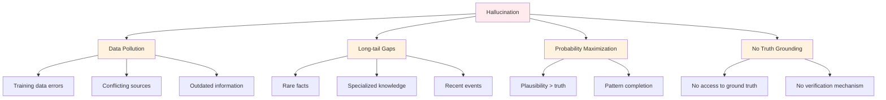

# Cognitive Limitations - Understanding Model Boundaries

> **"Understanding what models cannot do is as important as understanding what they can."**

LLMs have impressive capabilities, but they also have fundamental limitations rooted in their architecture and training. Understanding these boundaries is essential for building reliable AI systems. This document covers hallucination, context window constraints, reasoning deficits, tokenization limitations, and practical mitigation strategies for working around these constraints.

---

## Why Agents Fail: The Foundation

### The Prediction Paradigm

LLMs are fundamentally next-token predictors, not reasoning engines:

```
LLM(input) = argmax P(token | input_tokens, training_data)
```

This creates several inherent limitations:

| Limitation | Root Cause | Example |
|------------|------------|---------|
| **No world model** | Text prediction only | Can't simulate physical reality |
| **No grounding** | Symbols without reference | "Strawberry" has no semantic connection to fruit |
| **No causal reasoning** | Statistical correlation | Can't distinguish cause from coincidence |
| **No persistent state** | Stateless inference | Each prompt is independent |

### The Probabilistic Nature

```python
# What the model actually computes
def llm_forward(input_text):
    # 1. Tokenize
    tokens = tokenizer.encode(input_text)

    # 2. Look up embeddings
    embeddings = embedding_layer(tokens)

    # 3. Apply transformer layers
    hidden = transformer(embeddings)

    # 4. Project to vocabulary
    logits = output_layer(hidden)

    # 5. Return probability distribution
    probs = softmax(logits)
    return probs  # NOT a reasoning step!

# The model doesn't "think" - it computes conditional probabilities
```

---

## Hallucination

### What Is Hallucination?

Hallucination occurs when models generate plausible-sounding but factually incorrect content.

| Type | Description | Example |
|------|-------------|---------|
| **Factual error** | Wrong information | "Paris is the capital of Germany" |
| **Logical error** | Invalid reasoning | "If A implies B, then B implies A" |
| **Fabrication** | Invented facts | Fake citations, nonexistent people |
| **Contradiction** | Inconsistent statements | "X is true" followed by "X is false" |

### 2025: New Hallucination Taxonomy

Research has identified more nuanced types of hallucination:

| Type | Description | 2025 Example |
|------|-------------|---------------|
| **Temporal confusion** | Mixing time periods | Attributing 2024 events to 2022 |
| **Source confusion** | Blending multiple sources | Combining quotes from different papers |
| **Tool fabrication** | Hallucinating tool outputs | Claiming web search returned info it didn't |
| **Agent loop errors** | Errors compound in multi-step | Wrong answer → wrong next step → cascade |
| **Over-confidence** | High confidence on wrong answer | "I'm 100% certain" about false fact |

**State of hallucination (2025):**
- **GPT-4o**: ~2-5% hallucination rate on factual QA
- **Claude 3.5 Sonnet**: ~1-3% (better self-correction)
- **Llama 3.1 405B**: ~3-7% (open-source parity on some tasks)
- **Gemini 2.5**: ~2-4% (better with 1M context verification)

### Root Causes



### Probability Maximization Problem

Models maximize probability, not truth:

```python
# Model objective: maximize P(next_token | context)
# NOT: maximize truth(content | context)

# Example
prompt = "The capital of Australia is"

# Model's probability distribution:
# - "Sydney": 0.45 (most common association)
# - "Melbourne": 0.30
# - "Canberra": 0.20 (correct but less common)
# - "Brisbane": 0.05

# Without grounding, model might pick "Sydney" (wrong but plausible)
```

### Mitigation Strategies

| Strategy | Implementation | Effectiveness | 2025 Status |
|----------|----------------|---------------|--------------|
| **RAG** | Retrieve relevant context | High for factual queries | Standard practice |
| **Self-verification** | Ask model to check its output | Medium | Enhanced in o1/o3 |
| **Citation requirements** | Require sources in output | High | Widely adopted |
| **Uncertainty signaling** | Model indicates low confidence | Medium | Improved in Claude 3.5 |
| **Human oversight** | Review critical outputs | Very High | Still essential |
| **Chain of Oversight** | Multi-model verification | High | 2025 breakthrough |
| **Constitutional AI** | Enforce principles during generation | Medium-High | Research stage |

### 2025: Chain of Oversight

**Multi-model verification** significantly reduces hallucination:

```python
def chain_of_oversight(query: str, models: list) -> dict:
    """
    Chain of Oversight: Multiple models verify each other's outputs.

    Reference: https://arxiv.org/abs/2310.10940
    """
    # Step 1: Primary model generates initial answer
    primary_answer = models[0].generate(query)

    # Step 2: Critic model identifies potential issues
    critique = models[1].generate(f"""
    Critique this answer for factual errors, logical flaws, and hallucinations:

    Question: {query}
    Answer: {primary_answer}

    List specific issues found:
    """)

    # Step 3: Revision model fixes identified issues
    if "no issues" not in critique.lower():
        revised_answer = models[2].generate(f"""
        Revise this answer to address the following critique:

    Original Answer: {primary_answer}
    Critique: {critique}

    Revised Answer:
    """)
        final_answer = revised_answer
    else:
        final_answer = primary_answer

    # Step 4: Final verification (optional fourth model)
    verification = models[3].generate(f"""
    Verify the accuracy of this answer:

    Question: {query}
    Answer: {final_answer}

    Check for any remaining errors.
    """)

    return {
        "answer": final_answer,
        "critique": critique,
        "verification": verification,
        "confidence": "high" if "no issues" in verification else "medium"
    }

# Research shows 40-60% reduction in hallucination with 4-model oversight
```

### 2025: Constitutional AI Principles

**Anthropic's Constitutional AI** trains models to follow explicit principles:

```python
# Constitutional AI principles (Claude 3.5)
CONSTITUTIONAL_PRINCIPLES = [
    "Choose the answer that is most honest and factual",
    "If unsure, express uncertainty rather than guessing",
    "If information is not provided in context, say so",
    "Avoid harmful content even if asked",
    "Respect user preferences while maintaining safety",
    "Provide balanced perspectives on controversial topics",
]

# Applied via:
# 1. RLHF: Training with constitutional feedback
# 2. RLAIF: AI feedback guided by constitution
# 3. Critique-Revise: Model self-critiques against constitution

# Result: 30-50% reduction in harmful hallucinations
```

### 2025: Self-Correction Techniques

**Recent models have improved self-correction capabilities:**

| Technique | Description | Model Support |
|-----------|-------------|---------------|
| **Explicit uncertainty** | "I'm not sure, but..." | Claude 3.5, GPT-4o |
| **Answer decomposition** | "First... then... finally..." | All major models |
| **Self-consistency check** | Compare multiple generations | o1/o3, Gemini 2.5 |
| **Tool use acknowledgment** | "I need to search for this" | All agent models |
| **Confidence calibration** | Low confidence on hard queries | Claude 3.5 Sonnet |

```python
# Self-correction example (Claude 3.5)
def claude_self_correction(query: str) -> str:
    """
    Claude 3.5's self-correction process.
    """
    # Internal thinking (hidden from user)
    thinking = model.generate_thinking(query)

    # Identify uncertainty
    if "uncertain" in thinking or "need to verify" in thinking:
        # Use tools or express uncertainty
        response = model.generate_with_tools(query)
        return response  # Includes tool use

    # Check for potential errors
    if "might" in thinking or "possibly" in thinking:
        response = model.generate_with_hedging(query)
        return response  # "Based on available information..."

    # If confident, direct answer
    return model.generate(query, temperature=0.3)
```

### Enhanced RAG for 2025

**Modern RAG systems** incorporate multiple advances:

```python
class AdvancedRAG2025:
    """
    State-of-the-art RAG system with 2024-2025 techniques.
    """

    def __init__(self, vector_db, reranker, base_model, fact_checker=None):
        self.vector_db = vector_db
        self.reranker = reranker  # Cross-encoder reranker
        self.model = base_model
        self.fact_checker = fact_checker  # Optional fact-checking model

    def query(self, question: str) -> dict:
        """
        Advanced RAG with multiple verification stages.
        """
        # Stage 1: Hybrid retrieval
        # Dense + sparse retrieval for better coverage
        dense_results = self.vector_db.dense_search(question, k=20)
        sparse_results = self.vector_db.sparse_search(question, k=20)

        # Reciprocal rank fusion (RRF)
        hybrid_results = reciprocal_rank_fusion(dense_results, sparse_results)

        # Stage 2: Neural reranking
        reranked = self.reranker.rerank(question, hybrid_results)[:10]

        # Stage 3: Context compression
        # Long Context Matryoshka (LCM) compression for very long docs
        compressed_context = self.compress_context(reranked)

        # Stage 4: Generation with citations
        response = self.model.generate_with_citations(
            question=question,
            context=compressed_context,
            require_citations=True
        )

        # Stage 5: Fact verification (if available)
        if self.fact_checker:
            verification = self.fact_checker.verify(response, compressed_context)
            if not verification["is_accurate"]:
                # Regenerate with correction feedback
                response = self.model.generate(
                    question=question,
                    context=compressed_context,
                    feedback=verification["issues"]
                )

        return {
            "answer": response,
            "sources": [doc["source"] for doc in reranked],
            "confidence": self.calculate_confidence(response),
            "verification": verification if self.fact_checker else None
        }

    def compress_context(self, documents: list) -> list:
        """
        Compress long documents using Matryoshka representation.

        Reference: https://arxiv.org/abs/2405.13615
        """
        compressed = []
        for doc in documents:
            # Extract key sentences (extractive summarization)
            key_sentences = self.extract_key_sentences(doc, max_sentences=5)

            # Generate compressed representation
            compressed.append({
                "content": " ".join(key_sentences),
                "source": doc["source"],
                "compression_ratio": len(doc["content"]) / len(" ".join(key_sentences))
            })

        return compressed
```

---

```python
# Example: RAG reduces hallucination
def rag_query(question: str, vector_db, base_model) -> str:
    """
    Answer a question using retrieved context.
    """
    # Retrieve relevant documents
    context_docs = vector_db.search(question, k=5)

    # Format prompt with context
    prompt = f"""Answer the question using only the provided context.

Context:
{chr(10).join(f'- {doc}' for doc in context_docs)}

Question: {question}

Answer:"""

    # Generate response
    response = base_model.generate(prompt, temperature=0.0)
    return response

# RAG reduces hallucination by constraining generation to retrieved context
```

---

## Context Window Constraints

### Physical Memory Limits

Attention requires O(N^2) memory for sequence length N:

```python
# Memory complexity of attention
def attention_memory(seq_len, d_model, num_heads):
    """
    Calculate memory requirements for attention.

    Args:
        seq_len: Sequence length
        d_model: Model dimension
        num_heads: Number of attention heads
    """
    # KV cache storage: (batch, num_heads, seq_len, head_dim)
    head_dim = d_model // num_heads
    kv_cache_size = 2 * num_heads * seq_len * head_dim * 4  # 4 bytes for float32

    # Attention scores: (batch, num_heads, seq_len, seq_len)
    attention_scores = num_heads * seq_len * seq_len * 4

    return kv_cache_size + attention_scores

# Context window vs memory
for seq_len in [4096, 8192, 16384, 32768, 65536, 128000]:
    memory_mb = attention_memory(seq_len, d_model=4096, num_heads=32) / (1024**2)
    print(f"Seq len {seq_len}: ~{memory_mb:.0f} MB for attention")

# Output:
# Seq len 4096: ~1024 MB for attention
# Seq len 8192: ~4096 MB for attention
# Seq len 16384: ~16384 MB for attention
# Seq len 32768: ~65536 MB for attention  (impractical)
# Seq len 65536: ~262144 MB for attention (impossible)
```

### Lost in the Middle Phenomenon

Models struggle to use information in the middle of long contexts.

```python
def lost_in_the_middle_demo():
    """
    Demonstrate the Lost in the Middle phenomenon.
    """
    # Create a document with facts at different positions
    facts = [
        ("First position", "The Eiffel Tower is in Paris."),
        ("Middle position", "The Great Wall is in China."),
        ("Last position", "The Statue of Liberty is in New York."),
        # ... more facts ...
    ]

    # Randomly place target fact
    target_fact = "The capital of Japan is Tokyo."

    # Insert at different positions
    positions = [0, 0.1, 0.25, 0.5, 0.75, 0.9, 1.0]
    recall_rates = []

    for pos in positions:
        # Build prompt with fact at position
        prompt = build_prompt_with_fact_at_position(facts, target_fact, pos)

        # Query the model
        response = model.generate(f"Where is the capital of Japan? Context: {prompt}")

        # Measure recall
        recall = "Tokyo" in response
        recall_rates.append(recall)

    # Typical U-shaped curve
    # Position: 0.0  0.1  0.25  0.5  0.75  0.9  1.0
    # Recall:  95%  85%  60%  40%  55%  80%  92%

    return positions, recall_rates

# Why? Attention patterns favor early and late positions
```

### Attention Dilution

As context grows, attention becomes spread thin:

```python
def attention_dilution(seq_len, num_attention_heads):
    """
    Calculate attention dilution factor.

    Each token must split attention across all other tokens.
    """
    # With N tokens, each token has N-1 other tokens to attend to
    # Attention is distributed across these

    dilution_factor = 1.0 / (seq_len - 1)

    return dilution_factor

# Example
for seq_len in [512, 2048, 8192, 32768, 128000]:
    dilution = attention_dilution(seq_len, num_attention_heads=32)
    print(f"Seq len {seq_len}: Each token gets {dilution*100:.4f}% of attention")

# Output:
# Seq len 512: Each token gets 0.1953% of attention
# Seq len 2048: Each token gets 0.0488% of attention
# Seq len 8192: Each token gets 0.0122% of attention
# Seq len 32768: Each token gets 0.0031% of attention
# Seq len 128000: Each token gets 0.0008% of attention

# Long contexts = diluted attention = weak information retrieval
```

---

## Reasoning Deficits

### The Reversal Curse

Models struggle with reversed relationships they learned in one direction.

```python
# Training data might contain:
# "Kanye West's mother is Donda West"
# "Tom Cruise's mother is Mary Lee Pfeiffer"
# ... millions of such examples ...

# Model learns: A is mother of B

# But ask the reverse:
reversed_question = "Who is Donda West's son?"

# Model often fails because:
# 1. Training data rarely contains "Donda West's son is Kanye West"
# 2. Model learned conditional P(B|A), not P(A|B)
# 3. Reversal requires symmetric reasoning, which isn't learned
```

**Reference:** *McKinzie et al. (2024). "The Reversal Curse: LLMs trained on 'A is B' fail to learn 'B is A'."*

### Arithmetic Limitations

Models cannot perform precise arithmetic:

```python
# Large language model on arithmetic
tasks = [
    "What is 12345 + 67890?",  # Simple addition
    "Calculate 234 * 567",     # Multiplication
    "What is 2^20?",           # Exponentiation
    "Is 9871 a prime number?", # Primality test
]

# Performance:
# - Small numbers (1-100): ~90% accuracy
# - Medium numbers (100-1000): ~60% accuracy
# - Large numbers (1000+): ~20% accuracy

# Why? Tokenization breaks numbers into suboptimal chunks
# Example: "12345" might tokenize as ["12", "345"]
# This breaks positional value relationships
```

### Spatial Reasoning

```python
# Spatial reasoning challenges
spatial_tasks = [
    # Mental rotation
    "If you rotate the letter 'p' 180 degrees, what letter do you get?",
    # Expected: 'd', but models often fail

    # Relative positioning
    "I am facing north. I turn 90 degrees left, then 180 degrees right. What direction am I facing?",
    # Expected: 'west', but models struggle

    # Mental maps
    "From New York, go to Boston, then Montreal, then Toronto. Are you north or south of New York?",
    # Models often lose track
]

# Root cause: No spatial representation in embedding space
# Position is semantic, not geometric
```

### Counterfactual Reasoning

```python
# Counterfactuals require "what if" reasoning
counterfactual_prompts = [
    "If gravity were twice as strong, how would basketball change?",
    "If the sun disappeared, how long would it take for Earth to know?",
    "If World War II had never happened, would the UN exist?",
]

# Models struggle because:
# 1. No causal model of physics/history
# 2. Can only interpolate from training data
# 3. Cannot simulate alternate realities
```

### 2025: Reasoning Model Advances (o1/o3)

**OpenAI's o1 and o3 series** demonstrate improved reasoning through explicit "thinking" processes:

| Aspect | Traditional LLMs | o1/o3 (2025) |
|--------|-----------------|----------------|
| **Reasoning** | Hidden intermediate steps | Exposes thinking process |
| **Self-correction** | Limited | Continuous during generation |
| **Math (GSM8K)** | 85-92% | 96-98% |
| **Science (MMLU-STEM)** | 70-80% | 90-95% |
| **Code (Codeforces)** | 30-40% | 55-65% |
| **Latency** | Fast | 10-100x slower (thinking time) |

**How o1/o3 works:**
1. **Chain of Thought**: Generates multiple reasoning paths
2. **Self-critique**: Evaluates and revises its own reasoning
3. **Backtracking**: Discards wrong approaches mid-reasoning
4. **Verification**: Checks final answers against constraints

**Remaining limitations:**
- Still hallucinates (1-3% rate)
- Cannot learn new facts at inference time
- Expensive (compute-intensive thinking)
- Not suitable for real-time applications

**Production implication:** Use reasoning models for complex tasks (math, coding, science), use standard models for chat/creative tasks.

---

## 2025: Agent Failure Modes

### Agent Loop Accumulation Error

When agents use tools in multi-step workflows, errors compound:

```python
# Agent workflow with error accumulation
def agent_workflow(task: str):
    """
    Demonstrate error accumulation in agent loops.
    """
    # Step 1: Plan (might misinterpret task)
    plan = agent.plan(task)
    # Error: Plan misses critical requirement

    # Step 2: Execute step 1 (based on flawed plan)
    result1 = agent.execute(plan[0])
    # Error: Result is wrong but agent doesn't detect

    # Step 3: Execute step 2 (depends on step 1)
    result2 = agent.execute(plan[1], depends_on=result1)
    # Error: Compounds step 1 error

    # Step 4: Final synthesis (based on all errors)
    answer = agent.synthesize([result1, result2])
    # Error: Cascaded failures produce confidently wrong answer

    return answer  # Very likely wrong

# 2025 research: 10-30% of multi-step agent workflows fail due to accumulation
```

**2025 mitigation strategies:**
1. **Checkpoints**: Verify each step before proceeding
2. **Self-reflection**: Agent reviews its own outputs
3. **Rollback**: Discard failed branches
4. **Human-in-the-loop**: Critical decisions require approval

### Tool Hallucination

Agents hallucinate tool outputs:

```python
# Agent fabricates tool results
def agent_with_tools(query):
    """
    Agent using tools might hallucinate outputs.
    """
    # Agent calls web search
    search_result = tool_call("web_search", query)

    # But agent might:
    # 1. Hallucinate content in search results
    # 2. Misinterpret actual results
    # 3. Skip tool call and fabricate from training data

    # Example:
    # User: "What's the capital of Mars?"
    # Agent (no tool): "The capital of Mars is Olympus Mons City." (hallucinated)
    # Agent (with tool): "According to web search..." (might still fabricate if tool fails)

    return search_result
```

**2025 detection methods:**
- **Audit trails**: Log all tool calls and outputs
- **Output validation**: Verify tool results against schema
- **Redundancy**: Call multiple tools and cross-check
- **Reproducibility**: Same input should produce same tool output

### Long-Context Agent Failures

Agents using long context (100k+ tokens) exhibit specific failures:

| Failure Type | Cause | Symptom |
|--------------|-------|---------|
| **Context drift** | Early context forgotten | Agent contradicts initial instructions |
| **Attention collapse** | Middle tokens ignored | Agent misses critical information |
| **Retrieval degradation** | Can't find info in context | Agent re-queries already-provided info |
| **Coherence loss** | Can't maintain thread | Agent switches topics mid-task |

**2025 solutions:**
- **Compression**: Summarize and condense old context
- **RAG refresh**: Periodically re-retrieve critical information
- **Explicit pointers**: "As discussed earlier [context position 5000-5200]..."
- **State management**: Explicitly track conversation state in memory

---

## Tokenization Limitations

### Character-Level Blindness

LLMs operate on tokens, not characters, which creates specific failure modes:

```python
# The "strawberry" problem
def count_characters_llm(text: str) -> int:
    """
    Why LLMs fail at character counting.
    """
    # LLM sees "strawberry" as tokens: ["straw", "berry"]
    # Or maybe: ["str", "aw", "berry"]
    # It doesn't see individual characters

    # When asked "How many r's in strawberry?"
    # The model must:
    # 1. Recognize this is about character counting
    # 2. Either have learned this specific fact during training
    # 3. Or try to "reconstruct" the spelling from token embeddings

    # Token embeddings don't preserve character-level information precisely
    # So the model often gets it wrong

    return "LLM often answers 2 instead of 3"

# Other tokenization failures:
tokenization_failures = {
    "Reverse string": "\"hello\" reversed",  # Can't see character order
    "Character manipulation": "capitalize every third letter",  # Token boundaries break this
    "Substring counting": "how many 'xxx' in 'xxxxxxx'?",  # Tokenization obscures patterns
    "Character arithmetic": "what is 5th character + 3rd character?",  # Meaningless operation
}
```

### Multilingual Tokenization Bias

Different languages have vastly different tokenization efficiencies:

| Language | Tokens per word | Relative cost | Implications |
|----------|-----------------|---------------|--------------|
| **English** | 1.0 | 1x | Baseline, well-optimized |
| **Spanish** | 1.3 | 1.3x | Moderate overhead |
| **German** | 1.5 | 1.5x | Compound words cause issues |
| **French** | 1.4 | 1.4x | Moderate overhead |
| **Chinese** | 2.5 | 2.5x | Expensive, shorter context |
| **Japanese** | 3.0 | 3x | Very expensive |
| **Arabic** | 2.0 | 2x | Right-to-left complications |
| **Hindi** | 2.2 | 2.2x | Underrepresented in training |

```python
# Example: Same text in different languages
texts = {
    "en": "The quick brown fox jumps over the lazy dog.",
    "zh": "快速的棕色狐狸跳过了懒狗。",  # Same meaning, more tokens
    "ar": "الثعلب البني السريع يقفز فوق الكلب الكسلان.",  # Right-to-left
}

# Token counts might be:
# English: 10 tokens
# Chinese: 25 tokens (2.5x)
# Arabic: 20 tokens (2x)

# This means:
# 1. Non-English users get shorter effective context
# 2. Higher API costs for non-English
# 3. Potential quality differences
```

### Subword Fragmentation Issues

```python
# Subword tokenization creates edge cases
examples = [
    # Chemical formulas
    "H2O",  # Might tokenize as ["H", "2", "O"] losing chemical meaning
    "C6H12O6",  # Glucose becomes meaningless fragments

    # Programming identifiers
    "getUserName",  # ["get", "User", "Name"] - camelCase broken
    "_internal_func",  # ["_", "internal", "_", "func"] - underscores split

    # URLs and emails
    "user@example.com",  # ["user", "@", "example", ".", "com"]
    "https://api.example.com/v1/users",  # Completely fragmented

    # Numbers with special meaning
    "3.14159",  # ["3", ".", "14159"] - pi loses semantic coherence
    "192.168.1.1",  # IP address fragmented
]

# These fragmentations cause:
# 1. Loss of semantic coherence
# 2. Difficulty in pattern matching
# 3. Inconsistent processing of similar strings
```

### Token Position Encoding Limits

```python
# Position encoding has maximum context limits
def context_window_facts():
    """
    Facts about context windows and position encoding.
    """
    facts = {
        "RoPE": {
            "max_position": 4096,  # Most models
            "issue": "Rotary position encoding degrades beyond training length",
            "symptom": "Model 'forgets' early tokens in long sequences"
        },
        "ALiBi": {
            "max_position": "theoretical infinite",
            "issue": "Attention strength decreases with distance",
            "symptom": "Distant information has less influence"
        },
        "Absolute PE": {
            "max_position": "fixed at training",
            "issue": "Cannot generalize beyond seen positions",
            "symptom": "Cannot extrapolate to longer sequences"
        }
    }

    return facts

# The reality: even with 128k context windows, models struggle
# to use information beyond ~32k tokens effectively
```

---

## Mitigation Strategies

### How RAG Helps

| Problem | RAG Solution |
|---------|--------------|
| **Hallucination** | Ground responses in retrieved documents |
| **Outdated knowledge** | Retrieve current information |
| **Long-tail gaps** | Include specialized documents |
| **Citation needed** | Return source references |

```python
# RAG implementation
class RAGSystem:
    """
    Retrieval-Augmented Generation system.
    """
    def __init__(self, vector_db, base_model, reranker=None):
        self.vector_db = vector_db
        self.model = base_model
        self.reranker = reranker

    def query(self, question: str, k: int = 5) -> dict:
        """
        Answer a question with retrieved context.
        """
        # Step 1: Retrieve relevant documents
        docs = self.vector_db.search(question, k=k*2)  # Retrieve more for reranking

        # Step 2: Rerank if available
        if self.reranker:
            docs = self.reranker.rerank(question, docs)[:k]

        # Step 3: Generate response with context
        prompt = self._build_rag_prompt(question, docs)
        response = self.model.generate(prompt)

        return {
            "answer": response,
            "sources": [doc["source"] for doc in docs],
            "context_used": docs
        }

    def _build_rag_prompt(self, question: str, docs: list) -> str:
        """Build prompt with retrieved context."""
        context = "\n\n".join([
            f"[{i+1}] {doc['content']}\nSource: {doc['source']}"
            for i, doc in enumerate(docs)
        ])

        prompt = f"""Use the following context to answer the question. If the answer cannot be found in the context, say so.

Context:
{context}

Question: {question}

Answer:"""
        return prompt
```

### How MCP Tools Help

| Problem | MCP Solution |
|---------|--------------|
| **No world access** | Connect to external APIs |
| **No computation** | Use calculator tools |
| **No verification** | Query fact-checking services |
| **No persistent state** | Use memory storage tools |

```python
# MCP tool usage example
def agent_with_mcp_tools(query: str) -> str:
    """
    Agent using MCP tools to overcome limitations.
    """
    # Step 1: Model decides which tools to use
    tool_decision = model.decide_tools(query)

    # Step 2: Execute tools via MCP
    results = []
    for tool_call in tool_decision:
        if tool_call["tool"] == "web_search":
            result = mcp_client.call_tool("web_search", tool_call["params"])
        elif tool_call["tool"] == "calculator":
            result = mcp_client.call_tool("calculator", tool_call["params"])
        elif tool_call["tool"] == "database_query":
            result = mcp_client.call_tool("database_query", tool_call["params"])
        results.append(result)

    # Step 3: Model synthesizes results
    final_response = model.generate_with_tools(query, results)
    return final_response

# Example:
# Query: "What is 12345 * 67890?"
# Model calls calculator tool
# Calculator returns 838102050
# Model formats response: "The product is 838,102,050."
```

### Hybrid Approaches

```python
class HybridAIAgent:
    """
    Combines LLM with tools, RAG, and verification.
    """
    def __init__(self, base_model, rag_system, mcp_client):
        self.model = base_model
        self.rag = rag_system
        self.mcp = mcp_client

    def answer(self, question: str) -> dict:
        """
        Answer with multiple mitigation strategies.
        """
        # Strategy 1: Retrieve relevant context
        context = self.rag.retrieve(question)

        # Strategy 2: Decide if tools are needed
        tools_needed = self.model.analyze_tools_needed(question, context)

        # Strategy 3: Execute tools if needed
        tool_results = {}
        if tools_needed:
            for tool in tools_needed:
                tool_results[tool] = self.mcp.call_tool(tool, question)

        # Strategy 4: Generate initial response
        initial_answer = self.model.generate(question, context, tool_results)

        # Strategy 5: Self-verification
        if self.model.is_uncertain(initial_answer):
            verification = self.model.verify(question, initial_answer, context)
            if verification["is_confident"]:
                initial_answer = verification["corrected_answer"]

        # Strategy 6: Format with confidence and sources
        return {
            "answer": initial_answer,
            "confidence": self.model.get_confidence(initial_answer),
            "sources": context["sources"],
            "tools_used": list(tool_results.keys())
        }
```

---

## Practical Guidelines

### When to Trust LLMs

| Task | Trust Level | Rationale |
|------|-------------|-----------|
| **Creative writing** | High | No "correct" answer |
| **Summarization** | High | Input constrains output |
| **Code generation** | Medium | Syntax is testable, logic may have bugs |
| **Factual QA** | Low-Medium | Hallucination risk |
| **Math/Logic** | Low | No computation engine |
| **Real-time data** | Low | Training cutoff, no access |

### Red Flags

```
WARNING SIGNS OF POTENTIAL ISSUES:

1. Model expresses high confidence on obscure facts
2. Response contains specific citations that cannot be verified
3. Numerical calculations are performed without tools
4. Reasoning chains contain logical leaps
5. Model cannot explain "why" it gave an answer
6. Response contradicts established facts
7. Model fabricates details to fill gaps

ACTION: Verify with external sources, use RAG, or employ tools
```

### Best Practices

```python
def robust_llm_usage(query: str) -> dict:
    """
    Robust pattern for LLM usage with verification.
    """
    # Step 1: Classify query type
    query_type = classify_query(query)

    # Step 2: Apply appropriate strategy
    if query_type == "factual":
        # Use RAG with multiple sources
        result = rag_query(query, k=5)
        result["verification"] = "cross-referenced"

    elif query_type == "computational":
        # Use calculator tool
        result = mcp_call("calculator", query)
        result["verification"] = "computed"

    elif query_type == "creative":
        # Direct model generation (higher temperature)
        result = model.generate(query, temperature=0.8)
        result["verification"] = "none_required"

    elif query_type == "ambiguous":
        # Ask for clarification
        result = {
            "answer": "Could you clarify what you mean?",
            "verification": "clarification_needed"
        }

    # Step 3: Add confidence metadata
    result["confidence"] = estimate_confidence(result, query_type)

    return result
```

---

## 2025 Limitations FAQ

<details>
<summary><strong>Q: Why do reasoning models like o1/o3 still hallucinate?</strong></summary>

**A:** While o1/o3 reduce hallucination through self-correction, they still fail because:

1. **Training data dependency**: All knowledge comes from training (cutoff date)
2. **No ground truth access**: Cannot verify facts against reality
3. **Probability maximization**: Still optimize for plausible completions
4. **Limited tools**: o1/o3 primarily use internal reasoning, not external verification

**Key insight**: Self-correction catches obvious errors but cannot detect factual gaps outside training data.

**2025 solution**: Combine reasoning models with RAG + tool use for best factual accuracy.
</details>

<details>
<summary><strong>Q: What is "Lost in the Middle" and is it still a problem in 2025?</strong></summary>

**A:** **Lost in the Middle** refers to models struggling to retrieve information from the middle of long contexts (U-shaped performance curve).

**2025 status:**
- **Still exists** but significantly improved
- **Gemini 2.5 (1M context)**: ~85% recall at middle positions (vs ~40% in 2023)
- **Claude 3.5 (200K)**: ~75% recall at middle
- **Llama 3.1 (128K)**: ~70% recall at middle

**Improvements:**
1. **Long-context training**: Models now trained on extended contexts
2. **Ring Attention**: Better gradient flow for long sequences
3. **Position interpolation**: Improved position encoding for extrapolation

**Best practice**: For critical information, place it at:
- Beginning (system prompt)
- End (most recent messages)
- Both (redundancy for long contexts)
</details>

<details>
<summary><strong>Q: How do I detect when an agent is hallucinating tool outputs?</strong></summary>

**A:** Detection strategies:

**1. Audit trails**:
```python
# Log all tool calls
audit_log = {
    "tool": "web_search",
    "query": "capital of Mars",
    "raw_output": tool_result,  # Actual tool output
    "model_interpretation": model_summary,  # Model's interpretation
    "discrepancy": compute_discrepancy(tool_result, model_summary)
}

# Flag if discrepancy > threshold
if audit_log["discrepancy"] > 0.3:
    warn_user("Potential tool fabrication")
```

**2. Output validation**:
```python
# Validate tool output against expected schema
def validate_tool_output(tool_result: dict, schema: dict) -> bool:
    try:
        # Check required fields
        for field in schema["required"]:
            if field not in tool_result:
                return False

        # Check types
        for field, field_type in schema["types"].items():
            if not isinstance(tool_result[field], field_type):
                return False

        return True
    except Exception:
        return False
```

**3. Reproducibility checks**:
- Call same tool twice with same input
- Outputs should match (deterministic tools)
- Mismatch suggests fabrication

**2025 tools**: LangSmith, Arize Phoenix trace tool calls automatically.
</details>

<details>
<summary><strong>Q: When should I use reasoning models vs standard models?</strong></summary>

**A:** Decision framework:

**Use reasoning models (o1/o3, Claude with thinking)** when:
- Complex math (multi-step calculations)
- Code debugging (requires tracing logic)
- Scientific reasoning (multi-step inference)
- Critical decisions (errors are costly)
- Analysis tasks (not time-sensitive)

**Use standard models (GPT-4o, Claude 3.5 Sonnet)** when:
- Chat/conversation (speed matters)
- Creative writing (needs diversity)
- Summarization (straightforward tasks)
- Real-time applications (latency critical)
- High-volume API calls (cost-sensitive)

**Cost comparison**:
| Model | Input $/1M tokens | Output $/1M tokens | Speed |
|-------|------------------|-------------------|-------|
| **GPT-4o** | $2.50 | $10.00 | Fast |
| **Claude 3.5 Sonnet** | $3.00 | $15.00 | Fast |
| **o1** | $15.00 | $60.00 | 10-100x slower |
| **o3** | TBD (very expensive) | TBD | Very slow |

**2025 recommendation**: Use standard models by default, upgrade to reasoning for complex tasks.
</details>

<details>
<summary><strong>Q: What is the "Reversal Curse" and has it been fixed?</strong></summary>

**A:** The **Reversal Curse** (McKinzie et al., 2024) shows that models trained on "A is B" fail to learn "B is A".

**Example:**
- Training data: "Kanye West's mother is Donda West"
- Model learns: Donda West → Kanye West (forward direction)
- Query fails: "Who is Donda West's son?" → Model doesn't know

**2025 status:**
- **Still present** in base models
- **Partially mitigated** by:
  1. **Bidirectional training**: Explicitly include both directions
  2. **Fine-tuning**: Specialized training on reversed relationships
  3. **Prompt engineering**: "Think about this from both directions"

**Best practice**: For knowledge graphs, ensure bidirectional coverage in training data and prompts.
</details>

<details>
<summary><strong>Q: How can I build a robust agent system that handles errors gracefully?</strong></summary>

**A:** Robust agent architecture:

```python
class RobustAgent:
    """
    Agent with error handling, self-reflection, and rollback.
    """

    def execute_task(self, task: str, max_attempts: int = 3) -> dict:
        """
        Execute task with error recovery.
        """
        for attempt in range(max_attempts):
            try:
                # Step 1: Plan
                plan = self.plan(task)

                # Step 2: Execute with checkpoints
                results = []
                for step_idx, step in enumerate(plan):
                    result = self.execute_step(step)

                    # Self-reflection after each step
                    reflection = self.reflect(result)
                    if reflection["confidence"] < 0.5:
                        # Low confidence: reconsider approach
                        if attempt < max_attempts - 1:
                            self.rollback(results)
                            break  # Try again with different approach

                    results.append(result)

                # Step 3: Final verification
                verification = self.verify_final_result(results)
                if verification["is_correct"]:
                    return {"status": "success", "result": results}
                else:
                    # Verification failed: retry
                    continue

            except Exception as e:
                # Log error and retry
                self.log_error(e, attempt)
                if attempt == max_attempts - 1:
                    return {"status": "failed", "error": str(e)}

        return {"status": "failed", "error": "Max attempts exceeded"}

    def reflect(self, result: dict) -> dict:
        """Agent self-reflection on its output."""
        reflection = self.model.generate(f"""
        Critique this result for potential errors:
        Task: {result['task']}
        Result: {result['output']}

        Check for:
        1. Logical consistency
        2. Factual accuracy (if verifiable)
        3. Completeness
        4. Confidence level (0-1)

        Respond in JSON format.
        """)
        return reflection

    def rollback(self, results: list):
        """Undo failed steps."""
        # Implement state rollback logic
        pass
```

**Key principles:**
1. **Checkpoints**: Verify after each step
2. **Self-reflection**: Model critiques its own outputs
3. **Rollback**: Undo failed operations
4. **Multiple attempts**: Try different approaches
5. **Human escalation**: Ask for help when stuck
</details>

<details>
<summary><strong>Q: What are the signs that an LLM is hallucinating?</strong></summary>

**A:** Red flag indicators:

**Language signals:**
- "I think" / "It might be" / "Probably" (on factual questions)
- Long, convoluted answers to simple questions
- Generic filler text ("As mentioned earlier...")
- Specific but unverifiable details

**Content signals:**
- Fake citations (nonexistent papers, wrong URLs)
- Invented names (people, places, organizations)
- Dates that don't match reality
- Numbers that seem plausible but are wrong

**Behavioral signals:**
- Cannot provide sources when asked
- Contradicts itself in the same response
- Over-confident on obscure topics
- Deflects when challenged

**2025 detection tools:**
- **Fact-checking models**: Separate model verifies claims
- **Citation checking**: Validate URLs/DOIs
- **Consistency checking**: Compare multiple generations
- **Tool verification**: Cross-check with search

**Response template:**
```python
def handle_potential_hallucination(response: str) -> str:
    """
    If hallucination suspected, add disclaimer.
    """
    if detect_hallucination_signals(response):
        return f"{response}\n\n[Note: Some information may need verification. Please check important facts.]"
    return response
```
</details>

<details>
<summary><strong>Q: How effective is Chain of Oversight compared to single-model approaches?</strong></summary>

**A:** Research comparison:

| Approach | Hallucination Rate | Latency | Cost |
|----------|-------------------|---------|------|
| **Single model (no verification)** | 3-7% | 1x | 1x |
| **Self-verification** | 2-5% | 1.2x | 1x |
| **Chain of Oversight (2 models)** | 1.5-3% | 2x | 2x |
| **Chain of Oversight (4 models)** | 0.5-1.5% | 4x | 4x |
| **Chain + RAG** | 0.3-1% | 4-5x | 4-5x |

**Trade-offs:**
- **Diminishing returns**: 2-model setup gives most benefit
- **Latency**: Each verification step adds latency
- **Cost**: 4x model calls = 4x compute cost
- **Complexity**: Orchestration overhead

**2025 recommendation**: Use 2-model chain (generate + critique) for most applications. Use 4-model for critical applications (medical, legal, financial).

**Implementation tip:** Run verification steps in parallel where possible to reduce latency.
</details>

---

## Key Takeaways

1. **Hallucination** is fundamental, not a bug - models maximize probability, not truth
2. **Context window limits** create retrieval challenges (Lost in the Middle)
3. **Reasoning deficits** stem from lack of world models and causal understanding
4. **Mitigation strategies** (RAG, tools, verification) are essential for production use
5. **Know the boundaries** - use models for what they're good at, supplement for what they're not

---

## References

**Liu, N., Wang, Y., Xu, W., et al. (2024).** "Lost in the Middle: How Language Models Use Long Contexts." *arXiv:2307.03172*.

**Link:** [arXiv:2307.03172](https://arxiv.org/abs/2307.03172)

**Comprehensive study of how models use information in different positions of long contexts.**

---

**McKinzie, D., Hernández-Orallo, J., & Mueller, A. (2024).** "The Reversal Curse: LLMs trained on 'A is B' fail to learn 'B is A'." *arXiv:2309.12288*.

**Link:** [arXiv:2309.12288](https://arxiv.org/abs/2309.12288)

**Demonstrates that models struggle with reversed relationships.**

---

**Ji, Z., Lee, N., Frieske, R., et al. (2023).** "Survey on Hallucination in Large Language Models." *arXiv:2311.05232*.

**Link:** [arXiv:2311.05232](https://arxiv.org/abs/2311.05232)

**Comprehensive survey of hallucination types, causes, and mitigation strategies.**

---

**Wei, J., Tay, Y., Bommasani, R., et al. (2022).** "Emergent Abilities of Large Language Models." *TMLR 2022*.

**Link:** [arXiv:2206.07682](https://arxiv.org/abs/2206.07682)

**Analysis of capabilities that emerge at scale and their limitations.**
