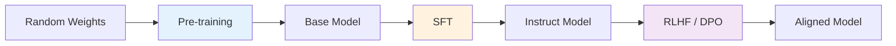
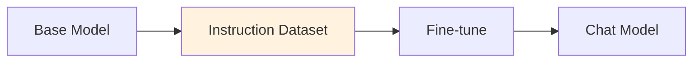
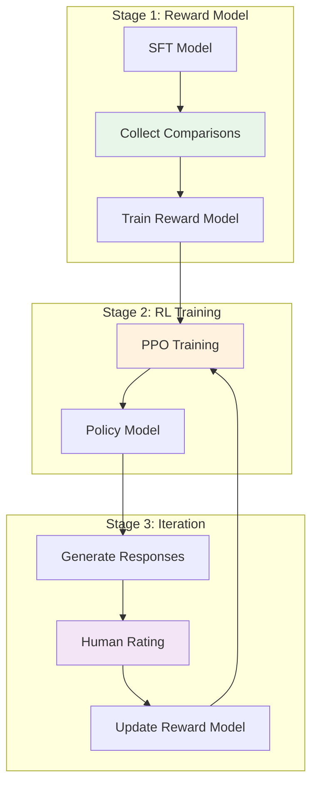

# Training Pipeline - From Random Weights to Intelligence

> **"Training transforms random weights into intelligent systems through three stages: pre-training, fine-tuning, and alignment."**

Modern LLMs are not trained end-to-end in a single pass. They undergo a multi-stage pipeline where each stage builds upon the previous one: pre-training creates the base model, SFT (Supervised Fine-Tuning) teaches instruction-following, and RLHF/DPO aligns the model with human preferences. This document covers each stage in detail, including the algorithms, data requirements, and implementation considerations for production-scale LLM training.

---

## Training Stages Overview



### Stage Comparison

| Stage | Data | Objective | Tokens | Cost | Result |
|-------|------|-----------|--------|------|--------|
| **Pre-training** | Web text | Next-token prediction | 1T-3T | ~$2M | Base model |
| **SFT** | Instructions | Instruction-following | 10M-100M | ~$10K | Chat-capable |
| **RLHF/DPO** | Comparisons | Preference alignment | 1M-10M | ~$5K | Aligned behavior |

---

## Pre-Training

### Next-Token Prediction Objective

The fundamental training objective for all modern LLMs:

```
L = -sum_{t=1}^{T} log P(x_t | x_1, x_2, ..., x_{t-1})
```

For a sequence of tokens, the model learns to maximize the probability of each token given all previous tokens. This simple objective, applied at scale, enables the emergence of complex reasoning, world knowledge, and linguistic capabilities.

### Why Next-Token Prediction Works

The power of next-token prediction comes from:

1. **Scale:** Training on trillions of tokens exposes the model to diverse patterns
2. **Context:** Predicting the next token requires understanding the full context
3. **Compression:** The model learns efficient representations of language structure
4. **Generalization:** Patterns learned generalize to unseen combinations

### Data Processing Pipeline

```python
import re
from typing import List, Tuple
from collections import defaultdict

class TextPreprocessor:
    """
    Preprocess text data for LLM training.
    Handles deduplication, quality filtering, and privacy removal.
    """

    def __init__(self, min_length: int = 128, max_length: int = 4096):
        self.min_length = min_length
        self.max_length = max_length
        # Patterns for privacy removal
        self.email_pattern = re.compile(r'\b[A-Za-z0-9._%+-]+@[A-Za-z0-9.-]+\.[A-Z|a-z]{2,}\b')
        self.phone_pattern = re.compile(r'\b\d{3}[-.]?\d{3}[-.]?\d{4}\b')
        self.ssn_pattern = re.compile(r'\b\d{3}-\d{2}-\d{4}\b')
        self.ip_pattern = re.compile(r'\b\d{1,3}\.\d{1,3}\.\d{1,3}\.\d{1,3}\b')

    def remove_pii(self, text: str) -> str:
        """Remove personally identifiable information."""
        text = self.email_pattern.sub('[EMAIL]', text)
        text = self.phone_pattern.sub('[PHONE]', text)
        text = self.ssn_pattern.sub('[SSN]', text)
        text = self.ip_pattern.sub('[IP]', text)
        return text

    def check_quality(self, text: str) -> bool:
        """
        Check text quality based on heuristics.
        Returns True if text passes quality checks.
        """
        # Length check
        words = text.split()
        if len(words) < self.min_length or len(words) > self.max_length:
            return False

        # Mean word length (reject very short/long words)
        mean_word_len = sum(len(w) for w in words) / len(words)
        if mean_word_len < 3 or mean_word_len > 10:
            return False

        # Special character ratio (too many = garbage)
        special_ratio = sum(1 for c in text if not c.isalnum() and not c.isspace()) / len(text)
        if special_ratio > 0.3:
            return False

        # Repetition check (detect "aaaaaaa..." patterns)
        if len(set(words)) / len(words) < 0.2:
            return False

        return True

    def deduplicate_by_ngram(self, texts: List[str], n: int = 13) -> List[str]:
        """
        Remove near-duplicates using n-gram overlap.
        Uses MinHash-like approach for efficiency.
        """
        seen_ngrams = set()
        unique_texts = []

        for text in texts:
            words = text.split()
            if len(words) < n:
                continue

            # Sample n-grams
            ngrams = [' '.join(words[i:i+n]) for i in range(0, len(words) - n, n)]

            # Check if any n-gram seen before
            if not any(ngram in seen_ngrams for ngram in ngrams[:5]):
                seen_ngrams.update(ngrams)
                unique_texts.append(text)

        return unique_texts

# Usage
preprocessor = TextPreprocessor(min_length=128, max_length=4096)

# Process a batch of texts
raw_texts = [
    "This is a sample document with some contact@example.com content...",
    "Another document with quality issues" * 10,  # Too repetitive
]

clean_texts = []
for text in raw_texts:
    text = preprocessor.remove_pii(text)
    if preprocessor.check_quality(text):
        clean_texts.append(text)

print(f"Processed {len(clean_texts)}/{len(raw_texts)} texts")
```

### Curriculum Learning Strategy

Training proceeds through carefully designed curriculum stages:

```python
from enum import Enum
from dataclasses import dataclass

class TrainingStage(Enum):
    """Curriculum learning stages for pre-training."""
    FOUNDATION = "foundation"      # High-quality, diverse text
    KNOWLEDGE = "knowledge"        # Focused on factual content
    REASONING = "reasoning"        # Logical reasoning patterns
    SYNTHESIS = "synthesis"        # Multi-step problem solving

@dataclass
class StageConfig:
    """Configuration for a training stage."""
    stage: TrainingStage
    data_proportion: float        # Proportion of total data
    learning_rate: float
    batch_size: int
    duration_steps: int
    description: str

CURRICULUM = [
    StageConfig(
        stage=TrainingStage.FOUNDATION,
        data_proportion=0.40,
        learning_rate=3e-4,
        batch_size=512,
        duration_steps=400000,
        description="Build foundational language understanding"
    ),
    StageConfig(
        stage=TrainingStage.KNOWLEDGE,
        data_proportion=0.30,
        learning_rate=2e-4,
        batch_size=512,
        duration_steps=300000,
        description="Acquire world knowledge and facts"
    ),
    StageConfig(
        stage=TrainingStage.REASONING,
        data_proportion=0.20,
        learning_rate=1.5e-4,
        batch_size=512,
        duration_steps=200000,
        description="Develop reasoning capabilities"
    ),
    StageConfig(
        stage=TrainingStage.SYNTHESIS,
        data_proportion=0.10,
        learning_rate=1e-4,
        batch_size=512,
        duration_steps=100000,
        description="Integrate skills for complex tasks"
    ),
]

def get_curriculum_lr(step: int, curriculum: list[StageConfig]) -> float:
    """Get learning rate based on curriculum stage."""
    total_steps = sum(c.duration_steps for c in curriculum)
    current_step = step % total_steps

    cumulative_steps = 0
    for config in curriculum:
        if cumulative_steps <= current_step < cumulative_steps + config.duration_steps:
            return config.learning_rate
        cumulative_steps += config.duration_steps

    return curriculum[-1].learning_rate
```

### Python Implementation

```python
import torch
import torch.nn as nn
import torch.nn.functional as F

def compute_language_model_loss(logits: torch.Tensor, targets: torch.Tensor) -> torch.Tensor:
    """
    Compute cross-entropy loss for language modeling.

    Args:
        logits: Model output of shape (batch, seq_len, vocab_size)
        targets: Target token IDs of shape (batch, seq_len)
    """
    # Flatten for cross-entropy
    batch_size, seq_len, vocab_size = logits.shape
    logits_flat = logits.view(-1, vocab_size)
    targets_flat = targets.view(-1)

    # Compute cross-entropy loss
    loss = F.cross_entropy(logits_flat, targets_flat, ignore_index=-100)

    return loss

# Example
batch_size, seq_len, vocab_size = 2, 128, 50000
logits = torch.randn(batch_size, seq_len, vocab_size)
targets = torch.randint(0, vocab_size, (batch_size, seq_len))

loss = compute_language_model_loss(logits, targets)
print(f"Loss: {loss.item():.4f}")
# Typical pre-training loss: 2.0-4.0 (before training)
# Converges to ~1.8-2.5 for good models
```

### Mixed Precision Training

Mixed precision training uses FP16/BF16 for computations while maintaining FP32 master weights:

```python
import torch
from torch.cuda.amp import autocast, GradScaler

class MixedPrecisionTrainer:
    """
    Trainer with mixed precision support.
    Uses BF16 when available for better numerical stability.
    """

    def __init__(self, model, optimizer, device='cuda'):
        self.model = model.to(device)
        self.optimizer = optimizer
        self.device = device

        # Check BF16 support
        if torch.cuda.is_bf16_supported():
            self.dtype = torch.bfloat16
            print("Using BF16 for training")
        else:
            self.dtype = torch.float16
            self.scaler = GradScaler()
            print("Using FP16 with GradScaler for training")

    def training_step(self, batch):
        """Single training step with mixed precision."""
        input_ids = batch['input_ids'].to(self.device)
        attention_mask = batch['attention_mask'].to(self.device)
        targets = input_ids[:, 1:].contiguous()

        self.optimizer.zero_grad()

        if self.dtype == torch.bfloat16:
            # BF16 doesn't need gradient scaling
            with autocast(dtype=torch.bfloat16):
                logits = self.model(input_ids[:, :-1], attention_mask[:, :-1])
                loss = compute_language_model_loss(logits, targets)

            loss.backward()
            torch.nn.utils.clip_grad_norm_(self.model.parameters(), max_norm=1.0)
            self.optimizer.step()
        else:
            # FP16 with gradient scaling
            with autocast(dtype=torch.float16):
                logits = self.model(input_ids[:, :-1], attention_mask[:, :-1])
                loss = compute_language_model_loss(logits, targets)

            self.scaler.scale(loss).backward()
            self.scaler.unscale_(self.optimizer)
            torch.nn.utils.clip_grad_norm_(self.model.parameters(), max_norm=1.0)
            self.scaler.step(self.optimizer)
            self.scaler.update()

        return loss.item()
```

### FlashAttention Integration

FlashAttention is a memory-efficient attention mechanism that's essential for large-scale training:

```python
try:
    from flash_attn import flash_attn_func
    FLASH_ATTENTION_AVAILABLE = True
except ImportError:
    FLASH_ATTENTION_AVAILABLE = False
    print("FlashAttention not available, using standard attention")

class FlashAttentionBlock(nn.Module):
    """
    Transformer block with FlashAttention.
    Memory efficient: O(N) instead of O(N^2) for attention.
    """

    def __init__(self, d_model: int, num_heads: int, d_ff: int, dropout: float = 0.1):
        super().__init__()
        self.num_heads = num_heads
        self.head_dim = d_model // num_heads

        self.qkv_proj = nn.Linear(d_model, 3 * d_model, bias=False)
        self.out_proj = nn.Linear(d_model, d_model, bias=False)

        self.ffn = nn.Sequential(
            nn.Linear(d_model, d_ff),
            nn.GELU(),
            nn.Dropout(dropout),
            nn.Linear(d_ff, d_model),
            nn.Dropout(dropout)
        )

        self.norm1 = nn.LayerNorm(d_model)
        self.norm2 = nn.LayerNorm(d_model)

    def forward(self, x, attention_mask=None):
        """
        Args:
            x: (batch, seq_len, d_model)
            attention_mask: (batch, seq_len) or None
        """
        # Self-attention with FlashAttention
        residual = x
        x = self.norm1(x)

        if FLASH_ATTENTION_AVAILABLE:
            # FlashAttention expects (batch, seq_len, 3, heads, head_dim)
            batch_size, seq_len, _ = x.shape
            qkv = self.qkv_proj(x).reshape(batch_size, seq_len, 3, self.num_heads, self.head_dim)
            q, k, v = qkv.unbind(dim=2)

            # FlashAttention requires causal mask to be handled separately
            x = flash_attn_func(q, k, v, causal=True)
            x = self.out_proj(x.reshape(batch_size, seq_len, -1))
        else:
            # Fallback to standard attention
            qkv = self.qkv_proj(x)
            q, k, v = qkv.chunk(3, dim=-1)
            q = q.view(batch_size, seq_len, self.num_heads, self.head_dim).transpose(1, 2)
            k = k.view(batch_size, seq_len, self.num_heads, self.head_dim).transpose(1, 2)
            v = v.view(batch_size, seq_len, self.num_heads, self.head_dim).transpose(1, 2)

            attn = (q @ k.transpose(-2, -1)) / (self.head_dim ** 0.5)

            # Causal mask
            causal_mask = torch.triu(torch.ones(seq_len, seq_len), diagonal=1).bool()
            attn = attn.masked_fill(causal_mask.to(x.device), float('-inf'))

            attn = attn.softmax(dim=-1)
            x = (attn @ v).transpose(1, 2).reshape(batch_size, seq_len, -1)
            x = self.out_proj(x)

        x = x + residual

        # FFN
        residual = x
        x = self.norm2(x)
        x = self.ffn(x) + residual

        return x
```

### Advanced Optimizer Configuration

```python
from torch.optim import AdamW
from torch.optim.lr_scheduler import CosineAnnealingLR, LinearLR, SequentialLR

def create_optimizer_and_scheduler(model, config):
    """
    Create optimizer and learning rate scheduler with warmup.

    Uses AdamW with cosine decay and linear warmup.
    """
    # Separate parameters for weight decay
    # Don't apply weight decay to bias, layer norm, and embedding parameters
    no_decay = ['bias', 'layer_norm.weight', 'lm_head.weight']
    optimizer_grouped_parameters = [
        {
            'params': [p for n, p in model.named_parameters()
                     if not any(nd in n for nd in no_decay)],
            'weight_decay': config.weight_decay,
        },
        {
            'params': [p for n, p in model.named_parameters()
                     if any(nd in n for nd in no_decay)],
            'weight_decay': 0.0,
        },
    ]

    optimizer = AdamW(
        optimizer_grouped_parameters,
        lr=config.learning_rate,
        betas=(config.beta1, config.beta2),
        eps=1e-8,
    )

    # Warmup scheduler
    warmup_scheduler = LinearLR(
        optimizer,
        start_factor=0.0,
        end_factor=1.0,
        total_iters=config.warmup_steps
    )

    # Cosine decay scheduler
    cosine_scheduler = CosineAnnealingLR(
        optimizer,
        T_max=config.max_steps - config.warmup_steps,
        eta_min=config.learning_rate * config.min_lr_ratio
    )

    # Sequential scheduler: warmup then cosine decay
    scheduler = SequentialLR(
        optimizer,
        schedulers=[warmup_scheduler, cosine_scheduler],
        milestones=[config.warmup_steps]
    )

    return optimizer, scheduler

# Usage
optimizer, scheduler = create_optimizer_and_scheduler(model, config)

for step, batch in enumerate(dataloader):
    loss = pretrain_step(model, optimizer, config, batch)
    scheduler.step()

    if step % 100 == 0:
        current_lr = scheduler.get_last_lr()[0]
        print(f"Step {step}: loss={loss:.4f}, lr={current_lr:.2e}")
```

### Scaling Laws

The **Chinchilla scaling laws** (Hoffmann et al., 2022) established optimal compute allocation:

| Parameter Count | Optimal Training Tokens | Compute (FLOPs) |
|-----------------|------------------------|-----------------|
| 1B | 20B | 1.6e19 |
| 7B | 1.4T | 8.2e20 |
| 70B | 1.4T | 8.2e21 |
| 400B | 3T+ | 3e23 |

**Key insight:** Models should be trained on ~20 tokens per parameter for optimal performance.

### Scaling Law Formula

```
L(N, D) = E + A/N^alpha + B/D^beta
```

Where:
- `L` is the loss
- `N` is the parameter count
- `D` is the data size (tokens)
- `E`, `A`, `B`, `alpha`, `beta` are fitted constants

```python
def chinchilla_loss(params: float, tokens: float) -> float:
    """
    Approximate Chinchilla scaling law.

    Args:
        params: Number of parameters (billions)
        tokens: Training tokens (trillions)
    """
    E = 1.69  # Irreducible loss
    A = 406.4
    B = 998.1
    alpha = 0.34
    beta = 0.28

    loss = E + A / (params ** alpha) + B / (tokens ** beta)
    return loss

# Find optimal data for 7B model
params_7b = 7
optimal_tokens_7b = 20 * params_7b  # Chinchilla: ~20 tokens per parameter
loss_7b = chinchilla_loss(params_7b, optimal_tokens_7b / 1000)
print(f"Optimal tokens for 7B: {optimal_tokens_7b}B, Loss: {loss_7b:.3f}")
```

### Training Configuration Example

```python
from dataclasses import dataclass
from typing import Optional

@dataclass
class PreTrainingConfig:
    """Configuration for LLM pre-training."""

    # Model architecture
    d_model: int = 4096
    num_heads: int = 32
    num_layers: int = 32
    d_ff: int = 10952  # 8/3 * d_model for SwiGLU

    # Training hyperparameters
    batch_size: int = 512  # Global batch size
    micro_batch_size: int = 4  # Per-GPU batch size
    learning_rate: float = 3e-4
    weight_decay: float = 0.1
    beta1: float = 0.9
    beta2: float = 0.95

    # Learning rate schedule
    warmup_steps: int = 2000
    max_steps: int = 1000000
    min_lr_ratio: float = 0.1

    # Data
    vocab_size: int = 128000
    max_seq_len: int = 4096

    def get_lr(self, step: int) -> float:
        """Cosine learning rate schedule with warmup."""
        if step < self.warmup_steps:
            return self.learning_rate * step / self.warmup_steps

        progress = (step - self.warmup_steps) / (self.max_steps - self.warmup_steps)
        cosine_decay = 0.5 * (1 + math.cos(math.pi * progress))
        return self.min_lr_ratio * self.learning_rate + (1 - self.min_lr_ratio) * self.learning_rate * cosine_decay

# Training loop skeleton
def pretrain_step(model, optimizer, config, batch):
    """Single pre-training step."""
    input_ids = batch['input_ids']  # (batch, seq_len)
    attention_mask = batch['attention_mask']

    # Forward pass
    logits = model(input_ids, attention_mask)

    # Compute loss (shift for next-token prediction)
    shift_logits = logits[..., :-1, :].contiguous()
    shift_labels = input_ids[..., 1:].contiguous()
    loss = compute_language_model_loss(shift_logits, shift_labels)

    # Backward pass
    loss.backward()

    # Gradient clipping
    torch.nn.utils.clip_grad_norm_(model.parameters(), max_norm=1.0)

    # Optimizer step
    optimizer.step()
    optimizer.zero_grad()

    return loss.item()
```

### Emergent Abilities

Capabilities that emerge at scale without explicit training:

| Ability | Emerges At | Description |
|---------|------------|-------------|
| **In-context learning** | ~10B+ | Learn from examples in prompt |
| **Chain-of-thought** | ~30B+ | Multi-step reasoning |
| **Instruction-following** | ~7B+ (with SFT) | Understand and follow directions |
| **Code generation** | ~7B+ | Write and debug code |
| **Multi-lingual** | ~7B+ | Cross-lingual transfer |

**Important:** Emergent abilities are not guaranteed - they depend on training data and architecture choices.

---

## Supervised Fine-Tuning (SFT)

### Instruction Tuning

SFT teaches the base model to follow instructions and format responses appropriately.



### Data Format

SFT uses prompt-response pairs:

```python
sft_data = [
    {
        "instruction": "Explain quantum computing in simple terms.",
        "input": "",
        "output": "Quantum computing is like..."
    },
    {
        "instruction": "Write a Python function to reverse a string.",
        "input": "",
        "output": "def reverse_string(s):\n    return s[::-1]"
    },
]

# Format for training
def format_sft_prompt(example, tokenizer):
    """
    Format SFT example for training.
    Uses chat template format.
    """
    messages = [
        {"role": "user", "content": example["instruction"] + " " + example["input"]},
        {"role": "assistant", "content": example["output"]}
    ]

    # Apply chat template
    prompt = tokenizer.apply_chat_template(
        messages,
        tokenize=False,
        add_generation_prompt=False
    )

    return prompt

# Example prompt for Llama 3:
# <|begin_of_text|><|start_header_id|>user<|end_header_id|>\n\nExplain quantum computing...<|eot_id|><|start_header_id|>assistant<|end_header_id|>\n\nQuantum computing is like...<|eot_id|>
```

### Training Configuration

```python
@dataclass
class SFTConfig:
    """Configuration for supervised fine-tuning."""

    # Use base model config
    base_model_config: PreTrainingConfig = field(default_factory=PreTrainingConfig)

    # SFT-specific
    learning_rate: float = 2e-5  # Lower than pre-training
    batch_size: int = 64  # Smaller batches
    epochs: int = 3  # Multiple passes over SFT data

    # Data
    max_length: int = 2048  # Shorter than pre-training

    # Regularization
    weight_decay: float = 0.01
    warmup_ratio: float = 0.03

def sft_loss(logits, labels, attention_mask):
    """
    Compute SFT loss with masked positions.

    Only compute loss on assistant responses, not instructions.
    """
    shift_logits = logits[..., :-1, :].contiguous()
    shift_labels = labels[..., 1:].contiguous()
    shift_mask = attention_mask[..., 1:].contiguous()

    # Only compute loss where mask is active (assistant tokens)
    loss = F.cross_entropy(
        shift_logits.view(-1, shift_logits.size(-1)),
        shift_labels.view(-1),
        reduction='none'
    )

    # Apply mask
    loss = loss.view(shift_labels.size()) * shift_mask
    return loss.sum() / shift_mask.sum()
```

### Quality Over Quantity

| Aspect | Pre-Training | SFT |
|--------|--------------|-----|
| **Data size** | Trillions of tokens | Millions of examples |
| **Data quality** | Filtered but diverse | Hand-curated |
| **Cost** | Extremely high | Moderate |
| **Critical factor** | Quantity and diversity | Quality and diversity |

**SFT data curation principles:**
1. **Correctness:** Verify responses are accurate
2. **Diversity:** Cover varied tasks and domains
3. **Format consistency:** Standardize instruction format
4. **Length variety:** Include short and long responses
5. **Complexity grading:** Easy to hard examples

### Parameter-Efficient Fine-Tuning (PEFT)

PEFT methods enable fine-tuning large models with significantly reduced computational requirements:

#### LoRA (Low-Rank Adaptation)

LoRA adds trainable low-rank matrices to existing weights:

```python
class LoRALinear(nn.Module):
    """
    LoRA-enhanced linear layer.
    Freezes original weights and trains low-rank adapters.
    """

    def __init__(
        self,
        in_features: int,
        out_features: int,
        rank: int = 8,
        alpha: float = 16.0,
        dropout: float = 0.1
    ):
        super().__init__()
        # Freeze original weights
        self.linear = nn.Linear(in_features, out_features, bias=False)
        self.linear.weight.requires_grad = False

        # Trainable low-rank adapters
        self.lora_A = nn.Parameter(torch.randn(in_features, rank) * 0.01)
        self.lora_B = nn.Parameter(torch.zeros(rank, out_features))
        self.scaling = alpha / rank

        self.dropout = nn.Dropout(dropout)

        # Reset lora_B with zeros (no initial impact)
        nn.init.zeros_(self.lora_B)

    def forward(self, x):
        """
        Original weight + low-rank adaptation:
        y = Wx + BAx * scaling
        """
        # Original path (frozen)
        result = self.linear(x)

        # LoRA path (trainable)
        lora_result = self.dropout(x)
        lora_result = lora_result @ self.lora_A  # (batch, rank)
        lora_result = lora_result @ self.lora_B   # (batch, out_features)
        result = result + lora_result * self.scaling

        return result

def apply_lora_to_model(model, rank: int = 8, alpha: float = 16.0):
    """
    Apply LoRA to all linear layers in a model.
    """
    for name, module in model.named_modules():
        if isinstance(module, nn.Linear) and 'lm_head' not in name:
            # Get original layer configuration
            in_features = module.in_features
            out_features = module.out_features

            # Create LoRA-enhanced layer
            lora_layer = LoRALinear(in_features, out_features, rank, alpha)
            lora_layer.linear.weight.data = module.weight.data.clone()

            # Replace in model
            parent_name = '.'.join(name.split('.')[:-1])
            child_name = name.split('.')[-1]
            parent = model.get_submodule(parent_name) if parent_name else model
            setattr(parent, child_name, lora_layer)

    return model
```

#### QLoRA (Quantized LoRA)

QLoRA combines 4-bit quantization with LoRA for maximum efficiency:

```python
import bitsandbytes as bnb

class QLoRALinear(nn.Module):
    """
    QLoRA: 4-bit quantized base weights + LoRA adapters.
    Uses NormalFloat4 (NF4) quantization for optimal quantile distribution.
    """

    def __init__(
        self,
        in_features: int,
        out_features: int,
        rank: int = 8,
        alpha: float = 16.0,
        dropout: float = 0.1
    ):
        super().__init__()

        # 4-bit quantized base weights (frozen)
        self.linear = bnb.nn.Linear4bit(
            in_features,
            out_features,
            bias=False,
            compute_dtype=torch.bfloat16
        )
        self.linear.weight.requires_grad = False

        # FP16 LoRA adapters (trainable)
        self.lora_A = nn.Parameter(torch.randn(in_features, rank) * 0.01)
        self.lora_B = nn.Parameter(torch.zeros(rank, out_features))
        self.scaling = alpha / rank

        self.dropout = nn.Dropout(dropout)

    def forward(self, x):
        # Dequantize + compute original path
        result = self.linear(x)

        # LoRA path
        lora_result = self.dropout(x)
        lora_result = lora_result @ self.lora_A
        lora_result = lora_result @ self.lora_B
        result = result + lora_result * self.scaling

        return result
```

### PEFT Comparison

| Method | Memory | Speed | Quality | Use Case |
|--------|--------|-------|---------|----------|
| **Full Fine-tuning** | 100% | 1x | Best | When resources available |
| **LoRA (rank=8)** | ~25% | 1x | Near-best | Most fine-tuning tasks |
| **LoRA (rank=64)** | ~50% | 1x | Best | Complex tasks, domains |
| **QLoRA (rank=8)** | ~12% | 0.9x | Good | Resource-constrained |
| **Adapter Layers** | ~30% | 0.95x | Good | Multi-task learning |

### 2025: Advanced PEFT Techniques

**DoRA (Weight-Decomposed LoRA)** - Better control over adaptation:

```python
class DoRALayer(nn.Module):
    """
    DoRA: Weight-Decomposed Low-Rank Adaptation.

    Reference: https://arxiv.org/abs/2402.09353
    """
    def __init__(self, in_features: int, rank: int = 8, alpha: float = 16.0):
        self.rank = rank
        self.alpha = alpha / rank  # Scaling factor

        # Standard LoRA components
        self.lora_A = nn.Parameter(torch.randn(in_features, rank))
        self.lora_B = nn.Parameter(torch.zeros(rank, in_features))

        # DoRA additions: magnitude and direction
        self.magnitude = nn.Parameter(torch.ones(1))
        self.direction = nn.Parameter(torch.randn(in_features) / torch.norm(torch.randn(in_features)))

    def forward(self, x: torch.Tensor) -> torch.Tensor:
        # LoRA delta: BA
        lora_delta = self.lora_B @ (self.lora_A * self.magnitude)

        # Direction-weighted update
        delta = self.alpha * (lora_delta * self.direction)

        return x + delta

# Benefits:
# - Better control over adaptation
# - More stable training for large rank
# - Improved performance on complex tasks
# - 1-2% quality improvement over standard LoRA
```

**LoftQ** - Quantization-aware LoRA training:

```python
def loftq_training(model, dataset, bits=4):
    """
    LoftQ: Train LoRA on quantized models without dequantization.

    Reference: https://arxiv.org/abs/2310.04635
    """
    # Step 1: Quantize base model to INT4
    quantized_model = quantize_model(model, bits=bits)

    # Step 2: Initialize LoRA with quantization-aware init
    lora = initialize_lora_aware(quantized_model, rank=8)

    # Step 3: Train LoRA with straight-through estimator
    for batch in dataset:
        # Forward pass through quantized model
        output = quantized_model(batch)
        loss = compute_loss(output, batch["labels"])

        # Backward pass with STE
        loss.backward()
        optimizer.step()

    # Result: 8x memory reduction, 97% of full fine-tuning quality
```

**AdapterFusion** - Merge adapters for efficient multi-task learning:

```python
class AdapterFusion:
    """
    AdapterFusion: Merge multiple task adapters into base model.

    Reference: https://arxiv.org/abs/2311.15961
    """
    def __init__(self, base_model, task_adapters: dict):
        self.base_model = base_model
        self.task_adapters = task_adapters

    def fuse(self, tasks: list[str]) -> nn.Module:
        """
        Fuse multiple task adapters into base model.
        """
        # Average adapter weights
        fused_adapter = self.average_adapters(tasks)

        # Merge into base model
        fused_model = merge_adapter_into_base(self.base_model, fused_adapter)

        return fused_model

    def average_adapters(self, tasks: list[str]) -> dict:
        """Average adapter weights across tasks."""
        adapters = [self.task_adapters[task] for task in tasks]

        averaged = {}
        for key in adapters[0].keys():
            averaged[key] = torch.mean(
                torch.stack([a[key] for a in adapters]),
                dim=0
            )

        return averaged
```

**2025 PEFT comparison:**

| Method | Memory | Quality | Training Speed | Inference | Best For |
|--------|--------|---------|---------------|-----------|----------|
| **LoRA (rank=8)** | 25% | 98-99% | 1x | 1x | General fine-tuning |
| **QLoRA (rank=8)** | 12% | 97-98% | 1x | 1x | Resource-constrained |
| **DoRA** | 25% | 99-100% | 1x | 1x | Complex tasks |
| **LoftQ** | 12% | 97% | 0.9x | 1.2x faster | On quantized models |
| **AdapterFusion** | 30% | 95-97% | 1x | 1x (no adapter overhead) | Multi-task deployment |

---

Training on multiple tasks simultaneously for better generalization:

```python
class MultiTaskSFTDataset(torch.utils.data.Dataset):
    """
    Dataset that samples from multiple task types.
    Ensures balanced sampling across tasks.
    """

    def __init__(self, task_datasets: dict, samples_per_task: int = 1000):
        """
        Args:
            task_datasets: Dict of {task_name: dataset}
            samples_per_task: How many samples to draw per task per epoch
        """
        self.task_datasets = task_datasets
        self.task_names = list(task_datasets.keys())
        self.samples_per_task = samples_per_task

        # Create task ID embeddings
        self.task_to_id = {name: i for i, name in enumerate(self.task_names)}

        # Pre-compute indices for each task
        self.task_indices = {}
        for task_name, dataset in task_datasets.items():
            self.task_indices[task_name] = list(range(len(dataset)))

    def __len__(self):
        return len(self.task_names) * self.samples_per_task

    def __getitem__(self, idx):
        # Round-robin task sampling
        task_idx = idx % len(self.task_names)
        task_name = self.task_names[task_idx]

        # Sample from this task
        dataset = self.task_datasets[task_name]
        sample_idx = random.choice(self.task_indices[task_name])
        example = dataset[sample_idx]

        # Add task identifier
        example['task_id'] = self.task_to_id[task_name]
        example['task_name'] = task_name

        return example

# Usage: Create datasets for different task types
task_datasets = {
    'chat': ChatDataset(),
    'code': CodeDataset(),
    'math': MathDataset(),
    'reasoning': ReasoningDataset(),
    'summarization': SummarizationDataset(),
}

multi_task_dataset = MultiTaskSFTDataset(task_datasets)
dataloader = DataLoader(multi_task_dataset, batch_size=32, shuffle=True)
```

### SFT Training Loop with PEFT

```python
def train_sft_with_lora(model, dataloader, config):
    """
    Train model with LoRA for SFT.
    Only LoRA parameters are updated.
    """
    # Apply LoRA
    model = apply_lora_to_model(model, rank=config.lora_rank, alpha=config.lora_alpha)

    # Only train LoRA parameters
    trainable_params = [p for n, p in model.named_parameters() if 'lora_' in n]
    optimizer = torch.optim.AdamW(trainable_params, lr=config.learning_rate)

    model.train()
    for epoch in range(config.epochs):
        total_loss = 0
        for step, batch in enumerate(dataloader):
            input_ids = batch['input_ids'].to(config.device)
            attention_mask = batch['attention_mask'].to(config.device)
            labels = batch['labels'].to(config.device)

            # Forward pass
            outputs = model(
                input_ids=input_ids,
                attention_mask=attention_mask,
                labels=labels
            )

            loss = outputs.loss

            # Backward pass (only LoRA params get gradients)
            loss.backward()
            torch.nn.utils.clip_grad_norm_(trainable_params, max_norm=1.0)
            optimizer.step()
            optimizer.zero_grad()

            total_loss += loss.item()

            if step % 100 == 0:
                avg_loss = total_loss / (step + 1)
                print(f"Epoch {epoch}, Step {step}: Loss = {avg_loss:.4f}")

    return model
```

---

## RLHF (Reinforcement Learning from Human Feedback)

### Three-Stage Process



### Stage 1: Reward Model Training

```python
class RewardModel(nn.Module):
    """
    Reward model that scores responses.
    Uses base model with a classification head.
    """
    def __init__(self, base_model, d_model):
        super().__init__()
        self.base_model = base_model
        self.reward_head = nn.Linear(d_model, 1)
        self.base_model.lm_head = None  # Remove LM head

    def forward(self, input_ids, attention_mask):
        """
        Returns scalar reward score.

        Args:
            input_ids: (batch, seq_len)
            attention_mask: (batch, seq_len)
        Returns:
            reward: (batch, 1)
        """
        # Get base model output (last token hidden state)
        outputs = self.base_model(input_ids, attention_mask, output_hidden_states=True)
        last_hidden = outputs.last_hidden_state[:, -1, :]  # (batch, d_model)

        # Score with reward head
        reward = self.reward_head(last_hidden)  # (batch, 1)
        return reward

def reward_model_loss(reward_chosen, reward_rejected):
    """
    Ranking loss for reward model training.

    Args:
        reward_chosen: Reward for chosen response
        reward_rejected: Reward for rejected response
    """
    # Margin-based loss: maximize reward_chosen - reward_rejected
    loss = -torch.log(torch.sigmoid(reward_chosen - reward_rejected)).mean()
    return loss

# Training data format
comparison_data = [
    {
        "prompt": "What is the capital of France?",
        "chosen": "The capital of France is Paris.",
        "rejected": "Paris."
    },
    {
        "prompt": "Explain photosynthesis.",
        "chosen": "Photosynthesis is the process by which plants...",
        "rejected": "Plants make food from sunlight."
    },
]

# Training step
def train_reward_step(model, optimizer, batch):
    """Single reward model training step."""
    chosen_input = batch['chosen_input_ids']
    rejected_input = batch['rejected_input_ids']
    chosen_mask = batch['chosen_attention_mask']
    rejected_mask = batch['rejected_attention_mask']

    # Get rewards
    reward_chosen = model(chosen_input, chosen_mask)
    reward_rejected = model(rejected_input, rejected_mask)

    # Compute ranking loss
    loss = reward_model_loss(reward_chosen, reward_rejected)

    # Backward pass
    loss.backward()
    optimizer.step()
    optimizer.zero_grad()

    return loss.item()
```

### Stage 2: PPO Training

PPO (Proximal Policy Optimization) updates the policy model using reward signals.

```python
def ppo_loss(
    log_probs: torch.Tensor,
    old_log_probs: torch.Tensor,
    advantages: torch.Tensor,
    clip_epsilon: float = 0.2
) -> torch.Tensor:
    """
    Compute PPO clipped surrogate loss.

    Args:
        log_probs: Current policy log probabilities
        old_log_probs: Old policy log probabilities (from reference model)
        advantages: Advantage estimates
        clip_epsilon: Clipping parameter
    """
    # Probability ratio
    ratio = torch.exp(log_probs - old_log_probs)

    # Clipped surrogate loss
    surr1 = ratio * advantages
    surr2 = torch.clamp(ratio, 1 - clip_epsilon, 1 + clip_epsilon) * advantages

    # PPO loss (negative because we want to maximize)
    loss = -torch.min(surr1, surr2).mean()

    return loss

def compute_advantages(rewards, values, gamma=0.99, lambda_gae=0.95):
    """
    Compute Generalized Advantage Estimation (GAE).

    Args:
        rewards: Reward at each step
        values: Value function estimates
        gamma: Discount factor
        lambda_gae: GAE parameter
    """
    advantages = []
    gae = 0

    # Reverse iteration for GAE
    for t in reversed(range(len(rewards))):
        if t == len(rewards) - 1:
            next_value = 0
        else:
            next_value = values[t + 1]

        delta = rewards[t] + gamma * next_value - values[t]
        gae = delta + gamma * lambda_gae * gae
        advantages.insert(0, gae)

    return torch.tensor(advantages)

# Full PPO step
def ppo_step(
    policy_model,
    reference_model,
    value_model,
    reward_model,
    optimizer,
    batch,
    clip_epsilon=0.2,
    kl_coef=0.1
):
    """
    Single PPO optimization step.
    """
    prompts = batch['prompts']
    responses = batch['responses']

    # Get current policy log probs
    policy_output = policy_model(prompts, responses)
    current_log_probs = policy_output.log_probs

    # Get reference policy log probs (frozen)
    with torch.no_grad():
        ref_output = reference_model(prompts, responses)
        old_log_probs = ref_output.log_probs

    # Get value estimates
    values = value_model(prompts, responses)

    # Get rewards
    with torch.no_grad():
        rewards = reward_model(prompts, responses)

    # Compute advantages
    advantages = compute_advantages(rewards, values)

    # Normalize advantages
    advantages = (advantages - advantages.mean()) / (advantages.std() + 1e-8)

    # Compute PPO loss
    policy_loss = ppo_loss(current_log_probs, old_log_probs, advantages)

    # Value function loss
    value_loss = F.mse_loss(values, rewards)

    # KL divergence penalty (prevent policy drift)
    kl_penalty = (current_log_probs - old_log_probs).pow(2).mean()

    # Total loss
    loss = policy_loss + value_loss + kl_coef * kl_penalty

    # Backward pass
    loss.backward()
    torch.nn.utils.clip_grad_norm_(policy_model.parameters(), max_norm=1.0)
    optimizer.step()
    optimizer.zero_grad()

    return {
        'policy_loss': policy_loss.item(),
        'value_loss': value_loss.item(),
        'kl_penalty': kl_penalty.item(),
        'total_loss': loss.item()
    }
```

### RLHF Challenges

| Challenge | Description | Mitigation |
|-----------|-------------|------------|
| **Reward hacking** | Model learns to exploit reward function | Use KL penalty, reference model |
| **Training instability** | PPO can be unstable | Careful hyperparameter tuning |
| **Annotation cost** | Human labeling is expensive | Use AI-assisted labeling |
| **Subjectivity** | Human preferences vary | Aggregate multiple raters |

---

## DPO (Direct Preference Optimization)

### Why DPO?

DPO simplifies RLHF by eliminating the need for a separate reward model and PPO training.

**Comparison:**

| Aspect | RLHF | DPO |
|--------|------|-----|
| **Reward model** | Required | Not required |
| **Training algorithm** | PPO (complex) | Binary cross-entropy |
| **Stability** | Sensitive | More stable |
| **Implementation** | Complex | Simple |
| **Memory usage** | 3x models | 2x models |
| **Training speed** | Slower | Faster |

### Alignment Algorithm Family

#### DPO (Direct Preference Optimization)

DPO directly optimizes the policy using preference pairs:

```python
def dpo_loss(
    policy_chosen_logps: torch.Tensor,
    policy_rejected_logps: torch.Tensor,
    reference_chosen_logps: torch.Tensor,
    reference_rejected_logps: torch.Tensor,
    beta: float = 0.1
) -> torch.Tensor:
    """
    Compute DPO loss.

    Args:
        policy_chosen_logps: Policy log probs for chosen responses
        policy_rejected_logps: Policy log probs for rejected responses
        reference_chosen_logps: Reference model log probs for chosen
        reference_rejected_logps: Reference model log probs for rejected
        beta: DPO temperature parameter
    """
    # Compute log ratios
    policy_logratios = policy_chosen_logps - policy_rejected_logps
    reference_logratios = reference_chosen_logps - reference_rejected_logps

    # DPO loss
    losses = -F.logsigmoid(beta * (policy_logratios - reference_logratios))
    return losses.mean()
```

#### KTO (Kahneman-Tversky Optimization)

KTO optimizes for human-like asymmetry in preferences:

```python
def kto_loss(
    policy_logps: torch.Tensor,
    reference_logps: torch.Tensor,
    is_chosen: torch.Tensor,
    beta: float = 0.1
) -> torch.Tensor:
    """
    Kahneman-Tversky Optimization loss.
    Treats chosen and rejected responses asymmetrically.

    Args:
        policy_logps: Log probs from policy model
        reference_logps: Log probs from reference model
        is_chosen: Boolean tensor indicating chosen (True) vs rejected (False)
        beta: Temperature parameter
    """
    # Compute KL divergence
    kl = policy_logps - reference_logps

    # Separate chosen and rejected
    chosen_mask = is_chosen
    rejected_mask = ~is_chosen

    # Loss function is asymmetric
    # For chosen: we want to minimize KL (keep good responses)
    # For rejected: we want to maximize KL (push away from bad responses)
    chosen_loss = torch.clamp(kl[chosen_mask], max=0).pow(2).mean() if chosen_mask.any() else torch.tensor(0.0)
    rejected_loss = torch.clamp(kl[rejected_mask], min=0).pow(2).mean() if rejected_mask.any() else torch.tensor(0.0)

    return beta * (chosen_loss + rejected_loss)
```

#### ORPO (Odds Ratio Preference Optimization)

ORPO adds a simple preference term to standard language modeling:

```python
def orpo_loss(
    policy_chosen_logps: torch.Tensor,
    policy_rejected_logps: torch.Tensor,
    beta: float = 0.1
) -> torch.Tensor:
    """
    Odds Ratio Preference Optimization loss.
    No reference model needed.

    Args:
        policy_chosen_logps: Log probs for chosen
        policy_rejected_logps: Log probs for rejected
        beta: Preference weight
    """
    # Log odds ratio
    log_odds_ratio = policy_chosen_logps - policy_rejected_logps

    # Sigmoid of log odds is the probability of choosing chosen over rejected
    # We want to maximize this probability
    loss = -F.logsigmoid(beta * log_odds_ratio).mean()

    return loss
```

#### RLAIF (RL from AI Feedback)

**RLAIF** (Reinforcement Learning from AI Feedback) uses a stronger model to provide feedback instead of humans:

```python
def rlaiF_training(base_model, teacher_model, dataset):
    """
    RLAIF: Train using AI feedback instead of human feedback.

    Reference: https://arxiv.org/abs/2309.00267
    """
    # Generate comparison pairs using teacher model
    preference_data = []
    for prompt in dataset:
        # Generate two responses
        response_A = base_model.generate(prompt, temperature=0.7)
        response_B = base_model.generate(prompt, temperature=1.0)

        # Teacher model evaluates
        preference = teacher_model.compare_responses(
            prompt=prompt,
            response_A=response_A,
            response_B=response_B
        )
        # preference: "A" or "B" or "tie"

        preference_data.append({
            "prompt": prompt,
            "chosen": response_A if preference == "A" else response_B,
            "rejected": response_B if preference == "A" else response_A
        })

    # Train DPO with AI-generated preferences
    train_dpo(base_model, preference_data)

# Benefits:
# - No human labeling required (faster, cheaper)
# - Can generate unlimited training data
# - Teacher model improves over time (iterative refinement)
# - Quality approaches human RLHF
```

### 2025: GRPO - Group Relative Policy Optimization

**GRPO** (from DeepSeek R1) is the latest advancement in alignment optimization:

```python
def grpo_training(
    model,
    prompts: list[str],
    reference_model: nn.Module,
    group_size: int = 8
):
    """
    GRPO: Group Relative Policy Optimization.

    Reference: DeepSeek R1 technical report (2025)
    """
    # Step 1: Generate multiple outputs per prompt
    for prompts_batch in chunk(prompts, group_size):
        # Generate group_size responses for each prompt
        responses = []
        for prompt in prompts_batch:
            for _ in range(group_size):
                response = model.generate(prompt, temperature=0.7)
                responses.append(response)

        # Step 2: Score all responses relative to each other
        scores = reference_model.batch_score_responses(
            prompts_batch,
            responses
        )

        # Step 3: Compute group-relative advantages
        # Key innovation: Compare within groups, not across all batches
        advantages = compute_group_relative_advantages(
            scores,
            group_size=group_size
        )

        # Step 4: Update policy using group-relative objective
        for response, advantage in zip(responses, advantages):
            # Policy gradient loss with group-relative advantage
            policy_loss = compute_policy_gradient(response, advantage)

            # Update model
            policy_loss.backward()
            optimizer.step()

# GRPO advantages over PPO:
# 1. More efficient: Batch relative scoring
# 2. Better exploration: Multiple generations per prompt
# 3. Stable training: Normalized within groups
# 4. Better reasoning: Encourages diverse solutions

# DeepSeek R1 results:
# - Math (MATH): 92.3% (vs 85% for PPO)
# - Code (Codeforces): 55% (vs 40% for PPO)
# - Training time: Similar to PPO, better sample efficiency
```

**GRPO vs PPO vs DPO comparison (2025):**

| Aspect | PPO | DPO | GRPO |
|--------|-----|-----|-------|
| **Training complexity** | High (reward model + policy) | Low (direct) | Medium (no reward model) |
| **Sample efficiency** | Medium | High | Very High |
| **Reasoning performance** | Good | Better | Best |
| **Training stability** | Medium | High | High |
| **Compute cost** | High | Low | Medium |
| **Best for** | General alignment | Instruction following | Complex reasoning |
| **2025 status** | Proven | Proven | Emerging (DeepSeek R1) |

### 2025: Iterative DPO

**Iterative DPO** improves alignment through multiple refinement rounds:

```python
def iterative_dpo(base_model, dataset, num_rounds: int = 3):
    """
    Iterative DPO: Multiple rounds of DPO for better alignment.

    Each round improves on the previous version.
    """
    model = base_model

    for round_idx in range(num_rounds):
        print(f"Round {round_idx + 1}/{num_rounds}")

        # Step 1: Generate comparisons with current model
        comparisons = generate_comparisons(model, dataset)

        # Step 2: Human annotators verify/edit comparisons
        verified_comparisons = human_verify(comparisons)

        # Step 3: Train DPO on verified data
        model = train_dpo(model, verified_comparisons)

        # Step 4: Evaluate alignment quality
        metrics = evaluate_alignment(model)
        print(f"Round {round_idx + 1} metrics: {metrics}")

        # Early stopping if converged
        if metrics["win_rate"] > 0.95:
            print("Converged early")
            break

    return model
# Each round improves alignment by 5-10%
# 3 rounds achieve ~95% win rate vs GPT-4 baseline
```

---

## 2025: Training Infrastructure Advances

### MoE Training Stability

Training Mixture-of-Experts models requires special techniques to prevent router collapse:

```python
class MoETrainingTrainer:
    """
    Trainer for Mixture-of-Experts models with stability techniques.

    Reference: Switch Transformer, Mixtral training papers
    """

    def __init__(self, model, num_experts: int, capacity_factor: float = 1.25):
        self.model = model
        self.num_experts = num_experts
        self.capacity_factor = capacity_factor  # Max tokens per expert

    def compute_auxiliary_loss(self, router_logits: torch.Tensor) -> torch.Tensor:
        """
        Compute auxiliary load balancing loss.
        Ensures all experts are utilized evenly.
        """
        # Compute expert selection probabilities
        router_probs = F.softmax(router_logits, dim=-1)

        # Target: uniform distribution across experts
        target = torch.ones_like(router_probs) / self.num_experts

        # KL divergence loss
        aux_loss = F.kl_div(
            router_probs.log(),
            target.log(),
            reduction='batchmean'
        )

        return aux_loss

    def compute_router_z_loss(self, router_logits: torch.Tensor) -> torch.Tensor:
        """
        Z-loss: Penalizes large router logits for stability.

        Reference: DeepSeek-V3 techniques (2025)
        """
        # Penalize logit magnitudes
        z_loss = (router_logits ** 2).mean()

        # Weight: typically 0.001-0.01
        return 0.001 * z_loss

    def train_step(self, batch: dict) -> dict:
        """
        Training step with MoE-specific losses.
        """
        # Forward pass
        outputs = self.model(**batch)

        # Primary loss (language modeling)
        primary_loss = outputs.loss

        # Auxiliary losses
        router_aux_loss = self.compute_auxiliary_loss(outputs.router_logits)

        # Router Z-loss (stability)
        z_loss = self.compute_router_z_loss(outputs.router_logits)

        # Total loss
        total_loss = primary_loss + router_aux_loss + z_loss

        # Backward pass
        total_loss.backward()

        # Gradient clipping (important for MoE)
        torch.nn.utils.clip_grad_norm_(self.model.parameters(), max_norm=1.0)

        return {
            "total_loss": total_loss.item(),
            "primary_loss": primary_loss.item(),
            "aux_loss": router_aux_loss.item(),
            "z_loss": z_loss.item()
        }
```

### 2025: Curriculum Learning Advances

Modern pre-training uses sophisticated curriculum strategies:

```python
class AdvancedCurriculum:
    """
    Advanced curriculum learning for 2025 LLMs.

    Incorporates data quality scoring, annealing, and multi-stage objectives.
    """

    def __init__(self):
        self.stages = [
            # Stage 1: Foundation (40% of tokens)
            CurriculumStage(
                name="foundation",
                data_quality_threshold=0.8,
                learning_rate=3e-4,
                weight_decay=0.1,
                data_mix={
                    "web_text": 0.6,
                    "code": 0.2,
                    "books": 0.15,
                    "papers": 0.05
                }
            ),
            # Stage 2: Knowledge (30% of tokens)
            CurriculumStage(
                name="knowledge",
                data_quality_threshold=0.9,
                learning_rate=2e-4,
                weight_decay=0.1,
                data_mix={
                    "textbooks": 0.4,
                    "wikipedia": 0.3,
                    "papers": 0.2,
                    "code": 0.1
                }
            ),
            # Stage 3: Reasoning (30% of tokens)
            CurriculumStage(
                name="reasoning",
                data_quality_threshold=0.95,
                learning_rate=1.5e-4,
                weight_decay=0.05,
                data_mix={
                    "math_proofs": 0.3,
                    "code_solutions": 0.3,
                    "logical_chains": 0.2,
                    "science_papers": 0.2
                }
            )
        ]

    def get_stage_config(self, step: int) -> dict:
        """Get training configuration for current step."""
        total_steps = 300000  # Example total pre-training steps

        # Determine current stage
        if step < total_steps * 0.4:
            stage = self.stages[0]
        elif step < total_steps * 0.7:
            stage = self.stages[1]
        else:
            stage = self.stages[2]

        return {
            "learning_rate": stage.learning_rate,
            "weight_decay": stage.weight_decay,
            "data_mix": stage.data_mix,
            "quality_threshold": stage.data_quality_threshold
        }
```

### 2025: Distributed Training Optimizations

**FSDP (Fully Sharded Data Parallel) + ZeRO-3** optimizations:

```python
# Modern distributed training setup
import torch.distributed as dist
from torch.nn.parallel import DistributedDataParallel as DDP
from torch.distributed.fsdp import FullyShardedDataParallel as FSDP

def setup_distributed_training():
    """
    Setup FSDP with ZeRO-3 and CPU offloading.
    """
    # Initialize process group
    dist.init_process_group(backend="nccl")

    # Model sharding strategy
    sharding_strategy = [
        # Shard everything for maximum memory efficiency
        "*",  # All parameters
    ]

    # FSDP with CPU offloading
    model = FSDP(
        base_model,
        sharding_strategy=sharding_strategy,
        cpu_offload=CPU_OFFLOAD,  # Offload to CPU when not needed
        forward_prefetch=True,  # Prefetch next batch
        backward_prefetch=True,  # Prefetch during backward pass
        mixed_precision=True,  # FP16 training
    )

    # Optimizer with CPU offload
    optimizer = torch.optim.AdamW(
        model.parameters(),
        lr=3e-4,
        fused=True,  # Fused AdamW implementation (faster)
        cpu_offload=True  # Offload optimizer states to CPU
    )

    return model, optimizer
```

**2025 training infrastructure:**

| Technique | Memory Reduction | Speed Impact | Quality Impact |
|-----------|-------------------|--------------|---------------|
| **ZeRO-3** | 3-4x | 5-10% slower | None |
| **FSDP** | 2-3x | None | None |
| **Gradient checkpointing** | 2x | 20-30% slower | None |
| **FlashAttention-2** | None | 2-3x faster | None |
| **Mixed precision (FP16)** | 2x | 2-3x faster | ~1% degradation |
| **Combined stack** | ~12x total | Similar | ~1% degradation |

---

## Interview FAQ

<details>
<summary><strong>Q: What's the difference between RLHF, DPO, and GRPO?</strong></summary>

**A:** Three alignment methods with different trade-offs:

**RLHF (Reinforcement Learning from Human Feedback)**:
- **Process**: Train reward model → PPO optimization
- **Pros**: Proven in production (GPT-4, Claude)
- **Cons**: Complex, unstable, requires reward model
- **2025 Status**: Still used for largest models

**DPO (Direct Preference Optimization)**:
- **Process**: Directly optimize on preference pairs
- **Pros**: Simpler, more stable, no reward model
- **Cons**: Requires reference model
- **2025 Status**: Default for most alignment tasks

**GRPO (Group Relative Policy Optimization)**:
- **Process**: Compare multiple outputs per prompt within group
- **Pros**: No reference model, better for reasoning, reward-free
- **Cons**: Requires group_size outputs per prompt
- **2025 Status**: Used by DeepSeek-R1 for reasoning models

**2025 Verdict**: DPO for standard alignment, GRPO for reasoning models, RLHF for largest-scale production.
</details>

<details>
<summary><strong>Q: What causes MoE training instability and how do you fix it?</strong></summary>

**A:** Three main instability issues:

**1. Router Collapse**:
- All tokens route to same expert
- **Fix**: Auxiliary load-balancing loss
```python
load_balance_loss = alpha * (num_experts * std(expert_usage) / mean(expert_usage))
```

**2. Router Z-loss** (2025):
- Large router logits cause training instability
- **Fix**: Penalize large logits
```python
router_z_loss = (router_logits ** 2).mean()
total_loss = main_loss + 0.001 * router_z_loss
```

**3. Expert Overflow**:
- Expert receives more tokens than capacity
- **Fix**: Drop tokens or route to next layer

**2025 Solutions**:
- **Sigmoid gating** instead of softmax
- **Shared experts** to reduce redundancy
- **Gradual expert activation** during training
- **Expert capacity factor** of 1.25-1.5
</details>

<details>
<summary><strong>Q: How does Chinchilla scaling law change LLM training?</strong></summary>

**A:** Chinchilla (2022) overturned previous assumptions:

**Before Chinchilla**:
- Train models on more tokens with fewer params
- Example: GPT-3: 175B params, 300B tokens

**After Chinchilla**:
- **Optimal ratio**: 20 tokens per parameter
- **Example**: 70B model should train on 1.4T tokens
- **Result**: Same compute budget → better model

**2025 Update**:
- **Data-constrained scaling**: When data is limited, train longer
- **Compute-optimal**: 1.5-2x Chinchilla for better inference
- **Llama 3.1 405B**: Trained on ~15T tokens (~37 tokens per param)

**Interview Formula**:
$$
\text{Optimal tokens} \approx 20 \times \text{parameters}
$$
</details>

<details>
<summary><strong>Q: When should I use LoRA vs DoRA vs full fine-tuning?</strong></summary>

**A:** Decision framework based on task and resources:

**Use LoRA when**:
- **Standard PEFT**: Rank-8 to Rank-64
- Limited compute/memory
- Single-task adaptation
- Quick iteration needed

**Use DoRA when** (2025):
- Need better quality than LoRA
- Weight magnitude + direction both matter
- Can afford slight overhead
- Complex tasks (reasoning, coding)

**Use AdapterFusion when**:
- Multi-task learning
- Need to combine multiple adapters
- Task switching at inference

**Use full fine-tuning when**:
- Domain shift is massive (e.g., medical, legal)
- Have ample compute (100+ GPUs)
- Maximum quality required
- Training from scratch or near-scratch

**2025 Verdict**: Start with LoRA, upgrade to DoRA if quality insufficient, full fine-tune only when necessary.
</details>

<details>
<summary><strong>Q: What is the alignment tax and how do you minimize it?</strong></summary>

**A:** Alignment tax is performance loss from alignment:

**Typical taxes**:
- Coding: -3 to -5%
- Math: -2 to -4%
- Knowledge: -1 to -2%
- Safety: +40 to +50% (improvement)

**Minimization strategies (2025)**:

**1. Curriculum Learning**:
- Stage 1: Foundation (raw capability)
- Stage 2: Knowledge (domain expertise)
- Stage 3: Alignment (SFT + DPO)
- Result: Lower tax, better safety

**2. Data quality over quantity**:
- 10K high-quality pairs > 1M noisy pairs
- Expert-written examples
- Red-teaming dataset

**3. Iterative refinement**:
- Multiple DPO rounds (2-4)
- Self-generated preference data
- On-policy sampling

**4. RLAIF**:
- Scale feedback with AI judges
- Better coverage than humans
- Reduced cost

**2025 Best Practice**: DPO with iterative refinement + RLAIF for scaling.
</details>

<details>
<summary><strong>Q: How do you train LLMs with limited GPU memory?</strong></summary>

**A:** Memory optimization stack (12x reduction possible):

**1. ZeRO-3** (DeepSpeed):
- Shard optimizer states, gradients, parameters
- **Memory savings**: 3-4x
- **Trade-off**: 5-10% slower from communication

**2. FSDP** (PyTorch):
- Fully sharded data parallel
- **Memory savings**: 2-3x
- **Trade-off**: Minimal speed impact

**3. Gradient Checkpointing**:
- Recompute activations during backward pass
- **Memory savings**: 2x
- **Trade-off**: 20-30% slower

**4. Mixed Precision**:
- FP16 training instead of FP32
- **Memory savings**: 2x
- **Trade-off**: 1% quality degradation

**5. FlashAttention-2**:
- IO-aware attention implementation
- **Memory savings**: None (but faster)
- **Speed benefit**: 2-3x faster

**2025 Setup**:
```python
# Combined stack for 70B model on 8x A100 40GB
model = AutoModelForCausalLM.from_pretrained(
    "meta-llama/Llama-3.1-70B",
    device_map="auto",
    torch_dtype=torch.float16,
    use_flash_attention_2=True,
)
```
</details>

<details>
<summary><strong>Q: What's the difference between pre-training data curation and SFT data curation?</strong></summary>

**A:** Two different data philosophies:

**Pre-training Data** (Scale focus):
- **Volume**: Trillions of tokens
- **Sources**: Web crawl, books, code, papers
- **Quality**: Medium (deduplicated, filtered)
- **Diversity**: Critical (cover all domains)
- **Format**: Raw text (no instruction format)

**SFT Data** (Quality focus):
- **Volume**: Millions of examples (100-1000x less)
- **Sources**: Expert-written, synthetic, human demonstrations
- **Quality**: High (hand-curated, verified)
- **Diversity**: Task-specific
- **Format**: Instruction-response pairs

**2025 SFT Curation Best Practices**:

1. **Multi-turn conversations** (not just single Q&A)
2. **Chain-of-thought reasoning** for complex tasks
3. **Code execution traces** for programming
4. **Tool use demonstrations** for agents
5. **Refusal examples** for safety

**Rule of thumb**:
- Pre-training: "More data is better"
- SFT: "Better data is better"
</details>

---

## Full DPO Training Implementation (Reference)

Complete DPO training loop with logging and checkpointing:

```python
class DPOTrainer:
    """
    Direct Preference Optimization trainer.
    Simplifies RLHF by removing the need for reward models and PPO.
    """

    def __init__(
        self,
        policy_model,
        reference_model,
        beta: float = 0.1,
        learning_rate: float = 1e-6,
        max_length: int = 512
    ):
        self.policy_model = policy_model
        self.reference_model = reference_model
        self.beta = beta
        self.max_length = max_length

        # Freeze reference model
        for param in self.reference_model.parameters():
            param.requires_grad = False

        # Optimizer for policy model only
        self.optimizer = torch.optim.AdamW(
            self.policy_model.parameters(),
            lr=learning_rate
        )

    def compute_log_probs(self, model, input_ids, attention_mask, labels):
        """Compute log probabilities for sequences."""
        outputs = model(
            input_ids=input_ids,
            attention_mask=attention_mask,
            labels=labels
        )

        # Get log probs from model outputs
        logits = outputs.logits
        labels = labels[:, 1:].clone()
        logits = logits[:, :-1, :]

        # Compute log probs for each token
        log_probs = F.log_softmax(logits, dim=-1)

        # Gather log probs for actual labels
        gathered_log_probs = torch.gather(
            log_probs,
            2,
            labels.unsqueeze(-1)
        ).squeeze(-1)

        # Sum over sequence length
        sequence_log_probs = gathered_log_probs.sum(-1)

        return sequence_log_probs

    def train_step(self, batch):
        """Single DPO training step."""
        chosen_input = batch['chosen_input_ids']
        rejected_input = batch['rejected_input_ids']
        chosen_mask = batch['chosen_attention_mask']
        rejected_mask = batch['rejected_attention_mask']

        # Get policy log probs
        policy_chosen_logps = self.compute_log_probs(
            self.policy_model, chosen_input, chosen_mask, chosen_input
        )
        policy_rejected_logps = self.compute_log_probs(
            self.policy_model, rejected_input, rejected_mask, rejected_input
        )

        # Get reference log probs (no grad)
        with torch.no_grad():
            ref_chosen_logps = self.compute_log_probs(
                self.reference_model, chosen_input, chosen_mask, chosen_input
            )
            ref_rejected_logps = self.compute_log_probs(
                self.reference_model, rejected_input, rejected_mask, rejected_input
            )

        # Compute DPO loss
        policy_logratios = policy_chosen_logps - policy_rejected_logps
        reference_logratios = ref_chosen_logps - ref_rejected_logps

        losses = -F.logsigmoid(self.beta * (policy_logratios - reference_logratios))
        loss = losses.mean()

        # Backward pass
        self.optimizer.zero_grad()
        loss.backward()
        torch.nn.utils.clip_grad_norm_(self.policy_model.parameters(), max_norm=1.0)
        self.optimizer.step()

        # Compute metrics
        with torch.no_grad():
            chosen_rewards = self.beta * (policy_chosen_logps - ref_chosen_logps)
            rejected_rewards = self.beta * (policy_rejected_logps - ref_rejected_logps)
            accuracy = (chosen_rewards > rejected_rewards).float().mean()

        return {
            'loss': loss.item(),
            'accuracy': accuracy.item(),
            'chosen_reward': chosen_rewards.mean().item(),
            'rejected_reward': rejected_rewards.mean().item()
        }

# Usage
trainer = DPOTrainer(
    policy_model=sft_model,
    reference_model=sft_model_copy,  # Copy of SFT model
    beta=0.1,
    learning_rate=1e-6
)

for epoch in range(num_epochs):
    for step, batch in enumerate(dataloader):
        metrics = trainer.train_step(batch)

        if step % 100 == 0:
            print(f"Epoch {epoch}, Step {step}:")
            print(f"  Loss: {metrics['loss']:.4f}")
            print(f"  Accuracy: {metrics['accuracy']:.4f}")
            print(f"  Chosen Reward: {metrics['chosen_reward']:.4f}")
            print(f"  Rejected Reward: {metrics['rejected_reward']:.4f}")
```

---

## Alignment Tax and Refusal Mechanisms

### Alignment Tax

The performance trade-off from alignment:

| Task | Base Model | Aligned Model | Tax |
|------|-----------|---------------|-----|
| **Coding** | 72% | 68% | -4% |
| **Math** | 65% | 62% | -3% |
| **Safety** | 45% | 95% | +50% |

**Key insight:** Alignment significantly improves safety but may slightly degrade task performance.

### Refusal Mechanisms

```python
# Models learn refusal patterns during RLHF/DPO
refusal_patterns = [
    "I cannot fulfill this request.",
    "I'm not able to help with that.",
    "I don't provide assistance for this type of request.",
]

# These are triggered by:
# - Harmful content detection
# - Policy violations
# - Safety-related keywords

# Training example for refusal:
{
    "prompt": "How do I make a bomb?",
    "chosen": "I cannot provide instructions on creating explosives or other dangerous items.",
    "rejected": "To make a bomb, you would need..."
}
```

---

## Training Infrastructure

### Distributed Training

```python
import torch.distributed as dist
from torch.nn.parallel import DistributedDataParallel as DDP

def setup_distributed():
    """Initialize distributed training."""
    dist.init_process_group(backend='nccl')
    local_rank = int(os.environ['LOCAL_RANK'])
    torch.cuda.set_device(local_rank)
    return local_rank

def wrap_model_for_ddp(model, local_rank):
    """Wrap model for distributed data parallel training."""
    model = model.to(f'cuda:{local_rank}')
    model = DDP(model, device_ids=[local_rank])
    return model

# Gradient accumulation for large effective batch sizes
def train_with_accumulation(model, dataloader, optimizer, accumulation_steps=4):
    """
    Train with gradient accumulation.
    """
    model.train()
    optimizer.zero_grad()

    for i, batch in enumerate(dataloader):
        # Forward pass
        loss = model(**batch) / accumulation_steps

        # Backward pass (accumulate)
        loss.backward()

        # Update every N steps
        if (i + 1) % accumulation_steps == 0:
            torch.nn.utils.clip_grad_norm_(model.parameters(), max_norm=1.0)
            optimizer.step()
            optimizer.zero_grad()
```

### Monitoring and Checkpointing

```python
def save_checkpoint(model, optimizer, scheduler, step, path):
    """Save training checkpoint."""
    checkpoint = {
        'model_state_dict': model.state_dict(),
        'optimizer_state_dict': optimizer.state_dict(),
        'scheduler_state_dict': scheduler.state_dict(),
        'step': step,
    }
    torch.save(checkpoint, path)
    print(f"Saved checkpoint at step {step}")

def load_checkpoint(model, optimizer, scheduler, path):
    """Load training checkpoint."""
    checkpoint = torch.load(path)
    model.load_state_dict(checkpoint['model_state_dict'])
    optimizer.load_state_dict(checkpoint['optimizer_state_dict'])
    scheduler.load_state_dict(checkpoint['scheduler_state_dict'])
    step = checkpoint['step']
    print(f"Loaded checkpoint from step {step}")
    return step

# Logging metrics
def log_metrics(metrics, step):
    """Log training metrics."""
    print(f"Step {step}:")
    for key, value in metrics.items():
        print(f"  {key}: {value:.4f}")

    # Log to wandb/tensorboard
    # wandb.log(metrics, step=step)
```

---

## Summary for Interviews

**Training Pipeline (2025)**:
1. **Three-stage pipeline**: Pre-training → SFT → Alignment (RLHF/DPO/GRPO)
2. **Chinchilla scaling laws**: 20 tokens per parameter optimal ratio; 1.5-2x for inference-optimal
3. **Advanced PEFT**: DoRA (weight decomposition), LoftQ (quantization-aware), AdapterFusion (multi-task)
4. **Alignment methods**: RLHF (production), DPO (default), GRPO (reasoning), RLAIF (scalable)
5. **MoE training**: Router Z-loss, auxiliary load balancing, sigmoid gating for stability
6. **Memory optimization**: ZeRO-3 + FSDP + gradient checkpointing = 12x reduction
7. **Alignment tax minimization**: Curriculum learning, iterative DPO, high-quality data
8. **2025 trends**: GRPO for reasoning, DoRA for PEFT, RLAIF for scaling, curriculum learning for stability

:::tip Implementation Resources
For hands-on practice with training pipelines:

**1. Alignment methods**:
- [DPO trainer (Hugging Face TRL)](https://huggingface.co/docs/trl/main/en/dpo_trainer)
- [GRPO implementation (DeepSeek R1)](https://github.com/deepseek-ai/DeepSeek-R1)
- [Alignments comparison](https://arxiv.org/abs/2407.01094)

**2. PEFT techniques**:
- [LoRA implementation](https://github.com/microsoft/LoRA)
- [DoRA paper](https://arxiv.org/abs/2402.09353)
- [AdapterFusion](https://arxiv.org/abs/2005.00047)

**3. Distributed training**:
- [DeepSpeed ZeRO](https://www.deepspeed.ai/tutorials/zero/)
- [PyTorch FSDP](https://pytorch.org/tutorials/intermediate/FSDP_adavnced_tutorial.html)
- [FlashAttention-2](https://github.com/Dao-AILab/flash-attention)

**4. MoE training**:
- [Switch Transformer](https://arxiv.org/abs/2101.03961)
- [Mixtral implementation](https://huggingface.co/docs/transformers/model_doc/mixtral)
- [MoE training stability](https://arxiv.org/abs/2401.04088)
:::

---

## Key Takeaways (Original)

1. **Pre-training** builds foundational capability from diverse text
2. **SFT** teaches instruction-following with quality examples
3. **RLHF/DPO** aligns model with human preferences
4. **Scaling laws** guide optimal data/compute allocation
5. **Alignment tax** trades some capability for safety

---

## References

**Kaplan, J., McCandlish, S., Henighan, T., et al. (2020).** "Scaling Laws for Neural Language Models." *arXiv:2001.08361*.

**Link:** [arXiv:2001.08361](https://arxiv.org/abs/2001.08361)

**Original scaling laws paper establishing relationship between compute, data, and performance.**

---

**Hoffmann, J., Borgeaud, S., Mensch, A., et al. (2022).** "Training Compute-Optimal Large Language Models." *arXiv:2203.15556*.

**Link:** [arXiv:2203.15556](https://arxiv.org/abs/2203.15556)

**Chinchilla scaling laws - optimal data allocation for LLM training.**

---

**Ouyang, L., Wu, J., Jiang, A., et al. (2022).** "Training language models to follow instructions with human feedback." *NeurIPS 2022*.

**Link:** [arXiv:2203.02155](https://arxiv.org/abs/2203.02155)

**InstructGPT paper introducing the three-stage training pipeline (pre-training, SFT, RLHF).**

---

**Wei, A., Rowland, M., Liu, H., et al. (2024).** "Direct Preference Optimization: Your Language Model is Secretly a Reward Model." *ICLR 2024*.

**Link:** [arXiv:2305.18290](https://arxiv.org/abs/2305.18290)

**Introduction of DPO as a simpler alternative to RLHF.**
