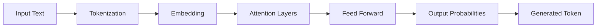

# 🧠 LLM Fundamentals

> **"Prompt engineering is programming in natural language."**

Large Language Models (LLMs) have revolutionized how we build AI applications. Understanding how they work and how to use them effectively is essential.

---

## 🎯 Core Concepts

### What is an LLM?

LLMs are neural networks trained on vast amounts of text data to predict the next token. Key characteristics:

| Concept | Description |
|---------|-------------|
| **Tokens** | Text broken into pieces (~4 chars in English) |
| **Context Window** | Maximum tokens the model can "see" |
| **Temperature** | Randomness in output (0 = deterministic) |
| **Top-p** | Nucleus sampling - probability threshold |

### Model Comparison

| Model | Context Window | Strengths | Best For |
|-------|---------------|-----------|----------|
| **GPT-4** | 128K | Reasoning, coding | Complex tasks |
| **Claude 3** | 200K | Long context, nuance | Analysis, writing |
| **Gemini** | 1M+ | Multimodal | Mixed content |
| **Llama 3** | 8K-128K | Open source, fine-tuning | Privacy, customization |

---

## ✨ Prompt Engineering

### Prompting Techniques

| Technique | Description | Example Use Case |
|-----------|-------------|------------------|
| **Zero-shot** | Direct instruction | Simple classification |
| **Few-shot** | Examples in prompt | Format guidance |
| **Chain-of-Thought** | Step-by-step reasoning | Math, logic problems |
| **Self-Consistency** | Multiple reasoning paths | Complex decisions |
| **ReAct** | Reasoning + Acting | Tool use, agents |

### Zero-Shot vs Few-Shot

```markdown
# Zero-Shot
Classify the sentiment: "This product is amazing!" → Positive

# Few-Shot  
Classify sentiment:
"I love it" → Positive
"Terrible quality" → Negative
"It's okay" → Neutral

Now classify: "Best purchase ever!" → ?
```

### Chain-of-Thought Prompting

```markdown
# Without CoT
Q: If a train travels 60 mph for 2.5 hours, how far does it go?
A: 150 miles

# With CoT
Q: If a train travels 60 mph for 2.5 hours, how far does it go?
A: Let me think step by step:
   1. Speed = 60 miles per hour
   2. Time = 2.5 hours
   3. Distance = Speed × Time
   4. Distance = 60 × 2.5 = 150 miles
```

### Prompt Structure Template

```markdown
# Role
You are an expert [domain] assistant.

# Context
[Relevant background information]

# Task
[Clear, specific instruction]

# Format
[Expected output structure]

# Examples (optional)
[Input → Output examples]

# Constraints
- [Constraint 1]
- [Constraint 2]
```

---

## 🔧 Practical Tips

### Token Optimization

```python
# Expensive (verbose)
"Please provide a detailed and comprehensive analysis of..."

# Efficient (concise)
"Analyze briefly:"
```

### System Prompts

```markdown
# System prompt best practices:
✅ Define role and expertise
✅ Set tone and style
✅ Specify output format
✅ Include guardrails

# Example:
"You are a senior software engineer reviewing code.
Be concise and actionable. Use bullet points.
Focus on bugs, performance, and security issues only."
```

### Temperature Guide

| Temperature | Behavior | Use Case |
|-------------|----------|----------|
| **0.0** | Deterministic | Code generation, facts |
| **0.3** | Slightly creative | Technical writing |
| **0.7** | Balanced | General conversation |
| **1.0** | Creative | Brainstorming, stories |

---

## 📊 Understanding Transformers



### Attention Mechanism (Simplified)

The **self-attention** mechanism allows each token to "look at" all other tokens:

- **Query (Q)**: What am I looking for?
- **Key (K)**: What do I contain?
- **Value (V)**: What do I contribute?

```
Attention(Q, K, V) = softmax(QK^T / √d) × V
```

---

## 📝 Detailed Topics

- [Advanced Prompting Techniques](/documentation/docs/ai/llm-fundamentals/advanced-prompting)
- [Model Fine-tuning](/documentation/docs/ai/llm-fundamentals/fine-tuning)
- [Token Economics](/documentation/docs/ai/llm-fundamentals/tokens)
- [Evaluation Metrics](/documentation/docs/ai/llm-fundamentals/evaluation)

---

:::tip Pro Tips
1. **Be specific** - Vague prompts get vague answers
2. **Iterate** - Refine prompts based on outputs
3. **Use delimiters** - Separate sections clearly (```, ###, ---)
4. **Ask for reasoning** - "Explain your thinking"
5. **Test edge cases** - Models can be brittle
:::
