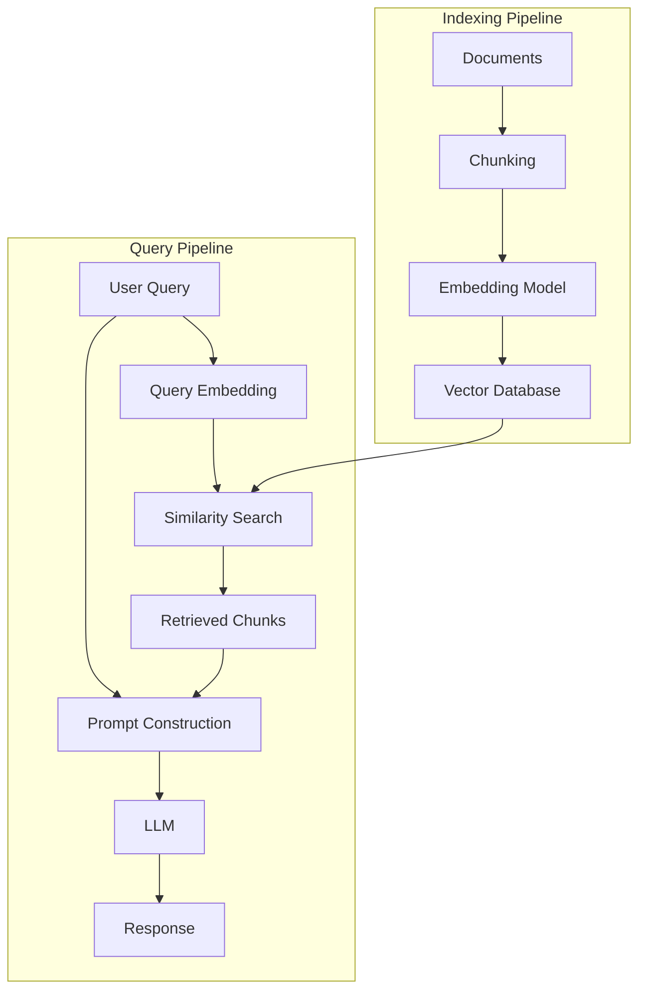
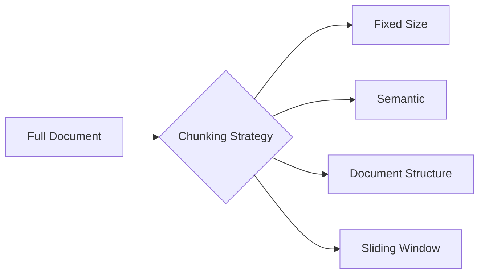
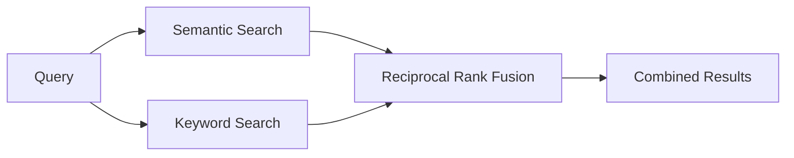

# 📚 RAG Systems

> **"RAG bridges the gap between static LLM knowledge and dynamic, domain-specific information."**

Retrieval-Augmented Generation (RAG) enhances LLM capabilities by providing relevant context from external knowledge bases.

---

## 🎯 Why RAG?

| LLM Limitation | How RAG Solves It |
|----------------|-------------------|
| Knowledge cutoff | Provides current information |
| Hallucinations | Grounds responses in facts |
| No private data | Accesses internal documents |
| Expensive fine-tuning | No model training needed |

---

## 🏗️ RAG Architecture



---

## 🔢 Embeddings

### What Are Embeddings?

Embeddings convert text into dense vector representations that capture semantic meaning:

```
"The cat sat on the mat" → [0.012, -0.034, 0.089, ...]  # 1536 dimensions
```

### Embedding Models Comparison

| Model | Dimensions | Quality | Speed | Cost |
|-------|------------|---------|-------|------|
| **OpenAI Ada-002** | 1536 | Excellent | Fast | $0.0001/1K tokens |
| **OpenAI 3-small** | 1536 | Excellent | Fast | $0.00002/1K tokens |
| **BGE-Large** | 1024 | Very Good | Medium | Free (self-hosted) |
| **E5-Large** | 1024 | Very Good | Medium | Free (self-hosted) |
| **Cohere Embed** | 1024 | Excellent | Fast | $0.0001/1K tokens |

### Similarity Metrics

| Metric | Formula | Use Case |
|--------|---------|----------|
| **Cosine Similarity** | cos(θ) = A·B / (\|A\|\|B\|) | Normalized vectors |
| **Euclidean Distance** | √Σ(aᵢ - bᵢ)² | Magnitude matters |
| **Dot Product** | Σ(aᵢ × bᵢ) | Pre-normalized vectors |

---

## ✂️ Chunking Strategies



### Strategy Comparison

| Strategy | Description | Pros | Cons |
|----------|-------------|------|------|
| **Fixed Size** | Split by character count | Simple, predictable | May break context |
| **Recursive** | Split by separators hierarchy | Respects boundaries | Complex to tune |
| **Semantic** | Split by meaning change | Best context | Computationally expensive |
| **Document** | Split by structure (H1, H2...) | Natural breaks | Uneven chunk sizes |

### Chunking Best Practices

```python
# Recommended chunk configuration
chunk_size = 512  # tokens (not characters)
chunk_overlap = 50  # prevent context loss at boundaries

# Include metadata
{
    "content": "The actual chunk text...",
    "metadata": {
        "source": "financial_report_2024.pdf",
        "page": 15,
        "section": "Revenue Analysis",
        "created_at": "2024-01-15"
    }
}
```

---

## 🗄️ Vector Databases

### Database Comparison

| Database | Type | Scalability | Special Features |
|----------|------|-------------|------------------|
| **Pinecone** | Managed | Very High | Serverless, filtering |
| **Milvus** | Self-hosted | Very High | GPU acceleration |
| **Weaviate** | Hybrid | High | Built-in ML modules |
| **PgVector** | SQL Extension | Medium | PostgreSQL integration |
| **Chroma** | In-memory/Local | Low-Medium | Easy development |

### PgVector Example

```sql
-- Enable extension
CREATE EXTENSION vector;

-- Create table with embedding column
CREATE TABLE documents (
    id SERIAL PRIMARY KEY,
    content TEXT,
    embedding vector(1536),  -- OpenAI dimension
    metadata JSONB
);

-- Create index for fast similarity search
CREATE INDEX ON documents 
USING ivfflat (embedding vector_cosine_ops)
WITH (lists = 100);

-- Query similar documents
SELECT content, 1 - (embedding <=> $1) AS similarity
FROM documents
ORDER BY embedding <=> $1
LIMIT 5;
```

---

## 🔄 Advanced RAG Patterns

### Hybrid Search



### Query Transformation

| Technique | Description |
|-----------|-------------|
| **Query Expansion** | Add synonyms and related terms |
| **HyDE** | Generate hypothetical document, then search |
| **Multi-Query** | Generate multiple query variations |
| **Step-back** | Abstract to higher-level concepts |

### Re-ranking

```python
# Two-stage retrieval
# 1. Fast initial retrieval (vector similarity)
initial_results = vector_db.similarity_search(query, k=20)

# 2. Re-rank with cross-encoder for precision
reranked = cross_encoder.rank(query, initial_results)
final_results = reranked[:5]
```

---

## 📝 Detailed Topics

- [Document Loaders](/documentation/docs/ai/rag/document-loaders)
- [Chunking Deep Dive](/documentation/docs/ai/rag/chunking)
- [Hybrid Search Implementation](/documentation/docs/ai/rag/hybrid-search)
- [Evaluation Metrics (RAGAS)](/documentation/docs/ai/rag/evaluation)
- [Production RAG Patterns](/documentation/docs/ai/rag/production)

---

:::tip Production Considerations
1. **Chunk size matters** - Too small loses context, too large reduces precision
2. **Metadata filtering** - Use filters before vector search when possible
3. **Monitor retrieval quality** - Track relevance of retrieved chunks
4. **Cache embeddings** - Avoid re-computing for same queries
5. **Handle edge cases** - What if no relevant documents found?
:::
