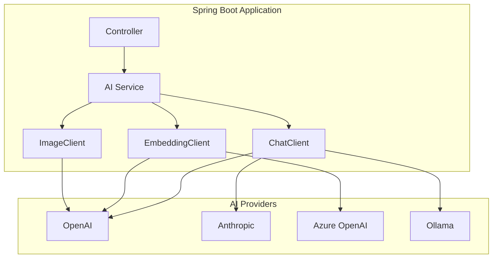

# 🍃 Spring AI

> **"Bringing the power of AI to the enterprise Java ecosystem."**

Spring AI provides a consistent abstraction layer for integrating AI capabilities into Spring Boot applications, supporting multiple AI providers with a unified API.

---

## 🎯 Why Spring AI?

| Benefit | Description |
|---------|-------------|
| **Familiar Patterns** | Spring conventions, dependency injection |
| **Provider Agnostic** | Switch between OpenAI, Anthropic, Ollama, etc. |
| **Production Ready** | Built-in retry, circuit breaker, observability |
| **Type Safe** | Java/Kotlin type safety, no JSON juggling |

---

## 🏗️ Architecture



---

## 🚀 Quick Start

### Dependencies

```xml
<!-- Spring AI BOM -->
<dependencyManagement>
    <dependencies>
        <dependency>
            <groupId>org.springframework.ai</groupId>
            <artifactId>spring-ai-bom</artifactId>
            <version>1.0.0-M4</version>
            <type>pom</type>
            <scope>import</scope>
        </dependency>
    </dependencies>
</dependencyManagement>

<!-- OpenAI Starter -->
<dependency>
    <groupId>org.springframework.ai</groupId>
    <artifactId>spring-ai-openai-spring-boot-starter</artifactId>
</dependency>
```

### Configuration

```yaml
# application.yml
spring:
  ai:
    openai:
      api-key: ${OPENAI_API_KEY}
      chat:
        options:
          model: gpt-4o
          temperature: 0.7
```

---

## 💬 Chat Client

### Basic Usage

```java
@Service
public class ChatService {
    
    private final ChatClient chatClient;
    
    public ChatService(ChatClient.Builder builder) {
        this.chatClient = builder.build();
    }
    
    public String chat(String userMessage) {
        return chatClient.prompt()
            .user(userMessage)
            .call()
            .content();
    }
}
```

### With System Prompt

```java
public String chatWithContext(String userMessage) {
    return chatClient.prompt()
        .system("You are a helpful assistant specialized in Java programming.")
        .user(userMessage)
        .call()
        .content();
}
```

### Streaming Response

```java
public Flux<String> streamChat(String userMessage) {
    return chatClient.prompt()
        .user(userMessage)
        .stream()
        .content();
}
```

---

## 📝 Output Parsing

### Structured Output

```java
// Define response structure
public record MovieRecommendation(
    String title,
    int year,
    String genre,
    String reason
) {}

// Parse LLM output to Java object
public MovieRecommendation getRecommendation(String preferences) {
    return chatClient.prompt()
        .user("Recommend a movie for someone who likes: " + preferences)
        .call()
        .entity(MovieRecommendation.class);
}
```

### List Output

```java
public List<MovieRecommendation> getRecommendations(String preferences) {
    return chatClient.prompt()
        .user("Recommend 3 movies for: " + preferences)
        .call()
        .entity(new ParameterizedTypeReference<List<MovieRecommendation>>() {});
}
```

---

## 🔧 Function Calling

### Define Functions

```java
@Configuration
public class FunctionConfig {
    
    @Bean
    @Description("Get current weather for a location")
    public Function<WeatherRequest, WeatherResponse> currentWeather() {
        return request -> {
            // Call weather API
            return new WeatherResponse(
                request.city(),
                72.0,
                "Sunny"
            );
        };
    }
}

record WeatherRequest(String city, String unit) {}
record WeatherResponse(String city, double temperature, String condition) {}
```

### Use Functions in Chat

```java
public String chatWithWeather(String userMessage) {
    return chatClient.prompt()
        .user(userMessage)
        .functions("currentWeather")  // Enable the function
        .call()
        .content();
}

// User: "What's the weather in Seattle?"
// Agent: calls currentWeather("Seattle")
// Response: "It's currently 72°F and sunny in Seattle."
```

---

## 🔢 Embeddings

### Generate Embeddings

```java
@Service
public class EmbeddingService {
    
    private final EmbeddingModel embeddingModel;
    
    public EmbeddingService(EmbeddingModel embeddingModel) {
        this.embeddingModel = embeddingModel;
    }
    
    public float[] embed(String text) {
        EmbeddingResponse response = embeddingModel.embedForResponse(
            List.of(text)
        );
        return response.getResult().getOutput();
    }
    
    public List<float[]> embedBatch(List<String> texts) {
        return embeddingModel.embed(texts);
    }
}
```

---

## 📚 RAG with Spring AI

### Vector Store Integration

```java
@Configuration
public class VectorStoreConfig {
    
    @Bean
    public VectorStore vectorStore(EmbeddingModel embeddingModel) {
        return new PgVectorStore(
            jdbcTemplate,
            embeddingModel,
            PgVectorStore.Options.builder()
                .dimensions(1536)
                .distanceType(DistanceType.COSINE)
                .build()
        );
    }
}
```

### RAG Service

```java
@Service
public class RAGService {
    
    private final VectorStore vectorStore;
    private final ChatClient chatClient;
    
    public String askWithContext(String question) {
        // 1. Retrieve relevant documents
        List<Document> documents = vectorStore
            .similaritySearch(question);
        
        // 2. Build context
        String context = documents.stream()
            .map(Document::getContent)
            .collect(Collectors.joining("\n\n"));
        
        // 3. Generate response with context
        return chatClient.prompt()
            .system("""
                Answer questions based on the provided context.
                If the answer is not in the context, say so.
                
                Context:
                """ + context)
            .user(question)
            .call()
            .content();
    }
}
```

---

## 📝 Detailed Topics

- [Multi-Provider Setup](/documentation/docs/ai/spring-ai/providers)
- [Advisors & Middleware](/documentation/docs/ai/spring-ai/advisors)
- [Observability & Tracing](/documentation/docs/ai/spring-ai/observability)
- [Testing AI Components](/documentation/docs/ai/spring-ai/testing)
- [Production Best Practices](/documentation/docs/ai/spring-ai/production)

---

:::tip Spring AI Best Practices
1. **Use ChatClient.Builder** - Better for testing and configuration
2. **External API keys** - Never hardcode, use environment variables
3. **Implement retries** - AI APIs have rate limits and failures
4. **Monitor tokens** - Track usage for cost control
5. **Cache responses** - When appropriate for deterministic queries
:::
