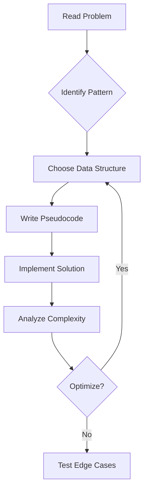

# 📊 Algorithms & Data Structures

> **"An algorithm must be seen to be believed."** — Donald Knuth

Mastering algorithms is about recognizing **patterns**, not memorizing solutions. This section organizes problems by solving patterns to build transferable problem-solving skills.

---

## 🎯 Pattern-Based Learning

### Array & String Patterns
| Pattern | Key Technique | Example Problems |
|---------|--------------|------------------|
| **Two Pointers** | Start/End convergence | Valid Palindrome, 3Sum |
| **Sliding Window** | Dynamic window sizing | Longest Substring, Max Subarray |
| **Prefix Sum** | Cumulative computation | Range Sum Query, Subarray Sum |

### Linked List Patterns
| Pattern | Key Technique | Example Problems |
|---------|--------------|------------------|
| **Fast & Slow** | Cycle detection | Linked List Cycle, Find Middle |
| **Reversal** | In-place modification | Reverse List, Reverse K Group |
| **Merge** | Combine sorted lists | Merge Two Lists, Merge K Lists |

### Tree & Graph Patterns
| Pattern | Key Technique | Example Problems |
|---------|--------------|------------------|
| **DFS** | Recursion, Stack | Path Sum, Tree Diameter |
| **BFS** | Queue, Level Order | Level Order Traversal, Shortest Path |
| **Union Find** | Disjoint sets | Number of Islands, Graph Connectivity |

### Dynamic Programming Patterns
| Pattern | Key Technique | Example Problems |
|---------|--------------|------------------|
| **1D DP** | Single state array | Climbing Stairs, House Robber |
| **2D DP** | Matrix state | Unique Paths, Edit Distance |
| **Knapsack** | Weight/Value optimization | 0/1 Knapsack, Coin Change |

---

## 🏗️ Core Data Structure Implementations

### Essential Structures

```java
// HashMap Implementation Concept
public class SimpleHashMap<K, V> {
    private static final int INITIAL_CAPACITY = 16;
    private Node<K, V>[] buckets;
    
    // Key insight: hash(key) % capacity -> bucket index
    // Collision handling: Separate chaining (linked list)
}
```

### Structure Complexity Reference

| Structure | Access | Search | Insert | Delete |
|-----------|--------|--------|--------|--------|
| Array | O(1) | O(n) | O(n) | O(n) |
| LinkedList | O(n) | O(n) | O(1) | O(1) |
| HashMap | - | O(1)* | O(1)* | O(1)* |
| TreeMap | - | O(log n) | O(log n) | O(log n) |
| Heap | - | O(n) | O(log n) | O(log n) |

*Average case, worst case O(n) for hash collisions

---

## 📝 Detailed Notes

Explore specific algorithm categories:

- [Two Pointers Pattern](/documentation/docs/cs/algorithms/two-pointers)
- [Sliding Window Pattern](/documentation/docs/cs/algorithms/sliding-window)
- [Dynamic Programming](/documentation/docs/cs/algorithms/dynamic-programming)
- [Graph Algorithms](/documentation/docs/cs/algorithms/graphs)
- [Tree Traversals](/documentation/docs/cs/algorithms/trees)

---

## 🧠 Problem-Solving Framework



---

:::tip Interview Strategy
1. **Clarify** - Ask about constraints, edge cases
2. **Plan** - Discuss approach before coding
3. **Execute** - Write clean, modular code
4. **Verify** - Walk through with examples
5. **Optimize** - Discuss potential improvements
:::
