# 🗄️ Database Internals

> **"The database is the heart of any application."**

Understanding database internals helps you write efficient queries, choose the right data model, and optimize performance under load.

---

## 🔍 MySQL Indexing

### Index Types

| Type | Description | Use Case |
|------|-------------|----------|
| **B+ Tree** | Balanced tree, range queries | Primary keys, most columns |
| **Hash** | O(1) lookup | Exact match only |
| **Full-Text** | Text search | Document search |
| **Composite** | Multi-column | Multi-condition queries |

### Index Optimization Rules

```sql
-- ✅ Good: Index can be fully utilized
SELECT * FROM users WHERE status = 'active' AND created_at > '2024-01-01';
-- Index: (status, created_at)

-- ❌ Bad: Index cannot help with leading wildcard
SELECT * FROM users WHERE name LIKE '%john%';

-- ✅ Good: Covering index (no table lookup)
SELECT id, name FROM users WHERE status = 'active';
-- Index: (status, id, name) -- includes all needed columns
```

### Query Analysis

```sql
EXPLAIN SELECT * FROM orders 
WHERE user_id = 100 AND status = 'pending'
ORDER BY created_at DESC;
```

| Column | What to Check |
|--------|---------------|
| **type** | Should be `ref`, `eq_ref` or `range`, not `ALL` |
| **key** | Index being used |
| **rows** | Estimated rows scanned (lower is better) |
| **Extra** | Watch for `Using filesort`, `Using temporary` |

---

## 🔐 Transaction Isolation Levels

```mermaid
flowchart TD
    A[Read Uncommitted] --> B[Read Committed]
    B --> C[Repeatable Read]
    C --> D[Serializable]
    
    A -.->|Dirty Read| E[❌ Problem]
    B -.->|Non-repeatable Read| F[❌ Problem]
    C -.->|Phantom Read| G[❌ Problem]
    D -.->|Performance Hit| H[⚠️ Trade-off]
```



| Level | Dirty Read | Non-Repeatable | Phantom Read | Performance |
|-------|------------|----------------|--------------|-------------|
| **Read Uncommitted** | ✓ | ✓ | ✓ | Fastest |
| **Read Committed** | ✗ | ✓ | ✓ | Fast |
| **Repeatable Read** | ✗ | ✗ | ✓* | Medium |
| **Serializable** | ✗ | ✗ | ✗ | Slowest |

*MySQL InnoDB prevents phantom reads with gap locking

---

## ⚡ Redis Caching

### Data Structures

| Structure | Use Case | Commands |
|-----------|----------|----------|
| **String** | Simple cache, counters | `GET`, `SET`, `INCR` |
| **Hash** | Object storage | `HGET`, `HSET`, `HMGET` |
| **List** | Message queues, feeds | `LPUSH`, `RPOP`, `LRANGE` |
| **Set** | Unique items | `SADD`, `SMEMBERS`, `SINTER` |
| **Sorted Set** | Leaderboards, timelines | `ZADD`, `ZRANGE`, `ZRANK` |

### Caching Patterns

```java
// Cache-Aside Pattern
public User getUser(Long id) {
    String key = "user:" + id;
    
    // 1. Check cache
    User cached = redis.get(key);
    if (cached != null) return cached;
    
    // 2. Cache miss - fetch from DB
    User user = userRepository.findById(id);
    
    // 3. Store in cache with TTL
    redis.setex(key, 3600, user);
    
    return user;
}
```

### Cache Invalidation Strategies

| Strategy | Description | Consistency |
|----------|-------------|-------------|
| **TTL** | Expire after time | Eventual |
| **Write-through** | Update cache on write | Strong |
| **Event-driven** | Invalidate on events | Near real-time |
| **Version keys** | Append version to key | Strong |

### Persistence Options

| Mode | Description | Trade-off |
|------|-------------|-----------|
| **RDB** | Point-in-time snapshots | Faster recovery, data loss window |
| **AOF** | Append-only log | Minimal data loss, larger files |
| **RDB + AOF** | Combined approach | Best durability |

---

## 📝 Detailed Topics

- [MySQL Query Optimization](/documentation/docs/cs/database/mysql-optimization)
- [Deadlock Prevention](/documentation/docs/cs/database/deadlocks)
- [Redis Cluster Setup](/documentation/docs/cs/database/redis-cluster)
- [Connection Pooling](/documentation/docs/cs/database/connection-pooling)
- [NoSQL Comparison](/documentation/docs/cs/database/nosql-comparison)

---

:::tip Production Tips
1. **Always use connection pooling** (HikariCP for Java)
2. **Add indexes based on query patterns**, not guesses
3. **Monitor slow query logs** regularly
4. **Set appropriate TTLs** for cache entries
5. **Use read replicas** for read-heavy workloads
:::
