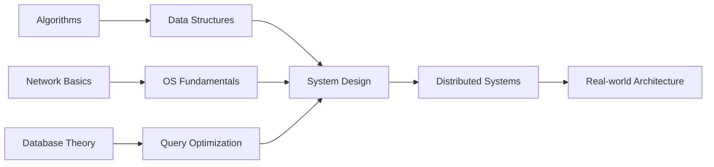

# 🧠 CS Core

> **"Master the fundamentals, and the rest will follow."**

This section covers the **foundational computer science knowledge** that every serious software engineer should master. These concepts form the bedrock of all software systems and demonstrate a deep understanding beyond just API integrations.

## Why CS Fundamentals Matter

In interviews and real-world engineering, understanding **why** things work is just as important as knowing **how** to use them. This section proves that foundation.

---

## 📚 Topics Covered

### [Algorithms & Data Structures](/documentation/docs/cs/algorithms)
Systematic problem-solving patterns and efficient data organization.
- LeetCode patterns (Two Pointers, Sliding Window, DP, etc.)
- Core data structure implementations in Java
- Time & Space complexity analysis

### [System Design](/documentation/docs/cs/system-design)
Building scalable, reliable, and maintainable systems.
- High concurrency & availability patterns
- Distributed systems fundamentals (CAP, BASE)
- Load balancing & caching strategies

### [Database Internals](/documentation/docs/cs/database)
Understanding how databases work under the hood.
- MySQL indexing & query optimization
- Transaction isolation levels (ACID)
- Redis caching strategies & persistence

### [Network & OS](/documentation/docs/cs/network-os)
The infrastructure that powers everything.
- TCP/IP handshake, HTTP/HTTPS protocols
- Linux essentials & process management
- Memory management & concurrency

---

## 🎯 Learning Path

---

## 📖 Quick References

| Topic | Key Concepts | Interview Focus |
|-------|-------------|-----------------|
| **Algorithms** | Sorting, Searching, Graph, DP | LeetCode Medium/Hard |
| **System Design** | Scalability, Reliability | Senior+ Interviews |
| **Database** | Indexing, Transactions | Backend Roles |
| **Network/OS** | Protocols, Processes | Infrastructure Roles |

---

:::tip Pro Tip
Start with **Algorithms** for coding interviews, then progress to **System Design** for senior positions. Database and Network knowledge will naturally integrate as you solve real-world problems.
:::
