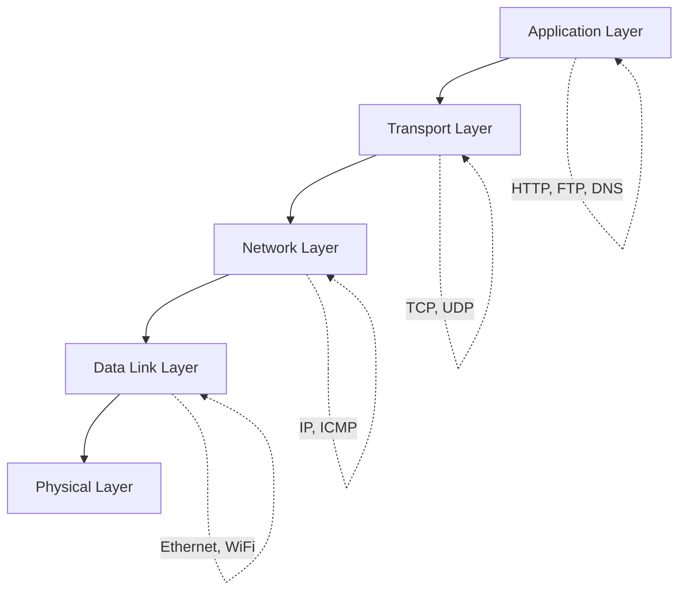
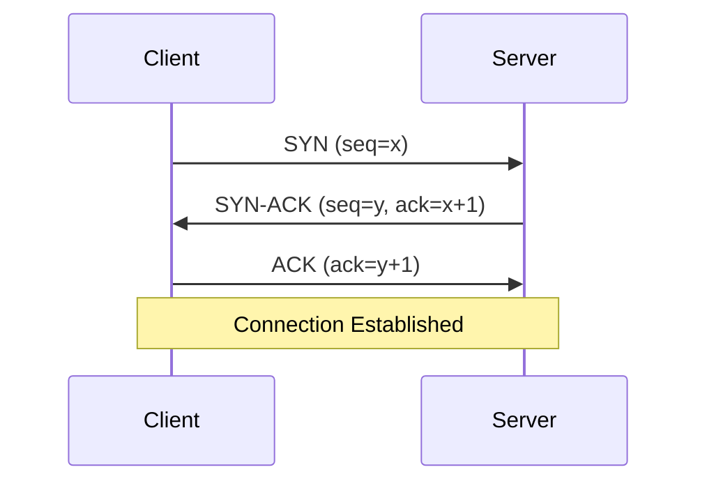
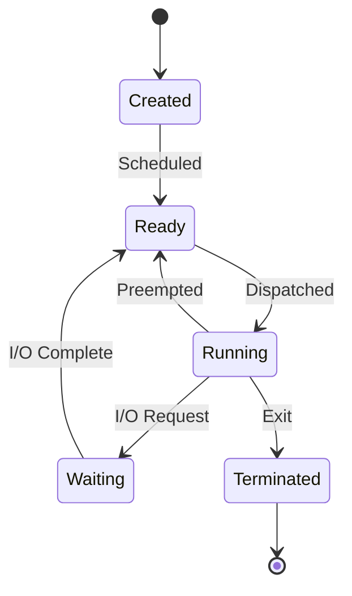

# 🌐 Network & Operating Systems

> **"Understanding the infrastructure helps you build better applications."**

Networks and operating systems form the foundation that all applications run on. Knowledge here helps debug complex issues and optimize performance.

---

## 🔗 Network Protocols

### TCP/IP Stack



### TCP Three-Way Handshake



### TCP vs UDP

| Feature | TCP | UDP |
|---------|-----|-----|
| **Connection** | Connection-oriented | Connectionless |
| **Reliability** | Guaranteed delivery | Best effort |
| **Ordering** | Maintained | Not guaranteed |
| **Speed** | Slower (overhead) | Faster |
| **Use Case** | HTTP, FTP, Email | DNS, Video streaming, Gaming |

### HTTP/HTTPS

| Version | Features |
|---------|----------|
| **HTTP/1.1** | Persistent connections, pipelining |
| **HTTP/2** | Multiplexing, header compression, server push |
| **HTTP/3** | QUIC (UDP-based), reduced latency |

```
HTTPS = HTTP + TLS/SSL
- Encrypts data in transit
- Verifies server identity
- Prevents man-in-the-middle attacks
```

---

## 🐧 Linux Essentials

### Essential Commands

| Category | Commands |
|----------|----------|
| **File System** | `ls`, `cd`, `cp`, `mv`, `rm`, `find`, `grep` |
| **Process** | `ps`, `top`, `htop`, `kill`, `nohup`, `&` |
| **Network** | `netstat`, `ss`, `curl`, `wget`, `ping`, `traceroute` |
| **Disk** | `df`, `du`, `mount`, `lsblk` |
| **System** | `systemctl`, `journalctl`, `dmesg` |

### Process Management

```bash
# View all processes
ps aux | grep java

# Real-time process monitoring
top -u $(whoami)

# Run in background
nohup java -jar app.jar > app.log 2>&1 &

# View open files/ports by process
lsof -i :8080
lsof -p <pid>

# Network connections
ss -tlnp  # TCP listening ports
netstat -an | grep ESTABLISHED
```

### File Permissions

```bash
# Format: rwx rwx rwx
#         user group others

chmod 755 script.sh  # rwxr-xr-x
chmod 600 secret.key # rw-------

# Ownership
chown user:group file
```

---

## 💾 Memory & Process

### Process States



### Memory Concepts

| Concept | Description |
|---------|-------------|
| **Virtual Memory** | Abstraction over physical memory |
| **Paging** | Fixed-size memory blocks |
| **Page Fault** | Accessing memory not in RAM |
| **Swap** | Using disk as extended memory |
| **Memory-mapped I/O** | File access via memory addresses |

### Concurrency Primitives

| Primitive | Description | Use Case |
|-----------|-------------|----------|
| **Mutex** | Mutual exclusion lock | Critical sections |
| **Semaphore** | Counting resource access | Resource pools |
| **Condition Variable** | Wait for condition | Producer-consumer |
| **Read-Write Lock** | Multiple readers, single writer | Read-heavy scenarios |

---

## 📝 Detailed Topics

- [DNS Resolution](/documentation/docs/cs/network-os/dns)
- [TLS/SSL Handshake](/documentation/docs/cs/network-os/tls)
- [Linux Performance Tuning](/documentation/docs/cs/network-os/linux-performance)
- [Container Networking](/documentation/docs/cs/network-os/container-networking)
- [System Calls](/documentation/docs/cs/network-os/syscalls)

---

## 🔧 Debugging Toolkit

```bash
# Network debugging
tcpdump -i eth0 port 80           # Capture HTTP traffic
curl -v https://api.example.com    # Verbose HTTP request
dig example.com                     # DNS lookup

# System debugging
strace -p <pid>                    # Trace system calls
vmstat 1                           # Virtual memory stats
iostat -x 1                        # I/O statistics

# Log analysis
tail -f /var/log/syslog            # Follow system logs
journalctl -u nginx -f             # Follow service logs
```

---

:::tip Key Takeaways
1. **TCP** for reliability, **UDP** for speed
2. **HTTPS** should be default for all web traffic
3. Master `grep`, `awk`, `sed` for log analysis
4. Understand process states for debugging hangs
5. Use `strace` when all else fails
:::
