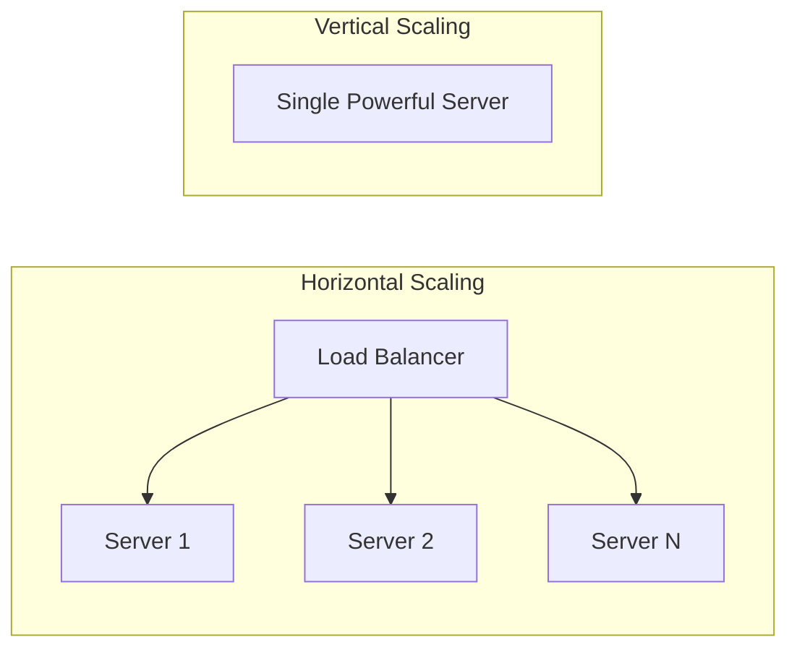

# 🏛️ System Design

> **"A complex system that works is invariably found to have evolved from a simple system that worked."** — John Gall

System design is about making **trade-offs** to build systems that are scalable, reliable, and maintainable.

---

## 🎯 Core Concepts

### Scalability Patterns



| Approach | Pros | Cons |
|----------|------|------|
| **Vertical** | Simple, no code changes | Hardware limits, single point of failure |
| **Horizontal** | Unlimited scale, fault tolerant | Complex, state management |

### High Availability Patterns

| Pattern | Description | Use Case |
|---------|-------------|----------|
| **Active-Passive** | Standby takes over on failure | Database failover |
| **Active-Active** | All nodes serve traffic | Web servers |
| **Leader Election** | One leader, multiple followers | Distributed consensus |

---

## 🔄 Distributed Systems

### CAP Theorem

```mermaid
graph TD
    A[CAP Theorem] --> B[Consistency]
    A --> C[Availability]
    A --> D[Partition Tolerance]
    
    B -.->|Choose 2| E[CA: Traditional RDBMS]
    C -.->|of 3| F[AP: Cassandra, DynamoDB]
    D -.->|| G[CP: MongoDB, HBase]
```

> During a network partition, you must choose between **Consistency** and **Availability**.

### BASE vs ACID

| Property | ACID | BASE |
|----------|------|------|
| **Consistency** | Strong | Eventual |
| **Availability** | Variable | High |
| **Scalability** | Limited | High |
| **Use Case** | Financial systems | Social media, caching |

---

## 🔧 Key Components

### Load Balancing Strategies

| Algorithm | Description | Best For |
|-----------|-------------|----------|
| **Round Robin** | Sequential distribution | Homogeneous servers |
| **Least Connections** | Route to least busy | Variable request times |
| **IP Hash** | Consistent per client | Session affinity |
| **Weighted** | Capacity-based routing | Heterogeneous servers |

### Caching Strategies

| Pattern | Description | Consistency |
|---------|-------------|-------------|
| **Cache Aside** | App manages cache/DB | Manual invalidation |
| **Write Through** | Write to cache + DB | Strong |
| **Write Behind** | Async DB writes | Eventual |
| **Read Through** | Cache fetches on miss | Automated |

---

## 📝 Detailed Topics

- [Distributed Locks](/documentation/docs/cs/system-design/distributed-locks)
- [Message Queues](/documentation/docs/cs/system-design/message-queues)
- [Microservices vs Monolith](/documentation/docs/cs/system-design/microservices)
- [Rate Limiting](/documentation/docs/cs/system-design/rate-limiting)
- [Database Sharding](/documentation/docs/cs/system-design/sharding)

---

## 🎨 Design Template

```markdown
## Requirements
- Functional: What should the system do?
- Non-functional: Scale, latency, availability targets

## High-Level Design
- Core components and their interactions
- Data flow diagram

## Deep Dive
- Database schema design
- API design
- Algorithm choices

## Trade-offs
- Why this approach vs alternatives?
- Scalability bottlenecks
```

---

:::tip Interview Framework
1. **Clarify Requirements** (2-3 min)
2. **High-Level Design** (10-15 min)
3. **Deep Dive** (15-20 min)
4. **Trade-offs & Bottlenecks** (5-10 min)
:::
