# Diagrams with Mermaid 📊

Create beautiful diagrams using simple text syntax.

## Flowcharts

### System Architecture

```mermaid
flowchart TB
    subgraph Client["🖥️ Client Layer"]
        Web[Web App]
        Mobile[Mobile App]
    end
    
    subgraph Gateway["🌐 API Gateway"]
        Kong[Kong Gateway]
        Auth[Auth Middleware]
    end
    
    subgraph Services["⚙️ Microservices"]
        User[User Service]
        Order[Order Service]
        Payment[Payment Service]
        Notification[Notification Service]
    end
    
    subgraph Data["💾 Data Layer"]
        PostgreSQL[(PostgreSQL)]
        Redis[(Redis Cache)]
        Kafka[Kafka]
    end
    
    Web --> Kong
    Mobile --> Kong
    Kong --> Auth
    Auth --> User
    Auth --> Order
    Auth --> Payment
    Order --> Kafka
    Kafka --> Notification
    User --> PostgreSQL
    Order --> PostgreSQL
    Payment --> PostgreSQL
    Services --> Redis
```

## Sequence Diagrams

### Authentication Flow

```mermaid
sequenceDiagram
    autonumber
    participant U as 👤 User
    participant C as 📱 Client
    participant G as 🌐 Gateway
    participant A as 🔐 Auth Service
    participant D as 🗄️ Database

    U->>C: Enter credentials
    C->>G: POST /auth/login
    G->>A: Validate credentials
    A->>D: Query user
    D-->>A: User data
    
    alt Valid credentials
        A->>A: Generate JWT
        A-->>G: Token + Refresh token
        G-->>C: 200 OK + Tokens
        C->>C: Store tokens
        C-->>U: Login successful
    else Invalid credentials
        A-->>G: 401 Unauthorized
        G-->>C: Error response
        C-->>U: Show error
    end
```

## State Diagrams

### Order Lifecycle

## Entity Relationship Diagrams

### Database Schema

## Git Graphs

### Git Flow

## Pie Charts

### Technology Stack Distribution

