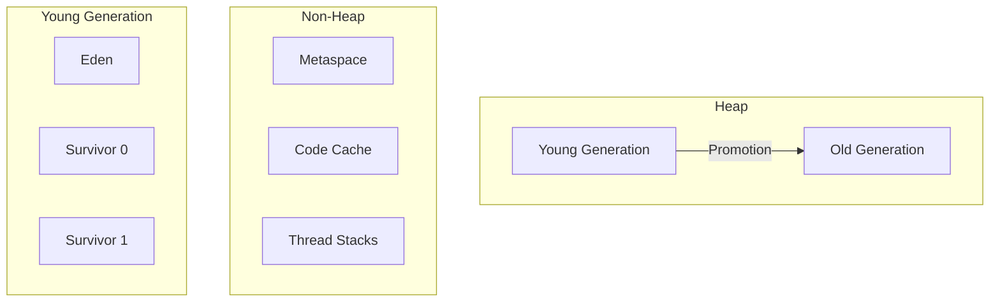

# ☕ Backend Development

> **"A well-designed backend is the foundation of any scalable application."**

Master the Java ecosystem for building robust, high-performance backend services.

---

## 🍃 Spring Boot

### Core Concepts

#### Application Startup Flow


#### Essential Annotations

| Annotation | Purpose |
|------------|---------|
| `@SpringBootApplication` | Entry point (combines 3 annotations) |
| `@RestController` | REST API endpoints |
| `@Service` | Business logic beans |
| `@Repository` | Data access beans |
| `@Configuration` | Java-based configuration |
| `@Bean` | Define Spring-managed beans |
| `@Autowired` | Dependency injection |

#### Auto-Configuration

```java
// Spring Boot auto-configures based on classpath
// Add starter → Get configuration
@ConditionalOnClass(DataSource.class)
@ConditionalOnProperty(name = "spring.datasource.url")
@AutoConfiguration
public class DataSourceAutoConfiguration {
    // Automatically creates DataSource bean
}
```

### Request Handling

```java
@RestController
@RequestMapping("/api/v1/users")
public class UserController {
    
    private final UserService userService;
    
    public UserController(UserService userService) {
        this.userService = userService;
    }
    
    @GetMapping("/{id}")
    public ResponseEntity<User> getUser(@PathVariable Long id) {
        return userService.findById(id)
            .map(ResponseEntity::ok)
            .orElse(ResponseEntity.notFound().build());
    }
    
    @PostMapping
    @ResponseStatus(HttpStatus.CREATED)
    public User createUser(@Valid @RequestBody CreateUserRequest request) {
        return userService.create(request);
    }
    
    @ExceptionHandler(UserNotFoundException.class)
    @ResponseStatus(HttpStatus.NOT_FOUND)
    public ErrorResponse handleNotFound(UserNotFoundException ex) {
        return new ErrorResponse(ex.getMessage());
    }
}
```

---

## ⚡ Concurrency (JUC)

### Thread Pools

```java
// ✅ Recommended: Use thread pools, not raw threads
ExecutorService executor = Executors.newFixedThreadPool(10);

// Better: CustomThreadPoolExecutor with tuned parameters
ThreadPoolExecutor executor = new ThreadPoolExecutor(
    5,                      // corePoolSize
    10,                     // maxPoolSize
    60L, TimeUnit.SECONDS,  // keepAliveTime
    new LinkedBlockingQueue<>(100),  // workQueue
    new ThreadPoolExecutor.CallerRunsPolicy()  // rejection policy
);
```

### CompletableFuture

```java
// Async composition
public CompletableFuture<OrderSummary> processOrder(Order order) {
    return CompletableFuture
        .supplyAsync(() -> validateOrder(order))
        .thenCompose(this::checkInventory)
        .thenCombine(calculateShipping(order), this::createSummary)
        .exceptionally(ex -> handleError(ex));
}

// Run multiple tasks in parallel
CompletableFuture.allOf(task1, task2, task3)
    .thenAccept(v -> {
        // All tasks completed
    });
```

### Locks and Synchronization

| Mechanism | Use Case |
|-----------|----------|
| `synchronized` | Simple mutual exclusion |
| `ReentrantLock` | More control (tryLock, fair) |
| `ReadWriteLock` | Multiple readers, single writer |
| `StampedLock` | Optimistic read locking |
| `Semaphore` | Limit concurrent access |

```java
// ReentrantLock with timeout
private final ReentrantLock lock = new ReentrantLock();

public void updateResource() {
    try {
        if (lock.tryLock(1, TimeUnit.SECONDS)) {
            try {
                // Critical section
            } finally {
                lock.unlock();
            }
        } else {
            throw new TimeoutException("Could not acquire lock");
        }
    } catch (InterruptedException e) {
        Thread.currentThread().interrupt();
    }
}
```

---

## 🧠 JVM Internals

### Memory Model



### Garbage Collection

| GC Type | Characteristics | Best For |
|---------|-----------------|----------|
| **G1** | Low latency, balanced | General purpose (default) |
| **ZGC** | Ultra-low pause (under 10ms) | Large heaps, latency-critical |
| **Parallel** | High throughput | Batch processing |
| **Shenandoah** | Low pause, concurrent | RedHat/OpenJDK |

### JVM Tuning Parameters

```bash
# Common production settings
java -Xms4g -Xmx4g \           # Heap size (min = max)
     -XX:+UseG1GC \             # Use G1 garbage collector
     -XX:MaxGCPauseMillis=200 \ # Target pause time
     -XX:+HeapDumpOnOutOfMemoryError \
     -Xlog:gc*:file=gc.log \    # GC logging
     -jar app.jar
```

### Profiling & Monitoring

```bash
# JFR (Java Flight Recorder)
jcmd <pid> JFR.start duration=60s filename=recording.jfr

# jstat - GC statistics
jstat -gcutil <pid> 1000

# jmap - Heap dump
jmap -dump:live,format=b,file=heap.hprof <pid>
```

---

## 📐 API Design

### REST Best Practices

| HTTP Method | Purpose | Idempotent |
|-------------|---------|------------|
| GET | Retrieve resource | Yes |
| POST | Create resource | No |
| PUT | Replace resource | Yes |
| PATCH | Partial update | Yes |
| DELETE | Remove resource | Yes |

### Response Structure

```java
// Consistent API response
public record ApiResponse<T>(
    boolean success,
    T data,
    String message,
    Map<String, Object> metadata
) {
    public static <T> ApiResponse<T> success(T data) {
        return new ApiResponse<>(true, data, null, null);
    }
    
    public static <T> ApiResponse<T> error(String message) {
        return new ApiResponse<>(false, null, message, null);
    }
}
```

---

## 📝 Detailed Topics

- [Spring Security](/documentation/docs/engineering/backend/spring-security)
- [Database Access (JPA/JDBC)](/documentation/docs/engineering/backend/database)
- [Caching Strategies](/documentation/docs/engineering/backend/caching)
- [Microservices Patterns](/documentation/docs/engineering/backend/microservices)
- [Testing Best Practices](/documentation/docs/engineering/backend/testing)

---

:::tip Performance Tips
1. **Connection pooling** - Use HikariCP (Spring Boot default)
2. **Lazy loading** - Only fetch data when needed
3. **Batch operations** - Reduce database round trips
4. **Async when possible** - Don't block for I/O
5. **Profile first** - Measure before optimizing
:::
