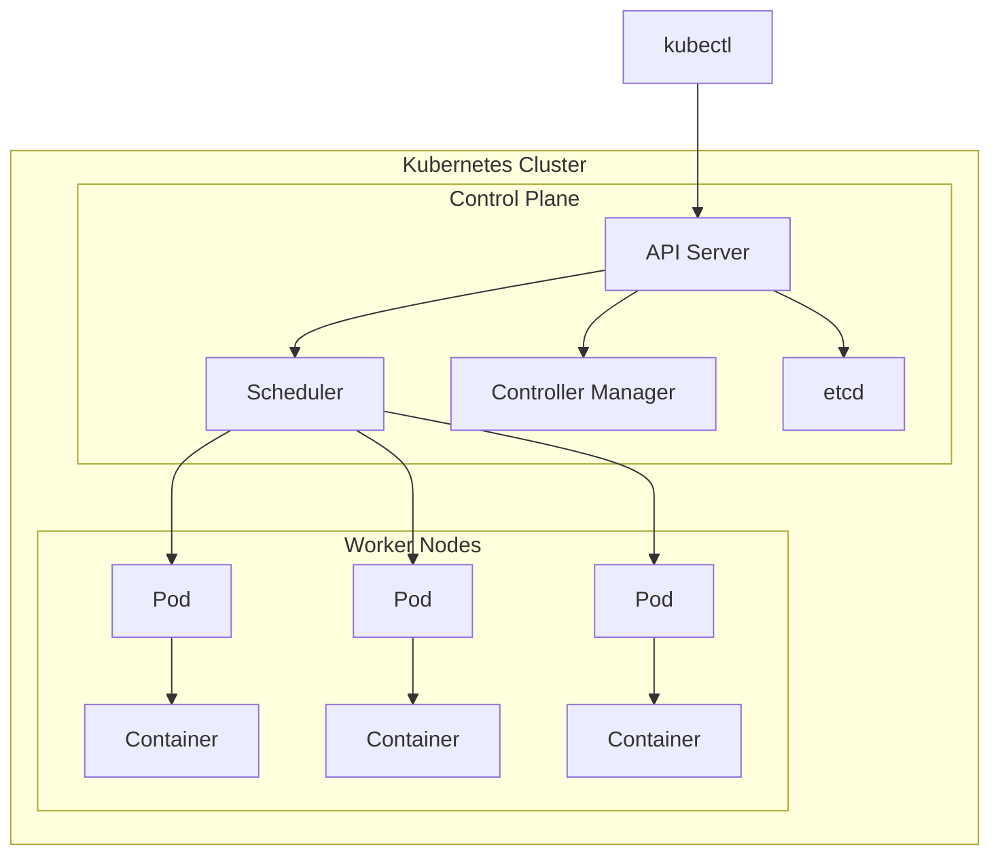

# ☁️ DevOps & Cloud

> **"Automate everything. If you do it twice, script it."**

Modern DevOps practices for deploying, scaling, and maintaining production applications.

---

## 🐳 Docker

### Dockerfile Best Practices

```dockerfile
# Multi-stage build for smaller images
FROM eclipse-temurin:21-jdk AS build
WORKDIR /app
COPY pom.xml .
COPY src ./src
RUN ./mvnw clean package -DskipTests

FROM eclipse-temurin:21-jre
WORKDIR /app
COPY --from=build /app/target/*.jar app.jar

# Non-root user for security
RUN addgroup --system app && adduser --system --group app
USER app

EXPOSE 8080
HEALTHCHECK --interval=30s --timeout=3s \
  CMD curl -f http://localhost:8080/actuator/health || exit 1

ENTRYPOINT ["java", "-jar", "app.jar"]
```

### Docker Compose

```yaml
# docker-compose.yml
version: '3.8'

services:
  app:
    build: .
    ports:
      - "8080:8080"
    environment:
      - SPRING_DATASOURCE_URL=jdbc:postgresql://db:5432/myapp
      - SPRING_REDIS_HOST=cache
    depends_on:
      db:
        condition: service_healthy
      cache:
        condition: service_started
    networks:
      - backend

  db:
    image: postgres:16
    environment:
      POSTGRES_DB: myapp
      POSTGRES_USER: user
      POSTGRES_PASSWORD: password
    volumes:
      - postgres_data:/var/lib/postgresql/data
    healthcheck:
      test: ["CMD-SHELL", "pg_isready -U user -d myapp"]
      interval: 10s
      timeout: 5s
      retries: 5
    networks:
      - backend

  cache:
    image: redis:7-alpine
    networks:
      - backend

volumes:
  postgres_data:

networks:
  backend:
```

### Essential Commands

```bash
# Build and run
docker build -t myapp:latest .
docker run -d -p 8080:8080 --name myapp myapp:latest

# Compose operations
docker compose up -d
docker compose logs -f app
docker compose down -v

# Debugging
docker exec -it myapp /bin/sh
docker logs --tail 100 -f myapp
docker stats
```

---

## ☸️ Kubernetes

### Core Concepts



### Deployment Example

```yaml
# deployment.yaml
apiVersion: apps/v1
kind: Deployment
metadata:
  name: myapp
  labels:
    app: myapp
spec:
  replicas: 3
  selector:
    matchLabels:
      app: myapp
  template:
    metadata:
      labels:
        app: myapp
    spec:
      containers:
      - name: myapp
        image: myapp:latest
        ports:
        - containerPort: 8080
        resources:
          requests:
            memory: "256Mi"
            cpu: "250m"
          limits:
            memory: "512Mi"
            cpu: "500m"
        livenessProbe:
          httpGet:
            path: /actuator/health
            port: 8080
          initialDelaySeconds: 30
          periodSeconds: 10
        readinessProbe:
          httpGet:
            path: /actuator/health/readiness
            port: 8080
          initialDelaySeconds: 5
          periodSeconds: 5
---
apiVersion: v1
kind: Service
metadata:
  name: myapp-service
spec:
  selector:
    app: myapp
  ports:
  - port: 80
    targetPort: 8080
  type: LoadBalancer
```

### Kubectl Commands

```bash
# Cluster info
kubectl cluster-info
kubectl get nodes

# Deployments
kubectl apply -f deployment.yaml
kubectl get pods -w
kubectl describe pod myapp-xxx

# Scaling
kubectl scale deployment myapp --replicas=5

# Debugging
kubectl logs myapp-xxx -f
kubectl exec -it myapp-xxx -- /bin/sh
kubectl port-forward svc/myapp-service 8080:80

# Rolling updates
kubectl set image deployment/myapp myapp=myapp:v2
kubectl rollout status deployment/myapp
kubectl rollout undo deployment/myapp
```

---

## 🔄 CI/CD with GitHub Actions

### Complete Workflow

```yaml
# .github/workflows/deploy.yml
name: Build and Deploy

on:
  push:
    branches: [main]
  pull_request:
    branches: [main]

env:
  REGISTRY: ghcr.io
  IMAGE_NAME: ${{ github.repository }}

jobs:
  test:
    runs-on: ubuntu-latest
    steps:
      - uses: actions/checkout@v4
      
      - name: Set up JDK 21
        uses: actions/setup-java@v4
        with:
          java-version: '21'
          distribution: 'temurin'
          cache: maven
      
      - name: Run tests
        run: ./mvnw verify

  build:
    needs: test
    runs-on: ubuntu-latest
    if: github.ref == 'refs/heads/main'
    
    steps:
      - uses: actions/checkout@v4
      
      - name: Set up Docker Buildx
        uses: docker/setup-buildx-action@v3
      
      - name: Login to Container Registry
        uses: docker/login-action@v3
        with:
          registry: ${{ env.REGISTRY }}
          username: ${{ github.actor }}
          password: ${{ secrets.GITHUB_TOKEN }}
      
      - name: Build and push
        uses: docker/build-push-action@v5
        with:
          context: .
          push: true
          tags: |
            ${{ env.REGISTRY }}/${{ env.IMAGE_NAME }}:latest
            ${{ env.REGISTRY }}/${{ env.IMAGE_NAME }}:${{ github.sha }}
          cache-from: type=gha
          cache-to: type=gha,mode=max

  deploy:
    needs: build
    runs-on: ubuntu-latest
    environment: production
    
    steps:
      - name: Deploy to Kubernetes
        uses: azure/k8s-deploy@v4
        with:
          manifests: k8s/
          images: |
            ${{ env.REGISTRY }}/${{ env.IMAGE_NAME }}:${{ github.sha }}
```

---

## ☁️ Cloud Platforms

### AWS Services Overview

| Service | Purpose | Alternative |
|---------|---------|-------------|
| **EC2** | Virtual servers | GCP Compute Engine |
| **S3** | Object storage | GCP Cloud Storage |
| **RDS** | Managed databases | GCP Cloud SQL |
| **Lambda** | Serverless functions | GCP Cloud Functions |
| **EKS** | Managed Kubernetes | GCP GKE |
| **CloudWatch** | Monitoring | GCP Cloud Monitoring |
| **SQS/SNS** | Messaging | GCP Pub/Sub |

### AWS CLI Examples

```bash
# S3 operations
aws s3 cp file.txt s3://mybucket/
aws s3 sync ./dist s3://mybucket/static/

# ECR (Container Registry)
aws ecr get-login-password | docker login --username AWS --password-stdin <account>.dkr.ecr.<region>.amazonaws.com
docker tag myapp:latest <account>.dkr.ecr.<region>.amazonaws.com/myapp:latest
docker push <account>.dkr.ecr.<region>.amazonaws.com/myapp:latest

# ECS / EKS
aws ecs update-service --cluster mycluster --service myapp --force-new-deployment
aws eks update-kubeconfig --name mycluster --region us-east-1
```

---

## 📊 Monitoring & Observability

### The Three Pillars

| Pillar | Purpose | Tools |
|--------|---------|-------|
| **Logs** | Event records | ELK Stack, Loki, CloudWatch Logs |
| **Metrics** | Measurements | Prometheus, Datadog, CloudWatch |
| **Traces** | Request flow | Jaeger, Zipkin, X-Ray |

```yaml
# Prometheus scrape config
scrape_configs:
  - job_name: 'spring-app'
    metrics_path: '/actuator/prometheus'
    static_configs:
      - targets: ['app:8080']
```

---

## 📝 Detailed Topics

- [Docker Networking](/documentation/docs/engineering/devops/docker-networking)
- [Kubernetes RBAC](/documentation/docs/engineering/devops/k8s-rbac)
- [Helm Charts](/documentation/docs/engineering/devops/helm)
- [Infrastructure as Code (Terraform)](/documentation/docs/engineering/devops/terraform)
- [Security Best Practices](/documentation/docs/engineering/devops/security)

---

:::tip DevOps Principles
1. **Infrastructure as Code** - Version control everything
2. **Immutable infrastructure** - Replace, don't patch
3. **Automate deployments** - Reduce human error
4. **Monitor everything** - Know before users complain
5. **Fail forward** - Quick rollbacks, blameless postmortems
:::
