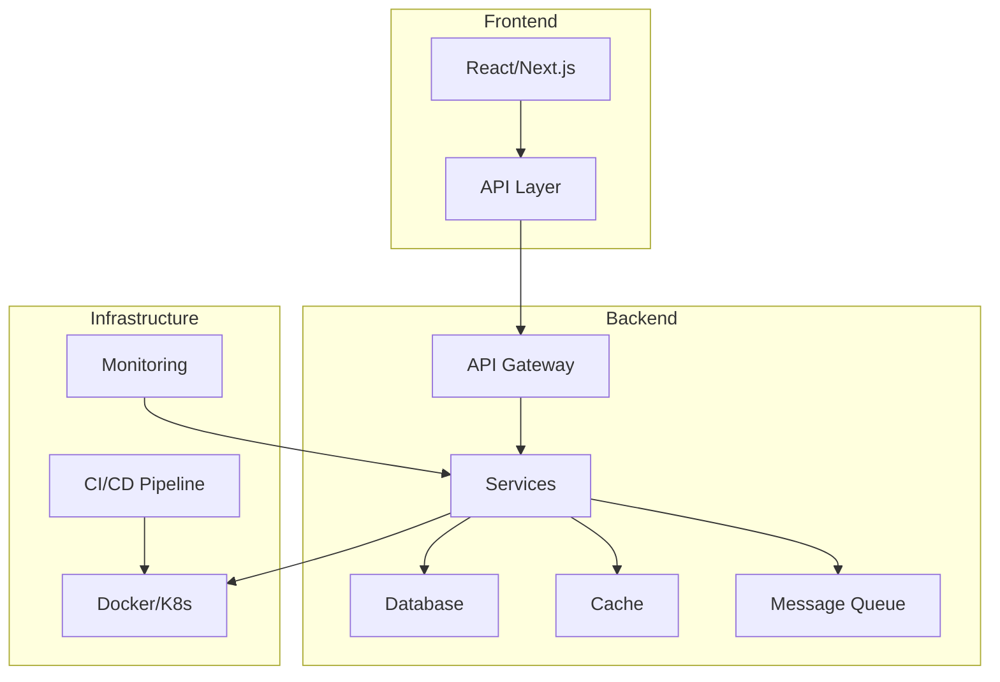
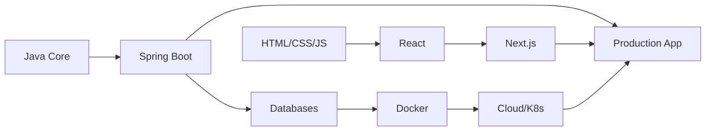

# 🛠️ Engineering

> **"Great engineers are not defined by what they know, but by what they can build."**

This section covers the **practical engineering skills** needed to build, deploy, and maintain production applications. From backend architecture to frontend experiences, from containers to CI/CD pipelines.

---

## 📚 Topics Covered

### [Backend (Java Ecosystem)](/documentation/docs/engineering/backend)
Building robust, scalable server-side applications.
- Spring Boot core concepts & annotations
- Concurrency with JUC (java.util.concurrent)
- JVM internals & garbage collection tuning
- API design & microservices patterns

### [Frontend (Modern Web)](/documentation/docs/engineering/frontend)
Creating responsive, interactive user experiences.
- React fundamentals & hooks
- Next.js for full-stack applications
- Tailwind CSS & modern styling
- State management patterns

### [DevOps & Cloud](/documentation/docs/engineering/devops)
Deploying and operating applications at scale.
- Docker containerization
- Kubernetes orchestration
- AWS / Google Cloud services
- CI/CD with GitHub Actions

### [Developer Tools](/documentation/docs/engineering/tools)
Maximizing productivity with the right tooling.
- Git advanced workflows
- IDE mastery (IntelliJ IDEA)
- Terminal & shell configuration
- Debugging & profiling

---

## 🏗️ Full Stack Architecture



---

## 🎯 Technology Stack

| Layer | Primary Technologies |
|-------|---------------------|
| **Frontend** | React, Next.js, TypeScript, Tailwind CSS |
| **Backend** | Java 21, Spring Boot 3, PostgreSQL, Redis |
| **DevOps** | Docker, Kubernetes, GitHub Actions, AWS |
| **Tools** | Git, IntelliJ IDEA, VS Code, Zsh |

---

## 📖 Quick Reference

### Common Spring Annotations

```java
@RestController      // REST API controller
@Service             // Business logic
@Repository          // Data access
@Transactional       // Transaction management
@Async               // Async execution
@Scheduled           // Scheduled tasks
@Cacheable           // Method caching
```

### Essential Docker Commands

```bash
docker build -t app:latest .
docker run -d -p 8080:8080 app:latest
docker compose up -d
docker logs -f container_name
docker exec -it container_name /bin/sh
```

### Git Workflow Commands

```bash
git rebase -i HEAD~3      # Interactive rebase
git cherry-pick <sha>     # Pick specific commit
git stash push -m "msg"   # Stash with message
git bisect start          # Binary search for bug
```

---

## 🎯 Learning Path



---

:::tip Engineering Principles
1. **Write code for humans** - Clarity over cleverness
2. **Fail fast** - Catch errors early in development
3. **Automate everything** - If you do it twice, script it
4. **Measure before optimizing** - Profile, don't guess
5. **Keep learning** - The landscape changes constantly
:::
