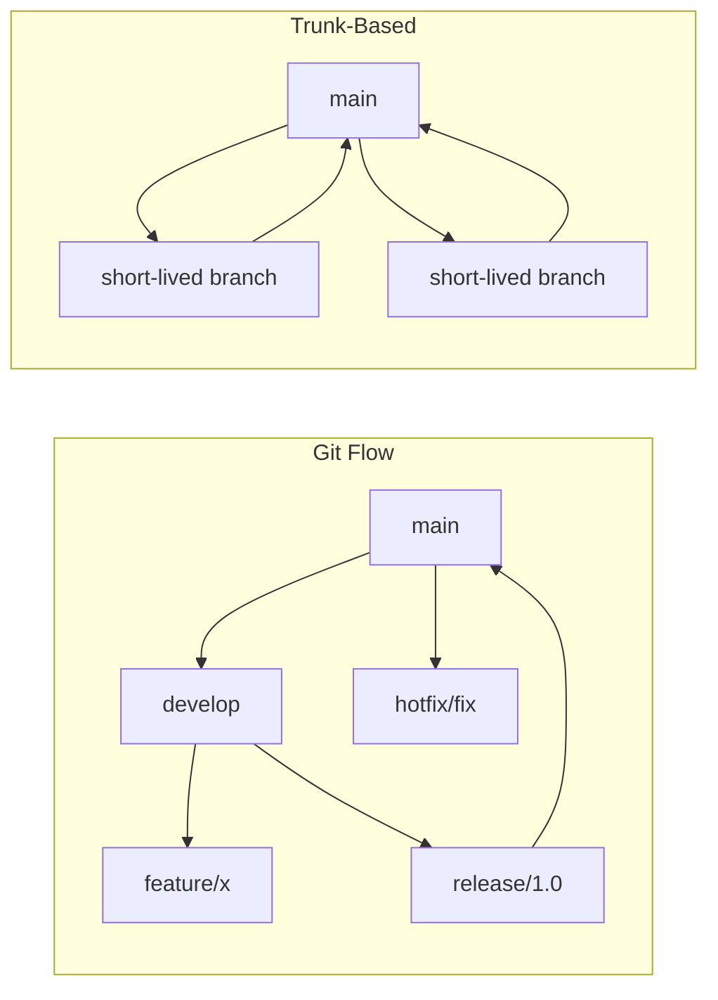

# 🧰 Developer Tools

> **"A craftsman is only as good as their tools - and their mastery of them."**

Maximize productivity with the right tooling and configuration.

---

## 📝 Git Advanced

### Essential Commands

```bash
# Interactive rebase - clean up history before PR
git rebase -i HEAD~5
# Commands: pick, reword, edit, squash, fixup, drop

# Cherry-pick specific commit
git cherry-pick abc123

# Find who changed a line
git blame -L 10,20 src/App.java

# Binary search for bug introduction
git bisect start
git bisect bad                 # Current commit is bad
git bisect good v1.0           # This version was good
# Git will binary search commits

# Stash with message
git stash push -m "WIP: feature implementation"
git stash list
git stash pop stash@{0}

# Undo mistakes
git reset --soft HEAD~1        # Undo commit, keep changes staged
git reset --mixed HEAD~1       # Undo commit, unstage changes
git reset --hard HEAD~1        # Undo commit, discard changes (dangerous!)
git reflog                     # Find lost commits
```

### Git Flow vs Trunk-Based



### Useful Aliases

```bash
# ~/.gitconfig
[alias]
    st = status -sb
    co = checkout
    br = branch
    ci = commit
    lg = log --oneline --graph --decorate -20
    undo = reset --soft HEAD~1
    amend = commit --amend --no-edit
    wip = !git add -A && git commit -m "WIP: work in progress"
    cleanup = !git branch --merged | grep -v main | xargs git branch -d
```

---

## 💻 IntelliJ IDEA

### Essential Shortcuts (Mac)

| Action | Shortcut |
|--------|----------|
| **Search Everywhere** | ⇧⇧ (Double Shift) |
| **Find Action** | ⌘⇧A |
| **Go to File** | ⌘⇧O |
| **Go to Symbol** | ⌘⌥O |
| **Recent Files** | ⌘E |
| **Navigate to Class** | ⌘O |
| **Rename** | ⇧F6 |
| **Extract Variable** | ⌘⌥V |
| **Extract Method** | ⌘⌥M |
| **Generate** | ⌘N |
| **Quick Fix** | ⌥Enter |
| **Find Usages** | ⌥F7 |
| **Go to Definition** | ⌘B |
| **Go to Implementation** | ⌘⌥B |
| **Show Parameters** | ⌘P |
| **Quick Documentation** | F1 |
| **Reformat Code** | ⌘⌥L |
| **Optimize Imports** | ⌃⌥O |

### Must-Have Plugins

| Plugin | Purpose |
|--------|---------|
| **GitHub Copilot** | AI code completion |
| **SonarLint** | Code quality analysis |
| **Rainbow Brackets** | Colorful bracket matching |
| **Key Promoter X** | Learn shortcuts faster |
| **GitToolBox** | Enhanced Git integration |
| **String Manipulation** | Text transformation tools |
| **Indent Rainbow** | Visual indentation |

### Live Templates

```java
// Type: sout + Tab
System.out.println($END$);

// Type: psvm + Tab
public static void main(String[] args) {
    $END$
}

// Custom: Create your own in Settings > Editor > Live Templates
// log + Tab
private static final Logger log = LoggerFactory.getLogger($CLASS$.class);
```

---

## 🖥️ Terminal & Shell

### Zsh Configuration

```bash
# ~/.zshrc

# Oh My Zsh
export ZSH="$HOME/.oh-my-zsh"
ZSH_THEME="powerlevel10k/powerlevel10k"

plugins=(
    git
    zsh-autosuggestions
    zsh-syntax-highlighting
    docker
    kubectl
    fzf
)

source $ZSH/oh-my-zsh.sh

# Aliases
alias ll='ls -la'
alias ..='cd ..'
alias ...='cd ../..'
alias gs='git status -sb'
alias gco='git checkout'
alias gcm='git commit -m'
alias gp='git push'
alias gl='git pull'
alias k='kubectl'
alias d='docker'
alias dc='docker compose'

# Functions
mkcd() { mkdir -p "$1" && cd "$1"; }
port() { lsof -i :"$1"; }
killport() { lsof -ti :"$1" | xargs kill -9; }
```

### Essential CLI Tools

| Tool | Purpose | Install |
|------|---------|---------|
| **fzf** | Fuzzy finder | `brew install fzf` |
| **ripgrep (rg)** | Fast grep | `brew install ripgrep` |
| **fd** | Fast find | `brew install fd` |
| **bat** | Better cat | `brew install bat` |
| **exa/eza** | Better ls | `brew install eza` |
| **jq** | JSON processor | `brew install jq` |
| **htop** | Process viewer | `brew install htop` |
| **tldr** | Simplified man pages | `brew install tldr` |
| **httpie** | Better curl | `brew install httpie` |
| **lazygit** | Git TUI | `brew install lazygit` |

### Vim Essentials

```bash
# .vimrc or neovim config basics
set number          # Line numbers
set relativenumber  # Relative line numbers
set tabstop=4       # Tab width
set shiftwidth=4    # Indent width
set expandtab       # Spaces instead of tabs
set autoindent      # Auto-indent
set clipboard=unnamed  # Use system clipboard

# Essential motions
h j k l           # Left, Down, Up, Right
w b              # Word forward/backward
0 $              # Beginning/End of line
gg G             # Beginning/End of file
/pattern         # Search
n N              # Next/Previous match

# Essential commands
i a              # Insert mode (before/after cursor)
dd yy p          # Delete/Yank line, Paste
u ⌃r             # Undo/Redo
:w :q :wq        # Write/Quit/Write+Quit
:%s/old/new/g    # Replace all
```

---

## 🐞 Debugging & Profiling

### JVM Debugging

```bash
# Remote debugging
java -agentlib:jdwp=transport=dt_socket,server=y,suspend=n,address=*:5005 -jar app.jar

# Memory analysis
jmap -histo <pid>                    # Object histogram
jmap -dump:format=b,file=heap.hprof <pid>  # Heap dump

# Thread analysis
jstack <pid>                         # Thread dump
jcmd <pid> Thread.print              # Alternative

# Performance profiling
java -XX:+UnlockCommercialFeatures -XX:+FlightRecorder ...
jcmd <pid> JFR.start duration=60s filename=recording.jfr
```

### Browser DevTools

| Tab | Use For |
|-----|---------|
| **Elements** | DOM inspection, CSS debugging |
| **Console** | JS execution, logging |
| **Network** | API calls, performance |
| **Performance** | Runtime profiling |
| **Application** | Storage, cookies, cache |
| **Lighthouse** | Performance audit |

---

## 📝 Detailed Topics

- [Git Rebase Strategies](/documentation/docs/engineering/tools/git-rebase)
- [Docker for Development](/documentation/docs/engineering/tools/docker-dev)
- [VS Code Setup](/documentation/docs/engineering/tools/vscode)
- [Productivity Workflows](/documentation/docs/engineering/tools/productivity)
- [API Testing (Postman, httpie)](/documentation/docs/engineering/tools/api-testing)

---

:::tip Productivity Tips
1. **Learn keyboard shortcuts** - Every mouse click costs time
2. **Customize your environment** - Invest time in .dotfiles
3. **Automate repetitive tasks** - Scripts save hours over time
4. **Use version control for everything** - Including dotfiles
5. **Stay updated** - Tools evolve, so should your workflow
:::
