# Welcome to CS Docs 🚀

This documentation site showcases **modern Docusaurus features** including live code editing, Mermaid diagrams, and more.

## Features

### 📝 Live Code Editing

Edit React code directly in the browser and see the results instantly!

```jsx live
function Welcome() {
  const [count, setCount] = React.useState(0);
  
  return (
    <div style={{ 
      padding: '20px', 
      borderRadius: '8px',
      background: 'linear-gradient(135deg, #667eea 0%, #764ba2 100%)',
      color: 'white',
      textAlign: 'center'
    }}>
      <h3>Interactive Counter</h3>
      <p>You clicked {count} times</p>
      <button 
        onClick={() => setCount(count + 1)}
        style={{
          padding: '10px 20px',
          fontSize: '16px',
          cursor: 'pointer',
          borderRadius: '5px',
          border: 'none',
          background: 'white',
          color: '#764ba2'
        }}
      >
        Click me!
      </button>
    </div>
  );
}
```

### 📊 Mermaid Diagrams

Create beautiful diagrams using Mermaid syntax:

```mermaid
graph TD
    A[📱 Client] -->|HTTP Request| B[🌐 API Gateway]
    B --> C[🔐 Auth Service]
    B --> D[📦 Order Service]
    B --> E[💳 Payment Service]
    C --> F[(🗄️ Database)]
    D --> F
    E --> F
```



### 📦 Package Manager Tabs

Install commands automatically generate tabs for npm, yarn, and pnpm:

```bash npm2yarn
npm install react react-dom
```

## Quick Links

- [React Playground](/docs/react-playground) - Interactive React examples
- [Diagrams](/docs/diagrams) - Mermaid diagram examples
- [API Reference](/docs/api) - API documentation

