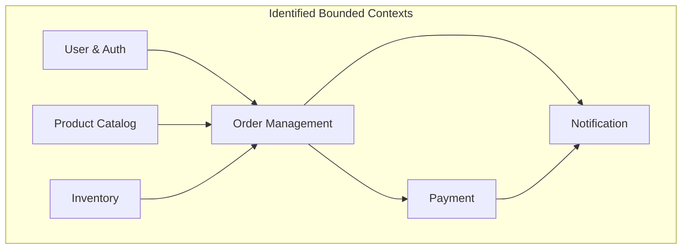
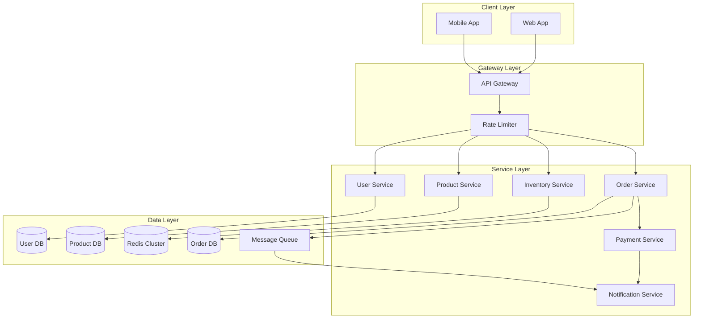
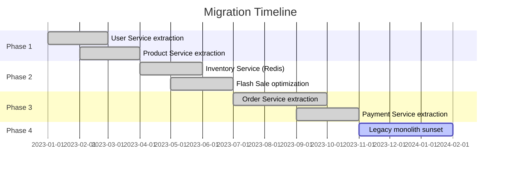

# 🛒 E-commerce Microservices Refactor

> **Transforming a monolith into a scalable microservices architecture without downtime.**

---

## 1. Problem Statement

### Business Context
The e-commerce platform was experiencing severe performance issues during flash sales. The monolithic application couldn't scale specific components independently, and database locks during high-traffic periods caused cascading failures.

### Technical Challenges
- **Traffic spikes**: 100x normal load during flash sales
- **Overselling**: Race conditions led to selling more inventory than available
- **Database bottleneck**: Single PostgreSQL instance at 100% CPU during peaks
- **Monolith complexity**: 500K+ lines of code, 3+ years of technical debt

### Success Criteria
- **Zero overselling** during flash sales
- **Sub-second checkout** response time (p99)
- **99.9% availability** during peak events
- **Independent deployments** for critical services

---

## 2. Research & Analysis

### Decomposition Strategy

We analyzed the monolith using Domain-Driven Design (DDD) principles:



### Migration Approach

| Strategy | Pros | Cons | Our Choice |
|----------|------|------|------------|
| **Big Bang** | Clean cut | High risk, long freeze | ❌ |
| **Strangler Fig** | Incremental, low risk | Longer timeline | ✅ |
| **Parallel Run** | Safe validation | Double infrastructure | Partial ✅ |

**Decision**: Strangler Fig pattern with parallel run for critical paths (inventory, checkout).

---

## 3. Architecture Design

### Target Architecture



### Service Boundaries

| Service | Responsibility | Database | Communication |
|---------|---------------|----------|---------------|
| **User** | Auth, profiles | PostgreSQL | Sync (REST) |
| **Product** | Catalog, search | PostgreSQL + ES | Sync (REST) |
| **Inventory** | Stock management | Redis | Sync (REST) |
| **Order** | Order lifecycle | PostgreSQL | Async (MQ) |
| **Payment** | Payment processing | PostgreSQL | Async (MQ) |
| **Notification** | Email, SMS, push | - | Async (MQ) |

---

## 4. Implementation Highlights

### Flash Sale Inventory: Preventing Overselling

The most critical challenge. We implemented a multi-layer solution:

#### Layer 1: Redis + Lua Atomic Operations

```java
@Service
public class InventoryService {
    
    private static final String DEDUCT_STOCK_SCRIPT = """
        local stock = redis.call('GET', KEYS[1])
        if not stock then
            return -1  -- Product not found
        end
        
        local current = tonumber(stock)
        local quantity = tonumber(ARGV[1])
        
        if current < quantity then
            return 0  -- Insufficient stock
        end
        
        redis.call('DECRBY', KEYS[1], quantity)
        return 1  -- Success
        """;
    
    public DeductResult deductStock(String productId, int quantity) {
        // Atomic operation in Redis - no race conditions
        Long result = redisTemplate.execute(
            RedisScript.of(DEDUCT_STOCK_SCRIPT, Long.class),
            List.of("stock:" + productId),
            String.valueOf(quantity)
        );
        
        return switch (result.intValue()) {
            case 1 -> DeductResult.SUCCESS;
            case 0 -> DeductResult.INSUFFICIENT_STOCK;
            case -1 -> DeductResult.PRODUCT_NOT_FOUND;
            default -> DeductResult.ERROR;
        };
    }
}
```

#### Layer 2: Distributed Rate Limiting

```java
@Component
public class FlashSaleRateLimiter {
    
    // Sliding window rate limiter
    private static final String RATE_LIMIT_SCRIPT = """
        local key = KEYS[1]
        local limit = tonumber(ARGV[1])
        local window = tonumber(ARGV[2])
        local now = tonumber(ARGV[3])
        
        -- Remove old entries
        redis.call('ZREMRANGEBYSCORE', key, 0, now - window)
        
        -- Count current window
        local count = redis.call('ZCARD', key)
        
        if count >= limit then
            return 0  -- Rate limited
        end
        
        -- Add current request
        redis.call('ZADD', key, now, now .. ':' .. math.random())
        redis.call('EXPIRE', key, window / 1000)
        
        return 1  -- Allowed
        """;
    
    public boolean allowRequest(String userId, String saleId) {
        String key = String.format("rate:%s:%s", saleId, userId);
        Long now = System.currentTimeMillis();
        
        Long result = redisTemplate.execute(
            RedisScript.of(RATE_LIMIT_SCRIPT, Long.class),
            List.of(key),
            "5",      // 5 requests
            "1000",   // per 1 second window
            String.valueOf(now)
        );
        
        return result == 1;
    }
}
```

#### Layer 3: Request Queue with Backpressure

```java
@Service
public class FlashSaleOrderService {
    
    private final RocketMQTemplate rocketMQTemplate;
    private final RedissonClient redisson;
    
    public OrderResult placeOrder(OrderRequest request) {
        // 1. Rate limiting check
        if (!rateLimiter.allowRequest(request.userId(), request.saleId())) {
            return OrderResult.rateLimited();
        }
        
        // 2. Deduct inventory (Redis)
        DeductResult deductResult = inventoryService.deductStock(
            request.productId(), 
            request.quantity()
        );
        
        if (deductResult != DeductResult.SUCCESS) {
            return OrderResult.fromDeductResult(deductResult);
        }
        
        // 3. Generate order ID
        String orderId = generateOrderId();
        
        // 4. Send to async processing queue
        rocketMQTemplate.asyncSend(
            "flash-sale-orders",
            new FlashSaleOrderMessage(orderId, request),
            new SendCallback() {
                @Override
                public void onSuccess(SendResult result) {
                    // Order queued for processing
                }
                
                @Override
                public void onException(Throwable e) {
                    // Rollback inventory
                    inventoryService.restoreStock(
                        request.productId(), 
                        request.quantity()
                    );
                }
            }
        );
        
        return OrderResult.queued(orderId);
    }
}
```

### Database Decomposition

Migrating from a single database to per-service databases:

```java
// Saga pattern for distributed transactions
@Service
public class OrderSagaOrchestrator {
    
    public OrderResult createOrder(CreateOrderCommand command) {
        Saga<OrderContext> saga = Saga.<OrderContext>builder()
            .step("reserve-inventory")
                .action(ctx -> inventoryClient.reserve(ctx.items()))
                .compensation(ctx -> inventoryClient.release(ctx.reservationId()))
            .step("create-payment")
                .action(ctx -> paymentClient.createPayment(ctx.amount()))
                .compensation(ctx -> paymentClient.cancelPayment(ctx.paymentId()))
            .step("confirm-order")
                .action(ctx -> orderRepository.confirm(ctx.orderId()))
                .compensation(ctx -> orderRepository.cancel(ctx.orderId()))
            .build();
        
        return saga.execute(new OrderContext(command));
    }
}
```

---

## 5. Challenges & Solutions

### Challenge 1: Data Consistency Across Services

**Problem**: Distributed transactions are hard. ACID isn't possible across services.

**Solution**: Eventual consistency with outbox pattern

```java
@Transactional
public void completeOrder(Order order) {
    // 1. Update order status
    orderRepository.save(order.complete());
    
    // 2. Write to outbox (same transaction)
    outboxRepository.save(new OutboxEvent(
        "order.completed",
        order.getId(),
        objectMapper.writeValueAsString(order)
    ));
}

// Separate process polls outbox and publishes events
@Scheduled(fixedDelay = 100)
public void publishOutboxEvents() {
    List<OutboxEvent> pending = outboxRepository.findPending(100);
    for (OutboxEvent event : pending) {
        try {
            messageQueue.publish(event.getTopic(), event.getPayload());
            outboxRepository.markPublished(event.getId());
        } catch (Exception e) {
            outboxRepository.incrementRetry(event.getId());
        }
    }
}
```

### Challenge 2: Service Discovery and Load Balancing

**Solution**: Kubernetes native service discovery + Istio for traffic management

```yaml
# istio virtual service for canary deployment
apiVersion: networking.istio.io/v1beta1
kind: VirtualService
metadata:
  name: order-service
spec:
  hosts:
  - order-service
  http:
  - match:
    - headers:
        canary:
          exact: "true"
    route:
    - destination:
        host: order-service
        subset: v2
      weight: 100
  - route:
    - destination:
        host: order-service
        subset: v1
      weight: 90
    - destination:
        host: order-service
        subset: v2
      weight: 10
```

### Challenge 3: Monitoring Distributed Systems

**Solution**: OpenTelemetry for distributed tracing

```java
@RestController
public class OrderController {
    
    private final Tracer tracer;
    
    @PostMapping("/orders")
    public ResponseEntity<OrderResponse> createOrder(@RequestBody CreateOrderRequest request) {
        Span span = tracer.spanBuilder("createOrder")
            .setAttribute("order.user_id", request.getUserId())
            .setAttribute("order.total", request.getTotal())
            .startSpan();
        
        try (Scope scope = span.makeCurrent()) {
            // Business logic
            OrderResult result = orderService.createOrder(request);
            
            span.setAttribute("order.id", result.getOrderId());
            span.setStatus(StatusCode.OK);
            
            return ResponseEntity.ok(result.toResponse());
        } catch (Exception e) {
            span.recordException(e);
            span.setStatus(StatusCode.ERROR, e.getMessage());
            throw e;
        } finally {
            span.end();
        }
    }
}
```

---

## 6. Results & Metrics

### Flash Sale Performance (11.11 Event)

| Metric | Before | After | Improvement |
|--------|--------|-------|-------------|
| **Peak QPS** | 5,000 | 50,000+ | 10x |
| **Oversell incidents** | 12 | 0 | -100% |
| **Checkout p99** | 8.2s | 0.4s | -95% |
| **System availability** | 94% | 99.95% | +6% |

### Infrastructure Impact

| Resource | Before (Monolith) | After (Microservices) |
|----------|-------------------|----------------------|
| **CPU cost** | $5,000/mo | $3,200/mo |
| **Scale time** | 5-10 min | 30 sec |
| **Deployment frequency** | Weekly | 20+ daily |
| **MTTR** | 45 min | 8 min |

---

## 7. Lessons Learned

### What Went Well
- ✅ Strangler fig pattern minimized risk
- ✅ Redis for inventory was the right call
- ✅ Async processing handled spikes gracefully
- ✅ Per-service databases eliminated lock contention

### What Could Be Improved
- ⚠️ Should have invested in distributed tracing earlier
- ⚠️ Initial service boundaries were too fine-grained (later merged some)
- ⚠️ Team needed more training on distributed systems concepts

### Key Takeaways

1. **Redis Lua scripts are powerful** - Atomic operations solve many race conditions
2. **Eventual consistency is acceptable** - Users care about correct results, not instant updates
3. **Queues are your friend** - Decouple for resilience
4. **Observability is essential** - Can't fix what you can't see
5. **Start with the hottest path** - Focus migration on the biggest pain points

---

## Architecture Evolution Timeline



---

:::info Key Takeaway
Microservices don't solve problems by themselves - they enable solutions. The real work is in understanding your system's bottlenecks and applying the right patterns (like Redis + Lua for atomicity, message queues for decoupling).
:::
