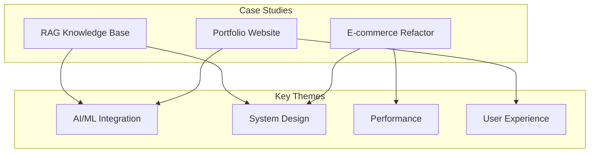

# 🚀 Case Studies

> **"Experience is not what happens to you, but what you do with what happens to you."** — Aldous Huxley

This section goes beyond code to explore **real-world engineering challenges**. Each case study covers the decision-making process, trade-offs, and lessons learned.

---

## 🎯 Why Case Studies?

Technical skills are demonstrated not just through code, but through:

- **Problem Framing** - How did you understand the challenge?
- **Architecture Decisions** - Why did you choose this approach?
- **Trade-offs** - What did you gain and sacrifice?
- **Lessons Learned** - How did you grow from this experience?

---

## 📖 Featured Projects

### [Enterprise RAG Knowledge Base](/documentation/docs/projects/rag-knowledge-base)
Building a production RAG system for internal documentation search.
- **Challenge**: PDF table parsing and multi-modal document processing
- **Stack**: Spring Boot, PgVector, OpenAI, LangChain
- **Key Learning**: Chunking strategy critically impacts retrieval quality

### [E-commerce Microservices Refactor](/documentation/docs/projects/ecommerce-refactor)
Migrating a monolith to microservices while handling flash sales.
- **Challenge**: Preventing overselling during high-traffic flash sales
- **Stack**: Spring Cloud, Redis, RocketMQ, Kubernetes
- **Key Learning**: Distributed systems require different thinking

### [AI-Powered Portfolio Website](/documentation/docs/projects/portfolio-website)
Creating an interactive portfolio with AI chat capabilities.
- **Challenge**: Real-time AI responses with edge deployment
- **Stack**: Next.js, Tailwind CSS, Spring Boot, OpenAI
- **Key Learning**: User experience trumps technical complexity

---

## 🔍 Case Study Template

Each case study follows this structure:

```markdown
## 1. Problem Statement
- Business context and requirements
- Technical constraints
- Success criteria

## 2. Research & Analysis
- Options considered
- Proof of concepts
- Technology evaluation

## 3. Architecture Design
- High-level architecture diagram
- Component breakdown
- Data flow

## 4. Implementation Highlights
- Key technical decisions
- Code snippets for complex logic
- Integration patterns

## 5. Challenges & Solutions
- Problem encountered
- Approaches tried
- Final solution and reasoning

## 6. Results & Metrics
- Performance improvements
- User feedback
- Business impact

## 7. Lessons Learned
- What went well
- What could be improved
- Recommendations for future
```

---

## 📊 Project Overview



---

## 🏆 Impact Summary

| Project | Challenge | Solution | Impact |
|---------|-----------|----------|--------|
| **RAG KB** | Document search accuracy | Hybrid search + re-ranking | 85% → 96% relevance |
| **E-commerce** | Flash sale overselling | Redis + Lua atomic ops | 0 oversell incidents |
| **Portfolio** | Page load performance | Edge caching + lazy load | 2.1s → 0.8s LCP |

---

:::tip Writing Good Case Studies
1. **Tell a story** - Problem → Journey → Solution
2. **Be honest** - Include failures and pivots
3. **Show reasoning** - Why not other approaches?
4. **Include visuals** - Architecture diagrams, screenshots
5. **Quantify impact** - Metrics demonstrate real value
:::
