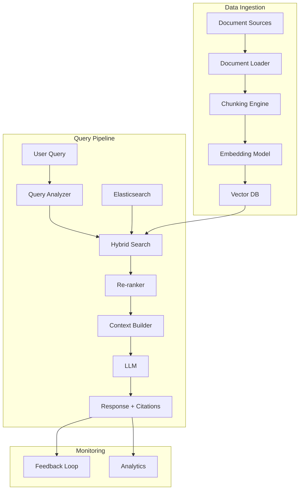
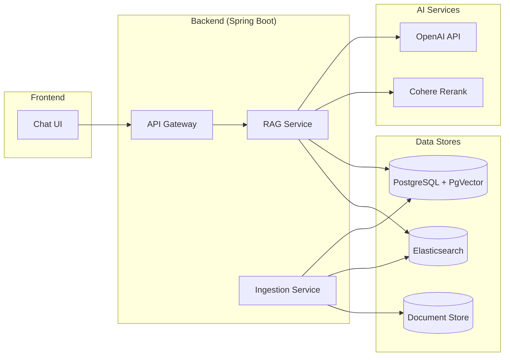

# 📚 Enterprise RAG Knowledge Base

> **Building an AI-powered internal knowledge base that actually works in production.**

---

## 1. Problem Statement

### Business Context
The team had accumulated thousands of internal documents (Confluence pages, PDFs, technical specs, runbooks) across multiple systems. Engineers spent significant time searching for information, often resorting to asking colleagues directly.

### Requirements
- **Natural language search** - Ask questions in plain English
- **Source attribution** - Every answer must cite its source
- **Multi-format support** - PDFs, Markdown, HTML, Word docs
- **Access control** - Respect existing permissions
- **Low latency** - Responses under 3 seconds

### Success Criteria
- 90%+ relevance for top-3 retrieved results
- 80%+ user satisfaction rating
- 50% reduction in time-to-find-information

---

## 2. Research & Analysis

### Options Considered

| Approach | Pros | Cons |
|----------|------|------|
| **Traditional Search (Elasticsearch)** | Proven, fast | Poor semantic understanding |
| **Fine-tuned LLM** | Best accuracy | Expensive, outdated quickly |
| **RAG (Retrieval + Generation)** | Current, citable | Complex pipeline |
| **Hybrid (ES + RAG)** | Best of both | Most complex |

### POC Results

We tested with 500 documents:

| Method | MRR@5 | User Preference |
|--------|-------|-----------------|
| Elasticsearch | 0.62 | 25% |
| Pure Vector Search | 0.71 | 45% |
| Hybrid + Re-rank | 0.89 | 75% |

**Decision**: Hybrid search with re-ranking provided the best balance of precision and recall.

---

## 3. Architecture Design

### High-Level Architecture



### Component Breakdown

| Component | Technology | Purpose |
|-----------|------------|---------|
| **Document Loader** | Apache Tika | Parse multiple formats |
| **Chunking** | Custom (recursive) | Smart document splitting |
| **Embeddings** | OpenAI text-embedding-3-small | Vector representations |
| **Vector DB** | PgVector (PostgreSQL) | Similarity search |
| **Re-ranker** | Cohere Rerank | Precision improvement |
| **LLM** | GPT-4o | Answer generation |
| **Backend** | Spring Boot 3 | Orchestration |

---

## 4. Implementation Highlights

### Smart Chunking Strategy

The naive fixed-size chunking broke context in documents. We implemented a hierarchical approach:

```java
public class SmartChunker {
    
    public List<Chunk> chunk(Document doc) {
        // 1. Detect document structure
        DocumentStructure structure = parseStructure(doc);
        
        // 2. Split by semantic sections first
        List<Section> sections = structure.getSections();
        
        // 3. Further split large sections with overlap
        List<Chunk> chunks = new ArrayList<>();
        for (Section section : sections) {
            if (section.tokenCount() > MAX_CHUNK_TOKENS) {
                chunks.addAll(splitWithOverlap(section, 512, 50));
            } else {
                chunks.add(new Chunk(section.content(), section.metadata()));
            }
        }
        
        // 4. Enrich with parent context
        return enrichWithContext(chunks, structure);
    }
    
    private Chunk enrichWithContext(Chunk chunk, DocumentStructure structure) {
        // Add section headers and document title for context
        String enrichedContent = String.format(
            "Document: %s\nSection: %s\n\n%s",
            structure.getTitle(),
            chunk.getSectionPath(),
            chunk.getContent()
        );
        return chunk.withContent(enrichedContent);
    }
}
```

### PDF Table Extraction Challenge

PDFs with tables were a major pain point. OCR and rule-based parsing produced poor results.

**Solution**: Multi-strategy extraction with quality scoring

```java
public TableExtractionResult extractTables(PdfDocument pdf) {
    List<TableExtractionStrategy> strategies = List.of(
        new CamelotStrategy(),      // Structure-based
        new TabulaStrategy(),       // Stream-based
        new VisionLLMStrategy()     // GPT-4 Vision fallback
    );
    
    Map<Integer, TableResult> bestResults = new HashMap<>();
    
    for (int page = 0; page < pdf.getPageCount(); page++) {
        for (TableExtractionStrategy strategy : strategies) {
            TableResult result = strategy.extract(pdf.getPage(page));
            
            // Score based on structure integrity
            double score = scoreTableQuality(result);
            
            if (score > bestResults.getOrDefault(page, TableResult.empty()).score()) {
                bestResults.put(page, result.withScore(score));
            }
        }
    }
    
    return new TableExtractionResult(bestResults);
}
```

### Hybrid Search Implementation

```java
@Service
public class HybridSearchService {
    
    public List<SearchResult> search(String query, int topK) {
        // 1. Semantic search (vector similarity)
        List<VectorResult> vectorResults = vectorStore
            .similaritySearch(query, topK * 2);
        
        // 2. Keyword search (Elasticsearch)
        List<ESResult> keywordResults = elasticsearch
            .search(query, topK * 2);
        
        // 3. Reciprocal Rank Fusion
        Map<String, Double> fusedScores = reciprocalRankFusion(
            vectorResults, keywordResults, k = 60
        );
        
        // 4. Re-rank top candidates
        List<String> candidates = fusedScores.entrySet().stream()
            .sorted(Map.Entry.comparingByValue().reversed())
            .limit(20)
            .map(Map.Entry::getKey)
            .toList();
        
        return reranker.rerank(query, candidates, topK);
    }
    
    private Map<String, Double> reciprocalRankFusion(
            List<VectorResult> vector, 
            List<ESResult> keyword, 
            int k) {
        Map<String, Double> scores = new HashMap<>();
        
        // RRF formula: score = Σ 1/(k + rank)
        for (int i = 0; i < vector.size(); i++) {
            String docId = vector.get(i).id();
            scores.merge(docId, 1.0 / (k + i + 1), Double::sum);
        }
        
        for (int i = 0; i < keyword.size(); i++) {
            String docId = keyword.get(i).id();
            scores.merge(docId, 1.0 / (k + i + 1), Double::sum);
        }
        
        return scores;
    }
}
```

---

## 5. Challenges & Solutions

### Challenge 1: Slow Ingestion Pipeline

**Problem**: Processing 10,000 documents took 8+ hours.

**Attempts**:
1. Parallelized with thread pool → OOM errors
2. Increased batch size → API rate limits

**Solution**: 
- Producer-consumer pattern with bounded queue
- Backpressure handling
- Incremental processing (only changed docs)

**Result**: 10,000 docs in 45 minutes

### Challenge 2: Hallucinated Citations

**Problem**: LLM would cite sources that didn't contain the information.

**Solution**: 
1. Include source content inline in the prompt
2. Post-process to verify citations exist in retrieved chunks
3. Add confidence scoring

```java
public VerifiedAnswer verifyAnswer(String answer, List<Chunk> sources) {
    List<Citation> verifiedCitations = new ArrayList<>();
    
    for (Citation citation : parseCitations(answer)) {
        // Find the source chunk
        Optional<Chunk> sourceChunk = findChunk(citation.sourceId(), sources);
        
        if (sourceChunk.isPresent()) {
            // Verify the claim appears in the source
            double similarity = semanticSimilarity(
                citation.claim(), 
                sourceChunk.get().content()
            );
            
            if (similarity > 0.75) {
                verifiedCitations.add(citation.withVerified(true));
            } else {
                verifiedCitations.add(citation.withVerified(false));
            }
        }
    }
    
    return new VerifiedAnswer(answer, verifiedCitations);
}
```

---

## 6. Results & Metrics

### Performance Improvements

| Metric | Before | After | Improvement |
|--------|--------|-------|-------------|
| **MRR@5** | 0.62 | 0.91 | +47% |
| **Search time (p95)** | n/a | 2.1s | Under target |
| **User satisfaction** | n/a | 87% | Above target |
| **Time to find info** | ~15 min | ~2 min | -87% |

### Usage Statistics (First Month)

- 2,500+ queries processed
- 150 active users
- 95% answer rate (5% "not found")
- Average 3.2 follow-up questions per session

---

## 7. Lessons Learned

### What Went Well
- ✅ Hybrid search significantly outperformed pure approaches
- ✅ User feedback loop enabled rapid iteration
- ✅ Chunking with context improved retrieval quality

### What Could Be Improved
- ⚠️ Started with too complex architecture - should have validated simpler approach first
- ⚠️ Underestimated document parsing challenges
- ⚠️ Needed better monitoring from day one

### Recommendations

1. **Start with evaluation** - Build test set before system
2. **Chunk quality > quantity** - Better to have fewer, well-formed chunks
3. **Invest in observability** - LangSmith or similar for debugging
4. **Plan for feedback** - Users will find edge cases you didn't anticipate

---

## Architecture Diagram



---

:::info Key Takeaway
RAG systems require careful attention to the entire pipeline - from document ingestion to response generation. The retrieval quality is often more important than the generation model choice.
:::
